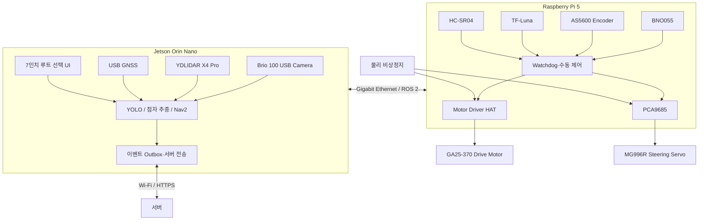
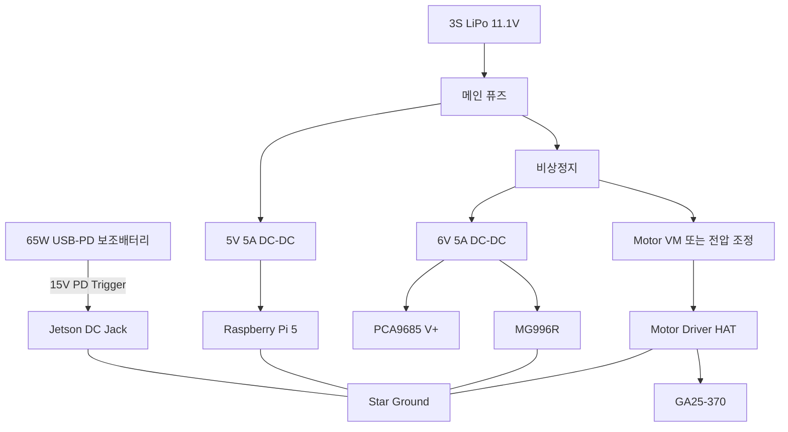

# 하드웨어 아키텍처

## 0. 설계 결론

평가 일정, 지급품 활용도, 개발 인력 구성을 고려하여 기본 하드웨어는 다음과 같이 구성한다.

> **Jetson Orin Nano = 인지·자율주행·서버 통신**  
> **Raspberry Pi 5 = 모터·조향·저수준 센서·안전 감시**

Raspberry Pi를 제거하고 MCU만 사용하는 구조도 가능하지만, 지급된 Motor Driver HAT·PCA9685·조이스틱·LCD와 제공 스켈레톤의 활용 가능성을 고려하면 2보드 구조가 평가일까지 가장 빠르게 통합될 가능성이 높다.

---

## 1. 지급 키트에서 확인한 주요 부품

첨부된 AIoT 키트 체크리스트에서 다음 핵심 부품을 확인했다.

| 분류 | 지급품 | 본 프로젝트 활용 |
|---|---|---|
| AI 컴퓨팅 | Jetson Orin Nano Developer Kit | 영상 AI, LiDAR, 경로 계획, ROS 2 상위 제어 |
| 저수준 제어 | Raspberry Pi 5 4GB, Active Cooler, Case | 모터·서보·센서 제어, watchdog |
| 카메라 | Logitech Brio 100 | 점자블록 추종·불량 촬영 |
| LiDAR | YDLIDAR X4 Pro | 전방 장애물, 로컬 비용지도, 회피 |
| 구동체 | OrinCar 프레임·금속/아크릴 플레이트·휠·조향 링크 | 차체 |
| 구동기 | GA25-370 DC Motor | 후륜 구동 |
| 조향기 | MG996R Servo | Ackermann 조향 |
| 드라이버 | Motor Driver HAT | DC 모터 출력 |
| PWM 보드 | PCA9685 | MG996R 조향 서보 PWM |
| 보조 센서 | HC-SR04, SG90 등 | 근거리 안전센서 또는 시험용 |
| HMI | 7인치 터치 LCD, Joystick | 루트 선택·수동 주행·디버깅 |
| 전원 부품 | 리튬 배터리 4개, Battery Shield V9 | 저전력 시험용; 주행 전체 전원으로는 별도 검증 필요 |
| 케이블 | UTP, USB-C, micro-USB, DP-to-HDMI 등 | 보드 간 통신·디스플레이·센서 연결 |

### 키트 점검표에서 발견한 주의점

Jetson 40핀 헤더의 일부 전원 핀이 `불량`으로 기록되어 있다. 따라서 다음 원칙을 적용한다.

- Jetson 40핀 헤더에서 센서·서보·모터 전원을 공급하지 않는다.
- Jetson 센서는 USB로 연결한다.
- 모터·서보·Raspberry Pi는 별도 전원 레일을 사용한다.
- 모든 전원 레일의 GND만 한 점에서 공통 연결한다.
- 40핀 헤더는 재측정 전까지 필수 신호 경로에 사용하지 않는다.

---

## 2. 보드별 역할

## 2.1 Jetson Orin Nano

### 연결 장치

| 포트/버스 | 연결 장치 | 역할 |
|---|---|---|
| USB 3.x | Logitech Brio 100 | 점자블록·불량 영상 |
| USB | YDLIDAR X4 Pro 어댑터 | `/scan` 2D LiDAR |
| USB | USB GNSS 수신기 | GPS 좌표, 순찰 이벤트 지오태깅 |
| Gigabit Ethernet | Raspberry Pi 5 | ROS 2 제어·상태 통신 |
| Wi-Fi/Ethernet | 모바일 핫스팟 또는 AP | 서버 업로드 |
| DisplayPort | DP-to-HDMI + 7인치 LCD | 루트 선택·상태 표시·시연 |
| microSD | 64GB 지급 카드 | Ubuntu/JetPack, 로컬 이벤트 outbox |

### 담당 기능

- ROS 2 상위 시스템 실행
- 카메라 캡처·캘리브레이션
- 점자블록 마스크 추론
- 불량 YOLOv8n-seg 추론
- LiDAR 장애물·로컬 비용지도 처리
- 센서 융합 위치 추정
- 사전 루트 추종·상태 머신
- 장애물 회피 경로 생성
- 대표 프레임 선정
- GPS·루트 누적거리 결합
- 서버 이벤트 전송과 재전송 큐
- 기기 UI·로그

### 권장 소프트웨어

- JetPack 6.2.x
- Ubuntu 22.04 기반 rootfs
- ROS 2 Humble
- Python 3/C++
- OpenCV
- Ultralytics YOLOv8n-seg
- ONNX Runtime GPU 또는 TensorRT
- YDLIDAR ROS 2 Driver
- `robot_localization`, Nav2, 필요 시 `slam_toolbox`

JetPack 6.2 계열을 선택하는 이유는 최신 버전 자체보다 **프로젝트에서 정한 Ubuntu 22.04·ROS 2 Humble 조합을 고정**하기 위해서다. 평가 한 주 전에는 JetPack·CUDA·TensorRT 버전을 변경하지 않는다.

---

## 2.2 Raspberry Pi 5

### 연결 장치

| 버스/핀 | 연결 장치 | 역할 |
|---|---|---|
| 40핀 HAT | 지급 Motor Driver HAT | GA25-370 속도·방향 제어 |
| I²C SDA/SCL | PCA9685 | MG996R PWM |
| I²C SDA/SCL | BNO055 추가 구매 | 자세·요레이트 |
| I²C SDA/SCL | AS5600 추가 구매 | 구동축 회전·이동거리 |
| UART 또는 USB-UART | TF-Luna 추가 구매 | 전방 하향 지면 거리·단차 후보 확인 |
| GPIO 입력 | 비상정지 상태·범퍼 스위치 | 안전 상태 확인 |
| GPIO/레벨시프터 | HC-SR04 지급품 | 근거리 보조 정지 |
| Ethernet | Jetson Orin Nano | `/drive_cmd`, `/wheel_odom`, `/imu/data`, 상태 |
| USB | 조이스틱 | 초기 루트 기록·수동 복구 |

### 담당 기능

- 모터 PWM·방향
- 조향 서보 PWM
- 휠 속도·누적거리 계산
- IMU 수집
- ToF·초음파 근거리 안전 확인
- Jetson 명령 타임아웃 감시
- 센서 이상 시 즉시 출력 0
- 수동 조이스틱 모드
- 구동부 상태·전압·오류 송신

### 제어 주기

| 기능 | 권장 주기 |
|---|---:|
| 모터·조향 출력 | 50 Hz |
| 명령 watchdog | 100 Hz |
| 휠 엔코더 | 50~100 Hz |
| IMU | 50 Hz |
| ToF | 20~50 Hz |
| 상태 송신 | 10 Hz |

Raspberry Pi는 하드 실시간 장치가 아니므로 다음 안전장치를 필수로 둔다.

- `/drive_cmd`가 0.5초 이상 갱신되지 않으면 모터 0, 조향 중립
- 제어 프로세스 종료 시 드라이버 Enable 해제
- 부팅 직후 기본 출력 0
- 물리 비상정지 버튼은 소프트웨어를 거치지 않고 모터 전원을 차단
- 회피 중에도 전방 안전센서가 임계값 이하면 즉시 정지

---

## 3. 전체 하드웨어 블록도

---

## 4. 기구 배치

## 4.1 카메라

### 권장 위치

- 차체 중심선
- 지면에서 약 25~35 cm
- 수평 기준 아래쪽 35~50° 기울기
- 로봇 전방 0.3~1.5 m 범위를 보도록 설치
- 진동을 줄이되 각도를 조절할 수 있는 3D 프린팅 브래킷 사용

### 설치 이유

- 가까운 영역은 불량의 세부 형상 촬영
- 먼 영역은 점자블록 진행 방향 추정
- 카메라가 조향축보다 약간 뒤에 있으면 회전 시 영상 흔들림이 줄어듦
- 너무 낮으면 전방 경로가 짧아지고, 너무 높으면 작은 크랙 분해능이 저하됨

### 캘리브레이션

- 체커보드 내부 파라미터 캘리브레이션
- 바닥 평면 기준 원근 변환
- 카메라 높이·각도 고정 후 설정 파일 버전 관리
- 브래킷을 분해하면 재캘리브레이션

## 4.2 LiDAR

- 지면에서 약 20~30 cm
- 360° 시야를 막지 않는 차체 상단
- 카메라·GNSS 마운트와 겹치지 않도록 배치
- 수평 오차를 줄이기 위한 수평 조절 플레이트
- 회전부 주변 케이블 간섭 금지

YDLIDAR X4 Pro는 제조사 SDK 데이터 기준 약 0.12~10 m 범위, 5~12 Hz 회전 설정을 지원하므로 저속 실내·보도 모형 코스의 장애물 감지에 적합하다. 실제 반사율과 외광에 따라 유효거리가 달라지므로 시연 코스에서 임계값을 별도 보정한다.

## 4.3 GNSS

- 차체 최상단
- Jetson, DC-DC 컨버터, 모터선과 최대한 이격
- 금속 플레이트 바로 아래를 피함
- 야외 하늘 시야 확보

GNSS는 점자블록 중심 제어가 아니라 **지도 좌표와 이벤트 위치 기록**에 사용한다.

## 4.4 하향 ToF

- 전방 바닥을 향해 20~35° 아래로 설치
- 기준 지면과의 거리를 평상시 학습
- 갑작스러운 거리 변화가 카메라 단차 후보와 동시에 나타나면 단차 신뢰도를 높임
- 3D 프린팅 각도 조절 브래킷 사용

TF-Luna는 단일 지점 거리센서이므로 넓은 단차를 완전 측정하지는 못한다. 평가 MVP에서는 `단차 후보 확인` 용도다.

## 4.5 AS5600 엔코더

- 구동축 또는 구동 휠 축 끝에 지름 방향 자석 부착
- 센서와 자석 간 중심 정렬
- 3D 프린팅 보호 커버
- 1회전당 휠 이동거리로 환산
- 슬립 때문에 장기 위치는 누적 오차가 생기므로 IMU·LiDAR와 융합

## 4.6 전원과 배터리

- 무거운 배터리는 차체 하단 중앙
- 컴퓨팅 전원과 모터 전원을 분리
- 모터선은 꼬아 배선하고 신호선과 이격
- 퓨즈와 비상정지는 상단에서 즉시 접근 가능
- LiPo는 보호 케이스와 벨크로 스트랩으로 고정

---

## 5. 상세 신호 연결

## 5.1 Jetson ↔ Raspberry Pi

| 항목 | 설정 |
|---|---|
| 물리 연결 | 지급 UTP 케이블 직결 |
| Jetson IP | `192.168.50.1/24` |
| Raspberry Pi IP | `192.168.50.2/24` |
| ROS Domain ID | 팀 전용 고정값, 예: `42` |
| 시간 동기 | Jetson을 기준으로 chrony 또는 주기적 시간 동기 |
| QoS | 주행 명령 Reliable/KeepLast 1, 센서 상태 BestEffort 또는 Reliable 선택 |
| heartbeat | Pi가 Jetson heartbeat를 10 Hz 수신 |
| timeout | 0.5초 미수신 시 구동 정지 |

### 주요 토픽

| 토픽 | 송신 → 수신 | 내용 |
|---|---|---|
| `/drive_cmd` | Jetson → Pi | 목표 속도, 조향각, 명령 시각 |
| `/drive_enable` | Jetson → Pi | 자율주행 출력 허용 |
| `/wheel_odom` | Pi → Jetson | 휠 거리·속도 |
| `/imu/data` | Pi → Jetson | 자세·각속도·가속도 |
| `/ground_range` | Pi → Jetson | 하향 ToF 거리 |
| `/actuator/status` | Pi → Jetson | PWM, 오류, watchdog |
| `/manual_cmd` | Pi → Jetson | 조이스틱 입력 |
| `/safety/stop` | 양방향 | 정지 원인 |

## 5.2 Raspberry Pi I²C

권장 주소는 실제 모듈 데이터시트와 `i2cdetect`로 확정한다.

| 장치 | 일반 주소 예시 | 비고 |
|---|---:|---|
| PCA9685 | `0x40` | 서보 PWM |
| BNO055 | `0x28` 또는 `0x29` | IMU |
| AS5600 | `0x36` | 엔코더 |

- I²C는 3.3V 로직
- 모듈 보드에 풀업이 중복되어 파형이 나빠지면 일부 풀업 제거
- 배선은 짧게 유지
- 모터선과 평행 배치 금지
- 100 kHz부터 시작하고 안정 후 상향

## 5.3 Motor Driver HAT

저장소와 실물에서 다음을 확인해야 한다.

1. 제어 IC
2. 입력 로직 전압
3. 모터 전원 허용 범위
4. 연속·피크 전류
5. Pi 5 호환 라이브러리
6. PWM 주파수
7. 브레이크/코스트 동작
8. Enable 또는 Standby 핀

GA25-370의 정격전압과 스톨전류가 드라이버 범위를 넘으면 예산의 예비비로 고전류 H-bridge를 구매한다. 확인 전에는 전류 제한 전원으로 무부하 시험을 수행한다.

---

## 6. 전원 아키텍처

## 6.1 전원 분리 원칙

### Jetson 전원

NVIDIA의 Jetson Orin Nano Developer Kit 캐리어보드 사양은 DC 잭을 5.5 mm × 2.5 mm, 중심 양극, 9~20 V 입력으로 명시한다. 따라서 다음 방식을 사용한다.

- 벤치 개발: 지급 AC 어댑터
- 이동 시연: 65 W 이상 USB-PD 보조배터리 + **15 V** PD 트리거 케이블
- 케이블 극성·전압을 멀티미터로 확인 후 연결
- 보조배터리가 15 V 프로파일과 필요한 출력을 지속 제공하는지 1시간 부하 시험

20 V도 허용 범위 안이지만, 케이블·트리거 오동작 위험을 줄이기 위해 15 V를 우선한다.

### Raspberry Pi 전원

- 3S LiPo → 5.1 V 5 A급 DC-DC → USB-C 전원 입력
- USB 주변기기는 최소화
- 저전압 경고를 로그로 수집
- 5 V 3 A만 가능한 경우 성능과 USB 전류가 제한될 수 있으므로 반드시 스트레스 테스트
- GPIO 5V 핀 직결은 역전류·보호회로 우회 위험 때문에 권장하지 않음

### 서보 전원

MG996R은 순간 전류가 크므로 Raspberry Pi 5V 핀 또는 PCA9685 로직 전원에서 공급하지 않는다.

- 별도 6 V 5 A급 DC-DC
- PCA9685 `V+`에 서보 전원
- 로직 VCC는 Pi의 3.3 V
- 1000 µF 이상 저ESR 커패시터를 서보 전원 단자 가까이에 배치
- GND 공통

### 모터 전원

GA25-370 변형에 따라 정격전압이 다를 수 있다.

- **12 V형이면:** 3S LiPo를 Motor Driver HAT VM에 공급
- **6 V형이면:** 6 V 고전류 레귤레이터 또는 적합한 배터리 구성 사용
- 정격 미확인 상태에서 3S 직결 금지
- 무부하 전류, 정상 주행 전류, 조향 최대부하 전류를 측정

### 비상정지

물리 비상정지는 다음 회로를 차단한다.

- Motor Driver HAT의 모터 전원
- MG996R 서보 전원 또는 드라이버 Enable

Jetson과 Pi는 켜진 상태로 남겨 로그와 오류 원인을 보존한다.

---

## 7. 추가 구매안: 총 30만 원 이하

가격은 2026-07-15 기준의 **계획용 추정치**다. 배송비·판매처·재고에 따라 달라지므로 구매 직전 재확인한다.

| 품목 | 수량 | 계획 단가 | 소계 | 용도 | 우선도 |
|---|---:|---:|---:|---|---|
| USB GNSS, u-blox NEO-M8N급 | 1 | 18,000원 | 18,000원 | GPS 좌표 | 필수 |
| BNO055 IMU 모듈 | 1 | 28,000원 | 28,000원 | 자세·요레이트 | 필수 |
| AS5600 + 지름 방향 자석 | 1 | 8,000원 | 8,000원 | 구동축 엔코더 | 필수 |
| TF-Luna ToF | 1 | 31,000원 | 31,000원 | 단차 후보 보조 | 필수 |
| 65W·20,000mAh급 USB-PD 보조배터리 | 1 | 45,000원 | 45,000원 | Jetson 이동 전원 | 필수 |
| 15V PD Trigger, 5.5×2.5 mm 중심 양극 | 1 | 15,000원 | 15,000원 | Jetson 전원 케이블 | 필수 |
| 3S 11.1V 2,200mAh급 LiPo | 1 | 32,000원 | 32,000원 | 모터·Pi·서보 | 필수 |
| 2S/3S 밸런스 충전기 | 1 | 18,000원 | 18,000원 | LiPo 충전 | 필수 |
| 5V 5A급 DC-DC/UBEC | 1 | 12,000원 | 12,000원 | Raspberry Pi | 필수 |
| 6V 5A급 DC-DC/UBEC | 1 | 12,000원 | 12,000원 | MG996R | 필수 |
| 비상정지·퓨즈·메인스위치 | 1식 | 15,000원 | 15,000원 | 안전 | 필수 |
| XT60·배선·커넥터·수축튜브·커패시터 | 1식 | 15,000원 | 15,000원 | 전장 | 필수 |
| 3D 프린팅 재료·자석·체결부품 | 1식 | 8,000원 | 8,000원 | 마운트 | 필수 |
| 배송·대체 드라이버 예비비 | 1식 | 18,000원 | 18,000원 | 불확실성 대응 | 예비 |
| **합계** |  |  | **275,000원** |  |  |

### 예산 절감 순서

예산이 초과되면 기능 영향이 적은 순서대로 조정한다.

1. 팀 보유 보조배터리 활용
2. 3D 프린팅 재료를 학교/교육장 지급분으로 대체
3. TF-Luna 구매를 보류하고 평가 MVP에서 단차를 `카메라 후보`로만 표시
4. GNSS를 스마트폰 위치 테더링으로 임시 대체하되 최종 시연 전 USB GNSS 확보
5. 절대로 비상정지·퓨즈·전원 안정화 부품을 삭제하지 않음

### 참고 판매·기술 페이지

- NVIDIA JetPack 6.2: <https://developer.nvidia.com/embedded/jetpack-sdk-62>
- Jetson Orin Nano Developer Kit Hardware Layout: <https://docs.nvidia.com/jetson/orin-nano-devkit/user-guide/latest/hardware_layout.html>
- Jetson Carrier Board Specification PDF: <https://developer.nvidia.com/downloads/assets/embedded/secure/jetson/orin_nano/docs/jetson_orin_nano_devkit_carrier_board_specification_sp.pdf>
- Raspberry Pi 5: <https://www.raspberrypi.com/products/raspberry-pi-5/>
- YDLIDAR ROS 2 Driver: <https://github.com/YDLIDAR/ydlidar_ros2_driver>
- YDLIDAR SDK X4 Pro parameters: <https://github.com/YDLIDAR/YDLidar-SDK/blob/master/doc/Dataset.md>
- Logitech Brio 100: <https://www.logitech.com/en-us/shop/p/brio-100-webcam>
- GNSS 참고 상품: <https://www.devicemart.co.kr/goods/view?no=14870402>
- TF-Luna 참고 상품: <https://vctec.co.kr/product/tf-luna-%EB%9D%BC%EC%9D%B4%EB%8B%A4-%EA%B1%B0%EB%A6%AC%EC%B8%A1%EC%A0%95-%EC%84%BC%EC%84%9C-tf-luna-lidar-range-sensor/16869/>
- AS5600 참고 상품: <https://vctec.co.kr/product/as5600-%EC%9E%90%EA%B8%B0%EC%8B%9D-%EC%97%94%EC%BD%94%EB%8D%94-%EB%AA%A8%EB%93%88-as5600-magnetic-encoder-module/18038/>
- MG996R 제조사 페이지: <https://towerpro.com.tw/product/mg996r/>

---

## 8. 3D 프린팅 부품

| 부품 | 요구사항 |
|---|---|
| 카메라 각도 조절 마운트 | 35~50° 조절, 진동 방지, 체커보드 캘리브레이션 후 잠금 |
| LiDAR 수평 플레이트 | 360° 시야 확보, 수평 미세 조정 |
| GNSS 상단 마스트 | 전장 노이즈원과 이격, 착탈 가능 |
| TF-Luna 하향 브래킷 | 20~35° 조절, 바닥 반사 시험 가능 |
| AS5600 자석 홀더 | 축 중심 정렬, 자석 이탈 방지 |
| 전원 분배·퓨즈 커버 | 단락 방지, 퓨즈 교체 가능 |
| Jetson/Pi 케이블 가이드 | 팬 흡기 방해 금지, 커넥터 장력 완화 |
| 범퍼 스위치 브래킷 | 전면 좌·우 충돌 입력 |

### 출력 권장

- 재료: PETG 권장, 급하면 PLA
- 인필: 25~40%
- 카메라·LiDAR 마운트는 3개 이상 체결점
- 모터·서보 주변은 열과 진동을 고려해 금속 체결부와 와셔 사용

---

## 9. 조립·검증 순서

### 단계 1. 구동부 단독

1. 모터 라벨과 드라이버 IC 확인
2. 바퀴를 띄운 상태에서 저전압·전류 제한 구동
3. 정·역회전 확인
4. MG996R 조향 중립·좌우 한계 설정
5. 기계적 스토퍼 전에 PWM 제한
6. 비상정지로 즉시 출력 차단 확인

### 단계 2. Raspberry Pi 저수준 제어

1. Motor Driver HAT 드라이버 실행
2. PCA9685 서보 제어
3. 명령 watchdog
4. 조이스틱 수동 주행
5. BNO055·AS5600 수집
6. 30분 연속 구동 및 저전압 로그 확인

### 단계 3. Jetson 센서

1. Brio 100 UVC 스트림
2. YDLIDAR `/scan`
3. GNSS `/fix`
4. 1시간 동시 스트리밍
5. USB 재연결 후 자동 복구
6. CPU/GPU 온도·저장장치 사용량 확인

### 단계 4. 보드 통합

1. 고정 IP
2. ROS 2 토픽 왕복
3. Jetson 명령 → Pi 출력
4. Pi watchdog
5. 시간 동기
6. 비상정지·통신 끊김 시험

### 단계 5. 이동 전원

1. 각 전원 레일 무부하 전압
2. 모터 정지·출발 시 전압 강하
3. 서보 최대 조향 시 Pi 리셋 여부
4. Jetson 최대 추론 시 보조배터리 출력 유지
5. 30분 시연 부하 반복
6. 케이블·DC-DC 발열 확인

---

## 10. 하드웨어 완료 기준

| 항목 | 완료 조건 |
|---|---|
| 차체 | 조향 간섭 없이 전진·후진·회전 |
| 수동 제어 | 조이스틱으로 10분 연속 주행 |
| 안전 | 비상정지, 명령 timeout, 프로세스 종료 시 100% 정지 |
| 카메라 | 1080p 또는 추론 해상도로 30분 무중단 |
| LiDAR | ROS 2 `/scan` 30분 무중단, 장애물 거리 오차 허용범위 확인 |
| GNSS | 야외 좌표 수신, 이벤트 좌표 저장 |
| IMU | 정지 시 드리프트 측정, 회전 방향 일치 |
| 엔코더 | 5 m 직선 주행 거리 오차 10% 이내를 1차 목표 |
| ToF | 정상 바닥과 제작 단차 모형의 변화 구분 |
| 전원 | 전체 부하 30분 동안 재부팅·저전압·과열 없음 |
| 통신 | Ethernet 분리 시 0.5초 내 정지, 재연결 후 상태 복구 |

---

## 11. 대안과 폴백

### A. Motor Driver HAT가 Pi 5와 호환되지 않음

- HAT 제어 IC를 확인해 직접 I²C/PWM 드라이버 작성
- 예비비로 적정 전류의 외부 H-bridge 구매
- 기존 스켈레톤이 Raspberry Pi 4 기준이면 GPIO 라이브러리를 `lgpio` 또는 Pi 5 호환 방식으로 교체
- 평가 직전까지 HAT 문제를 해결하지 못하면 검증된 단일 방향·저속 제어로 범위를 축소

### B. Raspberry Pi 전원 불안정

- USB 장치를 Jetson으로 이동
- Pi CPU governor와 주변기기 제한
- 5V 레일 배선 굵기 확대
- 별도 고품질 5V 5A 컨버터로 교체
- 최후에는 ESP32를 저수준 제어기로 추가하되, 3주차 이후 신규 구조 전환은 금지

### C. LiDAR ROS 2 드라이버 불안정

- SDK와 ROS 2 드라이버 버전 고정
- USB 장치 권한 udev 규칙
- 포트 이름 고정
- X4 Pro baud rate와 샘플링 파라미터 파일 고정
- 자동 재시작 노드 추가

### D. GNSS 실내 수신 불가

- 실외 데이터만 실제 좌표 사용
- 실내 시연은 사전 기준점 좌표 + 로컬 오도메트리로 가상 좌표 생성
- 발표 화면에 `실내 시연 좌표`임을 명확히 표시

### E. 단차 측정 불안정

- 지도에는 `단차 후보`와 신뢰도 표시
- ToF가 유효할 때만 단차 아이콘 확정
- 단차 실제 높이 수치를 과도하게 단정하지 않음

---

## 12. 하드웨어 의사결정 마감일

| 결정 | 마감 |
|---|---|
| Motor Driver HAT IC·모터 정격 확인 | 2026-07-17 |
| 2보드 통신 방식 확정 | 2026-07-18 |
| 추가 구매 발주 | 2026-07-18 |
| 전체 센서 스트림 완료 | 2026-07-22 |
| 이동 전원 완료 | 2026-07-24 |
| 차체 기구 배치 고정 | 2026-07-27 |
| 이후 배선·마운트 구조 변경 금지 | 2026-08-03 |
