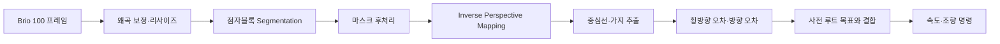
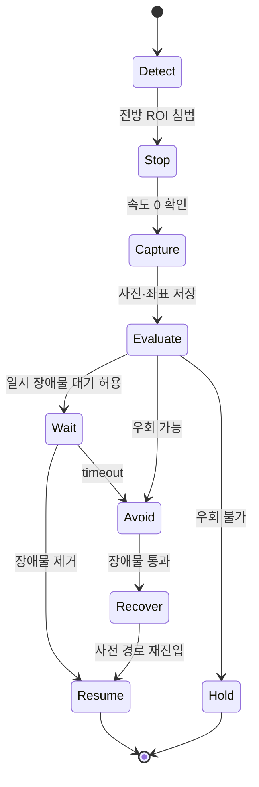
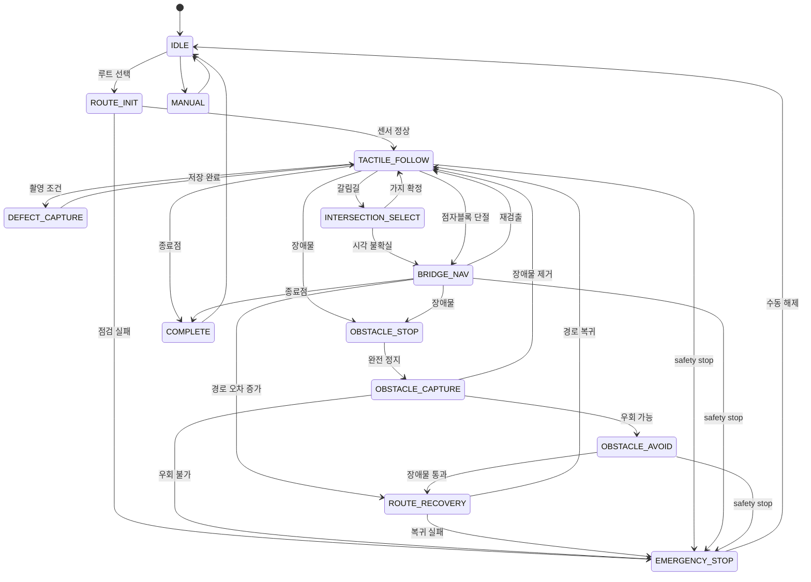

# 자율주행 알고리즘 설계

## 0. 목표와 제약

### 목표

로봇은 사전에 등록된 루트의 전역 방향을 따르면서, 카메라로 인식한 점자블록을 지역 주행 기준으로 사용한다.

```text
전역 기준: 사전 등록 루트
지역 기준: 카메라 점자블록 중심선
안전 기준: LiDAR·근거리 센서
위치 기록: GNSS + 루트 상 누적거리
```

### 제약

- 보도에서 일반 GNSS 오차는 점자블록 폭보다 클 수 있으므로 GNSS만으로 추종하지 않는다.
- 점자블록이 끊기거나 가려질 수 있다.
- 갈림길의 모든 방향이 점자블록으로 보일 수 있다.
- 차체는 GA25-370 구동과 MG996R 조향을 사용하는 Ackermann형으로 가정한다.
- 평가까지 시간이 짧으므로 완전한 범용 야외 자율주행보다 **등록 루트의 반복 순찰 안정성**을 우선한다.
- 장애물 종류는 분류하지 않는다.
- 사람과 차량이 자유롭게 이동하는 공공 보도는 평가 MVP 범위가 아니다.

---

## 1. 핵심 전략: Teach-and-Repeat + 점자블록 시각 추종

## 1.1 최초 루트 등록

운영자가 조이스틱으로 로봇을 수동 주행하며 루트를 기록한다.

기록 항목:

- `route_id`, `route_version`
- 로컬 `map` 좌표의 경로점 `x, y, yaw`
- GNSS `latitude, longitude`
- 시작점에서의 누적거리 `s`
- 권장 속도
- 세그먼트 유형
- 갈림길에서 선택할 방향
- 점자블록 단절 예상 구간
- 장애물 회피 허용 방향 또는 금지 구역

### 루트 세그먼트 유형

| 코드 | 의미 | 기본 제어 |
|---|---|---|
| `TACTILE_FOLLOW` | 점자블록 연속 구간 | 점자블록 중심선 우선 |
| `INTERSECTION` | 갈림길·굴절 | 사전 루트 방향과 가지 비교 |
| `BRIDGE_NAV` | 점자블록 단절·가림 구간 | 사전 경로 우선 |
| `SLOW_ZONE` | 촬영·회전·좁은 구간 | 감속 |
| `STOP_ZONE` | 종료·점검 위치 | 정지 |
| `NO_AVOID` | 회피 공간 부족 | 장애물 시 정지 유지 |

경로점은 0.1~0.2 m 간격으로 리샘플링한다. 단순 GPS 점열이 아니라 오도메트리 기반 로컬 경로를 저장하고 GNSS는 지리 좌표 변환용으로 사용한다.

## 1.2 반복 순찰

순찰 시 현재 위치를 사전 경로에 투영하여 가장 가까운 경로점과 진행 방향을 찾는다.

```text
현재 위치
→ 사전 경로의 최근접 점
→ 앞쪽 lookahead 경로점
→ 점자블록 중심선과 결합
→ 목표 조향각 생성
```

점자블록 인식 신뢰도가 높을수록 카메라 중심선을 더 강하게 사용하고, 신뢰도가 낮거나 단절 세그먼트이면 사전 경로 비중을 높인다.

---

## 2. 좌표계와 위치 추정

## 2.1 ROS 2 TF 구조

```text
map
└── odom
    └── base_link
        ├── camera_link
        ├── laser_link
        ├── gnss_link
        └── ground_tof_link
```

- `map`: 루트 시작점에 고정된 장기 기준 좌표
- `odom`: 연속성이 있는 휠·IMU 오도메트리
- `base_link`: 로봇 중심
- 센서 링크: URDF의 실제 장착 위치

## 2.2 센서 융합

### 기본 입력

- AS5600: 이동거리와 속도
- BNO055: yaw 변화와 각속도
- LiDAR: 장애물 및 환경 형상
- GNSS: 전역 좌표와 장기 드리프트 보조

### 권장 구성

1. Raspberry Pi가 휠 오도메트리를 계산한다.
2. Jetson의 `robot_localization` EKF가 휠 오도메트리와 IMU를 융합해 `odom → base_link`를 생성한다.
3. 루트 시작점에서 `map` 원점을 초기화한다.
4. 환경이 충분히 구조적이면 `slam_toolbox` 또는 LiDAR scan matching으로 `map → odom`을 보정한다.
5. GNSS는 이벤트 지오태깅과 루트의 대략적 전역 정렬에 사용한다.

### 폴백 단계

| 위치 추정 상태 | 주행 정책 |
|---|---|
| 엔코더+IMU 정상 | 정상 운행 |
| LiDAR 보정 가능 | 장기 드리프트 보정 |
| GNSS만 불량 | 운행 가능, 이벤트 좌표 신뢰도 낮음 표시 |
| 엔코더 또는 IMU 불량 | 감속 후 정지 |
| TF 단절 또는 위치 점프 | 즉시 정지·수동 복구 |

---

## 3. 점자블록 추종 파이프라인

## 3.1 영상 처리



### 처리 단계

1. 카메라 왜곡 보정
2. 추론 해상도 640×384 또는 640×640
3. 선형블록·점형블록 마스크 생성
4. 작은 노이즈 제거와 morphology closing
5. 지면 원근 변환으로 bird's-eye view 생성
6. 마스크 중심선 또는 skeleton 추출
7. 로봇 전방 0.3~1.2 m 구간에서 유효 중심선 선택
8. 2차 곡선 또는 polyline fitting
9. 추종 목표점 생성

## 3.2 시각 신뢰도

다음 요소를 이용해 `C_tactile ∈ [0,1]`를 산출한다.

- 평균 segmentation confidence
- 마스크 면적
- 마스크 연속성
- 예상 점자블록 폭과의 일치
- 이전 프레임 중심선과의 거리
- 사전 루트 진행 방향과의 각도
- 흐림·과노출 여부

예:

```text
C_tactile =
0.35 × 모델 신뢰도
+ 0.20 × 연속성
+ 0.15 × 폭 일치도
+ 0.15 × 시간적 일관성
+ 0.15 × 사전 루트 방향 일치도
```

## 3.3 목표점 결합

점자블록 목표점 `P_t`와 사전 경로 목표점 `P_r`를 신뢰도 기반으로 결합한다.

```text
w = clamp(C_tactile, 0, 1)

P_target = w × P_t + (1 - w) × P_r
```

세그먼트별 제한:

- `TACTILE_FOLLOW`: `w` 최대 0.9
- `INTERSECTION`: 가지 선택 후 `w` 최대 0.7
- `BRIDGE_NAV`: `w` 최대 0.2
- 점자블록 미검출: `w = 0`

이 구조는 점자블록을 우선 따라가되 전역 루트에서 벗어나지 않도록 한다.

---

## 4. Ackermann 경로 추종

## 4.1 Pure Pursuit 기반 조향

로봇 기준 목표점의 각도를 `α`, 휠베이스를 `L`, lookahead 거리를 `L_d`라 하면 조향각은 다음과 같이 계산한다.

```text
δ = atan(2L sin(α) / L_d)
```

초기 lookahead:

```text
L_d = clamp(0.35 + 0.8v, 0.35, 0.80) [m]
```

- 저속·급곡선: 짧은 lookahead
- 고속·직선: 긴 lookahead
- 조향각은 기계 한계보다 5~10% 안쪽으로 제한
- 조향 명령에 rate limit 적용

Nav2를 사용할 때는 Ackermann형에 적합한 **Regulated Pure Pursuit Controller**를 우선한다. 급격한 곡률과 장애물 접근에서 속도를 자동으로 낮출 수 있다.

## 4.2 속도 제어

```text
v_cmd =
v_route
× curvature_factor
× tactile_confidence_factor
× obstacle_factor
× image_quality_factor
```

초기 속도 범위:

| 상태 | 속도 |
|---|---:|
| 직선 정상 주행 | 0.25~0.35 m/s |
| 곡선·갈림길 | 0.15~0.25 m/s |
| 불량 촬영 접근 | 0.10~0.15 m/s 또는 정지 |
| 장애물 회피 | 최대 0.20 m/s |
| 경로 복귀 | 최대 0.15 m/s |
| 센서 신뢰도 저하 | 0 또는 0.10 m/s 이하 |

## 4.3 조향 캘리브레이션

MG996R PWM과 실제 조향각 관계를 측정하여 lookup table로 저장한다.

```text
steering_angle_rad
→ calibrated_servo_pulse_us
```

단순 선형 매핑보다 좌·우 비대칭과 링크 유격을 반영한 piecewise linear mapping을 사용한다.

---

## 5. 갈림길 처리

## 5.1 가지 후보 추출

Bird's-eye view 마스크를 skeletonize하고, 중심선 분기점 이후의 각 가지 방향을 계산한다.

각 후보 `i`에 대해 다음 점수를 계산한다.

```text
score_i =
0.45 × 다음 루트 방향 일치도
+ 0.20 × 마스크 신뢰도
+ 0.15 × 가지 연속 길이
+ 0.10 × 이전 진행 방향 연속성
+ 0.10 × 충돌 여유
```

가장 높은 점수의 가지를 선택한다.

## 5.2 불확실한 갈림길

다음 조건이면 즉시 선택하지 않고 감속한다.

- 1위와 2위 점수 차이가 임계값 미만
- 사전 루트 위치 불확실
- 선택 방향에 장애물 존재
- 점자블록 가지가 짧아 방향을 확정할 수 없음

감속 후 0.3~0.5 m 접근하면서 재평가한다. 여전히 불확실하면 사전 루트 목표점만으로 통과하거나 정지한다.

---

## 6. 점자블록 단절 처리

## 6.1 단절 판정

아래 조건이 연속적으로 발생하면 점자블록 단절로 판정한다.

- `C_tactile < 0.35`
- 유효 마스크 면적 부족
- 중심선 길이 부족
- 0.5~1.0초 이상 지속

순간적인 가림은 이전 곡선을 0.3~0.5초 유지하되, 그 이상은 `BRIDGE_NAV`로 전환한다.

## 6.2 연결 구간 통과

1. 현재 위치를 사전 루트에 투영
2. 다음 `TACTILE_FOLLOW` 세그먼트의 진입점을 목표로 설정
3. 엔코더·IMU·LiDAR로 저속 경로 추종
4. 점자블록을 다시 검출하면 방향·위치가 사전 루트와 일치하는지 확인
5. 3개 이상 프레임에서 안정되면 점자블록 추종으로 복귀

### 복귀 조건

```text
C_tactile ≥ 0.60
AND 사전 루트 방향 차이 ≤ 25°
AND 마스크 중심이 차체 허용범위 안
```

---

## 7. 장애물 탐지·정지·회피

## 7.1 전방 안전영역

로봇 footprint와 조향 궤적을 고려한 부채꼴 또는 직사각형 ROI를 사용한다.

초기값:

- 전방 폭: 차체 폭 + 좌우 각 0.15 m
- 정지 거리: 최소 0.60 m
- 비상 거리: 0.35 m
- 연속 검출: 3 scan
- 제거 판정: 5 scan 연속 여유

속도에 따른 정지 거리는 다음으로 보정한다.

```text
d_stop = v² / (2a_safe) + v × t_latency + d_margin
```

## 7.2 장애물 처리 순서



### 이벤트 생성

정지 후 다음을 저장한다.

- 대표 이미지
- `event_type = OBSTACLE`
- GNSS 좌표
- 루트 ID
- 루트 상 누적거리
- LiDAR 최소거리와 점유 영역
- 촬영 시각
- 이미지 품질
- 로봇 진행 방향

서버 업로드가 완료될 때까지 기다릴 필요는 없다. 로컬 저장 성공만 확인한 뒤 회피를 진행한다.

## 7.3 회피 경로

### 기본안: Nav2

- Local costmap의 obstacle layer에 `/scan` 사용
- Global/route corridor를 벗어나지 않는 비용 설정
- Ackermann 가능한 planner: Smac Hybrid-A* 계열 검토
- Controller: Regulated Pure Pursuit
- 회피 후 사전 경로 최근접 앞쪽 점으로 복귀

### 일정 지연 시 폴백: 3단계 우회

1. LiDAR에서 좌·우 통과 여유 비교
2. 허용된 측면으로 저속 이탈
3. 장애물 측면을 평행 통과
4. 앞쪽 사전 경로점으로 조향
5. 최근접 경로점이 현재보다 뒤면 선택하지 않음

안전거리 부족, 사람의 움직임, 센서 불확실성이 있으면 우회하지 않고 정지 유지한다.

---

## 8. 불량 탐지와 촬영 제어

## 8.1 병렬 추론

- 점자블록 추종 모델: 10~15 FPS 목표
- 불량 모델: 2~5 FPS 목표
- 주행 제어가 우선
- GPU 부하가 높으면 불량 모델 주기를 낮춤
- 불량 분석 때문에 LiDAR 정지 판단이 지연되어서는 안 됨

## 8.2 객체 추적

각 결함 후보에 `track_id`를 부여한다.

상태:

```text
NEW
→ TRACKING
→ CENTER_APPROACH
→ CAPTURED
→ PASSED
```

`CAPTURED` 이후 화면에서 사라질 때까지 다시 촬영하지 않는다.

## 8.3 대표 프레임 조건

다음 조건을 만족하는 프레임 중 품질 점수가 가장 높은 것을 선택한다.

- 중심점이 중앙 촬영 영역 안
- 마스크 면적이 최소 기준 이상
- 3개 이상 연속 프레임 검출
- blur score 기준 이상
- 과노출·저노출 비율 기준 이하
- 카메라와 결함 예상 거리 범위 안
- 로봇의 yaw rate가 낮음

필요하면 촬영 순간 0.10 m/s로 감속하거나 정지한다.

## 8.4 긴 크랙 병합

같은 통과 구간의 크랙 마스크가 다음 조건을 만족하면 한 이벤트로 묶는다.

- track 간 시간 간격이 짧음
- 마스크 끝점 간 실제 거리 기준 이하
- 주 진행 방향 각도 차이 작음
- 동일 또는 인접 점자블록 영역
- 루트 상 누적거리 범위가 겹침

서버 전송 값:

- 대표 이미지
- 필요 시 보조 이미지 최대 2장
- 병합 마스크
- 추정 길이
- 최대 폭
- 영향 블록 수
- 구간 시작·끝 누적거리

## 8.5 클래스 흔들림 방지

최근 N개 프레임의 클래스별 누적 점수를 사용한다.

```text
class_score(c) = Σ confidence_t(c) × quality_t × temporal_weight_t
```

- 최고 점수를 `primary_class`
- 2위가 임계값 이상이면 `secondary_class`
- 크랙과 파손이 실제로 공존할 수 있으므로 다중 라벨 허용
- 서버 VLM이 최종 상세 분석

---

## 9. 상태 머신



### 상태 전이 로그

모든 상태 전이를 다음 구조로 기록한다.

```json
{
  "timestamp": "2026-07-15T10:30:22.512+09:00",
  "route_id": "ROUTE_DEMO_01",
  "from": "TACTILE_FOLLOW",
  "to": "OBSTACLE_STOP",
  "reason": "front_roi_min_range",
  "pose": {"x": 12.4, "y": 1.2, "yaw": 0.08},
  "sensor_health": "OK"
}
```

---

## 10. ROS 2 노드 구성

## 10.1 Jetson 노드

| 노드 | 입력 | 출력 | 역할 |
|---|---|---|---|
| `camera_node` | Brio 100 | `/camera/image_raw` | 영상 |
| `tactile_seg_node` | image | `/tactile/mask`, `/tactile/path` | 점자블록 영역·중심선 |
| `defect_seg_node` | image | `/defect/detections` | 4종 불량 |
| `ydlidar_node` | X4 Pro | `/scan` | LiDAR |
| `gnss_node` | USB GNSS | `/fix` | GPS |
| `ekf_node` | odom, IMU | `/odometry/filtered` | 센서 융합 |
| `route_manager` | route DB | `/route/path`, `/route/segment` | 루트 로딩·선택 |
| `hybrid_follower` | route, tactile, pose | `/drive_cmd` | 목표 속도·조향 |
| `obstacle_manager` | scan, pose | 상태 이벤트 | 정지·회피 |
| `defect_event_manager` | detections, image, pose | `/event/outbox` | 추적·촬영·병합 |
| `system_supervisor` | 모든 상태 | `/drive_enable` | 안전·상태 머신 |
| `upload_agent` | outbox | HTTPS/Kafka gateway | 서버 전송 |
| `device_ui` | 상태·루트 | 사용자 입력 | 루트 선택·수동 정지 |

## 10.2 Raspberry Pi 노드

| 노드 | 입력 | 출력 |
|---|---|---|
| `actuator_node` | `/drive_cmd`, `/drive_enable` | motor/servo PWM, `/actuator/status` |
| `wheel_encoder_node` | AS5600 | `/wheel_odom` |
| `imu_node` | BNO055 | `/imu/data` |
| `ground_range_node` | TF-Luna | `/ground_range` |
| `near_obstacle_node` | HC-SR04 | `/safety/near_obstacle` |
| `manual_control_node` | joystick | `/manual_cmd` |
| `safety_watchdog` | heartbeat, GPIO | `/safety/stop` |

## 10.3 인터페이스 메시지 예시

```text
DriveCommand
- stamp
- speed_mps
- steering_angle_rad
- max_accel_mps2
- mode
- command_id
- valid_until
```

```text
DefectDetection
- track_id
- primary_class
- secondary_class
- confidence
- mask
- bbox
- center
- frame_quality
- capture_candidate
```

---

## 11. 핵심 의사코드

```python
while system_active:
    health = read_system_health()
    if not health.safe:
        command_stop(reason=health.reason)
        state = EMERGENCY_STOP
        continue

    pose = fused_pose()
    route_ctx = route_manager.context(pose)
    obstacle = obstacle_detector.front_hazard()

    if obstacle.emergency:
        command_stop(reason="emergency_obstacle")
        state = OBSTACLE_STOP
        continue

    if obstacle.blocking:
        command_stop(reason="blocking_obstacle")
        save_obstacle_event()
        if obstacle_detector.can_bypass(route_ctx):
            state = OBSTACLE_AVOID
            execute_bypass_and_recover()
        else:
            state = EMERGENCY_STOP
        continue

    tactile = tactile_tracker.latest()
    route_target = route_manager.lookahead_target(pose)

    if route_ctx.type == "INTERSECTION":
        tactile_target = choose_branch(tactile.branches, route_ctx.next_heading)
    elif tactile.confidence >= 0.60:
        tactile_target = tactile.lookahead_target
    else:
        tactile_target = None

    target = blend_targets(
        tactile_target=tactile_target,
        route_target=route_target,
        tactile_confidence=tactile.confidence,
        segment_type=route_ctx.type,
    )

    speed, steering = regulated_pure_pursuit(target, obstacle.clearance)
    publish_drive_cmd(speed, steering)

    event = defect_tracker.capture_ready()
    if event:
        slow_or_stop_for_capture()
        frame = select_best_frame(event)
        enqueue_defect_event(frame, event, pose, route_ctx)
```

---

## 12. 초기 튜닝 파라미터

다음 값은 시작점이며 실험으로 확정한다.

| 파라미터 | 초기값 |
|---|---:|
| 최고 속도 | 0.35 m/s |
| 촬영 속도 | 0.10~0.15 m/s |
| 회피 속도 | 0.20 m/s |
| 전방 정지 거리 | 0.60 m |
| 비상 거리 | 0.35 m |
| LiDAR 연속 장애물 scan | 3 |
| 점자 미검출 전환 시간 | 0.7 s |
| 점자 복귀 신뢰도 | 0.60 |
| 갈림길 방향 허용 오차 | 25° |
| drive command timeout | 0.5 s |
| lookahead | 0.35~0.80 m |
| route 최근접 검색 범위 | 현재 인덱스 전후 제한 |
| 경로 이탈 경고 | 0.35 m |
| 경로 복구 실패 | 1.0 m 또는 시간 초과 |
| 촬영 중앙 ROI | 영상 중앙 폭의 약 30~40% |
| 촬영 최소 연속 프레임 | 3 |
| 동일 track 재촬영 | 금지 |

---

## 13. 시험 방법

## 13.1 단계별 코스

### A. 구동 코스

- 점자블록 없이 테이프 중심선
- 직선 10 m
- 곡선
- 정지
- 조향 캘리브레이션

### B. 점자 추종 코스

- 정상 선형블록
- 그림자
- 일부 가림
- 색상이 다른 주변 바닥
- 갈림길

### C. 하이브리드 코스

- 점자블록 5 m
- 단절 2 m
- 재연결
- 갈림길
- 경로 종료

### D. 장애물 코스

- 고정 상자
- 폭이 충분한 우회
- 우회 불가
- 장애물 제거 후 재출발
- 장애물 회피 후 루트 복귀

### E. 통합 코스

- 불량 모형 4종
- 장애물
- 단절
- 갈림길
- 서버 전송

## 13.2 rosbag 재현

센서 데이터를 rosbag으로 저장해 다음을 하드웨어 없이 반복 검증한다.

- 점자블록 중심선
- 갈림길 선택
- 장애물 임계값
- 클래스 후처리
- 상태 머신 전이
- 이벤트 생성

평가에 사용한 모델·파라미터로 통합 코스 rosbag을 보존한다.

---

## 14. 자율주행 완료 기준

| 기능 | 완료 기준 |
|---|---|
| 수동 루트 기록 | 1회 기록 후 동일 루트 로딩 가능 |
| 직선 추종 | 10 m 구간에서 점자블록을 잃지 않고 완주 |
| 곡선 추종 | 지정 곡선 5회 중 4회 |
| 단절 통과 | 2 m 단절 5회 중 4회 |
| 갈림길 선택 | 지정 방향 10회 중 9회 |
| 장애물 정지 | 모든 시험에서 충돌 전 정지 |
| 장애물 회피 | 고정 장애물 5회 중 4회 |
| 경로 복귀 | 회피 성공 건 중 100% 앞쪽 경로로 복귀 |
| 통신 장애 | Ethernet 분리 후 0.5초 내 정지 |
| 센서 장애 | LiDAR/카메라/오도메트리 핵심 장애 시 정지 |
| 전체 루트 | 3회 연속 완주 |

---

## 15. 일정 지연 시 기능 축소 순서

1. LiDAR SLAM을 제거하고 엔코더·IMU+사전 루트로 고정
2. 범용 Nav2 회피 대신 검증된 3단계 고정 우회
3. 여러 루트를 1개 평가 루트로 축소
4. 동적 장애물 우회를 제거하고 정지·대기만 시연
5. 단차 높이 정량값을 제거하고 후보 탐지만 유지
6. 점자블록 갈림길을 사전 세그먼트 기반 고정 선택으로 단순화

다만 충돌 정지, 수동 비상정지, 이벤트 저장, 사전 경로 복귀는 축소 대상이 아니다.

---

## 16. 기술 참고자료

- ROS 2 Humble Ubuntu 설치: <https://docs.ros.org/en/humble/Installation/Ubuntu-Install-Debs.html>
- Nav2 개념: <https://docs.nav2.org/concepts/index.html>
- Nav2 Waypoint Follower: <https://docs.nav2.org/configuration/packages/configuring-waypoint-follower.html>
- Regulated Pure Pursuit: <https://docs.nav2.org/configuration/packages/configuring-regulated-pp.html>
- Nav2 알고리즘 선택: <https://docs.nav2.org/setup_guides/algorithm/select_algorithm.html>
- GPS 기반 Nav2 예제: <https://docs.nav2.org/tutorials/docs/navigation2_with_gps.html>
- YDLIDAR ROS 2 Driver: <https://github.com/YDLIDAR/ydlidar_ros2_driver>
