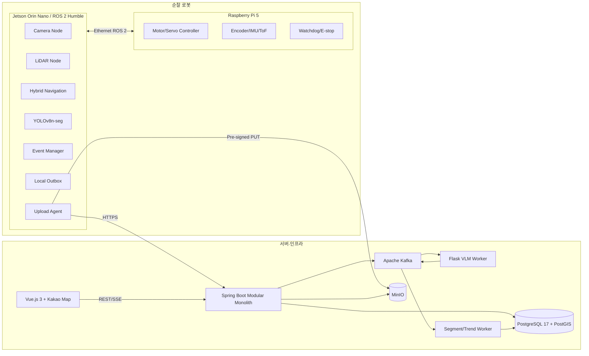
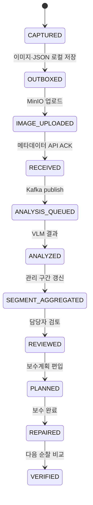
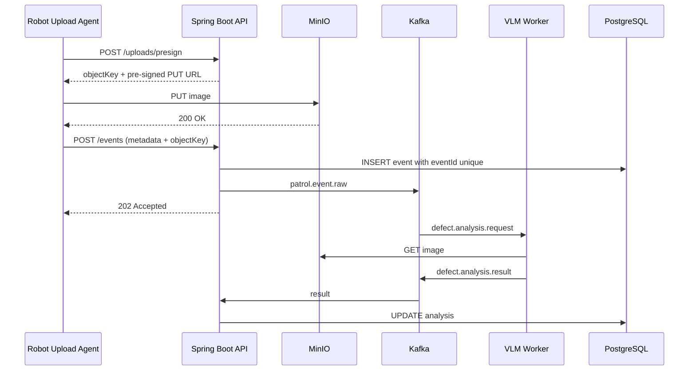
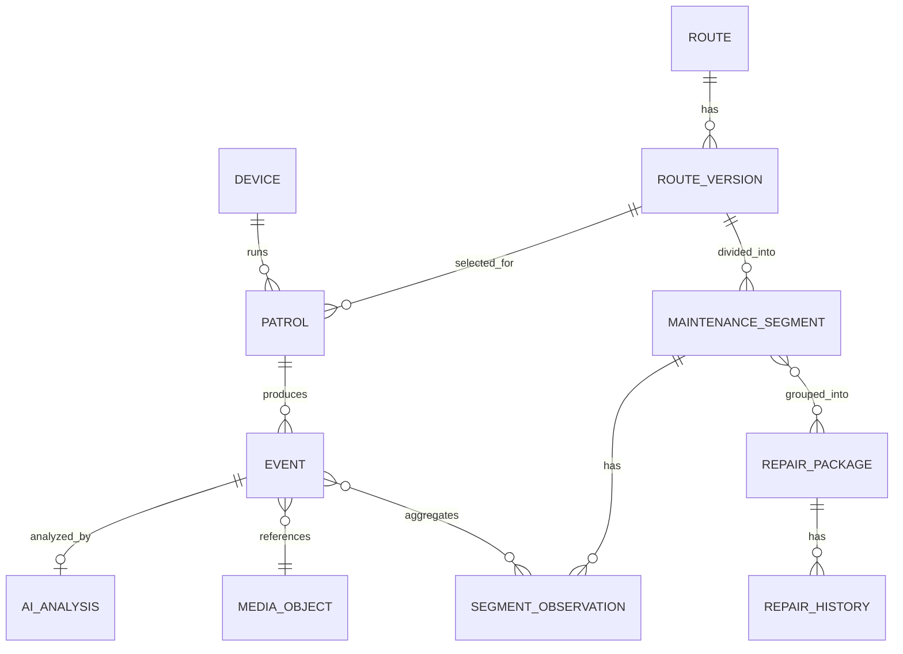

# 전체 시스템 아키텍처

## 0. 아키텍처 목표

본 시스템은 다음 요구를 동시에 만족해야 한다.

- 로봇 제어는 네트워크 없이도 동작
- 이미지·메타데이터는 연결이 끊겨도 유실되지 않음
- 서버 VLM은 주행 제어와 완전히 분리
- 동일 이벤트가 재전송되어도 중복 저장되지 않음
- 원본 관측과 후속 AI 분석을 모두 추적 가능
- 개별 이벤트를 3~5 m 관리 구간과 보수 후보 구간으로 집계
- 평가 일정 내 구현 가능하도록 과도한 마이크로서비스 분리를 피함

핵심 원칙은 **엣지 자율성, 서버 비동기 분석, 데이터 멱등성, 구간 중심 집계**다.

---

## 1. 전체 구성



---

## 2. 기술 스택 적용

| 계층 | 기술 | 적용 방식 |
|---|---|---|
| Frontend | Vue.js 3.5.39 | 관리자 대시보드·지도·루트·보수 계획 |
| 지도 | Kakao Map API | 5종 아이콘, 구간 폴리라인, 필터 |
| Backend | Java 21, Spring Boot 3.5.16 | 하나의 모듈형 애플리케이션으로 우선 구현 |
| Event | Spring Kafka, Apache Kafka | VLM·집계 비동기 처리 |
| ORM | Spring Data JPA | 메타데이터 CRUD |
| Database | PostgreSQL 17 | 이벤트·루트·순찰·분석·보수 상태 |
| 공간 기능 | PostGIS 권장 | 거리 검색, 구간 집계, 지도 geometry |
| Object Storage | MinIO | 원본·썸네일·마스크 이미지 |
| AI API | Flask | Qwen2.5-VL 분석과 위험도 규칙 |
| Edge AI | YOLOv8n-seg, ONNX | Jetson 추론 |
| Robot OS | Ubuntu 22.04, ROS 2 Humble | Jetson·Raspberry Pi |
| Container | Docker | 전 구성요소 이미지 |
| Orchestration | Kubernetes | 통합 안정화 후 배포; 평가의 선행조건 아님 |
| Cloud | AWS EC2 | API·DB·Kafka·MinIO 또는 staging |

### 구현 전략

평가 전에는 Spring Boot를 여러 마이크로서비스로 쪼개지 않는다. 다음 패키지 모듈을 가진 **modular monolith**로 구현한다.

```text
com.project
├── device
├── route
├── patrol
├── event
├── media
├── analysis
├── maintenance
├── map
└── common
```

Kafka는 프로세스 수를 늘리기 위해서가 아니라, VLM의 긴 처리시간과 집계 작업을 HTTP 요청에서 분리하기 위해 사용한다.

---

## 3. 엣지 소프트웨어 아키텍처

## 3.1 ROS 2 영역

### 상위 제어

- `route_manager`
- `hybrid_follower`
- `obstacle_manager`
- `system_supervisor`

### 인지

- `camera_node`
- `tactile_seg_node`
- `defect_seg_node`
- `ydlidar_node`
- `gnss_node`

### 이벤트

- `defect_event_manager`
- `obstacle_event_manager`
- `image_quality_node`
- `event_outbox`
- `upload_agent`

### 저수준

- `actuator_node`
- `wheel_encoder_node`
- `imu_node`
- `ground_range_node`
- `safety_watchdog`

## 3.2 ROS 2와 서버 경계

ROS 2 DDS를 공용 인터넷에 직접 노출하지 않는다.

```text
ROS 2 messages
→ Edge Event DTO
→ Local SQLite/JSON outbox
→ HTTPS REST
→ Spring Boot
```

로봇은 Kafka에 직접 접속하지 않는다. Kafka 인증·네트워크 복잡성과 재전송 문제를 줄이기 위해 Spring Boot가 Kafka producer 역할을 한다.

## 3.3 로컬 Outbox

권장 구현:

- SQLite 또는 파일+메타데이터 JSON
- 상태: `PENDING`, `IMAGE_UPLOADED`, `METADATA_SENT`, `ACKED`, `FAILED`
- 이벤트 UUID
- 이미지 SHA-256
- 재시도 횟수
- 다음 재시도 시간
- 마지막 오류
- 서버 ACK 시각

### 재시도 정책

```text
1초 → 5초 → 15초 → 1분 → 5분 → 최대 30분
```

네트워크가 복구되면 오래된 이벤트부터 처리하되, 현재 순찰 제어보다 낮은 우선순위로 실행한다.

---

## 4. 이벤트 생명주기



오류 상태:

- `UPLOAD_FAILED`
- `ANALYSIS_FAILED`
- `INVALID_IMAGE`
- `NEEDS_HUMAN_REVIEW`

실패한 AI 분석이 원본 이벤트 저장을 롤백하지 않는다.

---

## 5. 서버 모듈

## 5.1 Device Module

- 기기 등록
- device token
- 마지막 접속
- 소프트웨어·모델 버전
- 센서 상태
- 배터리·온도·오류
- 원격 설정 조회

## 5.2 Route Module

- 루트 생성·버전
- 로컬 경로와 GNSS polyline
- 세그먼트 유형
- 시작·종료점
- 루트 파일 다운로드
- 활성 버전 고정

## 5.3 Patrol Module

- 순찰 시작·종료
- 완주율
- 실제 이동 경로
- 이벤트 수
- 중단 원인
- 기기 로그 참조

## 5.4 Event Module

- defect/obstacle 이벤트 수신
- UUID 멱등 처리
- 위치·시간·루트 거리 저장
- YOLO 원본 결과
- 이미지 객체 키
- 분석 상태
- 검토 상태

## 5.5 Analysis Module

- Kafka 분석 요청 발행
- VLM 결과 소비
- 스키마 검증
- 재시도와 dead-letter
- 위험도 공식 적용
- 분석 버전 저장

## 5.6 Maintenance Module

- 3~5 m 관리 구간 생성
- 시계열 위험도
- 보수 후보 구간 병합
- 예상 물량·우선순위
- 보수 상태·전후 검증

## 5.7 Map Module

- 지도 viewport 기반 이벤트 조회
- 아이콘 클러스터링
- 루트·관리 구간 geometry
- 날짜·클래스·위험도 필터
- 상세 패널 DTO

---

## 6. 이미지 업로드 흐름

대용량 이미지를 Spring Boot가 직접 중계하지 않는 것을 기본으로 한다.



### 평가용 폴백

Pre-signed URL 구현이 지연되면 `multipart/form-data`로 이미지와 JSON을 한 번에 받는다. 단, 최종 구조는 MinIO 직접 업로드를 권장한다.

---

## 7. REST API 초안

## 7.1 Device

| Method | Path | 설명 |
|---|---|---|
| `POST` | `/api/v1/devices/{id}/heartbeat` | 상태·배터리·버전 |
| `GET` | `/api/v1/devices/{id}/config` | 설정 조회 |
| `POST` | `/api/v1/devices/{id}/logs` | 오류 요약 |

## 7.2 Route/Patrol

| Method | Path | 설명 |
|---|---|---|
| `GET` | `/api/v1/routes` | 루트 목록 |
| `GET` | `/api/v1/routes/{id}/versions/{v}` | 루트 파일 |
| `POST` | `/api/v1/patrols` | 순찰 시작 |
| `PATCH` | `/api/v1/patrols/{id}` | 진행·종료 |
| `GET` | `/api/v1/patrols/{id}` | 순찰 상세 |

## 7.3 Media/Event

| Method | Path | 설명 |
|---|---|---|
| `POST` | `/api/v1/uploads/presign` | MinIO 업로드 URL |
| `POST` | `/api/v1/events` | 이벤트 메타데이터 |
| `GET` | `/api/v1/events/{id}` | 이벤트 상세 |
| `PATCH` | `/api/v1/events/{id}/review` | 검토 상태 |

## 7.4 Map/Maintenance

| Method | Path | 설명 |
|---|---|---|
| `GET` | `/api/v1/map/events` | bbox·필터 기반 아이콘 |
| `GET` | `/api/v1/maintenance/segments` | 관리 구간 |
| `GET` | `/api/v1/maintenance/segments/{id}` | 구간 시계열 |
| `POST` | `/api/v1/repair-packages` | 공사 후보 생성 |
| `PATCH` | `/api/v1/repair-packages/{id}` | 상태 변경 |
| `GET` | `/api/v1/reports/export` | CSV 내보내기 |

---

## 8. 이벤트 스키마

## 8.1 불량 이벤트

```json
{
  "eventId": "01JZDEFECT000001",
  "eventType": "TACTILE_DEFECT",
  "deviceId": "ROBOT_01",
  "patrolId": "PATROL_20260715_01",
  "routeId": "ROUTE_DEMO_01",
  "routeVersion": 3,
  "capturedAt": "2026-07-15T10:30:00.123+09:00",
  "position": {
    "latitude": 37.123456,
    "longitude": 127.123456,
    "gnssAccuracyM": 4.2,
    "routeDistanceM": 125.4,
    "headingDeg": 82.5,
    "localX": 12.53,
    "localY": 1.24
  },
  "detection": {
    "primaryClass": "CRACK",
    "secondaryClasses": ["BREAKAGE"],
    "confidence": 0.91,
    "bbox": [320, 180, 240, 160],
    "maskEncoding": "RLE_OR_OBJECT_KEY",
    "estimatedLengthCm": 22.4,
    "affectedAreaRatio": 0.14,
    "trackId": 184
  },
  "sensorEvidence": {
    "groundRangeDeltaMm": null,
    "tactileConfidence": 0.88
  },
  "media": {
    "originalObjectKey": "events/2026/07/15/01JZDEFECT000001.jpg",
    "thumbnailObjectKey": null,
    "sha256": "..."
  },
  "quality": {
    "sharpness": 0.82,
    "exposure": 0.76,
    "overall": 0.79
  },
  "software": {
    "edgeVersion": "edge-v0.5.0",
    "defectModelVersion": "defect-y8nseg-v0.4.0",
    "postprocessVersion": "defect-track-v0.2"
  }
}
```

## 8.2 장애물 이벤트

```json
{
  "eventId": "01JZOBSTACLE0001",
  "eventType": "OBSTACLE",
  "deviceId": "ROBOT_01",
  "patrolId": "PATROL_20260715_01",
  "routeId": "ROUTE_DEMO_01",
  "capturedAt": "2026-07-15T10:35:00.000+09:00",
  "position": {
    "latitude": 37.123500,
    "longitude": 127.123600,
    "routeDistanceM": 141.8,
    "headingDeg": 84.1
  },
  "obstacle": {
    "minLidarRangeM": 0.48,
    "frontOccupiedWidthM": 0.42,
    "avoidanceResult": "BYPASSED"
  },
  "media": {
    "originalObjectKey": "events/2026/07/15/01JZOBSTACLE0001.jpg",
    "sha256": "..."
  },
  "software": {
    "edgeVersion": "edge-v0.5.0"
  }
}
```

장애물 종류 필드는 두지 않는다.

---

## 9. Kafka 설계

## 9.1 토픽

| Topic | Key | Producer | Consumer |
|---|---|---|---|
| `patrol.event.raw` | `eventId` | Spring Boot | 분석 라우터 |
| `defect.analysis.request` | `eventId` | 분석 라우터 | Flask VLM |
| `defect.analysis.result` | `eventId` | Flask VLM | Spring Boot |
| `maintenance.segment.rebuild` | `routeId` | Spring Boot | 집계 worker |
| `device.telemetry` | `deviceId` | Spring Boot | 모니터링/저장 |
| `analysis.dead-letter` | `eventId` | 실패 handler | 운영자 |

### 파티션 키

- 이벤트 분석: `eventId`
- 관리 구간 재계산: `routeId`
- 장치 상태: `deviceId`

### 소비 멱등성

Kafka는 중복 전달이 가능하므로 consumer도 `eventId + analysisVersion` unique key로 멱등 처리한다.

---

## 10. 데이터베이스 설계

PostgreSQL 17에 PostGIS 확장을 권장한다.

## 10.1 핵심 테이블



### 주요 테이블

- `device`
- `route`
- `route_version`
- `route_point`
- `patrol`
- `event`
- `event_detection`
- `media_object`
- `ai_analysis`
- `maintenance_segment`
- `segment_observation`
- `repair_package`
- `repair_history`
- `review_action`

## 10.2 공간 컬럼

- `event.geom geometry(Point, 4326)`
- `route_version.geom geometry(LineString, 4326)`
- `maintenance_segment.geom geometry(LineString, 4326)`
- `repair_package.geom geometry(LineString, 4326)`

### 활용 쿼리

- 현재 지도 viewport 안 이벤트 조회
- 루트에서 일정 거리 이내 이벤트 조회
- 이벤트를 가장 가까운 루트에 snap
- 3~5 m 구간별 집계
- 시설 인접성 계산

## 10.3 주요 제약조건

- `event.event_id UNIQUE`
- `media_object.sha256`
- `ai_analysis(event_id, analysis_version) UNIQUE`
- `route(route_code)`
- `route_version(route_id, version) UNIQUE`
- 모든 상태 변경에 `created_at`, `updated_at`

---

## 11. 관리 구간 생성

## 11.1 기본 방법

1. 이벤트를 `route_id`별로 분리
2. `route_distance_m`을 3~5 m bin으로 양자화
3. GPS와 route polyline 근접성 검증
4. 인접 bin의 고위험 이벤트가 연속되면 병합
5. 순찰별 관측값 생성
6. 구간 위험도와 추세 갱신

### 예

```text
ROUTE_A, 120.0~125.0 m
- 크랙 3건
- 파손 1건
- 최대 위험도 74
- 평균 상위 위험도 61
- 최근 4주 상승률 +3.2점/주
```

GPS 좌표가 조금 달라도 루트 상 거리가 비슷하면 같은 구간으로 취급할 수 있다.

## 11.2 보수 후보 공사 구간

다음 조건으로 관리 구간을 연속 병합한다.

- 서로 인접
- 주요 결함이 유사
- 위험도 임계값 이상
- 공사 최소 길이 기준
- 같은 관리 주체
- 중간 정상 구간이 짧음

결과:

```json
{
  "repairPackageId": "RP_2026_0012",
  "routeId": "ROUTE_A",
  "startDistanceM": 115.0,
  "endDistanceM": 145.0,
  "lengthM": 30.0,
  "estimatedBlocks": 42,
  "mainDefects": ["CRACK", "BREAKAGE"],
  "priority": 82,
  "suggestedWindow": "1_TO_3_MONTHS"
}
```

---

## 12. Frontend 구조

## 12.1 Vue 모듈

```text
src/
├── views/
│   ├── DashboardView.vue
│   ├── MapView.vue
│   ├── EventDetailView.vue
│   ├── MaintenanceView.vue
│   ├── RouteView.vue
│   └── DeviceView.vue
├── components/
│   ├── map/
│   ├── charts/
│   ├── event/
│   └── device/
├── stores/
├── api/
└── types/
```

## 12.2 지도 표현

### 5종 아이콘

- 마모·벗겨짐
- 크랙
- 파손
- 단차
- 장애물

### 별도 레이어

- 루트
- 실제 순찰 궤적
- 관리 구간 위험도
- 보수 후보 구간
- 보수 이력
- 반복 장애물 hotspot

아이콘이 많을 때는 지도 zoom에 따라 cluster를 사용한다. 관리 구간은 색상만으로 의미를 전달하지 않고 라벨·패턴·툴팁을 함께 제공한다.

## 12.3 실시간 상태

평가 MVP에서 WebSocket까지 구현 부담이 크면 Server-Sent Events 또는 3~5초 polling을 사용한다.

- 로봇 현재 상태
- 위치
- 배터리
- 현재 루트
- 최근 이벤트
- 업로드 대기 수

---

## 13. VLM 서비스

## 13.1 배포

Qwen2.5-VL-7B-Instruct는 GPU가 있는 실행 노드가 필요하다. AWS EC2가 CPU 인스턴스라면 다음 중 하나를 사용한다.

1. 팀이 사용할 수 있는 GPU 서버에 Flask worker 배포
2. GPU EC2 또는 GPU Kubernetes node
3. 4-bit quantized 모델을 별도 GPU PC에서 실행
4. 평가 폴백으로 더 작은 VLM 또는 규칙 기반 분석

VLM 응답은 로봇 주행을 막지 않으며, 지도에는 `분석 중` 상태를 표시할 수 있다.

## 13.2 API 예

```http
POST /internal/v1/analyze
Content-Type: application/json
```

```json
{
  "eventId": "01JZDEFECT000001",
  "imageUrl": "signed-read-url",
  "yolo": {},
  "sensorEvidence": {},
  "history": {}
}
```

응답은 AI 설계 문서의 고정 JSON 스키마를 따른다.

## 13.3 오류 처리

- timeout 60~120초
- 최대 3회 재시도
- JSON schema validation 실패 시 한 번 재프롬프트
- 계속 실패하면 규칙 기반 분석
- dead-letter 저장
- 원본 이벤트는 유지

---

## 14. 보안·개인정보

### 기기 인증

- device별 API key 또는 짧은 수명 JWT
- HTTPS
- key는 이미지에 포함하지 않고 환경변수·secret에 저장
- 분실 기기 token 폐기

### MinIO

- public bucket 금지
- pre-signed URL 만료
- object key에 개인식별정보 금지
- 원본과 썸네일 bucket 또는 prefix 분리

### 개인정보

- 얼굴과 차량 번호판 blur
- 통제 시연에서는 사람·차량이 촬영되지 않도록 구성
- 원본 접근 권한과 일반 지도 조회 권한 분리
- 보존기간과 삭제 정책
- 운영 환경 로그에 이미지 URL 전체 노출 금지

### 서버

- 입력 JSON schema 검증
- 파일 MIME·크기 제한
- 업로드 object key path traversal 방지
- Kafka·DB·MinIO는 private network
- 운영 secret은 Kubernetes Secret 또는 EC2 secret store

---

## 15. 신뢰성 설계

## 15.1 멱등성

- `eventId`를 로봇에서 생성
- 이벤트 POST 재시도 시 같은 ID 사용
- DB unique constraint
- Kafka consumer도 동일 version 중복 방지
- 이미지 SHA-256 저장

## 15.2 연결 장애

- 로봇 outbox
- MinIO 업로드와 metadata 전송 상태 분리
- 서버 ACK 전 로컬 원본 유지
- 재연결 시 순차 재전송
- 네트워크 속도가 낮으면 썸네일 우선, 원본 후속 업로드 가능

## 15.3 서비스 장애

| 장애 | 동작 |
|---|---|
| Spring Boot 중단 | 로봇 outbox 누적 |
| Kafka 중단 | API는 이벤트 저장 후 분석 대기 |
| VLM 중단 | 원본 지도 표시, 분석 상태 대기 |
| MinIO 중단 | 로봇 이미지 재시도 |
| DB 중단 | API 503, 로봇 outbox 유지 |
| Kakao Map 장애 | 목록·표 형태로 데이터 조회 |
| GPU 부족 | 규칙 기반 위험도 폴백 |

## 15.4 데이터 일관성

DB 이벤트 저장과 Kafka 발행 사이 유실을 막기 위해 서버 내부에도 transactional outbox 패턴을 권장한다.

```text
HTTP event transaction
→ event row + server_outbox row
→ background publisher
→ Kafka
→ published flag
```

---

## 16. 관측성과 로그

### Edge

- ROS 2 node health
- inference FPS
- LiDAR frequency
- command latency
- battery voltage
- outbox length
- upload success/failure
- 상태 머신 전이

### Server

- API latency/error rate
- Kafka lag
- VLM latency·실패율
- MinIO 오류
- DB connection
- 분석 대기 건수
- segment rebuild 시간

### 공통 trace ID

`eventId`를 로봇 로그, API 로그, Kafka header, VLM 로그, DB에 동일하게 사용한다.

---

## 17. 개발·배포 환경

## 17.1 로컬 개발

Docker Compose 권장 구성:

```text
postgres-postgis
kafka-kraft
minio
spring-api
flask-vlm-mock
vue
```

VLM 전체 모델 대신 mock JSON을 사용해 BE/FE를 먼저 완성한다.

## 17.2 통합 환경

- Spring Boot·Vue·PostgreSQL·Kafka·MinIO는 EC2 또는 교육장 서버
- GPU VLM worker는 GPU 사용 가능한 노드
- 로봇은 HTTPS로 접속
- 도메인·TLS가 어렵다면 평가 전용 VPN/사설 AP에서 고정 주소 사용

## 17.3 Kubernetes

Kubernetes는 다음 조건을 만족한 후 적용한다.

- Docker Compose에서 종단 간 시연 성공
- 환경변수와 volume 정의 완료
- readiness/liveness endpoint 존재
- DB·MinIO persistence 계획
- GPU node scheduling 계획

평가에서 중요한 것은 Kubernetes 화면이 아니라 로봇 이벤트가 안정적으로 지도에 반영되는 것이다. 2026-08-03까지 K8s가 불안정하면 Docker Compose 또는 단일 EC2 배포로 고정한다.

---

## 18. 테스트 전략

## 18.1 Contract Test

- Edge event JSON ↔ Spring DTO
- Kafka request/result schema
- Flask output JSON schema
- Vue TypeScript type

OpenAPI 또는 JSON Schema 파일을 한 곳에서 관리한다.

## 18.2 통합 테스트

1. 고정 샘플 이미지 이벤트 POST
2. MinIO 저장
3. Kafka 분석
4. VLM mock 결과
5. DB update
6. 지도 아이콘
7. 관리 구간 집계

## 18.3 장애 테스트

- 네트워크 5분 차단
- 같은 event POST 3회
- MinIO 일시 중단
- VLM timeout
- 잘못된 JSON
- 이미지 누락
- Kafka 재전달
- DB 재시작

## 18.4 부하 기준

평가 MVP는 대규모 처리보다 안정성을 우선한다.

- 로봇 1~3대 가정
- 순찰당 이벤트 수십~수백 건
- 원본 이미지 JPEG 0.2~2 MB 목표
- VLM 비동기 queue
- 지도 viewport pagination

---

## 19. 전체 시스템 완료 기준

| 계층 | 완료 조건 |
|---|---|
| Edge | 결함·장애물 이벤트를 outbox에 저장 |
| Upload | 온라인·오프라인 재전송, 중복 없음 |
| Object | MinIO 원본 조회 가능 |
| Backend | 이벤트·순찰·루트 CRUD |
| Kafka | 분석 요청·결과 비동기 흐름 |
| VLM | 구조화 분석 또는 규칙 폴백 |
| DB | 위치·분석·관리 구간 저장 |
| Frontend | 5종 아이콘·상세·필터 |
| Maintenance | 3~5 m 구간·시계열·우선순위 |
| Operations | 로그·상태·오류 확인 |
| Security | 비공개 이미지·기기 인증·업로드 제한 |
| Demo | 루트 1회 순찰 결과가 지도·구간까지 연결 |

---

## 20. 기술 참고자료

- Spring Boot: <https://spring.io/projects/spring-boot>
- Spring for Apache Kafka: <https://spring.io/projects/spring-kafka>
- PostgreSQL: <https://www.postgresql.org/>
- PostGIS: <https://postgis.net/>
- MinIO: <https://min.io/>
- Apache Kafka: <https://kafka.apache.org/>
- Vue.js: <https://vuejs.org/>
- Kakao Maps API: <https://apis.map.kakao.com/>
- ROS 2 Humble: <https://docs.ros.org/en/humble/>
