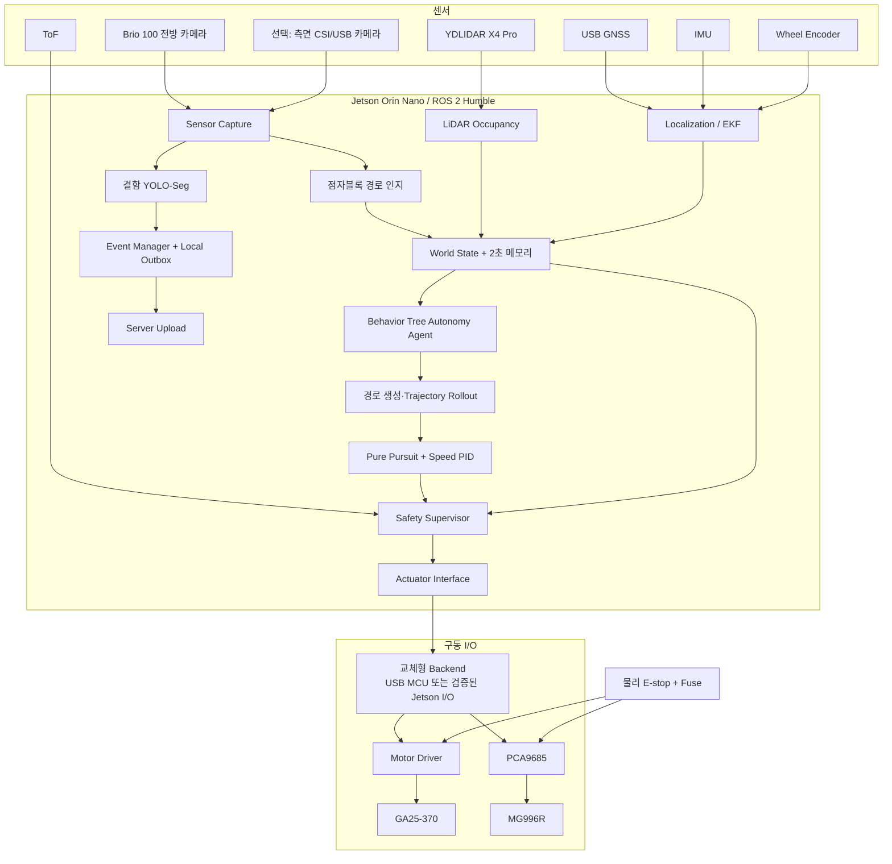

# Jetson 단독형 자율주행 에이전트 상세설계

- **대상 작품:** 불량 점자블록·보행 장애물 탐지 자율주행 로봇
- **기준일:** 2026-07-16
- **핵심 변경:** Raspberry Pi를 필수 구성에서 제거하고 Jetson Orin Nano를 유일한 상위 컴퓨터로 사용
- **운용 범위:** 통제된 보도·캠퍼스·실외 모형 코스, 운영자 감독, 0.1~0.5 m/s 저속 운용

---

## 1. 설계 결론

Raspberry Pi는 필수 장치가 아니다. 현재 작품에는 다음 구조가 가장 적합하다.

> **Jetson Orin Nano가 인지·상황통합·행동판단·경로계획·속도/조향 제어·이벤트 처리를 모두 수행한다. 모터와 서보는 Jetson의 액추에이터 인터페이스가 제어하며, 물리 비상정지와 명령 타임아웃은 소프트웨어와 독립적으로 동작하도록 구성한다.**

다만 다음 두 개념을 구분해야 한다.

- **Raspberry Pi:** 제거 가능
- **저수준 구동 인터페이스와 독립 안전장치:** 제거 불가

Jetson Linux에서 모터 PWM과 센서 I/O를 직접 처리할 수 있지만, Jetson 전체가 멈췄을 때 마지막 PWM이 유지되는 구조는 안전하지 않다. 따라서 실제 적용 우선순위는 다음과 같다.

1. **권장:** Jetson + USB 연결 소형 MCU 또는 command-timeout이 있는 모터 컨트롤러
2. **조건부:** Jetson 40핀 헤더 직접 제어 + 외부 하드웨어 watchdog
3. **시험 전용:** Jetson 직접 GPIO/PWM만 사용하고 운영자가 E-stop을 상시 확보

소형 MCU는 자율주행 판단을 하지 않는다. Jetson이 만든 최종 속도·조향 명령을 전기 신호로 변환하고, heartbeat가 끊기면 출력을 0으로 만드는 장치다. 따라서 본 설계의 자율주행 에이전트는 여전히 Jetson 안에 완전히 탑재된다.

---

## 2. 현재 하드웨어 조건 재정의

### 2.1 사용 장치

| 영역 | 장치 | 본 설계 역할 |
|---|---|---|
| 컴퓨팅 | Jetson Orin Nano | 전체 자율주행·AI·제어·통신 |
| 주행 카메라 | Logitech Brio 100 | 점자블록 경로·전방 장면 |
| 결함 카메라 | 호환 CSI/USB 카메라가 있을 때 사용 | 측면 점자블록 결함 촬영 |
| LiDAR | YDLIDAR X4 Pro | 장애물·자유 공간·로컬 비용지도 |
| 구동 | GA25-370 DC 모터 | 후륜 구동 |
| 조향 | MG996R | Ackermann 조향 |
| 모터 드라이버 | 지급 Motor Driver HAT | IC·전류·입력 방식 확인 후 사용 판단 |
| 서보 PWM | PCA9685 | MG996R PWM 생성 |
| 자세 | BNO055/BNO085급 IMU | yaw·yaw rate·자세 |
| 엔코더 | AS5600 또는 모터축 엔코더 | 속도·이동거리 |
| 지면 거리 | TF-Luna | 단차 후보·낙하 위험 보조 |
| 위치 | USB GNSS | 이벤트 지도 좌표·글로벌 루트 |
| 안전 | 물리 E-stop·퓨즈 | 모터·서보 전원 직접 차단 |

### 2.2 확인된 제약

- Jetson 40핀 헤더의 3.3 V·5 V 전원 항목에 이상 기록이 있으므로, 재검증 전까지 헤더 전원을 센서나 드라이버에 공급하지 않는다.
- Motor Driver HAT의 제어 IC, 입력 로직, 연속·피크 전류, PWM·DIR·EN 방식이 아직 확정되지 않았다.
- GA25-370은 변형 모델별 정격전압·기어비·스톨전류가 다르므로 실물 라벨과 전류 제한 전원으로 확인해야 한다.
- 실제 지급 카메라가 Brio 100 한 대뿐이라면 우선 단일 카메라 MVP로 구성한다.
- Ackermann 섀시이므로 제자리 회전이 불가능하며, 회피 경로는 최소 회전반경을 만족해야 한다.

---

## 3. 권장 전체 아키텍처



핵심은 자율주행 소프트웨어가 특정 하위 보드에 종속되지 않도록 `Actuator Interface`를 추상화하는 것이다.

```text
Autonomy Agent / Controller
        ↓ 동일한 VehicleCommand
Actuator Interface
        ├─ JetsonDirectBackend
        ├─ UsbMcuBackend
        └─ RpiBackend (필요할 때만 사용 가능한 폴백)
```

RPi는 이 중 하나의 선택지일 뿐 기본 아키텍처가 아니다.

---

## 4. 액추에이터 연결 설계

## 4.1 1순위: Jetson + USB MCU

### 역할 분담

#### Jetson

- 모든 센서 인지
- World State 생성
- 행동 모드 선택
- 경로·궤적 계획
- 목표 속도·목표 조향각 계산
- 최종 명령 제한
- 결함 이벤트 생성·서버 전송

#### MCU 또는 command-timeout 지원 모터 컨트롤러

- Jetson 명령 수신
- PWM·DIR·EN 출력
- PCA9685 또는 직접 서보 PWM
- 엔코더 카운트
- 100~200 ms heartbeat timeout
- timeout 시 모터 0·서보 중립 또는 안전 유지
- E-stop 상태 보고

### 직렬 프로토콜 예

```text
Jetson → MCU, 50 Hz
CMD,seq,mode,speed_mps,steering_rad,enable,crc

MCU → Jetson, 50 Hz
FB,seq,encoder_ticks,speed_mps,estop,fault,crc
```

`enable=0`, CRC 오류, heartbeat timeout이면 MCU가 즉시 PWM을 0으로 만든다.

### 이 구조를 권장하는 이유

- RPi 운영체제·Ethernet·ROS 2 구성을 제거할 수 있다.
- Jetson의 USB 포트로 연결하므로 문제 기록이 있는 40핀 헤더에 의존하지 않는다.
- 엔코더 펄스와 PWM을 Linux 스케줄링 지터에서 분리할 수 있다.
- MCU는 판단 장치가 아니라 안전한 I/O 장치이므로 소프트웨어 복잡도가 낮다.

## 4.2 2순위: Jetson 직접 I/O

다음 조건을 모두 만족할 때만 적용한다.

- 40핀 헤더 전원·GND·I²C·GPIO 재시험 통과
- Motor Driver HAT가 3.3 V 입력 호환
- HAT의 PWM·DIR·EN 핀맵과 기본 상태 확인
- 부팅 중 모든 구동 출력이 0임을 측정
- 외부 하드웨어 watchdog 또는 driver timeout 확보

### 연결 예

```text
Jetson I²C SDA/SCL
├─ PCA9685 0x40 → MG996R
├─ IMU 0x28/0x29
└─ AS5600 0x36

Jetson GPIO/PWM
├─ Motor PWM
├─ Motor DIR
└─ Driver ENABLE

Jetson USB
├─ Brio 100
├─ YDLIDAR
├─ GNSS
└─ USB-UART ToF
```

### 주의사항

- 센서·PCA9685 로직 전원은 외부의 검증된 3.3 V 레일에서 공급한다.
- MG996R 전원은 별도 6 V 5 A급 레일을 사용한다.
- 모터 전원은 모터 정격에 맞춘 별도 레일을 사용한다.
- 모든 신호 GND는 star ground에서 공통화한다.
- HC-SR04는 5 V echo 레벨과 배선 복잡성 때문에 MVP에서 제외한다.

## 4.3 Motor Driver HAT 채택 게이트

| 확인 항목 | 통과 기준 | 실패 시 조치 |
|---|---|---|
| 제어 방식 | I²C 또는 PWM/DIR/EN 식별 | 회로 추적 또는 교체 |
| 입력 로직 | 3.3 V HIGH 인식 | 레벨시프터 또는 교체 |
| 모터 전압 | 실제 GA25-370 정격 지원 | 별도 H-bridge |
| 연속 전류 | 실주행 전류 이상 | 상위 전류 드라이버 |
| 피크 전류 | 기동·스톨 피크 견딤 | 전류 제한·교체 |
| 정지 방식 | brake/coast 동작 확인 | 안전 정지 로직 조정 |
| ENABLE | timeout 시 하드웨어 차단 가능 | 외부 relay/watchdog 추가 |

이 게이트를 통과하기 전에는 바퀴를 지면에 놓고 시험하지 않는다.

---

## 5. 카메라 구성

## 5.1 단일 카메라 MVP

Brio 100 한 대만 확실히 사용할 수 있을 때의 구성이다.

### 설치

- 차체 전방 중심에서 점자블록 쪽으로 약간 편향
- 지면과 전방 0.3~1.5 m가 동시에 보이는 하향 각도
- 영상 하단: 근거리 결함 ROI
- 영상 중·상단: 점자블록 방향·경로 ROI

### 처리 스케줄

```text
모든 프레임
→ 경로 검출 15~20 Hz

매 3~4번째 프레임 또는 저속 구간
→ 결함 YOLO-Seg 4~7 Hz
```

한 프레임을 경로 검출과 결함 탐지에 공유하므로 USB 대역폭과 캡처 복제가 줄어든다.

### 한계

- 측면 결함의 해상도가 낮아질 수 있다.
- 오프셋이 클수록 점자블록 근접 ROI가 화면 바깥으로 나갈 수 있다.
- 카메라 브래킷 각도와 오프셋을 함께 캘리브레이션해야 한다.

## 5.2 듀얼 카메라 확장

두 번째 카메라가 Jetson에서 안정적으로 인식될 때만 적용한다.

- Camera 1: 전방 점자 경로 인지, 640×360 또는 640×480
- Camera 2: 측면 결함 탐지, 640×640 추론 입력
- Camera 2는 5~10 Hz로 제한
- 두 스트림을 30분 이상 동시 실행해 USB 재연결·발열·프레임 드롭을 검증

Jetson Orin Nano 개발 키트에는 USB Type-A 포트 4개와 호스트로 사용할 수 있는 USB-C 포트가 있으나, 두 카메라·LiDAR·GNSS·MCU·조이스틱을 동시에 연결하면 포트와 전원 여유가 부족할 수 있다. 이 경우 **외부 전원형 USB 허브**를 사용하고, 카메라와 LiDAR를 서로 다른 USB 스택에 분산한다.

---

## 6. Jetson 내부 소프트웨어 구조

## 6.1 노드 구성

| 노드 | 언어 | 주기 | 역할 |
|---|---|---:|---|
| `camera_pipeline` | C++/GStreamer | 20~30 Hz | 캡처·왜곡 보정·공유 버퍼 |
| `tactile_path_perception` | C++/TensorRT 또는 OpenCV | 15~20 Hz | 점자 중심선·신뢰도 |
| `defect_inference` | TensorRT | 4~10 Hz | 6종 결함 마스크·confidence |
| `lidar_obstacle` | C++ | LiDAR native | scan filtering·occupancy |
| `localization` | C++ | 30~50 Hz | encoder+IMU+GNSS EKF |
| `world_state` | C++ | 20 Hz | 인지 통합·timestamp 검증·2초 메모리 |
| `autonomy_agent` | C++ BT/HSM | 10~20 Hz | 행동 모드 선택 |
| `local_planner` | C++ | 10~20 Hz | 정상·회피·복귀 궤적 |
| `vehicle_controller` | C++ | 50 Hz | Pure Pursuit·속도 PID |
| `safety_supervisor` | C++ | 100 Hz | 최종 명령 검증·정지 |
| `actuator_interface` | C++ | 50 Hz | USB/I²C/GPIO 출력 |
| `event_manager` | C++/Python | event-driven | 대표 프레임·중복 제거 |
| `upload_agent` | Python/C++ | 비동기 | 로컬 outbox·재전송 |

제어 경로는 C++로 구성하고, Python은 이벤트 업로드·학습 실험처럼 실시간성이 낮은 영역에 제한한다.

## 6.2 프로세스 분리

```text
Process A: camera + path perception
Process B: defect TensorRT inference
Process C: LiDAR + localization
Process D: world state + agent + planner
Process E: controller + safety + actuator
Process F: event + upload + UI
```

가장 중요한 `controller + safety + actuator`는 결함 AI·서버 통신과 같은 프로세스에 넣지 않는다.

## 6.3 우선순위

1. `safety_supervisor`
2. `actuator_interface`
3. `vehicle_controller`
4. LiDAR·localization
5. 경로 인지
6. Behavior Agent·Planner
7. 결함 YOLO
8. UI·업로드

GPU나 CPU 부하가 증가하면 결함 추론 주기를 먼저 낮춘다. 주행 경로 인지와 안전 제어 주기는 유지한다.

---

## 7. World State 설계

에이전트는 원본 영상이나 전체 LiDAR scan을 직접 판단 입력으로 사용하지 않는다. 인지 노드가 생성한 정규화 상태를 사용한다.

```yaml
stamp: 1721100000.123

vehicle:
  speed_mps: 0.22
  steering_rad: -0.08
  yaw_rad: 1.41
  yaw_rate_radps: -0.12

path:
  detected: true
  confidence: 0.87
  lateral_error_m: 0.04
  heading_error_rad: -0.06
  curvature_1pm: 0.35
  age_ms: 42

obstacle:
  detected: true
  min_range_m: 0.92
  bearing_rad: 0.08
  left_clearance_m: 0.44
  right_clearance_m: 0.71
  collision_time_s: 3.1
  age_ms: 75

localization:
  valid: true
  route_progress_m: 18.6
  covariance_xy: 0.32
  gnss_valid: false

system:
  camera_alive: true
  lidar_alive: true
  actuator_alive: true
  gpu_temp_c: 67.0
  command_age_ms: 18
  estop: false
```

### Short-term Memory

최근 2초 상태를 ring buffer로 유지한다.

- 최근 점자 중심선 계수
- 최근 조향각·곡률
- 장애물 위치 변화
- 경로 confidence 변화율
- 이전 행동 모드
- 마지막 정상 localization

단일 프레임 검출 실패로 즉시 정지하지 않고, 짧은 예측 주행과 단계적 감속을 가능하게 한다.

---

## 8. 자율주행 에이전트

## 8.1 에이전트 방식

대형 VLM이나 강화학습 정책 대신 **Behavior Tree 또는 계층형 상태 머신 + Utility 점수**를 사용한다.

- Behavior Tree: 우선순위와 복구 절차 관리
- Utility score: 좌회피·우회피·정지 후보 비교
- 결정론적 controller: 최종 속도·조향 계산

이 구조가 현재 Jetson과 데이터 규모에서 가장 구현 가능하고 설명 가능하다.

## 8.2 상태 정의

```text
BOOT
  ↓
IDLE
  ↓
ALIGN_TO_PATH
  ↓
FOLLOW_OFFSET
  ├─ confidence 저하 → CAUTION
  ├─ 장애물 → STOP_CAPTURE
  ├─ 경로 소실 → SEARCH_PATH
  └─ 시스템 이상 → FAILSAFE

STOP_CAPTURE
  ↓
PLAN_AVOIDANCE
  ↓
AVOID
  ↓
SEARCH_PATH
  ↓
MERGE_TO_OFFSET
  ↓
FOLLOW_OFFSET
```

## 8.3 우선순위 규칙

```text
1. 물리 E-stop 또는 actuator fault → FAILSAFE
2. LiDAR stale 또는 충돌 임박 → STOP
3. Camera path stale → 감속 후 STOP
4. 장애물 이벤트 → STOP_CAPTURE
5. 회피 가능 공간 있음 → AVOID
6. 점자 경로 재검출 → MERGE_TO_OFFSET
7. 정상 조건 → FOLLOW_OFFSET
```

## 8.4 모드별 출력

| 모드 | 속도 상한 | Planner | 특이사항 |
|---|---:|---|---|
| `ALIGN_TO_PATH` | 0.10 m/s | 단기 합류 궤적 | 큰 조향 금지 |
| `FOLLOW_OFFSET` | 0.2~0.5 m/s | 점자 오프셋 경로 | 곡률 기반 감속 |
| `CAUTION` | 0.08~0.15 m/s | 이전 경로+예측 | confidence 회복 감시 |
| `STOP_CAPTURE` | 0 | 없음 | 이벤트 프레임 저장 |
| `AVOID` | 0.05~0.12 m/s | rollout 후보 | footprint collision check |
| `SEARCH_PATH` | 0.05~0.10 m/s | 글로벌 루트/짧은 탐색 | 제한 시간 초과 시 정지 |
| `MERGE_TO_OFFSET` | 0.05~0.15 m/s | 부드러운 합류 곡선 | 오프셋 단계 수렴 |
| `FAILSAFE` | 0 | 없음 | enable=0 |

---

## 9. 경로 생성과 제어

## 9.1 점자블록 오프셋 경로

점자블록 중심선 `P_tactile(s)`에 법선 방향 오프셋을 적용한다.

```text
P_offset(s) = P_tactile(s) + d_offset × n(s)
```

초기 `d_offset`은 0.20~0.35 m 범위에서 카메라 시야·차체 폭·돌출 브래킷을 반영해 실측한다.

## 9.2 정상 경로 추종

- Pure Pursuit
- 속도 연동 look-ahead
- steering rate limit
- curvature 기반 속도 제한

```text
L_d = clamp(L_min + K_v × v, L_min, L_max)
```

최종 속도는 여러 제한 중 최솟값으로 정한다.

```text
v_cmd = min(
  v_route,
  v_curvature,
  v_path_confidence,
  v_obstacle,
  v_thermal,
  v_mode
)
```

## 9.3 장애물 회피: 경량 다중 후보 방식

Diffusion Planner나 대형 World Model 대신, Ackermann 운동학으로 1~2초 길이의 후보 궤적을 여러 개 생성한다.

### 후보 예

```text
steering = [-δ_max, -δ_mid, 0, +δ_mid, +δ_max]
speed    = [0.05, 0.08, 0.12] m/s
```

각 후보를 로봇 footprint로 local occupancy에 투영하고 다음 비용을 계산한다.

```text
J =
  w_collision × collision_cost
+ w_clearance × clearance_cost
+ w_route × route_deviation
+ w_steer × steering_change
+ w_progress × negative_progress
+ w_tactile × tactile_block_intrusion
```

충돌 후보는 즉시 폐기하고, 남은 후보 중 비용이 가장 작은 궤적을 선택한다.

이 방식은 최신 연구의 “복수 궤적 생성 후 평가” 개념을 현재 하드웨어에서 결정론적으로 구현한 것이다.

## 9.4 복귀 경로

회피 후 점자 오프셋 경로로 직접 꺾지 않는다.

- 현재 pose
- 오프셋 경로의 0.5~1.0 m 전방 합류점
- 중간 제어점

을 사용해 cubic Bézier 또는 짧은 clothoid 유사 경로를 생성한다.

복귀 완료 조건 예:

```text
|lateral_error| < 0.08 m
|heading_error| < 0.12 rad
path_confidence > 0.75
0.5초 이상 지속
```

---

## 10. Safety Supervisor

Safety Supervisor는 에이전트와 별도 계층이며 모든 명령을 검사한다.

## 10.1 검사 항목

- 명령 timestamp와 sequence
- camera·LiDAR·encoder·IMU 데이터 age
- 속도·조향 절대 한계
- 조향 변화율
- 현재 속도에서의 정지거리
- 0.5~1.0초 충돌 예측
- 로봇 전체 footprint와 카메라 브래킷 충돌
- E-stop·driver fault
- Jetson 온도·전원·메모리 압박
- actuator heartbeat

## 10.2 동적 정지거리

고정 0.5 m 대신 측정 기반으로 계산한다.

```text
d_stop = v × t_latency + v² / (2 × a_brake) + d_margin
```

초기 보수값 예:

- `t_latency`: 0.20~0.30 s
- `a_brake`: 실측값 사용, 초기 가정 0.6~0.8 m/s²
- `d_margin`: 0.20~0.30 m

실제 모터·노면·배터리 상태로 제동 시험 후 확정한다.

## 10.3 데이터 stale 기준 초기값

| 데이터 | 경고 | 정지 |
|---|---:|---:|
| Controller command | 100 ms | 200 ms |
| LiDAR | 200 ms | 350 ms |
| Path perception | 250 ms | 700 ms |
| Encoder | 150 ms | 300 ms |
| IMU | 150 ms | 400 ms |
| MCU/driver heartbeat | 100 ms | 200 ms |

값은 실제 주기와 로그를 기준으로 조정한다.

## 10.4 물리 안전

```text
배터리
→ 메인 퓨즈
→ 물리 E-stop
→ Motor VM
→ Motor Driver

배터리
→ 메인 퓨즈
→ 물리 E-stop
→ 6 V DC-DC
→ MG996R / PCA9685 V+
```

E-stop은 Jetson 전원을 끄지 않는다. 구동 전원만 차단하고 Jetson은 로그를 보존한다.

---

## 11. 추론·연산 예산

## 11.1 기본 프로파일

### Orin Nano 8 GB 권장 프로파일

| 작업 | 입력·주기 | 실행 방식 |
|---|---|---|
| 경로 인지 | 640×360, 15~20 Hz | OpenCV 또는 경량 TensorRT |
| 결함 YOLO-Seg | 512~640, 4~10 Hz | TensorRT FP16 |
| LiDAR occupancy | 5~12 Hz | CPU C++ |
| EKF | 30~50 Hz | CPU C++ |
| BT agent | 10~20 Hz | CPU C++ |
| Controller | 50 Hz | CPU C++ |
| Safety | 100 Hz | CPU C++ |
| 업로드 | event-driven | 낮은 우선순위 |

### Orin Nano 4 GB 또는 메모리 부족 프로파일

- 경로 인지는 classical CV 우선
- 결함 입력 416~512
- 결함 추론 3~5 Hz
- RViz 상시 실행 금지
- 로컬 VLM 금지
- 원본 영상 장기 저장 금지
- 이벤트 전후 짧은 ring buffer만 유지

## 11.2 GPU 스케줄러

두 TensorRT 모델을 무조건 동시에 실행하지 않는다.

```text
우선순위 1: path inference deadline
우선순위 2: obstacle/localization CPU tasks
우선순위 3: defect inference
```

경로 인지 deadline이 임박하면 결함 추론 프레임을 건너뛴다.

## 11.3 적용하지 않을 항목

현재 하드웨어와 일정에서는 다음을 주행 핵심에 넣지 않는다.

- Jetson 로컬 7B VLM 상시 추론
- 영상에서 PWM을 직접 생성하는 End-to-End VLA
- Diffusion Planner 실시간 제어
- 생성형 영상 World Model
- 두 카메라 1080p 30 FPS 동시 YOLO
- Kubernetes를 Jetson에 탑재
- 서버 응답을 기다리는 주행 판단

VLM은 서버에서 결함 상세 설명·위험도 분석에만 사용한다.

---

## 12. ROS 2 인터페이스

### 주요 토픽

```text
/sensors/front/image
/sensors/side/image
/scan
/imu/data
/wheel/odom
/fix

/perception/tactile_path
/perception/defects
/perception/local_occupancy

/autonomy/world_state
/autonomy/mode
/planning/reference_trajectory
/control/proposed_cmd
/safety/validated_cmd
/actuator/status
/safety/stop_reason

/events/raw
/events/outbox_status
```

### VehicleCommand

```yaml
stamp: timestamp
sequence: uint32
mode: IDLE | ALIGN | FOLLOW | CAUTION | STOP | AVOID | SEARCH | MERGE | FAILSAFE
target_speed_mps: float32
target_steering_rad: float32
enable: bool
valid_for_ms: uint16
```

### ActuatorStatus

```yaml
stamp: timestamp
ack_sequence: uint32
actual_speed_mps: float32
encoder_ticks: int64
motor_pwm: float32
steering_pwm_us: uint16
heartbeat_ok: bool
estop_active: bool
fault_code: string
```

Jetson 직접 backend를 사용해도 이 메시지 계약을 유지한다. 향후 MCU나 RPi로 바꿔도 상위 소프트웨어는 수정하지 않는다.

---

## 13. 구현 순서

## 단계 0. 하드웨어 의사결정

1. Motor Driver HAT IC·핀맵·정격 확인
2. GA25-370 정격·무부하·기동 전류 측정
3. Jetson 40핀 전원·GND·I²C·GPIO 재검증
4. 다음 중 backend 선택
   - USB MCU
   - Jetson 직접 I/O
   - 검증된 USB motor controller
5. E-stop·퓨즈·전원 레일 완성

**Exit Criteria**

- 바퀴를 띄운 상태에서 수동 속도·조향·정지
- 통신 또는 명령 중단 시 200 ms 내 PWM 0
- E-stop 10회 모두 즉시 차단

## 단계 1. Jetson 단독 수동 주행

- joystick → safety → actuator
- servo 중립·좌우 한계 캘리브레이션
- motor PWM ↔ 속도 테이블
- encoder PID
- 10분 연속 저속 주행

## 단계 2. 센서·위치 추정

- Brio 30분
- YDLIDAR 30분
- IMU·encoder 30분
- EKF odometry
- TF와 timestamp 검증

## 단계 3. 점자 경로 추종

- BEV·중심선
- 20~35 cm 오프셋
- Pure Pursuit
- 직선·곡선 오차 측정
- path confidence 기반 감속

## 단계 4. 장애물 처리

- footprint costmap
- 동적 정지거리
- stop·capture
- trajectory rollout 좌/우 회피
- 합류 경로 복귀

## 단계 5. 결함 탐지·이벤트

- YOLO-Seg 4~10 Hz
- N-frame 안정화
- 대표 프레임 1장
- GNSS·route chainage 저장
- offline outbox·재전송

## 단계 6. 통합 부하·Fault Injection

- 카메라 USB 분리
- LiDAR 중단
- actuator heartbeat 중단
- YOLO 인위적 지연
- 서버 네트워크 단절
- 고온·메모리 압박
- E-stop

모든 경우에서 주행 제어가 안전 정지하는지 확인한다.

---

## 14. 성능 목표

| 항목 | 1차 목표 |
|---|---:|
| 제어 주기 | 50 Hz |
| Safety 검사 | 100 Hz |
| 직선 오프셋 오차 | 평균 5~10 cm |
| 곡선 오프셋 오차 | 평균 8~12 cm |
| 안정 주행 속도 | 0.2~0.35 m/s |
| 최대 시험 속도 | 0.5 m/s 이하 |
| 명령 상실 정지 | 0.2 s 목표, 최대 0.5 s |
| 경로 인지 | 15 Hz 이상 |
| 결함 추론 | 4 Hz 이상 |
| LiDAR 중단 정지 | 0.35 s 내 |
| E-stop | 구동 전원 즉시 차단 |
| 30분 통합 시험 | 재부팅·출력 고착 없음 |
| 서버 단절 | 자율주행 지속·이벤트 로컬 저장 |

수치는 실제 차체와 노면에서 검증 후 확정한다.

---

## 15. 최종 채택안

### 기본 구성

```text
Jetson Orin Nano
├─ Camera path perception
├─ Defect YOLO-Seg
├─ LiDAR occupancy
├─ Encoder/IMU/GNSS localization
├─ World State + short-term memory
├─ Behavior Tree autonomy agent
├─ Ackermann trajectory rollout
├─ Pure Pursuit + speed PID
├─ Safety Supervisor
├─ Actuator Interface
└─ Event outbox + server upload
```

### 구동 연결

```text
1순위: Jetson USB → 소형 MCU/안전 모터 컨트롤러 → H-bridge/PCA9685
2순위: 검증된 Jetson I²C/GPIO → H-bridge/PCA9685 + 외부 watchdog
RPi: 필요할 때만 선택 가능한 폴백
```

### 연구 트렌드 반영

| 최신 트렌드 | 본 작품의 현실적 구현 |
|---|---|
| Dual-System | 느린 Agent 판단 + 빠른 controller/safety |
| World Model | 2초 World State memory + kinematic rollout |
| 다중 궤적 생성 | 좌·직진·우 Ackermann 후보 생성·평가 |
| VLA | 서버 의미 분석, 주행 직접 제어에는 미사용 |
| Runtime Assurance | 독립 Safety Supervisor |
| Closed-loop 평가 | Fault injection·회피 후 복귀·장시간 반복주행 |

---

## 16. 최종 판단

이 프로젝트는 **Jetson Orin Nano 한 대만을 주 컴퓨터로 사용해 수행 가능**하다.

성공 조건은 다음 세 가지다.

1. 경로 인지와 결함 추론을 같은 우선순위로 돌리지 않고, 경로·안전 제어를 우선한다.
2. Motor Driver HAT와 Jetson 40핀을 검증 없이 연결하지 않는다.
3. Raspberry Pi를 제거하더라도 물리 E-stop과 heartbeat 기반 출력 차단을 유지한다.

가장 적합한 명칭은 다음과 같다.

> **Jetson-Centric Dual-Rate Agentic Autonomy with Runtime Safety**
>
> **Jetson 중심 이중주기 에이전트 자율주행 및 런타임 안전 구조**

---

## 참고 자료

1. NVIDIA, Jetson Orin Nano Developer Kit User Guide — Hardware Layout. 2026-06-06 갱신.  
   https://docs.nvidia.com/jetson/orin-nano-devkit/user-guide/latest/hardware_layout.html
2. NVIDIA, JetPack 6.2 SDK. Ubuntu 22.04 기반 Jetson Linux 36.4.3, CUDA 12.6, TensorRT 10.3.  
   https://developer.nvidia.com/embedded/jetpack-sdk-62
3. YDLIDAR, ROS 2 Driver Repository.  
   https://github.com/YDLIDAR/ydlidar_ros2_driver
4. 프로젝트 입력 문서: `점자블록_자율주행로봇_통합_스펙_기획서.md`
5. 프로젝트 입력 문서: `02_하드웨어_아키텍처.md`
6. 프로젝트 입력 문서: `07_키트_구성품_활용_및_저장소_대조표.md`
7. 프로젝트 입력 문서: `최신_자율주행_연구개발_트렌드_보고서_2026.md`
