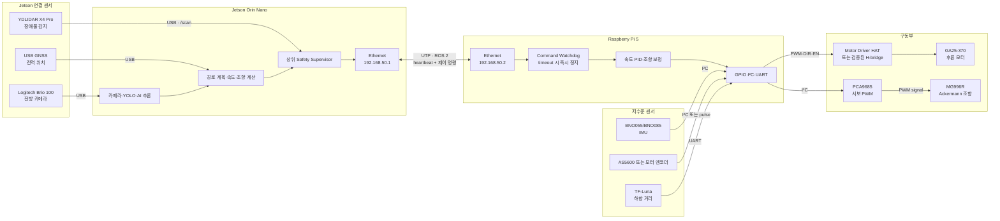
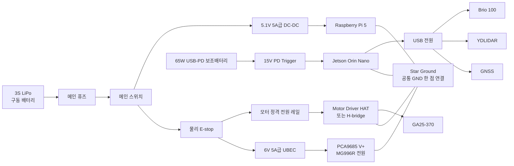
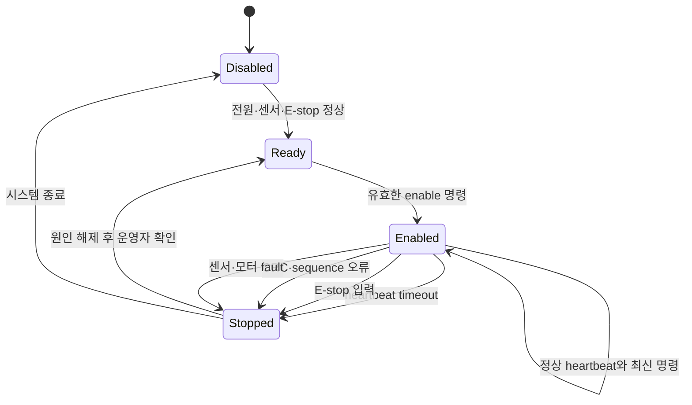

# Jetson + Raspberry Pi 하드웨어 설계

## 0. 문서 상태

이 문서는 Jetson Orin Nano와 Raspberry Pi 5를 함께 사용하는 권장 하드웨어 설계안이다. 역할과 안전 원칙은 채택 가능한 수준으로 구체화했지만, 다음 실물 사양이 확인되기 전에는 최종 확정안이 아니다.

- Motor Driver HAT의 IC·핀맵·입력 논리·허용 전류
- GA25-370 모터의 정격전압·기어비·기동 및 스톨전류
- Raspberry Pi 5와 Motor Driver HAT의 소프트웨어 호환성
- IMU·엔코더·TF-Luna의 실제 보유 및 연결 방식
- 배터리·DC-DC·UBEC의 실제 제품과 정격

위 항목이 검증을 통과하면 본 구성을 최종안으로 승격한다. Motor Driver HAT가 탈락하면 HAT만 검증된 H-bridge로 교체하고 Jetson–RPi 역할 구조는 유지한다.

## 1. 설계 결론

역할을 다음처럼 분리한다.

> **Jetson은 인지·판단·경로 계획·목표 속도와 조향각 계산을 담당하고, Raspberry Pi는 저수준 센서 수집·PWM 출력·heartbeat 감시·안전 정지를 담당한다.**

Raspberry Pi가 독자적으로 경로를 판단하지는 않는다. Jetson이 만든 최종 명령을 안정적인 전기 신호로 변환하고, Jetson 또는 통신에 문제가 생기면 출력을 안전 상태로 바꾸는 장치다.

## 2. 전체 신호 및 제어 구조



## 3. 전원 및 비상정지 구조



E-stop은 Jetson과 Raspberry Pi의 전원을 끄지 않는다. 모터와 서보의 구동 전원만 물리적으로 차단한다. 컴퓨터와 센서는 계속 동작하여 정지 원인과 직전 로그를 보존한다.

## 4. 장치별 역할

| 장치 | 역할 | 하지 않는 일 |
|---|---|---|
| Jetson Orin Nano | 카메라·YOLO·LiDAR 판단, 위치 추정, 경로 계획, 목표 속도·조향각 계산, 상위 안전 검사 | 모터·서보 전원 공급 |
| Raspberry Pi 5 | heartbeat 감시, 속도 PID, 조향 보정, PWM·DIR 출력, IMU·엔코더·ToF 수집 | 자율주행 경로 판단 |
| Motor Driver HAT/H-bridge | 모터 방향·전류 제어 | 안전 판단·경로 계획 |
| PCA9685 | MG996R에 안정적인 PWM 신호 생성 | 서보 전원 생성 |
| 물리 E-stop | 모터·서보 구동 전원 직접 차단 | 소프트웨어 명령 대기 |
| 퓨즈 | 단락·과전류 보호 | 제어 명령 처리 |

## 5. 연결표

### 5.1 Jetson 연결

| Jetson 포트 | 연결 장치 | 데이터·기능 | 비고 |
|---|---|---|---|
| USB | Logitech Brio 100 | `/camera/image_raw` | 최종 마운트에서 캘리브레이션 |
| USB | YDLIDAR X4 Pro | `/scan` | 30분 연속 발행 시험 |
| USB | GNSS | 전역 위치·이벤트 좌표 | 횡방향 정밀 제어에는 사용하지 않음 |
| Ethernet | Raspberry Pi 5 | ROS 2 명령·상태·heartbeat | 고정 IP 직접 연결 |
| USB/HDMI | 화면·조이스틱 | 운영자 UI·수동 조작 | 포트와 전력 예산 확인 |

Jetson 40핀 헤더는 이상 기록이 있으므로 재검증 전까지 전원원이나 필수 신호 경로로 사용하지 않는다.

### 5.2 Raspberry Pi 연결

| RPi 인터페이스 | 연결 장치 | 기능 | 확인사항 |
|---|---|---|---|
| Ethernet | Jetson | ROS 2 명령·상태 | 지연·재연결 시험 |
| 40핀/GPIO | Motor Driver HAT 또는 H-bridge | PWM·DIR·EN | Pi 5 호환성과 3.3V 논리 확인 |
| I²C | PCA9685 | MG996R PWM | 로직 VCC와 서보 V+ 분리 |
| I²C | BNO055/BNO085 | yaw·각속도·가속도 | 주소·축 방향 확인 |
| I²C 또는 GPIO | AS5600/모터 엔코더 | 거리·속도 | 샘플링 속도·방향 부호 확인 |
| UART | TF-Luna | 하향 거리·단차 후보 | 선택 부품, 실제 필요성 검토 |

## 6. Jetson–RPi 통신

### 6.1 네트워크

| 장치 | 권장 주소 |
|---|---|
| Jetson | `192.168.50.1/24` |
| Raspberry Pi | `192.168.50.2/24` |

- 지급 UTP 케이블로 직접 연결한다.
- 제어 명령과 heartbeat는 최소 10Hz 이상 전송한다.
- 정확한 ROS 2 domain ID와 QoS는 통합 전에 고정한다.
- `best effort`로 잃어도 되는 센서 데이터와 반드시 전달해야 하는 안전 상태를 구분한다.

### 6.2 Jetson → RPi 명령

```text
VehicleCommand
- sequence
- target_speed_mps
- target_steering_rad
- enable
- emergency_stop
- timestamp
- checksum
```

권장 topic은 `/vehicle/target_cmd` 또는 기존 설계의 `/drive_cmd` 중 하나로 통일한다. 두 이름을 동시에 유지하지 않는다.

### 6.3 RPi → Jetson 상태

```text
ActuatorStatus
- actual_speed_mps
- actual_steering_rad
- encoder_count
- imu_yaw
- watchdog_ok
- estop_pressed
- motor_fault
- timestamp
```

권장 topic은 `/vehicle/feedback`이다. 별도로 `/wheel_odom`, `/imu/data`, `/safety/stop_reason`을 발행한다.

## 7. 안전 상태 전이



자동으로 `Stopped → Enabled`로 복귀하지 않는다. 정지 원인을 해제한 뒤 운영자가 재활성화해야 한다.

## 8. 안전 규칙

1. Jetson heartbeat가 200ms 이상 끊기면 RPi가 모터 출력을 0으로 만들고 정지 상태로 전환한다.
2. timestamp가 오래됐거나 sequence가 역행한 명령은 실행하지 않는다.
3. E-stop은 Motor Driver와 MG996R 전원을 직접 차단한다.
4. Jetson 40핀에서 모터·서보·센서 전원을 공급하지 않는다.
5. 모터와 서보 전원을 Raspberry Pi 5V 핀에서 공급하지 않는다.
6. PCA9685의 로직 전원과 서보 `V+` 전원을 분리한다.
7. 모터·서보·컴퓨팅 전원 레일을 분리하고 GND만 한 점에서 공통 연결한다.
8. RPi 소프트웨어가 멈춰도 Motor Driver `EN` 또는 외부 watchdog이 출력을 차단하도록 구성한다.
9. 최대 속도·조향각·가속도 제한은 Jetson과 RPi 양쪽에 둔다.
10. E-stop 해제만으로 모터가 다시 움직이지 않게 한다.

## 9. 권장 전원 구성

| 부하 | 권장 전원 | 주의사항 |
|---|---|---|
| Jetson | 65W USB-PD 보조배터리 + 15V PD Trigger | 커넥터 극성·전압 확인 후 연결 |
| Raspberry Pi 5 | 3S LiPo → 5.1V 5A급 DC-DC | 저전압 경고와 재부팅 시험 |
| MG996R | 3S LiPo → 6V 5A급 UBEC | PCA9685 로직 전원과 분리 |
| GA25-370 | 모터 정격에 맞춘 배터리 또는 DC-DC | 실물 정격 확인 전 확정 금지 |
| 카메라·LiDAR·GNSS | Jetson USB | USB 포트 전력·대역폭 시험 |

MG996R 근처에는 1000µF 이상 저ESR 커패시터 배치를 검토한다. 정확한 용량과 전압 정격은 실제 서보 전류 측정 후 결정한다.

## 10. 기동 순서

1. E-stop을 누른 상태로 메인 전원을 켠다.
2. Jetson과 Raspberry Pi를 부팅한다.
3. 각 전원 레일의 전압·온도·저전압 경고를 확인한다.
4. 카메라·LiDAR·IMU·엔코더 topic을 확인한다.
5. Jetson–RPi heartbeat를 확인한다.
6. 바퀴를 지면에서 띄운 상태로 저출력 모터·서보 시험을 수행한다.
7. Safety Supervisor와 RPi watchdog이 모두 Ready인지 확인한다.
8. 운영자 확인 후 E-stop을 해제하고 enable 명령을 보낸다.

## 11. 종료 및 고장 대응

### 정상 종료

1. 목표 속도를 0으로 보낸다.
2. RPi가 실제 속도 0을 보고하는지 확인한다.
3. enable을 0으로 만든다.
4. E-stop 또는 구동 전원 스위치로 모터·서보 전원을 차단한다.
5. 로그를 저장한 뒤 Jetson과 RPi를 정상 종료한다.

### 통신 단절

- RPi는 200ms 이내 모터 출력을 0으로 만든다.
- 서보는 검증된 안전각 또는 현재각 유지 중 실차 시험으로 더 안전한 방식을 선택한다.
- `/safety/stop_reason`에 `HEARTBEAT_TIMEOUT`을 기록한다.
- 통신이 복구돼도 운영자 재승인 전에는 enable하지 않는다.

### RPi 정지·재부팅

- Motor Driver의 `EN`이 외부 pull-down 또는 watchdog으로 비활성화돼야 한다.
- 마지막 PWM이 유지되는 회로는 허용하지 않는다.
- Jetson은 상태 timeout을 감지하고 상위 주행을 중단한다.

## 12. 단계별 조립·검증

### 단계 0. 실물 사양 확인

- Motor Driver HAT IC와 핀맵 촬영·기록
- GA25-370 라벨과 저항·무부하 전류 측정
- MG996R 중립 PWM과 안전 각도 확인
- 배터리 셀 종류·상태·충전기 확인

### 단계 1. Raspberry Pi 저수준 제어

- 모터를 지면에서 띄운 상태로 저출력 회전
- 정방향·역방향·정지 확인
- MG996R 중립·좌·우 제한각 확인
- IMU 축 방향과 엔코더 부호 확인
- heartbeat를 끊어 자동 정지 확인

### 단계 2. Jetson 센서

- Brio 100 영상 30분
- YDLIDAR `/scan` 30분
- GNSS 좌표와 timestamp
- 카메라·LiDAR 동시 연결 시 USB drop 확인

### 단계 3. Jetson–RPi 통합

- 고정 IP와 ROS 2 통신
- 목표 속도·조향 명령 전달
- 실제 encoder·IMU 상태 회신
- 네트워크 케이블 제거 fault injection
- RPi 프로세스 강제 종료 fault injection

### 단계 4. 전원·열 시험

- 전체 부하 30분
- Jetson·RPi 재부팅 0회
- 저전압 경고 0회
- 케이블·DC-DC·드라이버 과열 없음
- YOLO 동시 실행 중 제어 주기 유지

### 단계 5. 저속 실차 시험

- 운영자와 E-stop 확보
- 0.1m/s부터 시작
- 5m 직진 거리와 조향 중립 확인
- 장애물 정지거리 측정
- 최대 속도·가속도 제한 확정

## 13. 최종 채택 게이트

| 검사 | 합격 조건 | 실패 시 대응 |
|---|---|---|
| Motor Driver HAT 호환 | Pi 5 제어·3.3V 논리·전류 정격 충족 | 검증된 H-bridge로 교체 |
| 모터 정격 | 배터리·드라이버 범위 안에서 기동·스톨 안전 | 전원·드라이버 재선정 |
| heartbeat 정지 | 통신 차단 후 200ms 이내 출력 0 | 외부 watchdog 또는 MCU 추가 |
| E-stop | 소프트웨어와 무관하게 모터·서보 전원 차단 | 배선 재설계 |
| 센서 연속 운용 | 30분 동안 핵심 topic 중단 없음 | USB 전원형 허브·포트 분산 |
| 전원 안정성 | 전체 부하 30분 재부팅·저전압·과열 없음 | DC-DC·배선·냉각 재설계 |
| 엔코더 | 5m 직선 거리 오차 10% 이내 1차 목표 | 장착·자석·기어비 보정 |
| 안전 복귀 | 정지 원인 해제 후 수동 승인 없이는 재출발하지 않음 | 상태 머신 수정 |

## 14. 최종 권장안

```text
Jetson Orin Nano
├─ USB: Brio 100
├─ USB: YDLIDAR X4 Pro
├─ USB: GNSS
└─ Ethernet: Raspberry Pi 5
                  ├─ Motor Driver HAT/H-bridge → GA25-370
                  ├─ PCA9685 → MG996R
                  ├─ IMU
                  ├─ Encoder
                  ├─ 선택: TF-Luna
                  └─ Watchdog + E-stop 상태 감시
```

이 구성은 지급된 Raspberry Pi와 Motor Driver HAT를 활용하면서 Jetson의 AI·경로 계획 부하와 저수준 I/O를 분리한다. 최종 채택 여부는 문서의 부품 이름이 아니라 **실물 사양 측정, heartbeat 정지, E-stop, 전체 부하 시험 결과**로 결정한다.
