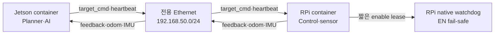

# Step-Step Docker 개발·배포 가이드

> 대상: Docker를 처음 사용하는 Step-Step 팀원  
> 개발 저장소: `https://lab.ssafy.com/s15-webmobile3-sub1/S15P11A103`  
> 실행 장비: Windows 노트북, Jetson Orin Nano, Raspberry Pi 5  
> 기준일: 2026-07-21  
> 문서 상태: **실기 검증 전 상세 실행안**

## 0. 먼저 읽을 결론

Step-Step은 처음부터 다음 구조로 개발한다.

```text
노트북
├─ GitLab 코드를 편집·리뷰
├─ SSH로 두 보드에 접속
└─ 이미지 빌드·배포·로그 확인을 지시

Jetson Orin Nano
├─ JetPack 6.2.x host
├─ NVIDIA Container Runtime
└─ step-step-jetson container
   └─ ROS 2 Humble + 카메라 + LiDAR + TensorRT + Planner

Raspberry Pi 5
├─ Ubuntu Server 24.04 arm64 host
├─ Docker Engine
├─ host native safety watchdog
└─ step-step-rpi container
   └─ ROS 2 Humble + IMU + encoder + motor·steering control
```

두 보드는 모두 Docker를 사용하지만 **같은 물리 image 하나를 쓰지 않는다.**

```text
같은 Git commit·release
├─ step-step-jetson:<release>
└─ step-step-rpi:<release>
```

이렇게 하는 이유는 다음과 같다.

- Jetson에는 JetPack, CUDA, TensorRT, NVIDIA camera 계층이 필요하다.
- RPi에는 GPIO, I²C, PWM, watchdog 계층이 필요하다.
- 두 보드 모두 ARM64라서 Docker manifest만으로 “Jetson인지 RPi인지” 구분할 수 없다.
- 같은 release 번호로 두 image를 묶으면 ROS interface 불일치와 한쪽만 업데이트되는 사고를 막기 쉽다.

### 기존 최종명세와의 차이

현재 [`04_최종문서/10_HW_CONTROL/12_Jetson_Orin_Nano_시스템명세.md`](../04_최종문서/10_HW_CONTROL/12_Jetson_Orin_Nano_시스템명세.md)는 Jetson의 기본 runtime을 native ROS로 기록한다. 이 가이드는 이후 논의에서 선택한 **Jetson과 RPi 모두 container** 방식을 설명한다.

따라서 이 방식을 구현 기준으로 확정할 때는 별도 검토를 거쳐 ADR과 `04_최종문서`도 함께 변경해야 한다. 이 문서만 추가했다고 기존 최종명세가 자동으로 바뀌지는 않는다.

---

## 1. Docker를 아주 짧게 이해하기

### 1.1 Image와 container

- **Image**: Ubuntu user space, ROS, Python package, project dependency를 묶은 읽기 전용 설계도다.
- **Container**: image를 실제로 실행한 process 묶음이다.
- **Host**: container를 실행하는 실제 노트북 또는 보드다.

Container는 가상 컴퓨터 전체가 아니다. 별도 Linux kernel을 부팅하지 않고 host kernel을 공유한다.

```text
실제 보드 CPU·RAM·GPU·센서
             ↓
host Linux kernel·driver
             ↓
Docker container
ROS 2·Python·프로젝트 프로그램
```

따라서 RPi container는 RPi CPU와 RAM을 사용하고, Jetson container는 Jetson GPU를 사용한다. USB·GPIO·카메라·GPU는 자동으로 보이지 않으며 실행 설정에서 필요한 장치만 전달한다.

### 1.2 무엇을 어디서 관리하는가

| 대상 | 관리 위치 | 예시 |
|---|---|---|
| host kernel·driver | 각 보드 OS | JetPack driver, Pi GPIO kernel driver |
| 공통 개발환경 | Dockerfile | ROS 2 Humble, Python, colcon |
| source code | GitLab | `ai/`, `robot/`, `server/` |
| 실행 설정 | Git + Compose | 환경변수, 장치, volume, network |
| 비밀값 | GitLab CI variable 또는 보드 secret | Registry token, SSH private key |
| 운영 산출물 | Registry | Jetson/RPi image와 digest |
| 로그·ROS bag | 보드의 별도 data directory | `/var/lib/step-step` |

<details>
<summary>확인: Ubuntu 24.04 RPi에서 Jammy container를 실행해도 되는가?</summary>

된다. Container 안의 Ubuntu 22.04 user space가 Ubuntu 24.04 host kernel을 공유한다. 단, CPU architecture는 모두 `arm64`여야 하며 GPIO·I²C driver는 host kernel이 제공해야 한다.

</details>

---

## 2. 이 가이드에서 고정하는 구성

### 2.1 Host와 base image

| 대상 | Host | 선택 base image | 용도 |
|---|---|---|---|
| 노트북 | Windows 11 + WSL 2 + Docker Desktop | `ros:humble-ros-base-jammy`의 `amd64` | 공통 code build·unit test |
| Jetson | JetPack 6.2.x, Ubuntu 22.04 기반 | `nvcr.io/nvidia/l4t-jetpack:r36.4.0` | 초기 GPU·camera 통합 안정성 우선 |
| RPi 5 | Ubuntu Server 24.04 arm64 | `ros:humble-ros-base-jammy`의 `arm64/v8` | ROS control·sensor 개발과 실행 |

Jetson image는 크지만 CUDA, cuDNN, TensorRT, VPI, Jetson Multimedia를 포함하므로 첫 통합의 변수를 줄인다. GPU·USB camera 중심 runtime이 검증된 뒤 저장공간이 실제 문제가 될 때만 `l4t-tensorrt:r10.3.0-runtime` 경량화를 별도 변경으로 검토한다.

후보별 점수와 크기·공식성 비교는 [07_Jetson_RPi_실행환경_컨테이너_조사.md](./07_Jetson_RPi_실행환경_컨테이너_조사.md)에 있다. 해당 조사에서는 경량 `l4t-tensorrt` 운영 base가 높은 점수를 받았지만, 이 초보자 가이드는 처음부터 camera·Multimedia 계층까지 포함하고 중간 base 변경을 피하기 위해 전체 `l4t-jetpack`을 초기 고정안으로 선택한다. 저장공간 Gate를 통과하지 못하면 application 개발 전에 선택을 다시 확정한다.

> **중요:** NGC의 공개 `l4t-jetpack` 최신 tag는 조사 시점에 `r36.4.0`이다. JetPack 6.2, 6.2.1, 6.2.2는 각각 L4T patch가 다를 수 있다. 그래서 tag 이름만 보고 호환된다고 가정하지 않고 8장의 Jetson Gate를 통과해야 한다.

### 2.2 Image 이름과 release

GitLab Container Registry가 활성화되어 있다면 다음 이름을 사용한다.

```text
$CI_REGISTRY_IMAGE/jetson:<release>
$CI_REGISTRY_IMAGE/rpi:<release>
```

예시 release:

```text
개발: dev-a58041f
후보: 0.1.0-rc.1
정식: 0.1.0
```

운영에서는 `latest`를 사용하지 않는다. 최종 확인이 끝나면 tag보다 강한 digest로 고정한다.

```text
registry.example/group/project/jetson:0.1.0@sha256:...
registry.example/group/project/rpi:0.1.0@sha256:...
```

### 2.3 ROS 통신 기본값

| 설정 | Jetson | RPi |
|---|---|---|
| 전용 Ethernet IP | `192.168.50.1/24` | `192.168.50.2/24` |
| ROS | Humble | Humble |
| RMW | `rmw_fastrtps_cpp` | `rmw_fastrtps_cpp` |
| Domain | `42` | `42` |
| localhost 제한 | `0` | `0` |
| Docker network | host | host |

---

## 3. 최종적으로 GitLab 저장소에 둘 파일

이 가이드는 현재 기획 저장소에 있다. 실제 Dockerfile과 Compose는 개발 저장소 `S15P11A103`에 아래 구조로 추가한다.

```text
S15P11A103/
├─ ai/
├─ robot/
│  ├─ docker/
│  │  ├─ common/
│  │  │  ├─ ros_entrypoint.sh
│  │  │  └─ requirements-common.txt
│  │  ├─ jetson/
│  │  │  └─ Dockerfile
│  │  └─ rpi/
│  │     └─ Dockerfile
│  ├─ deploy/
│  │  ├─ common/
│  │  │  └─ fastdds/
│  │  │     ├─ jetson.xml
│  │  │     └─ rpi.xml
│  │  ├─ jetson/
│  │  │  ├─ compose.yaml
│  │  │  ├─ compose.camera-usb.yaml
│  │  │  └─ .env.example
│  │  └─ rpi/
│  │     ├─ compose.yaml
│  │     ├─ compose.hardware.yaml
│  │     └─ .env.example
│  ├─ scripts/docker/
│  │  ├─ inspect-jetson.sh
│  │  ├─ inspect-rpi.sh
│  │  └─ smoke-ros-network.sh
│  └─ ci/
│     └─ docker.gitlab-ci.yml
├─ server/
└─ .gitlab-ci.yml     # GitLab 진입점: robot/ci 파일만 include
```

Dockerfile, Compose, DDS 설정, image 환경파일, Docker 전용 script와 CI job 정의는 모두 `robot/` 아래에 둔다. 루트 `.gitlab-ci.yml`은 GitLab이 기본 경로에서 읽는 project 공통 진입점이며 Docker 구현을 직접 담지 않는다.

### GitLab 작업 규칙

이 작업은 `robot/`에 속하므로 팀 저장소의 `AGENTS.md`와 `docs/team-convention.md`를 먼저 따른다. Jira key를 발급받고 `robot/develop`에서 다음처럼 분기한다.

```bash
git clone https://lab.ssafy.com/s15-webmobile3-sub1/S15P11A103.git
cd S15P11A103

git fetch origin
git switch robot/develop
git pull --ff-only origin robot/develop
git switch -c robot/chore/S15P11A103-000-docker-runtime
```

`S15P11A103-000`은 예시다. 실제 Jira key로 바꾼다. 작업 branch를 바로 `main`에 합치지 않고 저장소의 `-merge` branch와 MR 절차를 따른다.

---

## 4. 시작 전 안전 Gate

Docker 설정이 정상이어도 주행 폐루프가 안전하다는 뜻은 아니다. 처음 설정할 때는 다음 조건을 지킨다.

- [ ] 바퀴를 지면에서 띄웠다.
- [ ] Motor/servo 전원과 compute 전원을 분리했다.
- [ ] 물리 E-stop으로 motor/servo 출력 전원을 끊을 수 있다.
- [ ] RPi boot 시 Driver EN이 OFF다.
- [ ] Container 시작·재시작만으로 EN이 켜지지 않는다.
- [ ] `privileged: true`를 쓰지 않는다.
- [ ] 네트워크가 끊기면 RPi가 Jetson과 독립적으로 EN을 차단한다.

하나라도 충족하지 않으면 camera·ROS 통신까지만 시험하고 actuator를 연결하지 않는다.

---

## 5. Windows 노트북 준비

### 5.1 설치할 프로그램

1. Git for Windows
2. OpenSSH Client
3. WSL 2
4. Docker Desktop
5. VS Code와 Remote SSH 확장 또는 선호하는 IDE

관리자 PowerShell에서 WSL을 확인한다.

```powershell
wsl --version
wsl --status
wsl -l -v
```

WSL이 없거나 손상된 경우 관리자 PowerShell에서 실행한다.

```powershell
wsl --install --no-distribution
wsl --update
```

재부팅한 뒤 Docker Desktop의 `Settings > General > Use the WSL 2 based engine`을 켠다. WSL 배포판 안에 별도 Docker Engine을 중복 설치하지 않는다.

### 5.2 노트북 Docker Gate

```powershell
docker version
docker buildx version
docker run --rm hello-world
```

Go 조건:

- `Client`와 `Server` 정보가 모두 보인다.
- `hello-world`가 정상 종료한다.
- `Docker Desktop is unable to start`가 나오지 않는다.

현재 같은 오류가 나면 image build를 반복하지 말고 WSL 설치·재부팅·Docker engine 실행부터 복구한다.

### 5.3 GitLab source 준비

```powershell
Set-Location C:\workspace
git clone https://lab.ssafy.com/s15-webmobile3-sub1/S15P11A103.git
Set-Location .\S15P11A103

git remote -v
git status -sb
```

기대 remote:

```text
origin  https://lab.ssafy.com/s15-webmobile3-sub1/S15P11A103.git
```

Source 수정은 노트북에서 하고, 보드는 GitLab의 commit을 checkout해서 실행한다. 재현되지 않는 `scp` 복사본을 운영 source로 사용하지 않는다.

---

## 6. 보드 공통 Docker Engine 설치

다음 명령은 Jetson과 RPi의 Ubuntu shell에서 각각 실행한다. Docker 공식 apt repository 방식이다.

### 6.1 충돌 package 확인

```bash
dpkg -l | grep -E 'docker.io|docker-compose|podman-docker|containerd|runc' || true
```

이미 JetPack이 제공한 정상 Docker 구성이 있다면 무조건 삭제하지 않는다. `docker version`과 NVIDIA runtime부터 확인한다. 새 Ubuntu RPi에 처음 설치할 때만 다음 단계로 간다.

### 6.2 공식 repository 등록

```bash
sudo apt update
sudo apt install -y ca-certificates curl
sudo install -m 0755 -d /etc/apt/keyrings
sudo curl -fsSL https://download.docker.com/linux/ubuntu/gpg \
  -o /etc/apt/keyrings/docker.asc
sudo chmod a+r /etc/apt/keyrings/docker.asc

sudo tee /etc/apt/sources.list.d/docker.sources >/dev/null <<EOF
Types: deb
URIs: https://download.docker.com/linux/ubuntu
Suites: $(. /etc/os-release && echo "${UBUNTU_CODENAME:-$VERSION_CODENAME}")
Components: stable
Architectures: $(dpkg --print-architecture)
Signed-By: /etc/apt/keyrings/docker.asc
EOF

sudo apt update
apt list --all-versions docker-ce
```

팀이 검증할 version을 선택해 기록한다. 아래는 변수 사용 예시이며 표시되는 실제 version으로 바꾼다.

```bash
DOCKER_VERSION='<apt list에서 선택한 exact version>'

sudo apt install -y \
  docker-ce="$DOCKER_VERSION" \
  docker-ce-cli="$DOCKER_VERSION" \
  containerd.io \
  docker-buildx-plugin \
  docker-compose-plugin
```

초기 실험에서 version 고정 전이라면 공식 문서의 latest 설치도 가능하지만, RC 전에 exact version을 release manifest에 기록한다.

```bash
sudo systemctl enable --now docker
sudo docker run --rm hello-world
docker compose version
docker buildx version
```

### 6.3 `docker` group 주의

매번 `sudo`를 쓰지 않으려면 다음 설정을 할 수 있다.

```bash
sudo usermod -aG docker "$USER"
newgrp docker
docker run --rm hello-world
```

`docker` group 사용자는 사실상 host root 권한을 가질 수 있다. 차량 보드 계정은 팀원 전체가 공유하지 말고 배포 담당 계정만 사용한다.

### 6.4 로그 무한 증가 방지

`/etc/docker/daemon.json`에 이미 NVIDIA runtime 설정이 있을 수 있으므로 파일 전체를 덮어쓰지 않는다. 먼저 확인한다.

```bash
sudo cat /etc/docker/daemon.json 2>/dev/null || true
```

기존 JSON과 병합해 다음 logging 값을 추가한다.

```json
{
  "log-driver": "json-file",
  "log-opts": {
    "max-size": "20m",
    "max-file": "5"
  }
}
```

JSON 문법 확인 뒤 재시작한다.

```bash
sudo dockerd --validate --config-file=/etc/docker/daemon.json
sudo systemctl restart docker
docker info
```

---

## 7. Raspberry Pi 5 host 설정

### 7.1 OS와 architecture 확인

권장 host는 Ubuntu Server 24.04 64-bit다.

```bash
cat /etc/os-release
uname -a
dpkg --print-architecture
cat /proc/device-tree/model
```

Go 조건:

```text
Ubuntu 24.04
arm64
Raspberry Pi 5
```

실제 출력은 release manifest에 보존한다.

### 7.2 전용 Ethernet 고정 IP

먼저 interface 이름을 찾는다.

```bash
nmcli device status
```

아래 `end0`는 예시다. 실제 유선 interface 이름으로 바꾼다.

```bash
RPI_LAN_IF='end0'

sudo nmcli connection add \
  type ethernet \
  ifname "$RPI_LAN_IF" \
  con-name step-step-lan \
  ipv4.method manual \
  ipv4.addresses 192.168.50.2/24 \
  ipv4.never-default yes \
  ipv6.method disabled

sudo nmcli connection up step-step-lan
ip -br address show "$RPI_LAN_IF"
```

이미 같은 이름의 connection이 있으면 새로 만들지 말고 `nmcli connection show`로 확인 후 수정한다.

### 7.3 I²C·GPIO·serial 확인

필요한 bus만 활성화한다. OS image마다 boot 설정 방식이 다를 수 있으므로 먼저 현재 상태를 확인한다.

```bash
ls -l /dev/i2c-* 2>/dev/null || true
ls -l /dev/gpiochip* 2>/dev/null || true
ls -l /dev/ttyUSB* /dev/ttyACM* 2>/dev/null || true
```

진단 도구:

```bash
sudo apt update
sudo apt install -y i2c-tools gpiod udev

i2cdetect -l
gpioinfo
```

장치가 안 보인다고 임의의 `/dev/gpiochip0`을 가정하지 않는다. 실제 Pi 5의 gpiochip과 line offset을 기록한다.

### 7.4 USB 장치 stable name 만들기

`/dev/ttyUSB0`은 재부팅이나 재연결 때 번호가 바뀔 수 있다. 먼저 장치 식별값을 찾는다.

```bash
udevadm info --query=property --name=/dev/ttyUSB0 | \
  grep -E 'ID_VENDOR_ID|ID_MODEL_ID|ID_SERIAL_SHORT'
```

그 값을 사용해 `/etc/udev/rules.d/99-step-step.rules`에 stable symlink를 만든다. 다음은 형식 예시다.

```text
SUBSYSTEM=="tty", ATTRS{idVendor}=="1234", ATTRS{idProduct}=="5678", ATTRS{serial}=="ABC123", SYMLINK+="step_step_imu", GROUP="dialout", MODE="0660"
```

적용:

```bash
sudo udevadm control --reload-rules
sudo udevadm trigger
ls -l /dev/step_step_imu
```

VID·PID·serial은 실제 장치 값으로 바꾸며 `MODE="0666"`로 전부 개방하지 않는다.

---

## 8. Jetson Orin Nano host 설정

### 8.1 JetPack/L4T를 먼저 기록

```bash
cat /etc/nv_tegra_release
dpkg-query -W nvidia-jetpack 2>/dev/null || true
cat /etc/os-release
uname -a
dpkg --print-architecture
```

참고 관계:

| JetPack | Jetson Linux/L4T |
|---|---|
| 6.2 | 36.4.3 |
| 6.2.1 | 36.4.4 |
| 6.2.2 | 36.5 |

실제 보드 출력이 단일 기준이다. “JetPack 6.2 정도”라고만 기록하지 않는다.

### 8.2 전용 Ethernet 고정 IP

```bash
nmcli device status
```

아래 `eth0`는 예시다.

```bash
JETSON_LAN_IF='eth0'

sudo nmcli connection add \
  type ethernet \
  ifname "$JETSON_LAN_IF" \
  con-name step-step-lan \
  ipv4.method manual \
  ipv4.addresses 192.168.50.1/24 \
  ipv4.never-default yes \
  ipv6.method disabled

sudo nmcli connection up step-step-lan
ip -br address show "$JETSON_LAN_IF"
ping -c 3 192.168.50.2
```

### 8.3 NVIDIA runtime 확인

```bash
docker version
docker info | grep -i runtime
command -v nvidia-ctk
```

`nvidia` runtime이 없고 `nvidia-ctk`가 설치되어 있다면 공식 설정을 적용한다.

```bash
sudo nvidia-ctk runtime configure --runtime=docker
sudo systemctl restart docker
docker info | grep -i runtime
```

이 명령은 `/etc/docker/daemon.json`을 수정한다. 앞 장의 log rotation 설정과 충돌하지 않도록 수정 전후를 비교한다.

### 8.4 NVIDIA image smoke test

```bash
docker pull nvcr.io/nvidia/l4t-jetpack:r36.4.0

docker run --rm -it \
  --runtime nvidia \
  --network host \
  nvcr.io/nvidia/l4t-jetpack:r36.4.0 \
  bash
```

Container 안에서 확인한다.

```bash
python3 -c 'import tensorrt as trt; print(trt.__version__)'
ls -l /dev/nvhost* 2>/dev/null | head
```

Go 조건:

- image가 `exec format error` 없이 실행된다.
- TensorRT import가 성공한다.
- Container 종료 후 Docker daemon이 정상이다.

### 8.5 Camera·LiDAR 장치 확인

USB camera:

```bash
v4l2-ctl --list-devices
ls -l /dev/video*
```

LiDAR:

```bash
ls -l /dev/ttyUSB* /dev/ttyACM* 2>/dev/null || true
udevadm info --query=property --name=/dev/ttyUSB0
```

USB camera는 `/dev/videoN`, CSI camera는 Argus socket과 NVIDIA Multimedia 설정이 다르다. 둘을 같은 설정으로 취급하지 않는다.

---

## 9. Project image 만들기

이 장의 파일은 실제 개발 저장소에 추가하는 예시다. Package 이름이 확정되면 `COPY`와 build command를 실제 구조에 맞춘다.

### 9.1 공통 entrypoint

`robot/docker/common/ros_entrypoint.sh`:

```bash
#!/usr/bin/env bash
set -e

source /opt/ros/humble/setup.bash

if [ -f /opt/step-step/install/setup.bash ]; then
  source /opt/step-step/install/setup.bash
fi

exec "$@"
```

### 9.2 RPi Dockerfile

`robot/docker/rpi/Dockerfile`:

```dockerfile
FROM ros:humble-ros-base-jammy

ARG DEBIAN_FRONTEND=noninteractive
ARG APP_VERSION=dev
ARG GIT_SHA=unknown

LABEL org.opencontainers.image.title="step-step-rpi"
LABEL org.opencontainers.image.version="${APP_VERSION}"
LABEL org.opencontainers.image.revision="${GIT_SHA}"

RUN apt-get update && apt-get install -y --no-install-recommends \
      i2c-tools \
      gpiod \
      libgpiod-dev \
      python3-colcon-common-extensions \
      python3-pip \
      python3-rosdep \
      ros-humble-demo-nodes-cpp \
      ros-humble-rmw-fastrtps-cpp \
      udev \
    && rm -rf /var/lib/apt/lists/*

WORKDIR /opt/step-step

COPY robot/ ./src/robot/
COPY robot/docker/common/ros_entrypoint.sh /ros_entrypoint.sh

# 실제 package가 생긴 뒤 활성화한다.
# RUN rosdep install --from-paths src --ignore-src -r -y \
#  && . /opt/ros/humble/setup.sh \
#  && colcon build --merge-install --cmake-args -DCMAKE_BUILD_TYPE=Release

RUN chmod +x /ros_entrypoint.sh

ENTRYPOINT ["/ros_entrypoint.sh"]
CMD ["bash"]
```

처음에는 package가 아직 없으므로 주석 처리한 build 줄을 그대로 두고 base와 장치 통신부터 검증한다. Package가 추가되면 CI에서 `rosdep`과 `colcon build`를 켠다.

### 9.3 Jetson Dockerfile

`robot/docker/jetson/Dockerfile`:

```dockerfile
FROM nvcr.io/nvidia/l4t-jetpack:r36.4.0

ARG DEBIAN_FRONTEND=noninteractive
ARG ROS_APT_SOURCE_VERSION=1.2.0
ARG APP_VERSION=dev
ARG GIT_SHA=unknown

LABEL org.opencontainers.image.title="step-step-jetson"
LABEL org.opencontainers.image.version="${APP_VERSION}"
LABEL org.opencontainers.image.revision="${GIT_SHA}"

ENV LANG=en_US.UTF-8
ENV LC_ALL=en_US.UTF-8
ENV ROS_DISTRO=humble

RUN apt-get update && apt-get install -y --no-install-recommends \
      ca-certificates \
      curl \
      locales \
      v4l-utils \
    && locale-gen en_US.UTF-8 \
    && curl -fsSL \
      -o /tmp/ros2-apt-source.deb \
      "https://github.com/ros-infrastructure/ros-apt-source/releases/download/${ROS_APT_SOURCE_VERSION}/ros2-apt-source_${ROS_APT_SOURCE_VERSION}.jammy_all.deb" \
    && apt-get install -y /tmp/ros2-apt-source.deb \
    && rm /tmp/ros2-apt-source.deb \
    && apt-get update \
    && apt-get install -y --no-install-recommends \
      python3-colcon-common-extensions \
      python3-pip \
      python3-rosdep \
      ros-humble-demo-nodes-cpp \
      ros-humble-ros-base \
      ros-humble-rmw-fastrtps-cpp \
    && rm -rf /var/lib/apt/lists/*

WORKDIR /opt/step-step

COPY ai/ ./src/ai/
COPY robot/ ./src/robot/
COPY robot/docker/common/ros_entrypoint.sh /ros_entrypoint.sh

# 실제 package가 생긴 뒤 활성화한다.
# RUN rosdep install --from-paths src --ignore-src -r -y \
#  && . /opt/ros/humble/setup.sh \
#  && colcon build --merge-install --cmake-args -DCMAKE_BUILD_TYPE=Release

RUN chmod +x /ros_entrypoint.sh

ENTRYPOINT ["/ros_entrypoint.sh"]
CMD ["bash"]
```

예전 `apt-key` 명령 대신 공식 `ros2-apt-source` package를 사용한다. 이 문서에서는 확인된 `1.2.0`을 고정했다. 이후 올릴 때는 두 image를 함께 rebuild하고 회귀시험한다.

### 9.4 RPi Compose

`robot/deploy/rpi/compose.yaml`:

아래 첫 Compose는 아직 application package가 없어도 base image·장치·network를 확인할 수 있는 smoke-test 상태로 둔다.

```yaml
services:
  rpi_ros:
    image: ${RPI_IMAGE:?RPI_IMAGE is required}
    container_name: step-step-rpi
    network_mode: host
    restart: unless-stopped
    environment:
      ROS_DOMAIN_ID: "${ROS_DOMAIN_ID:-42}"
      ROS_LOCALHOST_ONLY: "0"
      RMW_IMPLEMENTATION: rmw_fastrtps_cpp
      FASTRTPS_DEFAULT_PROFILES_FILE: /etc/step-step/fastdds.xml
      STEP_STEP_RELEASE: "${STEP_STEP_RELEASE:?STEP_STEP_RELEASE is required}"
    volumes:
      - /etc/step-step/rpi-fastdds.xml:/etc/step-step/fastdds.xml:ro
      - /var/lib/step-step/log:/var/lib/step-step/log
    healthcheck:
      test: ["CMD-SHELL", "test -f /opt/ros/humble/setup.bash"]
      interval: 10s
      timeout: 3s
      retries: 3
    command: ["bash", "-lc", "sleep infinity"]
```

`robot/deploy/rpi/compose.hardware.yaml`:

```yaml
services:
  rpi_ros:
    devices:
      - /dev/gpiochip0:/dev/gpiochip0
      - /dev/i2c-1:/dev/i2c-1
      - /dev/step_step_imu:/dev/step_step_imu
    group_add:
      - "${GPIO_GID}"
      - "${I2C_GID}"
      - "${DIALOUT_GID}"
```

장치 번호와 GID는 예시다. 다음 명령으로 실제 숫자를 찾는다.

```bash
getent group gpio i2c dialout
stat -c '%n %g' /dev/gpiochip0 /dev/i2c-1 /dev/step_step_imu
```

### 9.5 Jetson Compose

`robot/deploy/jetson/compose.yaml`:

Jetson도 application package를 만들기 전에는 `sleep infinity`로 base·GPU·network만 시험한다.

```yaml
services:
  jetson_ros:
    image: ${JETSON_IMAGE:?JETSON_IMAGE is required}
    container_name: step-step-jetson
    runtime: nvidia
    network_mode: host
    restart: unless-stopped
    environment:
      NVIDIA_VISIBLE_DEVICES: all
      NVIDIA_DRIVER_CAPABILITIES: compute,utility,video
      ROS_DOMAIN_ID: "${ROS_DOMAIN_ID:-42}"
      ROS_LOCALHOST_ONLY: "0"
      RMW_IMPLEMENTATION: rmw_fastrtps_cpp
      FASTRTPS_DEFAULT_PROFILES_FILE: /etc/step-step/fastdds.xml
      STEP_STEP_RELEASE: "${STEP_STEP_RELEASE:?STEP_STEP_RELEASE is required}"
    volumes:
      - /etc/step-step/jetson-fastdds.xml:/etc/step-step/fastdds.xml:ro
      - /var/lib/step-step/log:/var/lib/step-step/log
      - /var/lib/step-step/models:/var/lib/step-step/models:ro
    healthcheck:
      test: ["CMD-SHELL", "python3 -c 'import tensorrt' && test -f /opt/ros/humble/setup.bash"]
      interval: 10s
      timeout: 5s
      retries: 3
    command: ["bash", "-lc", "sleep infinity"]
```

`step_step_bringup` package가 구현되면 `command`를 실제 launch 명령으로 바꾸고 healthcheck도 각각 `/rpi_monitor_node`, `/system_monitor_node`가 보이는지 검사하도록 강화한다.

USB camera override `robot/deploy/jetson/compose.camera-usb.yaml`:

```yaml
services:
  jetson_ros:
    devices:
      - /dev/video0:/dev/video0
      - /dev/step_step_lidar:/dev/step_step_lidar
    group_add:
      - "${VIDEO_GID}"
      - "${DIALOUT_GID}"
```

CSI camera는 별도 override에서 `/tmp/argus_socket`과 실제 필요한 media device를 전달한다. USB camera 설정을 그대로 복사하지 않는다.

### 9.6 `.env.example`

RPi 예시:

```dotenv
RPI_IMAGE=<GitLab Registry에서 복사한 경로>/rpi:dev-a58041f
STEP_STEP_RELEASE=dev-a58041f
ROS_DOMAIN_ID=42
GPIO_GID=997
I2C_GID=998
DIALOUT_GID=20
```

Jetson 예시:

```dotenv
JETSON_IMAGE=<GitLab Registry에서 복사한 경로>/jetson:dev-a58041f
STEP_STEP_RELEASE=dev-a58041f
ROS_DOMAIN_ID=42
VIDEO_GID=44
DIALOUT_GID=20
```

`.env`에는 token을 넣지 않으며 Git에 commit하지 않는다. `.env.example`만 공유한다.

---

## 10. 개발 image build

### 10.1 Git SHA를 tag로 사용

Linux shell 또는 Git Bash:

```bash
GIT_SHA="$(git rev-parse --short=8 HEAD)"
RELEASE="dev-${GIT_SHA}"
```

### 10.2 노트북에서 할 수 있는 build

노트북은 `amd64`이므로 공통 package의 CPU build·unit test를 실행한다.

```bash
docker build \
  --platform linux/amd64 \
  -f robot/docker/rpi/Dockerfile \
  -t step-step-common-test:"$RELEASE" \
  --build-arg APP_VERSION="$RELEASE" \
  --build-arg GIT_SHA="$GIT_SHA" \
  .
```

이 build가 성공해도 Pi의 GPIO와 Jetson GPU가 검증된 것은 아니다.

### 10.3 보드에서 해당 image build

개발 초기에는 각 보드가 GitLab의 같은 commit을 checkout한 뒤 자기 image를 build하는 것이 가장 단순하다.

Jetson:

```bash
git fetch origin
git checkout <시험할 commit SHA>

docker build \
  -f robot/docker/jetson/Dockerfile \
  -t local/step-step-jetson:"$RELEASE" \
  --build-arg APP_VERSION="$RELEASE" \
  --build-arg GIT_SHA="$GIT_SHA" \
  .
```

RPi:

```bash
git fetch origin
git checkout <같은 commit SHA>

docker build \
  -f robot/docker/rpi/Dockerfile \
  -t local/step-step-rpi:"$RELEASE" \
  --build-arg APP_VERSION="$RELEASE" \
  --build-arg GIT_SHA="$GIT_SHA" \
  .
```

두 보드에서 `git rev-parse HEAD`가 같아야 한다.

### 10.4 Source 수정 반복 방법

빠른 개발 loop:

1. 노트북에서 code 수정
2. local test
3. 작업 branch에 commit·push
4. GitLab MR 또는 시험 commit 확인
5. 보드에서 그 commit checkout
6. image rebuild 또는 dev container 실행
7. 하드웨어 smoke test

운영에서는 source bind mount를 사용하지 않는다. 개발 단계에서 bind mount를 쓰더라도 시험한 commit SHA를 반드시 로그에 남긴다.

---

## 11. GitLab Container Registry 확인

SSAFY GitLab은 self-managed instance이므로 Container Registry와 runner가 활성화됐다고 가정하지 않는다.

### 11.1 Registry Gate

GitLab project에서 다음 메뉴를 확인한다.

```text
Deploy > Container Registry
```

메뉴에서 표시되는 정확한 repository path를 복사한다. `registry.lab.ssafy.com` 같은 주소를 추측하지 않는다.

Go 조건:

- [ ] Container Registry 메뉴가 보인다.
- [ ] `$CI_REGISTRY_IMAGE`가 pipeline에서 값으로 확인된다.
- [ ] Project runner가 동작한다.
- [ ] ARM64 build 방식을 정했다.

Registry가 비활성화되어 있으면 source와 CI는 GitLab에 유지하고, 팀이 승인한 GHCR 또는 Docker Hub를 별도 registry로 사용할 수 있다.

### 11.2 보드 pull용 Deploy Token

보드에는 개인 password나 CI job password를 저장하지 않는다. GitLab project Deploy Token에 `read_registry`만 부여한다.

```bash
read -rsp 'Deploy token: ' DEPLOY_TOKEN
echo

printf '%s' "$DEPLOY_TOKEN" | \
  docker login \
    -u '<deploy-token-user>' \
    --password-stdin \
    '<GitLab에 표시된 registry host>'

unset DEPLOY_TOKEN
```

`CI_REGISTRY_PASSWORD`는 job 동안만 유효하므로 보드의 장기 pull credential로 쓰지 않는다.

---

## 12. GitLab CI/CD 예시

### 12.1 먼저 알아둘 제한

- 일반 `amd64` runner가 QEMU로 ARM64를 build할 수는 있지만 느리고 Jetson hardware를 검증하지 못한다.
- Docker-in-Docker는 privileged runner가 필요하다.
- 차량 Jetson/RPi를 팀 전체가 사용할 수 있는 unrestricted shell runner로 등록하면 안 된다.
- 가장 좋은 방식은 별도의 신뢰된 ARM64 builder와 최종 Jetson hardware smoke-test job을 분리하는 것이다.

Runner 구성이 확인되기 전에는 이 예시를 그대로 merge하지 않는다.

### 12.2 동일 release에서 두 image 만들기

GitLab의 루트 `.gitlab-ci.yml`에는 다음 include만 추가한다. 기존 project CI 내용이 있다면 삭제하지 않고 병합한다.

```yaml
include:
  - local: /robot/ci/docker.gitlab-ci.yml
```

Docker job 정의는 `robot/ci/docker.gitlab-ci.yml`에 둔다.

```yaml
stages:
  - test
  - build
  - deploy

variables:
  RELEASE_TAG: "sha-${CI_COMMIT_SHORT_SHA}"
  RPI_IMAGE: "${CI_REGISTRY_IMAGE}/rpi:${RELEASE_TAG}"
  JETSON_IMAGE: "${CI_REGISTRY_IMAGE}/jetson:${RELEASE_TAG}"

test:common:
  stage: test
  image: ros:humble-ros-base-jammy
  script:
    - . /opt/ros/humble/setup.sh
    - echo "공통 lint와 unit test 명령으로 교체"

.registry_login:
  before_script:
    - |
      echo "$CI_REGISTRY_PASSWORD" |
        docker login "$CI_REGISTRY" \
          -u "$CI_REGISTRY_USER" \
          --password-stdin

build:rpi:
  stage: build
  extends: .registry_login
  tags: [trusted-arm64-builder]
  script:
    - >-
      docker build --pull
      -f robot/docker/rpi/Dockerfile
      --build-arg APP_VERSION="$RELEASE_TAG"
      --build-arg GIT_SHA="$CI_COMMIT_SHA"
      -t "$RPI_IMAGE" .
    - docker push "$RPI_IMAGE"

build:jetson:
  stage: build
  extends: .registry_login
  tags: [trusted-jetson-builder]
  script:
    - >-
      docker build --pull
      -f robot/docker/jetson/Dockerfile
      --build-arg APP_VERSION="$RELEASE_TAG"
      --build-arg GIT_SHA="$CI_COMMIT_SHA"
      -t "$JETSON_IMAGE" .
    - docker push "$JETSON_IMAGE"

deploy:boards:
  stage: deploy
  when: manual
  script:
    - echo "검증된 deploy script로 두 image를 pull하고 health check"
  rules:
    - if: '$CI_COMMIT_TAG'
```

이 예시는 Docker CLI가 설치된 신뢰된 shell runner를 가정한다. 실제 runner 종류와 tag는 GitLab 관리자와 확인한다. 사용 중인 GitLab version이 지원하면 manual job에 확인 문구도 추가한다. Release는 `latest`가 아니라 Git SHA 또는 Git tag를 사용한다.

### 12.3 배포 자동화의 안전 경계

배포 job이 할 수 있는 일:

```text
image pull → container 교체 → health check → release 기록
```

배포 job이 하면 안 되는 일:

```text
Motor EN 자동 활성화 → 자동 주행 시작
```

차량 배포는 `when: manual`로 두고, E-stop·바퀴 상태·두 보드 release 일치 확인 후 운영자가 별도로 enable한다.

---

## 13. 노트북에서 두 보드 관리

### 13.1 SSH key

Windows PowerShell:

```powershell
ssh-keygen -t ed25519 -C "step-step-deploy"
```

공개키만 각 보드의 `~/.ssh/authorized_keys`에 등록한다. Private key는 Git에 넣지 않는다.

```powershell
ssh robot@192.168.50.1
ssh robot@192.168.50.2
```

### 13.2 Docker context

```powershell
docker context create step-jetson `
  --docker "host=ssh://robot@192.168.50.1"

docker context create step-rpi `
  --docker "host=ssh://robot@192.168.50.2"

docker --context step-jetson info
docker --context step-rpi info
docker --context step-jetson ps
docker --context step-rpi ps
```

`docker context use`로 전역 context를 자주 바꾸기보다 명령마다 `--context`를 써서 잘못된 보드에서 container를 내리는 실수를 줄인다.

> Remote Docker context에서 bind mount path는 노트북이 아니라 remote daemon의 host path다. Windows의 `C:\...`를 Linux 보드 volume으로 넘기지 않는다. Compose 배포는 보드의 `/opt/step-step`에서 직접 실행하거나 bind mount 없는 immutable image를 사용한다.

### 13.3 자주 쓰는 원격 명령

```powershell
docker --context step-jetson ps
docker --context step-rpi ps

docker --context step-jetson logs --tail 100 step-step-jetson
docker --context step-rpi logs --tail 100 step-step-rpi

docker --context step-jetson inspect step-step-jetson
docker --context step-rpi inspect step-step-rpi
```

---

## 14. 두 보드에서 container 실행

### 14.1 보드 directory

각 보드에 같은 repository commit을 둔다. Private source 접근에는 GitLab project의 **read-only Deploy Key**를 사용한다. Registry `read_registry` Deploy Token과 Git SSH Deploy Key는 서로 다른 자격 증명이다.

```bash
sudo install -d -o "$USER" -g "$USER" /opt/step-step
# GitLab 화면의 "Clone with SSH" 주소를 그대로 복사한다.
git clone <GitLab Clone with SSH 주소> /opt/step-step/source
cd /opt/step-step/source
git checkout <release commit SHA>
```

운영에서 보드 source clone이 필요하지 않도록 최종 image에 source·build 산출물을 포함하는 것이 목표다. 초기 Compose와 device 설정 검증 때는 위 방식이 이해하기 쉽다.

### 14.2 Fast DDS 설정 배치

```bash
sudo install -d -m 0755 /etc/step-step
sudo install -d -m 0755 /var/lib/step-step/log
```

Jetson용 XML은 전용 IP `192.168.50.1`, RPi용은 `192.168.50.2`만 사용하도록 만든다. Humble/Fast DDS 2.6 계열에서는 환경 변수 이름을 다음처럼 사용한다.

```text
FASTRTPS_DEFAULT_PROFILES_FILE
```

Fast DDS 3 문서의 `FASTDDS_DEFAULT_PROFILES_FILE`을 그대로 복사하지 않는다.

처음에는 host network와 multicast 기본값으로 통신을 확인한다. Wi-Fi·Docker bridge 등 잘못된 interface를 선택하면 Fast DDS `interfaceWhiteList`와 상대 IP `initialPeersList`를 추가한다.

### 14.3 RPi 시작

```bash
cd /opt/step-step/source/robot/deploy/rpi
cp .env.example .env
nano .env

docker compose \
  -f compose.yaml \
  -f compose.hardware.yaml \
  config

docker compose \
  -f compose.yaml \
  -f compose.hardware.yaml \
  pull

docker compose \
  -f compose.yaml \
  -f compose.hardware.yaml \
  up -d

docker compose ps
docker compose logs --tail 100
```

장치 연결 전에는 `compose.hardware.yaml`을 빼고 ROS base 통신만 시험할 수 있다.

### 14.4 Jetson 시작

```bash
cd /opt/step-step/source/robot/deploy/jetson
cp .env.example .env
nano .env

docker compose \
  -f compose.yaml \
  -f compose.camera-usb.yaml \
  config

docker compose \
  -f compose.yaml \
  -f compose.camera-usb.yaml \
  pull

docker compose \
  -f compose.yaml \
  -f compose.camera-usb.yaml \
  up -d

docker compose ps
docker compose logs --tail 100
```

`docker compose config`가 실패하면 실행하지 않는다. 환경변수·device path·YAML을 먼저 고친다.

---

## 15. 보드 간 ROS 2 통신

Image끼리 통신하는 것이 아니라 각 container 안의 ROS node가 실제 Ethernet을 통해 DDS packet을 주고받는다.



### 15.1 순서대로 시험

1. Link·IP

```bash
ip -br address
ping -c 3 192.168.50.1
ping -c 3 192.168.50.2
```

2. 양쪽 container 환경

```bash
printenv | grep -E 'ROS_DOMAIN_ID|ROS_LOCALHOST_ONLY|RMW_IMPLEMENTATION|FASTRTPS'
```

기대값:

```text
ROS_DOMAIN_ID=42
ROS_LOCALHOST_ONLY=0
RMW_IMPLEMENTATION=rmw_fastrtps_cpp
```

3. ROS daemon 초기화

```bash
ros2 daemon stop
ros2 daemon start
```

4. Jetson에서 talker

```bash
docker exec -it step-step-jetson \
  bash -lc 'source /opt/ros/humble/setup.bash && ros2 run demo_nodes_cpp talker'
```

5. RPi에서 listener

```bash
docker exec -it step-step-rpi \
  bash -lc 'source /opt/ros/humble/setup.bash && ros2 run demo_nodes_cpp listener'
```

6. 방향을 바꿔 다시 시험

7. 실제 topic 확인

```bash
ros2 topic list
ros2 topic info /vehicle/target_cmd --verbose
ros2 topic hz /vehicle/feedback
```

### 15.2 보드 경계를 넘기는 topic

Jetson → RPi:

- `/vehicle/target_cmd`
- `/system/heartbeat/jetson`

RPi → Jetson:

- `/vehicle/feedback`
- `/wheel/odom`
- `/imu/data`
- `/safety/estop`
- `/system/heartbeat/rpi`

Camera 원본 image, LiDAR 전체 point cloud, TensorRT 중간 tensor는 보드 경계를 넘기지 않고 Jetson 내부에서 처리한다.

### 15.3 통신이 안 될 때 확인 순서

1. 양방향 ping
2. `ROS_LOCALHOST_ONLY=0`
3. `ROS_DOMAIN_ID` 동일
4. `RMW_IMPLEMENTATION` 동일
5. host 방화벽
6. 잘못 선택된 Wi-Fi·Docker interface
7. Fast DDS multicast 차단
8. ROS message package/type hash 불일치

Multicast가 차단되면 바로 모든 방화벽을 끄지 말고 전용 Ethernet만 허용하거나 `initialPeersList`로 상대 IP를 지정한다.

---

## 16. RPi native safety watchdog

Motor Driver EN의 최종 차단은 ROS container 안에만 두지 않는다.

```text
RPi control container
└─ Unix socket으로 짧은 enable lease 갱신

RPi native systemd watchdog
├─ monotonic clock으로 lease age 확인
├─ physical E-stop 확인
├─ timeout이면 EN OFF
└─ boot·shutdown·process crash에서도 EN OFF
```

초기 timeout 기준은 200 ms이며 실차 p99와 정지거리 시험 후 확정한다.

Native watchdog 원칙:

- ROS message를 해석하지 않는다.
- Docker healthcheck를 안전 신호로 믿지 않는다.
- Container restart 후 fault latch를 자동 해제하지 않는다.
- 가능하면 외부 safety MCU 또는 monostable이 kernel 정지까지 덮는다.

이 가이드에서는 GPIO line·motor driver 회로가 확정되지 않았으므로 watchdog code와 unit을 임의로 작성하지 않는다. 해당 구현은 회로도·active level·boot pull state 확인 후 별도 HIL 작업으로 진행한다.

---

## 17. 부팅 시 자동 실행

두 보드는 자기 `systemd`에서 자기 Compose를 시작한다. 한 보드가 SSH로 다른 보드를 연쇄 기동하지 않는다.

예시 `/etc/systemd/system/step-step-rpi.service`:

```ini
[Unit]
Description=Step-Step Raspberry Pi ROS container
Requires=docker.service
After=docker.service network-online.target step-step-watchdog.service
Wants=network-online.target

[Service]
Type=oneshot
RemainAfterExit=yes
WorkingDirectory=/opt/step-step/source/robot/deploy/rpi
ExecStart=/usr/bin/docker compose -f compose.yaml -f compose.hardware.yaml up -d --remove-orphans
ExecStop=/usr/bin/docker compose -f compose.yaml -f compose.hardware.yaml down
TimeoutStartSec=0

[Install]
WantedBy=multi-user.target
```

Jetson은 working directory와 compose file만 바꾼 별도 unit을 둔다.

```bash
sudo systemctl daemon-reload
sudo systemctl enable step-step-rpi.service
sudo systemctl start step-step-rpi.service
sudo systemctl status step-step-rpi.service
```

자동 실행되어도 drive는 disabled 상태여야 한다. 운영자 reset과 safety 조건을 모두 통과한 뒤에만 enable한다.

---

## 18. Release 배포와 rollback

### 18.1 Release manifest

두 image와 다음 정보를 하나의 manifest로 묶는다.

```yaml
release_id: 0.1.0-rc.1
git_sha: <40자리 SHA>
interface_sha: <step_step_interfaces SHA>

jetson:
  image: <registry>/jetson:0.1.0-rc.1
  digest: sha256:<digest>
  jetpack: <실측>
  l4t: <실측>
  cuda: <실측>
  tensorrt: <실측>

rpi:
  image: <registry>/rpi:0.1.0-rc.1
  digest: sha256:<digest>
  host_os: Ubuntu 24.04
  docker: <실측>

config_sha256: <hash>
model_sha256: <hash>
wiring_revision: <revision>
```

### 18.2 안전한 배포 순서

1. 차량을 정지하고 바퀴를 띄운다.
2. E-stop과 EN OFF를 확인한다.
3. 두 보드가 같은 기존 release인지 확인한다.
4. 두 새 image를 pull한다.
5. RPi container를 교체하고 watchdog OFF 상태를 확인한다.
6. Jetson container를 교체한다.
7. 양쪽 healthcheck와 release ID를 확인한다.
8. ROS contract test를 한다.
9. Sensor·GPU·actuator HIL을 한다.
10. 운영자가 수동 reset 후 제한적으로 enable한다.

한 보드만 새 release인 동안에는 drive enable을 거부한다.

### 18.3 Rollback

이전 `.env`에 digest를 보관한다.

```dotenv
RPI_IMAGE=<registry>/rpi:0.0.9@sha256:<old-digest>
JETSON_IMAGE=<registry>/jetson:0.0.9@sha256:<old-digest>
STEP_STEP_RELEASE=0.0.9
```

Rollback도 두 보드를 한 쌍으로 수행한다.

```bash
docker compose pull
docker compose up -d --remove-orphans
docker compose ps
docker compose logs --tail 100
```

Rollback 뒤에도 자동으로 EN을 켜지 않는다.

---

## 19. 단계별 Go/No-Go 체크리스트

### L0 — 노트북

- [ ] GitLab clone이 된다.
- [ ] `docker version`에 Client·Server가 모두 보인다.
- [ ] `docker buildx version`이 성공한다.
- [ ] 두 보드 SSH 접속이 된다.

### P0 — RPi host

- [ ] Ubuntu 24.04 arm64를 기록했다.
- [ ] Docker·Compose가 실행된다.
- [ ] 고정 IP `192.168.50.2`가 재부팅 후 유지된다.
- [ ] 실제 GPIO/I²C/serial 장치와 GID를 기록했다.
- [ ] Boot 시 EN이 OFF다.

### J0 — Jetson host

- [ ] Exact JetPack·L4T·CUDA·TensorRT를 기록했다.
- [ ] NVIDIA runtime이 보인다.
- [ ] `l4t-jetpack:r36.4.0` TensorRT smoke test가 통과한다.
- [ ] USB/CSI camera와 LiDAR를 container에서 각각 시험했다.

### I0 — Images

- [ ] 두 image가 같은 Git SHA label을 가진다.
- [ ] RPi image는 RPi에서 native ARM64로 실행된다.
- [ ] Jetson image는 GPU·camera contract를 통과한다.
- [ ] 운영 image에 source bind mount가 없다.

### N0 — Network

- [ ] 양방향 ping이 된다.
- [ ] 같은 ROS Domain·RMW를 사용한다.
- [ ] Talker/listener가 양방향 통과한다.
- [ ] 실제 7개 경계 topic의 type·QoS·rate가 맞는다.

### S0 — Safety

- [ ] Jetson process kill 시 RPi EN이 200 ms 초기 기준 안에 OFF다.
- [ ] RPi control container kill 시 native watchdog이 EN을 끈다.
- [ ] Docker daemon kill·Ethernet cable 제거에도 정지한다.
- [ ] 재시작만으로 fault latch가 풀리지 않는다.

### R0 — Release

- [ ] Registry·runner 활성화를 실제 확인했다.
- [ ] `latest`가 아닌 Git SHA·tag·digest를 사용한다.
- [ ] Release manifest가 두 image를 묶는다.
- [ ] 수동 deploy와 paired rollback을 실제로 시험했다.

No-Go가 하나라도 있으면 다음 단계로 넘어가지 않는다.

---

## 20. 자주 발생하는 오류

| 증상 | 가장 먼저 볼 것 | 해결 방향 |
|---|---|---|
| `Docker Desktop is unable to start` | `wsl --status`, Docker Server | 관리자 WSL 설치·update·재부팅 후 engine부터 확인 |
| `permission denied /var/run/docker.sock` | `groups`, Docker group | `sudo` 사용 또는 제한된 배포 계정만 group 추가 |
| `exec format error` | `docker image inspect`, `uname -m` | amd64 image를 ARM64 보드에서 실행했는지 확인 |
| `unknown or invalid runtime name: nvidia` | `docker info`, `nvidia-ctk` | NVIDIA runtime configure 후 Docker 재시작 |
| TensorRT import 실패 | Host JetPack/L4T와 base tag | Exact version 기록 후 호환 image·runtime 재검증 |
| `/dev/video0` 없음 | Host의 `v4l2-ctl --list-devices` | Host driver·cable부터 확인, 실제 장치만 Compose에 추가 |
| USB 재연결 후 장치 변경 | `udevadm info` | Serial 기반 udev symlink 사용 |
| ROS node가 서로 안 보임 | ping, Domain, RMW, localhost | host network·전용 NIC·Fast DDS multicast 순으로 확인 |
| `unauthorized` Registry 오류 | Registry host·token scope | 정확한 path와 `read_registry` Deploy Token 확인 |
| 보드 저장공간 급감 | `docker system df`, log 크기 | Log rotation·ROS bag 보존정책 적용; 무분별한 prune 금지 |
| Container는 healthy인데 구동 불가 | Watchdog·fault latch | Healthcheck와 safety enable은 별개; 원인 해제 후 수동 reset |

> `docker system prune -a`는 image와 cache를 광범위하게 삭제한다. 운영 보드에서 습관적으로 실행하지 말고 삭제 대상과 rollback image 보존 여부를 먼저 확인한다.

---

## 21. 개발자가 매일 쓰는 최소 명령

노트북:

```powershell
git status -sb
git pull --ff-only

docker --context step-jetson ps
docker --context step-rpi ps
docker --context step-jetson logs --tail 100 step-step-jetson
docker --context step-rpi logs --tail 100 step-step-rpi
```

보드:

```bash
git rev-parse HEAD
docker compose ps
docker compose logs --tail 100
docker inspect --format '{{.Image}}' step-step-rpi
docker image inspect <image> --format '{{json .RepoDigests}}'
```

ROS:

```bash
ros2 node list
ros2 topic list
ros2 topic hz /vehicle/feedback
ros2 topic echo /safety/estop --once
```

---

## 22. 아직 실기에서 확정해야 하는 값

- Jetson의 exact JetPack/L4T minor
- `l4t-jetpack:r36.4.0`과 설치 host의 camera·TensorRT 호환성
- RPi와 Jetson의 실제 Ethernet interface 이름
- GPIO chip·line, I²C bus, USB serial, camera device path
- Host group GID
- GitLab Container Registry와 ARM64 runner 제공 여부
- Fast DDS interface whitelist XML
- 200 ms watchdog cutoff의 실제 p99·정지거리 적합성
- Package 이름과 bringup 실행 명령
- Model·config·ROS bag 저장 위치와 용량 상한

이 값들은 추측해서 Dockerfile에 박지 않고 각 Gate의 실측 결과로 채운다.

---

## 23. 공식 참고자료

- [Docker Engine on Ubuntu](https://docs.docker.com/engine/install/ubuntu/)
- [Docker Linux post-install](https://docs.docker.com/engine/install/linux-postinstall/)
- [Docker daemon을 SSH로 관리](https://docs.docker.com/engine/security/protect-access/)
- [Docker Desktop WSL 2 backend](https://docs.docker.com/desktop/features/wsl/)
- [Microsoft WSL 명령](https://learn.microsoft.com/windows/wsl/basic-commands)
- [GitLab Container Registry](https://docs.gitlab.com/user/packages/container_registry/)
- [GitLab image build·push](https://docs.gitlab.com/user/packages/container_registry/build_and_push_images/)
- [GitLab predefined CI variables](https://docs.gitlab.com/ci/variables/predefined_variables/)
- [GitLab Deploy Token](https://docs.gitlab.com/user/project/deploy_tokens/)
- [GitLab CI SSH key](https://docs.gitlab.com/ci/jobs/ssh_keys/)
- [NVIDIA JetPack 6.2.2](https://developer.nvidia.com/embedded/jetpack-sdk-622)
- [NVIDIA L4T JetPack container](https://catalog.ngc.nvidia.com/orgs/nvidia/-/containers/l4t-jetpack/)
- [NVIDIA L4T TensorRT container](https://catalog.ngc.nvidia.com/orgs/nvidia/-/containers/l4t-tensorrt/)
- [NVIDIA Container Toolkit 설치·설정](https://docs.nvidia.com/datacenter/cloud-native/container-toolkit/latest/install-guide.html)
- [ROS 2 Humble 지원 platform](https://docs.ros.org/en/humble/Releases/Release-Humble-Hawksbill.html)
- [ROS Docker Official Image](https://hub.docker.com/_/ros/)
- [ROS apt source package](https://github.com/ros-infrastructure/ros-apt-source)
- [ROS 2 node를 Docker에서 실행](https://docs.ros.org/en/humble/How-To-Guides/Run-2-nodes-in-single-or-separate-docker-containers.html)
- [ROS RMW 선택](https://docs.ros.org/en/humble/How-To-Guides/Working-with-multiple-RMW-implementations.html)
- [Fast DDS 2.6 ROS 2 XML 설정](https://fast-dds.docs.eprosima.com/en/2.6.x/fastdds/ros2/ros2_configure.html)

ROS 2 Humble 지원 종료 예정은 2027년 5월이다. 현재 release는 양쪽 Humble로 유지하되 2027년 전에 두 보드를 함께 migration하는 별도 계획을 세운다.
