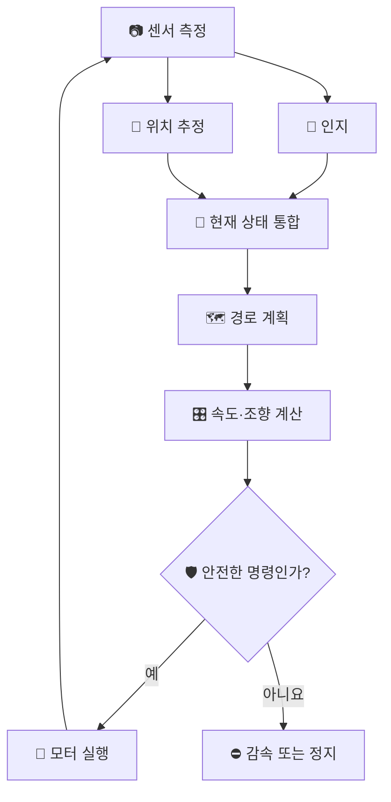

# 02. 로봇은 어떻게 스스로 움직이는가?

> ⏱️ 예상 읽기 시간: 7분
> 🎯 목표: 센서 정보가 모터 움직임으로 바뀌는 과정을 이해한다.

## 사람의 운전과 비교해 보기

| 사람 | 자율주행 로봇 | 하는 일 |
|---|---|---|
| 👀 눈 | 카메라·LiDAR | 길, 점자블록, 장애물을 본다. |
| 👂 귀·평형감각 | IMU | 회전과 기울기 변화를 느낀다. |
| 🧭 위치 감각 | GNSS·엔코더 | 대략적인 위치와 이동거리를 계산한다. |
| 🧠 두뇌 | Jetson의 주행 소프트웨어 | 상황을 판단하고 경로를 정한다. |
| 👐 손·발 | Raspberry Pi·모터 | 조향하고 전진·정지한다. |
| ⚠️ 위험 반응 | Safety Supervisor·E-stop | 위험할 때 명령을 막고 정지한다. |

## 전체 동작 흐름



## 1. 👀 인지: 주변에 무엇이 있는가?

인지는 센서값을 사람이 이해할 수 있는 정보로 바꾸는 과정이다.

```text
카메라 픽셀 → 점자블록 영역
LiDAR 거리값 → 전방 장애물
```

카메라에 노란색이 보였다는 사실만으로는 부족하다. 그것이 점자블록인지, 그림자인지, 얼마나 신뢰할 수 있는지도 판단해야 한다.

## 2. 📍 위치 추정: 나는 어디에 있는가?

센서 하나만으로 위치를 완벽히 알기 어렵기 때문에 여러 측정값을 합친다.

| 센서 | 알려주는 정보 | 약점 |
|---|---|---|
| GNSS | 지도상의 대략적인 위치 | 건물 주변에서 오차가 커질 수 있음 |
| 휠 엔코더 | 바퀴가 이동한 거리 | 미끄러지면 실제 거리와 달라짐 |
| IMU | 회전 방향과 각속도 | 오래 사용하면 오차가 누적됨 |
| LiDAR | 주변 물체까지의 거리·형상 | 유리·비·복잡한 환경의 영향 |

> 🧩 여러 센서의 장점을 합치고 약점을 보완하는 것을 **센서 융합**이라고 한다.

## 3. 🧠 판단·계획: 어디로 갈 것인가?

판단은 현재 상황을 고르고, 계획은 앞으로 이동할 경로를 만든다.

| 현재 상황 | 가능한 판단 |
|---|---|
| 점자블록이 잘 보임 | 일정 간격을 유지하며 따라가기 |
| 잠깐 가려짐 | 이전 진행 방향과 등록 루트 유지 |
| 장애물이 가까움 | 감속 또는 정지 |
| 안전한 우회 공간이 있음 | 장애물을 피해 임시 경로 생성 |
| 우회가 끝남 | 원래 루트의 앞쪽 지점으로 복귀 |

계획 결과는 보통 로봇이 앞으로 지나갈 여러 점, 즉 **경로(path)** 또는 **궤적(trajectory)**으로 표현한다.

## 4. 🎛️ 제어: 계획대로 어떻게 움직일 것인가?

제어기는 목표 경로를 실제 모터 명령으로 바꾼다.


예를 들어 경로가 왼쪽으로 휘어 있으면 조향을 왼쪽으로 돌린다. 실제로 충분히 회전했는지는 엔코더와 IMU로 다시 확인한다.

## 5. 🛡️ 안전 감시: 이 명령을 실행해도 되는가?

안전 계층은 주행 알고리즘과 별도로 최종 명령을 검사한다.

| 위험 신호 | 안전 행동 예시 |
|---|---|
| 장애물이 정지 거리 안에 있음 | 즉시 정지 |
| 센서 정보가 오래됨 | 명령 차단 후 정지 |
| Jetson 통신이 끊김 | Raspberry Pi watchdog 정지 |
| 사람이 E-stop을 누름 | 모터 출력 차단 |
| 조향·위치값이 갑자기 튐 | 감속 후 수동 점검 |

## 하나의 상황을 끝까지 따라가 보기

> 🍂 **상황:** 낙엽 때문에 점자블록이 잠시 보이지 않는다.

1. 카메라의 점자블록 신뢰도가 낮아진다.
2. 로봇은 엔코더·IMU와 등록 루트로 진행 방향을 유지한다.
3. LiDAR로 앞쪽 장애물이 없는지 확인한다.
4. 속도를 낮춰 짧은 구간을 통과한다.
5. 점자블록이 다시 보이면 원래 평행 경로에 부드럽게 합류한다.
6. 다시 찾지 못하거나 위치가 불확실하면 정지한다.

## 한 페이지 요약

- 센서는 주변과 움직임을 측정하고, 컴퓨터는 이를 상태 정보로 바꾼다.
- 여러 센서를 합치면 하나의 센서가 틀렸을 때 더 안정적으로 판단할 수 있다.
- 계획은 이동할 길을 만들고, 제어는 그 길을 모터 명령으로 바꾼다.
- 모든 명령은 독립 안전 계층을 통과해야 한다.

<details>
<summary><strong>✅ 이해 확인</strong></summary>

1. GNSS만으로 점자블록 옆을 정확히 달리기 어려운 이유는 무엇인가?
2. 경로 계획과 제어는 어떻게 다른가?
3. Jetson과 통신이 끊기면 하위 제어기는 어떻게 해야 하는가?

</details>

⬅️ [01. 자율주행이란?](./01_자율주행이란.md) · ➡️ [03. 우리 프로젝트의 자율주행 구조](./03_우리_프로젝트의_자율주행_구조.md)
