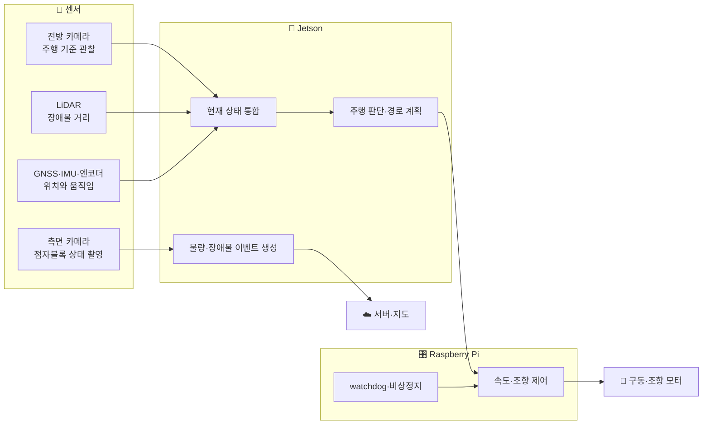
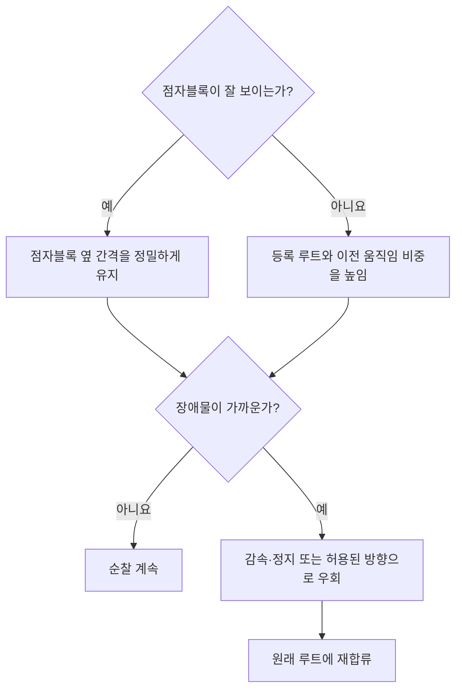
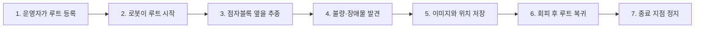

# 03. 우리 프로젝트의 자율주행 구조

> ⏱️ 예상 읽기 시간: 7분
> 🎯 목표: 걸음걸음 로봇의 센서·컴퓨터·주행 임무가 어떻게 연결되는지 이해한다.

## 프로젝트를 한 장으로 보기

## 🚦 로봇에는 두 가지 일이 있다

| 구분 | 주행 | 조사·기록 |
|---|---|---|
| 목적 | 루트를 안전하게 완주 | 불량과 장애물 정보를 남김 |
| 주 센서 | 전방 카메라·LiDAR·GNSS·IMU·엔코더 | 측면 카메라·GNSS |
| 주요 출력 | 목표 속도·조향각 | 이미지·종류·신뢰도·위치 |
| 실패 시 | 감속·정지·복구 | 이벤트 재촬영·로컬 저장 |

측면 카메라의 불량 탐지와 전방 카메라의 주행 판단은 서로 관련되지만 같은 작업은 아니다. 주행이 흔들리면 촬영 품질도 낮아지므로, 먼저 안정적으로 달리는 기반이 필요하다.

## 두 개의 길잡이를 함께 사용한다

걸음걸음 로봇은 하나의 센서만 믿지 않고 **전역 기준**과 **지역 기준**을 결합한다.

| 기준 | 쉬운 의미 | 사용 시점 |
|---|---|---|
| 🗺️ 사전 등록 루트 | 전체 순찰 방향을 알려주는 큰 지도 | 항상 기본 방향으로 사용 |
| 🟨 점자블록 추종 | 바로 앞에서 정밀하게 맞추는 안내선 | 점자블록이 잘 보일 때 강하게 사용 |
| 📡 LiDAR 안전거리 | 앞을 계속 확인하는 안전 울타리 | 주행 중 항상 검사 |
| 📍 GNSS 위치 | 사건이 발생한 지도 좌표 | 전역 정렬과 이벤트 기록에 사용 |

## 주요 센서의 역할

| 장치 | 이 프로젝트에서 하는 일 | 하지 않는 일 |
|---|---|---|
| 전방 카메라 | 점자블록과 주행 가능한 방향 관찰 | 정확한 전역 좌표 제공 |
| 측면 카메라 | 점자블록을 수직에 가깝게 촬영해 불량 탐지 | 로봇 전체 주행을 단독 결정 |
| LiDAR | 장애물까지 거리와 주변 형상 측정 | 모든 장애물의 종류 분류 |
| GNSS | 대략적인 전역 위치와 이벤트 좌표 제공 | 점자블록 폭 단위의 정밀 추종 |
| IMU | 회전·각속도 측정 | 장시간 절대 위치 유지 |
| 휠 엔코더 | 이동거리와 속도 추정 | 바퀴 미끄러짐을 스스로 구분 |

## 컴퓨터는 역할을 나눈다

### 🧠 Jetson: 보고 판단하는 상위 컴퓨터

- 카메라·LiDAR·위치 정보를 합친다.
- 현재 주행 상태와 목표 경로를 판단한다.
- 목표 속도와 조향 방향을 하위 제어기로 보낸다.
- 불량·장애물 이벤트를 서버로 전송하거나 저장한다.

### 🎛️ Raspberry Pi: 빠르고 안전하게 실행하는 하위 컴퓨터

- 목표값을 실제 PWM·모터 출력으로 바꾼다.
- 엔코더·IMU 피드백으로 속도와 조향을 보정한다.
- 상위 컴퓨터의 heartbeat가 끊기면 출력을 0으로 만든다.
- E-stop과 하드웨어 안전 동작을 수행한다.

> 💡 **heartbeat**는 Jetson이 정상이라는 사실을 주기적으로 보내는 “나 살아 있어요” 신호다.

## 순찰 한 회의 흐름

## 현재 프로젝트의 현실적인 범위

✅ 우선 목표

- 사전에 등록한 통제된 루트를 반복 순찰
- 점자블록 옆의 설정된 간격 유지
- 장애물 정지와 제한적인 우회·복귀
- 이벤트 이미지와 위치 저장
- 센서·통신 이상 시 안전 정지

🚫 아직 목표가 아닌 것

- 어느 도시에서나 즉시 주행하는 범용 자율주행
- 복잡한 공공 보도에서 사람 사이를 고속으로 통과
- 모든 장애물 종류를 정확히 분류
- AI 판단만으로 안전장치를 대체

## 한 페이지 요약

- 전방 센서는 **주행**, 측면 카메라는 **점자블록 조사**에 중심적으로 사용된다.
- 사전 루트는 전체 방향을, 점자블록은 가까운 구간의 정밀한 방향을 제공한다.
- Jetson은 판단하고 Raspberry Pi는 모터를 제어하며 비상 상황에 대비한다.
- 목표는 범용 자율주행보다 등록 루트의 안정적인 반복 순찰이다.

<strong>✅ 이해 확인</strong>

1. 사전 등록 루트와 점자블록 추종을 함께 사용하는 이유는 무엇인가?
2. 전방 카메라와 측면 카메라는 각각 어떤 일을 하는가?
3. Jetson이 멈춰도 Raspberry Pi가 별도로 정지 기능을 가져야 하는 이유는 무엇인가?

⬅️ [02. 로봇은 어떻게 스스로 움직이는가?](./02_로봇은_어떻게_스스로_움직이는가.md) · ➡️ [04. 자율주행 AI 핵심 용어](./04_자율주행_AI_핵심용어.md)
