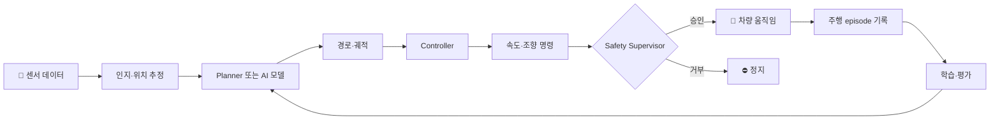
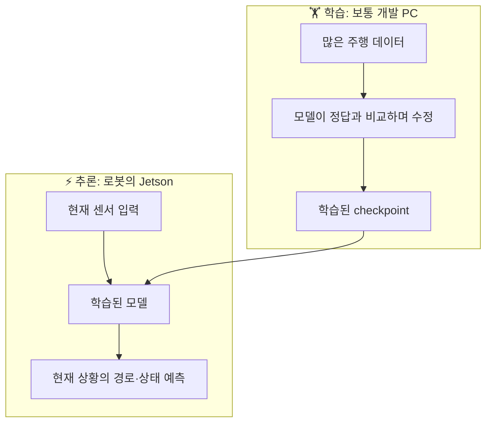
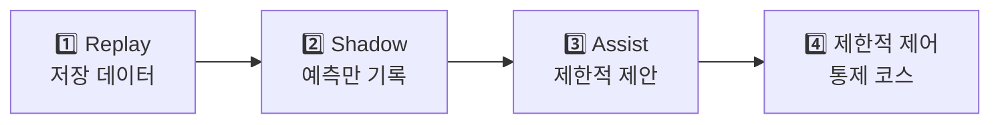

# 04. 자율주행 AI 핵심 용어

> ⏱️ 예상 읽기 시간: 8분
> 🎯 목표: 이후 문서에 반복해서 나오는 용어를 “우리 로봇에서 하는 일”과 연결한다.

## 먼저 관계부터 보기

영어를 외우기보다 **어느 단계에서 무엇을 하는 말인지** 이해하면 된다.

## 🚗 주행과 제어 용어

| 용어 | 쉬운 뜻 | 우리 로봇의 예 |
|---|---|---|
| **Path(경로)** | 지나가야 할 위치들의 선 | 점자블록 옆으로 이어지는 선 |
| **Trajectory(궤적)** | 시간·속도까지 포함한 미래 움직임 | 2초 동안 어느 점을 어떤 속도로 지날지 |
| **Planner(계획기)** | 이동할 경로를 만드는 기능 | 장애물을 피해 앞쪽 루트로 연결 |
| **Controller(제어기)** | 경로를 모터 명령으로 바꾸는 기능 | 목표점을 향하도록 조향각 계산 |
| **Waypoint(경유점)** | 경로를 이루는 개별 목표점 | 로봇 앞 0.5m의 다음 목표 위치 |
| **Rejoin(재합류)** | 이탈·우회 후 원래 길로 돌아감 | 장애물 통과 뒤 점자블록 옆으로 복귀 |
| **Offset(오프셋)** | 기준선에서 떨어진 거리 | 점자블록을 밟지 않도록 옆 간격 유지 |

## 📍 센서와 위치 용어

| 용어 | 쉬운 뜻 | 기억할 점 |
|---|---|---|
| **GNSS** | 위성으로 대략적인 전역 위치를 구함 | GPS는 GNSS 계열 중 하나 |
| **IMU** | 회전·가속도·기울기를 측정 | 방향 변화에는 강하지만 오차가 누적됨 |
| **Encoder** | 바퀴가 얼마나 돌았는지 측정 | 미끄러지면 실제 이동거리와 달라짐 |
| **LiDAR** | 빛을 쏘아 물체까지 거리를 측정 | 장애물 거리와 주변 형상 파악 |
| **Odometry** | 센서로 계산한 로봇의 이동 기록 | 보통 엔코더와 IMU를 함께 사용 |
| **Sensor fusion** | 여러 센서값을 합쳐 상태를 추정 | 각 센서의 약점을 서로 보완 |
| **TF** | 센서와 로봇 사이의 위치·방향 관계 | 카메라가 차체 어디에 달렸는지 표현 |

<strong>🧭 GPS, GNSS, odometry는 어떻게 다른가?</strong>

- **GNSS**는 지구상의 대략적인 절대 위치를 알려준다.
- **Odometry**는 출발점에서 얼마나 이동했는지를 연속적으로 계산한다.
- GNSS는 순간 오차가 클 수 있고, odometry는 오래 달리면 오차가 쌓인다.
- 그래서 프로젝트에서는 두 정보를 경쟁시키지 않고 용도에 맞게 함께 사용한다.

## 🧠 AI와 학습 용어

| 용어 | 쉬운 뜻 | 우리 프로젝트에서의 사용 |
|---|---|---|
| **Rule-based** | 사람이 조건과 행동을 직접 작성 | 장애물이 가까우면 정지 |
| **Model** | 입력을 받아 예측을 출력하는 계산 구조 | 영상과 센서로 미래 waypoint 예측 |
| **Training(학습)** | 데이터로 모델의 내부 값을 조정 | 실제 주행 기록으로 모델을 개선 |
| **Inference(추론)** | 학습된 모델로 현재 답을 계산 | Jetson에서 실시간 경로 예측 |
| **Pretrained model** | 다른 데이터로 미리 학습된 모델 | GNM·ViNT·NoMaD checkpoint |
| **Fine-tuning** | 사전학습 모델을 우리 데이터에 맞게 추가 학습 | 카메라 높이·보도·차량 특성 적응 |
| **Checkpoint** | 학습 중 저장한 모델 가중치 파일 | 공개 모델을 실행할 때 불러오는 파일 |
| **Teacher / Student** | 큰 모델·기존 시스템의 판단을 작은 모델이 배움 | 규칙 Planner의 정상 경로를 AI가 학습 |

### 학습과 추론은 다르다

## 💾 데이터 용어

| 용어 | 쉬운 뜻 | 예시 |
|---|---|---|
| **Frame** | 영상 한 장 또는 한 시점의 데이터 | 카메라 이미지 1장 |
| **Episode** | 시작부터 종료까지 이어진 한 번의 주행 기록 | 출발→장애물→복귀→도착 전체 |
| **ROS bag** | 여러 ROS 2 센서 메시지를 시간과 함께 저장한 파일 | 카메라·LiDAR·IMU 동시 기록 |
| **Label** | 모델이 배워야 할 정답 | 미래 위치, 정지 여부, 주행 mode |
| **Dataset** | 학습·검증에 쓰는 데이터 묶음 | 여러 장소와 날짜의 episode 집합 |
| **Timestamp** | 데이터가 측정된 시각 | 센서끼리 같은 순간을 맞추는 기준 |

> 📌 비슷한 영상 1,000장은 다양한 주행 1,000회와 같지 않다. AI 주행에는 시간 순서와 실제 행동이 연결된 **episode**가 중요하다.

## 🛡️ 안전과 평가 용어

| 용어 | 쉬운 뜻 | 차량에 미치는 영향 |
|---|---|---|
| **Safety Supervisor** | AI 명령을 독립적으로 검사하는 안전 관리자 | 위험 명령을 거부하고 정지 |
| **E-stop** | 사람이 누르는 비상정지 | 모터 출력을 즉시 차단 |
| **Watchdog** | 정상 신호가 끊겼는지 감시 | heartbeat 단절 시 정지 |
| **Replay** | 저장 데이터로 결과를 다시 계산 | 모터를 움직이지 않고 모델 확인 |
| **Shadow mode** | AI가 예측하지만 차량 제어에는 사용하지 않음 | 기존 Planner와 결과 비교 |
| **Assist mode** | AI가 제한적으로 후보 행동을 제안 | 안전 계층 승인 후 일부 반영 |
| **Closed-loop** | 모델 행동이 다음 입력에 영향을 주는 실주행 시험 | 실제 회전 결과를 다시 보고 판단 |
| **Go/No-Go** | 다음 단계로 갈 수 있는지 판단하는 기준 | 안전 기준 미달이면 다음 단계 금지 |

### AI의 권한은 한 번에 높이지 않는다

각 단계에서 정확도뿐 아니라 충돌, 정지 실패, 사람 개입률, 루트 복귀 성공률을 확인한 뒤 다음 단계로 이동한다.

## 자주 헷갈리는 조합

| A | B | 차이 |
|---|---|---|
| Path | Trajectory | Path는 공간상의 길, trajectory는 시간·속도까지 포함 |
| Planner | Controller | Planner는 길을 만들고 controller는 모터를 움직임 |
| Training | Inference | Training은 배우는 과정, inference는 배운 것을 사용하는 과정 |
| Replay | Shadow | Replay는 저장 데이터, shadow는 실제 주행 중 예측만 수행 |
| AI model | Safety Supervisor | AI는 행동을 제안하고 안전 계층은 실행 가능 여부를 검사 |

## 한 페이지 요약

- 센서와 위치 정보가 Planner 또는 AI 모델로 들어가 경로·궤적이 만들어진다.
- Controller가 경로를 속도·조향 명령으로 바꾸고 Safety Supervisor가 최종 검사한다.
- 학습은 데이터를 이용해 모델을 만드는 과정이고, 추론은 완성된 모델을 사용하는 과정이다.
- 실차 적용은 `Replay → Shadow → Assist → 제한적 제어` 순서로 권한을 높인다.
- 이후 문서에서 모르는 용어가 나오면 이 문서의 분류표부터 확인한다.

<strong>✅ 이해 확인</strong>

1. Planner와 Controller는 각각 무엇을 만드는가?
2. frame 여러 장보다 episode가 중요한 이유는 무엇인가?
3. shadow mode에서는 AI가 실제 모터를 제어하는가?
4. AI 모델과 Safety Supervisor를 분리해야 하는 이유는 무엇인가?

⬅️ [03. 우리 프로젝트의 자율주행 구조](./03_우리_프로젝트의_자율주행_구조.md) · ➡️ [05. 규칙 기반과 AI 기반 자율주행](./05_규칙기반과_AI기반_자율주행.md)
