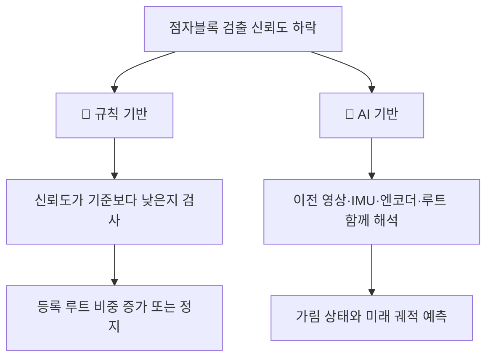
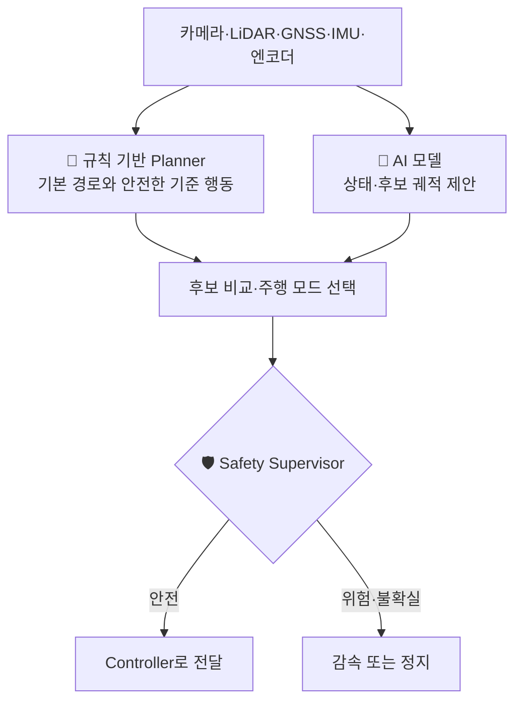

# 05. 규칙 기반과 AI 기반 자율주행

> ⏱️ 예상 읽기 시간: 7분
> 🎯 목표: 두 방식의 장단점을 이해하고, 왜 이 프로젝트가 **혼합 방식**을 사용하는지 설명할 수 있다.

## 한 문장으로 비교하면

| 방식 | 핵심 아이디어 |
|---|---|
| 📏 **규칙 기반** | 사람이 상황별 판단 규칙을 직접 작성한다. |
| 🧠 **AI 기반** | 여러 주행 사례를 보고 입력과 행동의 관계를 학습한다. |

```text
규칙 기반: “장애물이 0.5m 안에 있으면 정지해.”
AI 기반: 여러 센서와 과거 장면을 보고 “지금은 정지해야 할 상황”을 예측해.
```

## 같은 상황을 다르게 해결한다

> 🍂 **상황:** 낙엽 때문에 점자블록이 중간에서 보이지 않는다.



규칙 기반은 조건이 명확할 때 단순하고 믿기 쉽다. AI 기반은 여러 정보가 복잡하게 얽힌 상황을 다룰 가능성이 있지만, 충분한 데이터와 검증이 필요하다.

## 두 방식의 특징

| 비교 항목 | 📏 규칙 기반 | 🧠 AI 기반 |
|---|---|---|
| 판단 근거 | 사람이 작성한 조건문·수식 | 학습 데이터에서 배운 패턴 |
| 장점 | 동작을 설명하고 수정하기 쉬움 | 복잡한 영상·센서 관계를 함께 다룰 수 있음 |
| 약점 | 예외 상황이 늘수록 규칙이 복잡해짐 | 데이터 밖의 상황에서 틀릴 수 있음 |
| 데이터 | 적어도 시작 가능 | 프로젝트 자체 데이터가 필수 |
| 디버깅 | 어떤 규칙이 실행됐는지 확인 가능 | 내부 판단 이유가 불명확할 수 있음 |
| 계산량 | 비교적 작음 | 모델 크기에 따라 큼 |
| 안전성 | 명시적 제한을 걸기 쉬움 | 독립 안전 계층이 반드시 필요 |

## 규칙 기반이 잘하는 일

다음처럼 답이 명확하고 반드시 지켜야 하는 행동은 규칙으로 두는 편이 적합하다.

- E-stop이 눌리면 모터 출력을 차단한다.
- heartbeat가 끊기면 정지한다.
- 장애물이 최소 안전거리 안에 있으면 정지한다.
- 허용된 최대 속도와 조향각을 넘지 않는다.
- 센서 데이터가 너무 오래됐으면 주행 명령을 거부한다.

> 🛡️ 안전 규칙은 AI가 학습으로 바꾸는 대상이 아니라, AI보다 바깥에서 지켜야 하는 울타리다.

## AI 기반이 도움을 줄 수 있는 일

다음처럼 단순한 한두 조건으로 표현하기 어려운 상황에서 AI를 검토할 수 있다.

- 점자블록이 낙엽·그림자·사람 때문에 부분적으로 가려진 상황
- 점자블록이 실제로 끝난 것인지 잠시 안 보이는 것인지 구분
- 장애물 우회 후 어느 경로로 재합류할지 판단
- 여러 센서와 이전 행동을 함께 보고 현재 주행 상태 분류
- 불확실한 구간에서 여러 후보 궤적 제안

AI가 이런 일을 **즉시 잘한다는 뜻은 아니다.** 실제 차량 데이터로 학습하고 단계적으로 시험해야 한다.

## 왜 처음부터 AI만 사용하지 않는가?


차량이 아직 제대로 움직이지 않으면 좋은 주행 데이터를 모을 수 없다. 데이터가 없으면 AI를 프로젝트 환경에 맞게 학습할 수도 없다. 따라서 **규칙 기반 차량은 AI의 경쟁자가 아니라 데이터 수집기이자 안전한 기준선**이다.

## 이 프로젝트의 권장 구조: 서로 잘하는 일을 맡긴다



| 영역 | 우선 담당 |
|---|---|
| 비상정지·속도 제한·통신 감시 | 규칙 기반 안전 계층 |
| 선명한 점자블록 구간 추종 | 검증된 규칙 기반 Planner |
| 가림·단절·복귀 같은 불확실한 상황 | AI가 상태와 후보 궤적 제안 |
| 최종 모터 명령 승인 | 독립 Safety Supervisor |

## 자주 하는 오해

| 오해 | 바로잡기 |
|---|---|
| “규칙 기반은 낡았고 AI가 무조건 더 좋다.” | 명확한 안전 조건은 규칙 기반이 더 단순하고 검증하기 쉽다. |
| “AI를 붙이면 작성한 규칙을 모두 지워야 한다.” | 기존 Planner를 기준선·teacher·fallback으로 활용할 수 있다. |
| “정확도가 높으면 모터에 바로 연결해도 된다.” | 저장 데이터 성능과 실제 주행 안전성은 다르다. |
| “혼합 방식은 임시방편이다.” | 안전이 중요한 시스템에서는 판단과 안전 제약을 분리하는 것이 중요하다. |

## 한 페이지 요약

- 규칙 기반은 사람이 조건을 만들고, AI 기반은 데이터에서 판단 패턴을 배운다.
- 명확한 안전 조건은 규칙으로 유지한다.
- AI는 가림·단절·복귀처럼 복잡한 상황의 상태와 후보 경로를 제안한다.
- 규칙 기반 차량을 먼저 완성해야 안전한 AI 학습 데이터를 모을 수 있다.
- 이 프로젝트는 한쪽을 버리지 않고 **규칙 기반 + AI 보조 + 독립 안전 계층**을 사용한다.

<details>
<summary><strong>✅ 이해 확인</strong></summary>

1. E-stop을 AI가 아니라 규칙 기반 안전 계층이 담당해야 하는 이유는 무엇인가?
2. 규칙 기반 차량이 AI 개발의 기반이 되는 이유는 무엇인가?
3. 이 프로젝트에서 AI가 처음 맡아야 할 역할은 완전 제어인가, 후보 제안인가?

</details>

⬅️ [04. 자율주행 AI 핵심 용어](./04_자율주행_AI_핵심용어.md) · ➡️ [06. 왜 자율주행 AI에 데이터가 필요한가?](./06_왜_자율주행_AI에_데이터가_필요한가.md)
