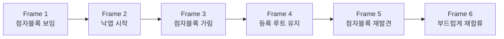
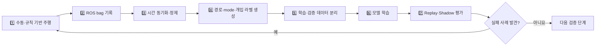

# 06. 왜 자율주행 AI에 데이터가 필요한가?

> ⏱️ 예상 읽기 시간: 8분
> 🎯 목표: 어떤 데이터를 왜 수집해야 하며, 이미지 수보다 **주행 episode**가 중요한 이유를 이해한다.

## AI는 경험하지 않은 것을 저절로 알지 못한다

> **데이터는 AI에게 보여주는 운전 경험과 정답 예시다.**

공개 모델은 일반적인 길과 이동 모습을 배웠을 수 있다. 하지만 우리 카메라의 높이, 점자블록 옆 간격, 차량의 회전반경, 한국 보도 환경은 알지 못한다. 이 차이를 메우려면 실제 걸음걸음 로봇의 주행 기록이 필요하다.

## 사진 한 장과 주행 한 번은 다르다

| 구분 | 이미지 기반 불량 탐지 | AI 주행 정책 |
|---|---|---|
| 기본 단위 | 서로 다른 사진 | 시작부터 종료까지 이어진 episode |
| 입력 | 현재 이미지 | 시간 순 이미지 + 센서 + 이전 행동 + 목표 |
| 정답 | 불량 종류·영역 | 미래 경로·속도·정지·주행 상태 |
| 중요한 다양성 | 불량 모양·재질·조명 | 장소·날짜·경로·실패·복구 상황 |

측면 카메라의 불량 분류용 이미지가 많아도, 전방 카메라와 차량 행동이 연결된 주행 데이터가 없다면 AI 주행 모델은 학습하기 어렵다.

## Frame보다 Episode가 중요한 이유



한 장만 보면 Frame 3이 “길이 끝난 장면”인지 “잠깐 가려진 장면”인지 알기 어렵다. 앞뒤 장면과 그때의 이동·조향 기록을 함께 봐야 올바른 행동을 배울 수 있다.

> 🎞️ 같은 1분 영상을 1,800장으로 나눠도 독립적인 주행 경험 1,800개가 되지는 않는다.

## 한 번의 Episode에 필요한 정보

| 종류 | 저장 예시 | 필요한 이유 |
|---|---|---|
| 👀 주변 관측 | 전방 RGB, LiDAR | 길과 장애물 확인 |
| 📍 차량 상태 | GNSS, IMU, 엔코더, 속도 | 위치와 움직임 추정 |
| 🎛️ 행동 | 목표·실제 조향각, 속도, 제어 주체 | 어떤 판단이 어떤 움직임을 만들었는지 확인 |
| 🗺️ 임무 | route ID, 목표점, 주행 mode | 어디로 가려 했는지 설명 |
| ⚠️ 사건 | 사람 개입, E-stop, 센서 이상, 복구 | 실패와 안전 행동 학습·평가 |
| 🕒 시간 | 모든 데이터의 timestamp | 같은 순간의 센서와 행동을 연결 |
| 📝 환경 | 장소, 날짜, 날씨, 노면 | 조건별 성능과 데이터 편향 확인 |

## 데이터는 어떻게 학습 자료가 되는가?



이 과정은 한 번으로 끝나지 않는다. 모델이 어려워한 상황을 다시 수집하면서 데이터와 모델을 함께 개선한다.

## 규칙 기반 Planner는 Teacher가 될 수 있다

정상적으로 주행한 구간에서는 기존 Planner가 만든 경로를 AI의 정답 후보로 사용할 수 있다.

```text
규칙 Planner의 정상 궤적 → 자동 라벨
사람이 개입해 수정한 궤적 → 더 안전한 정답
잘못된 모델 궤적 → 피해야 할 사례
```

다만 teacher가 잘못 판단한 기록까지 그대로 학습하면 AI도 같은 실수를 배운다. 사람 개입과 실패 원인을 함께 기록해야 한다.

## 좋은 데이터의 조건

| ✅ 좋은 데이터 | ❌ 위험한 데이터 |
|---|---|
| 센서와 행동 시간이 맞음 | 영상과 조향 시점이 어긋남 |
| 실제 명령과 실제 차량 반응을 함께 저장 | 목표 PWM만 저장 |
| 장소·날짜·경로 단위로 학습/시험 분리 | 같은 영상의 인접 frame을 양쪽에 사용 |
| 정상·가림·우회·실패·복구를 포함 | 쉬운 직선 주행만 반복 |
| E-stop과 사람 개입을 명확히 표시 | 위험 순간의 원인을 알 수 없음 |

## 데이터 규모에 따라 가능한 일이 달라진다

> ⚠️ 아래 수량은 성공을 보장하는 연구 결과가 아니라 프로젝트 계획을 위한 **공학적 추정치**다. 시간보다 독립적인 episode와 다양한 조건이 중요하다.

| 단계 | 자체 데이터 예시 | 허용되는 활동 |
|---|---|---|
| D0 | 0시간·0 episode | 로거 개발, 공개 checkpoint 실행 |
| D1 | 0.5~1시간·짧은 run 10회 이상 | 동기화와 라벨 생성 검증 |
| D2 | 5~10시간·50~100 episode | 작은 모델 학습, Shadow 평가 |
| D3 | 15~25시간·150~300 episode | Safety gate 뒤에서 제한적 Assist |
| D4 | 50시간 이상·다양한 희귀 실패 포함 | 통제 코스에서 일부 Planner 대체 검토 |

## 자주 하는 실수

- 공개 데이터만으로 우리 로봇이 바로 주행할 수 있다고 가정한다.
- 영상만 저장하고 실제 조향·속도·엔코더를 저장하지 않는다.
- 모든 센서를 처음부터 한 모델에 넣어 문제 원인을 찾기 어렵게 만든다.
- 저장 데이터의 평균 오차만 보고 실차 주행 성공을 선언한다.
- 데이터가 부족한데 더 큰 모델이나 증류가 해결해 줄 것이라 기대한다.

## 한 페이지 요약

- AI 주행에는 정지 이미지보다 시간 순서와 행동이 연결된 episode가 필요하다.
- 카메라·LiDAR·위치·행동·개입 기록의 timestamp가 맞아야 한다.
- 규칙 기반 Planner는 정상 경로의 teacher이자 데이터 수집 기반이다.
- 학습 데이터와 시험 데이터는 장소·날짜·경로 단위로 분리한다.
- 데이터가 쌓인 만큼만 AI의 권한을 높인다.

<details>
<summary><strong>✅ 이해 확인</strong></summary>

1. 같은 영상의 frame 1,800장이 독립 episode 1,800개와 다른 이유는 무엇인가?
2. 실제 모터 반응과 사람 개입을 함께 저장해야 하는 이유는 무엇인가?
3. 자체 데이터가 없는 D0 단계에서 허용되는 활동은 무엇인가?

</details>

⬅️ [05. 규칙 기반과 AI 기반 자율주행](./05_규칙기반과_AI기반_자율주행.md) · ➡️ [07. 자율주행 고도화 전체 로드맵](./07_자율주행_고도화_전체로드맵.md)
