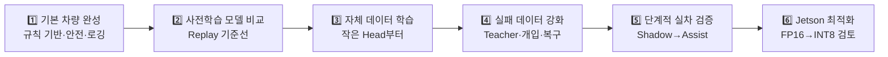
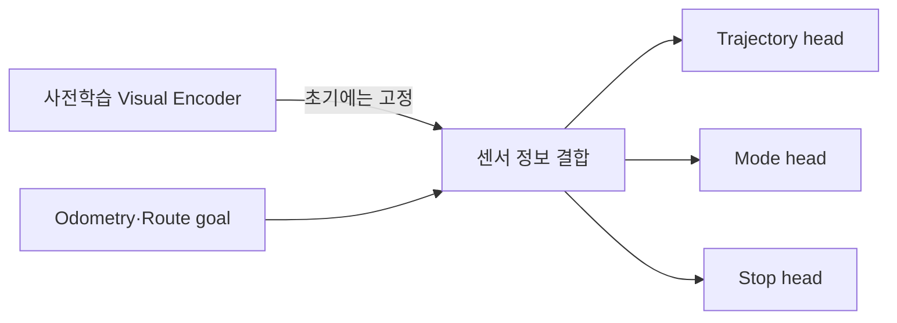
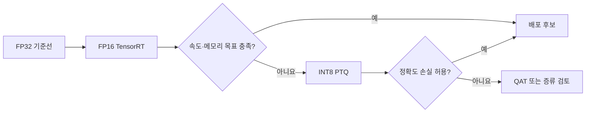
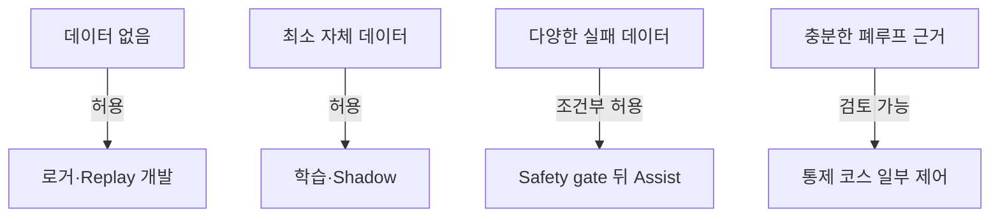

# 07. 자율주행 고도화 전체 로드맵

> ⏱️ 예상 읽기 시간: 8분
> 🎯 목표: 현재의 규칙 기반 차량에서 AI 보조 주행까지 어떤 순서로 발전시키는지 이해한다.

## 먼저 전체 순서를 보기



> 🚧 앞 단계의 완료 기준을 통과하지 못하면 다음 단계로 넘어가지 않는다.

## 단계별로 무엇을 하는가?

|  단계 | 쉬운 설명                       | 핵심 작업                                    | 대표 산출물                  |
| --: | --------------------------- | ---------------------------------------- | ----------------------- |
|   1 | 로봇이 안전하게 달리고 기록하게 만든다.      | 규칙 Planner, E-stop, watchdog, 센서 동기화     | 반복 주행 baseline, ROS bag |
|   2 | 공개 AI 모델이 우리 환경에서 실행되는지 본다. | GNM·ViNT·NoMaD Replay 비교                 | 지연·메모리·예측 비교표           |
|   3 | 우리 로봇의 경험을 조금씩 가르친다.        | RGB+odometry, frozen encoder, 작은 head 학습 | 학습 pipeline, offline 결과 |
|   4 | 쉬운 직선보다 실패하기 쉬운 상황을 보강한다.   | teacher 라벨, 사람 개입, 우회·복구 수집              | 실패·복구 데이터셋              |
|   5 | AI의 권한을 안전하게 조금씩 높인다.       | Replay→Shadow→Assist→통제 코스               | Go/No-Go 기록, 폐루프 결과     |
|   6 | 검증된 모델을 Jetson에서 빠르게 만든다.   | TensorRT FP16, 이후 INT8·QAT·증류 검토         | 실시간 benchmark           |

## 1단계: 규칙 기반 차량과 데이터 수집

🎯 **목표:** AI 없이도 정해진 루트를 안전하게 반복 주행하고 모든 센서를 기록한다.

- 수동 주행과 E-stop이 동작한다.
- 카메라·LiDAR·GNSS·IMU·엔코더 시간이 맞는다.
- 실제 속도·조향 반응과 사람 개입이 저장된다.
- 센서·통신 이상 시 안전하게 정지한다.

**통과 질문:** 같은 코스를 반복했을 때 주행과 ROS bag 재생이 안정적인가?

## 2단계: 사전학습 모델 비교

🎯 **목표:** 공개 checkpoint를 모터에 연결하지 않고, 저장 데이터에서 비교한다.

```text
같은 입력 데이터 → GNM / ViNT / NoMaD → 예측·속도·메모리 비교
```

이 단계에서 좋은 결과가 나와도 실차 안전성이 증명된 것은 아니다. 실행 가능성과 baseline을 확인하는 단계다.

**통과 질문:** 입력 형식, 좌표계, 추론 지연을 이해하고 같은 조건에서 재현할 수 있는가?

## 3단계: 자체 데이터 기반 학습

🎯 **목표:** 큰 모델 전체보다 작은 출력부부터 우리 환경에 적응시킨다.



처음에는 RGB+odometry baseline으로 시작한다. 모든 센서와 복잡한 모델을 한꺼번에 넣지 않는다.

**통과 질문:** 새로운 장소·날짜의 시험 episode에서도 기준 모델보다 나아졌는가?

## 4단계: Teacher와 실패 데이터 강화

🎯 **목표:** 정상 주행뿐 아니라 AI가 틀리기 쉬운 순간을 집중 학습한다.

| 모을 상황 | 필요한 이유 |
|---|---|
| 점자블록 가림·단절 | 단일 이미지로 상태 구분이 어려움 |
| 사람 개입 직전 | 위험 판단의 경계를 보여줌 |
| 장애물 우회 | 임시 경로 생성 능력 검증 |
| 우회 후 재합류 실패·성공 | 복구 행동을 비교 학습 |
| 센서 품질 저하 | 불확실할 때 감속·정지 학습 |

**통과 질문:** 드문 실패 mode마다 독립적인 사례와 올바른 복구 정답이 있는가?

## 5단계: Shadow에서 Assist까지

🎯 **목표:** AI가 실제 차량에 미치는 영향을 단계적으로 제한하며 검증한다.

| 수준 | AI가 하는 일 | 모터 제어 |
|---|---|---|
| Replay | 저장 데이터에서 예측 | 없음 |
| Shadow | 실제 주행 중 예측만 기록 | 기존 Planner가 담당 |
| Assist | 불확실 구간의 후보 궤적 제안 | Safety gate 승인 후 제한적 반영 |
| 제한적 제어 | 통제 코스 일부 구간 담당 | 즉시 fallback 가능해야 함 |

**통과 질문:** 완주율뿐 아니라 충돌·정지 실패·개입률·재합류 성공률이 기준을 만족하는가?

## 6단계: Jetson 배포 최적화

🎯 **목표:** 정확도를 확인한 모델을 목표 하드웨어에서 실시간으로 실행한다.



최적화 전후에 정확도, 추론 지연, GPU·RAM 사용량, timeout을 같은 조건으로 기록한다.

**통과 질문:** 측면 YOLO와 동시에 실행해도 제어 주기와 안전 timeout을 지키는가?

## 단계별 안전 권한



AI의 권한은 모델 이름이나 데모 영상이 아니라 **자체 데이터와 검증 증거**에 따라 높인다.

## MVP와 후속 고도화를 구분한다

| MVP에서 우선 | 충분한 검증 후 검토 |
|---|---|
| 규칙 기반 반복 순찰 | AI의 Planner 일부 대체 |
| 독립 Safety Supervisor | NoMaD 복수 궤적 생성 |
| 모든 센서의 동기화 로그 | 멀티센서 전체 fusion 확대 |
| Replay·Shadow 비교 | Assist 폐루프 운용 |
| FP16 TensorRT 기준선 | INT8·QAT·teacher-student 증류 |

> 📌 모델 고도화보다 먼저 확보해야 할 것은 **안전하게 움직이는 차량과 신뢰할 수 있는 자체 episode**다.

## 시작 전 현재 상태를 다시 확인한다

기존 조사 문서 작성 시점에는 프로젝트 전용 AI 주행 episode가 없는 것으로 정리됐다. 실제 착수 전에는 다음 항목을 다시 확인하고 로드맵의 시작점을 갱신한다.

- 수동·규칙 기반 주행이 가능한가?
- ROS bag이 존재하고 정상 재생되는가?
- 센서 timestamp와 TF가 맞는가?
- 실제 조향·속도·개입 기록이 들어 있는가?
- 장소·날짜·route별 episode 수는 얼마인가?

## 한 페이지 요약

- 순서는 `기본 차량 → 사전학습 비교 → 자체 학습 → 실패 강화 → 단계 검증 → Jetson 최적화`다.
- 공개 모델을 곧바로 모터에 연결하지 않는다.
- 단순한 RGB+odometry와 작은 head부터 시작해 센서를 하나씩 추가한다.
- AI 권한은 Replay, Shadow, Assist 순으로 높인다.
- 모든 단계에서 독립 Safety Supervisor와 fallback을 유지한다.

<details>
<summary><strong>✅ 이해 확인</strong></summary>

1. 사전학습 모델 비교보다 규칙 기반 차량 완성이 먼저인 이유는 무엇인가?
2. 자체 학습 단계에서 모든 센서를 한꺼번에 넣지 않는 이유는 무엇인가?
3. AI의 권한을 높일 때 필요한 근거는 모델 크기인가, 자체 데이터와 폐루프 검증인가?

</details>

⬅️ [06. 왜 자율주행 AI에 데이터가 필요한가?](./06_왜_자율주행_AI에_데이터가_필요한가.md) · ➡️ [08. 룰베이스 ROS 2 제어 통합 구현설계](./08_룰베이스_ROS2_제어_통합구현설계.md)
