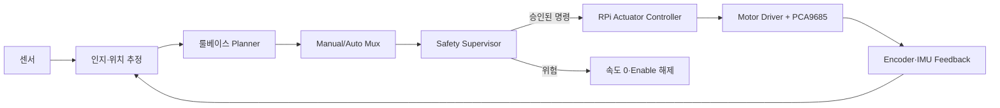
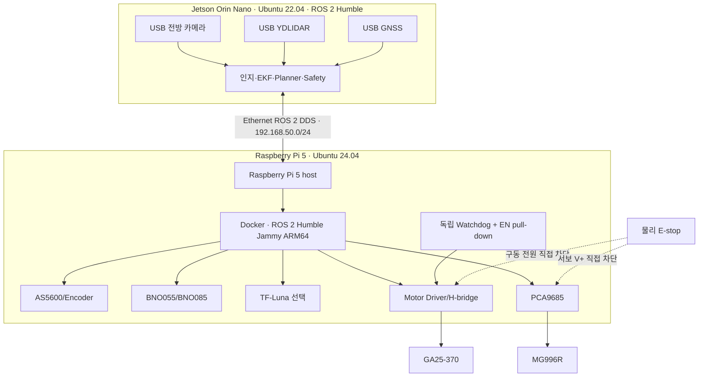
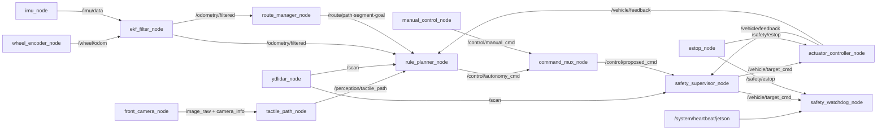
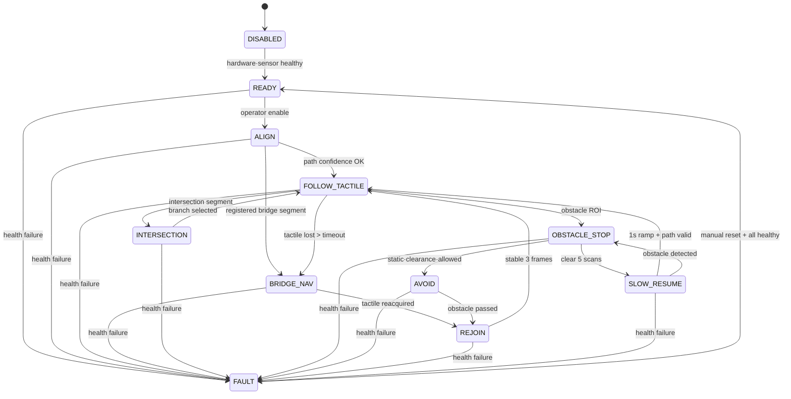
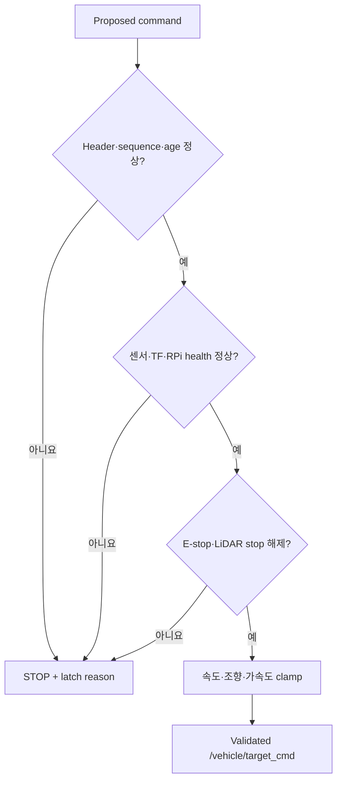
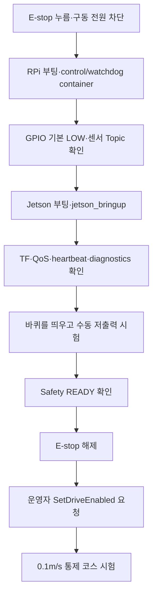

# 08. 룰베이스 ROS 2 제어 통합 구현설계

> [!IMPORTANT]
> 이 문서는 학습·설계 과정의 참고 자료입니다. 구현 및 검수에는 `../04_최종문서/`의 최신 Spec을 사용하세요. 대응 기준은 [HW/CONTROL 문서 지도](../04_최종문서/10_HW_CONTROL/10_README.HW_CONTROL.md)에서 확인할 수 있습니다.

> 대상: Jetson Orin Nano(Ubuntu 22.04·native ROS 2 Humble) + Raspberry Pi 5(Ubuntu 24.04·Docker ROS 2 Humble), Ackermann 조향 로봇
> 상태: 구현 기준안 — 실물 하드웨어 미확정 항목은 §2의 Gate 통과 전 사용 금지
> 최종 시스템 기준서: [09. 최종 HW·ROS·제어 통합설계](./09_최종_HW_ROS_제어_통합설계.md)

## 0. 문서 목적과 채택 결론

이 문서는 기존의 자율주행 알고리즘, Jetson–Raspberry Pi 하드웨어, 데이터 수집 가이드를 하나의 구현 계약으로 통합한다.

### 채택 구조

> **Jetson은 인지·위치 추정·룰베이스 계획·상위 안전 검사를 담당하고, Raspberry Pi는 엔코더·IMU 수집, 속도 PID, 조향 PWM, 명령 watchdog과 하위 안전 정지를 담당한다.**

기존 문서의 충돌은 다음처럼 정리한다.

| 충돌 항목 | 최종 결정 |
|---|---|
| `/drive_cmd`, `/safety/validated_cmd` vs `/vehicle/target_cmd` | 최종 승인 명령은 `/vehicle/target_cmd`로 통일 |
| `/actuator/status` vs `/vehicle/feedback` | 실제 구동기 상태는 `/vehicle/feedback`으로 통일 |
| `/wheel_odom` vs `/wheel/odom` | 바퀴 odometry는 `/wheel/odom`으로 통일 |
| Jetson 단독 I/O vs Jetson–RPi | 현재 하드웨어 설계에 맞춰 Jetson–RPi 분리형 채택 |
| 여러 노드의 모터 직접 접근 | RPi의 `actuator_controller_node`만 모터·서보 API 소유 |
| GNSS 기반 정밀 추종 | 금지; GNSS는 이벤트 좌표와 전역 정렬 보조 |
| AI가 안전 계층 대체 | 금지; 본 문서는 deterministic rule-based control만 다룸 |
| 명령 checksum | DDS 구간에서는 제외; sequence·timestamp·watchdog 사용 |
| `emergency_stop` 필드 | 제거; `enable=false`, `MODE_FAILSAFE`, 별도 `/safety/estop`으로 분리 |
| `valid_for`의 단위·형식 | `builtin_interfaces/Duration`을 최종 계약으로 채택 |
| RPi Ubuntu 24.04에 native Humble 설치 | 금지; Humble Jammy ARM64 container로 실행 |
| RPi native Jazzy와 Jetson Humble 혼용 | 금지; ROS 배포판 간 통신은 공식 보장되지 않음 |
| Jetson까지 즉시 container화 | 보류; 기존 native Humble과 JetPack 장치 경로 유지 |
| Docker 기본 bridge network | 실차 ROS graph에서 사용하지 않음; Linux `network_mode: host` 채택 |
| 원격 서버를 ROS graph에 직접 결합 | 금지; 주행은 보드 안에서 완결하고 서버는 HTTPS·MQTT·VPN gateway로 분리 |

### 운영체제·실행환경 최종 결정

| 컴퓨터 | Host OS | ROS 실행 방식 | 이유 |
|---|---|---|---|
| Jetson Orin Nano | Ubuntu 22.04(JetPack 호환 버전 고정) | native ROS 2 Humble | 이미 구성된 GPU·카메라·TensorRT 장치 경로를 단순하게 유지 |
| Raspberry Pi 5 | 현재 Ubuntu 24.04 Desktop 유지 | Ubuntu 22.04 Jammy ARM64 기반 ROS 2 Humble container | Jetson과 ROS 배포판을 통일하면서 Pi 5 host 지원을 유지 |
| 현장 서버 | 운영 OS | 필요 시 Humble container 또는 일반 서비스 | rosbag 수집·모니터링만 ROS, 업무 API는 HTTPS·MQTT 사용 |
| 원격 서버 | 서버 운영 OS | ROS DDS 직접 노출 금지 | 차량 gateway를 통한 인증된 API·VPN만 허용 |

Pi의 Desktop GUI가 필요 없고 새로 설치할 시점이 오면 Ubuntu Server 24.04를 선택할 수 있다. 현재 Desktop 설치는 기능상 재설치 사유가 아니며, 불필요한 GUI 자동 시작 서비스만 운영 프로파일에서 비활성화한다.

### 제어 원칙



---

## 1. 시스템 범위와 성공 기준

### 구현 범위

- 등록 루트의 반복 순찰
- 전방 카메라 기반 점자블록 옆 오프셋 추종
- 점자블록 가림·단절 구간의 등록 루트 추종
- LiDAR 기반 장애물 정지
- 검증된 고정 우회와 앞쪽 루트 재합류
- 수동 조종 우선권과 즉시 정지
- 센서·TF·통신 이상 시 감속 또는 latched stop

### 범위 밖

- 공공 보도에서의 온라인 탐색
- 동적 보행자 사이 자율 우회
- GNSS 단독 정밀 주행
- 미검증 AI 모델의 직접 모터 제어
- 서버 응답에 의존하는 주행 판단
- HC-SR04 기반 근접 정지(야외 반사·빔폭 검증 전 MVP 안전센서에서 제외)

### 최종 성공 기준

| 영역 | 합격 조건 |
|---|---|
| 명령 단절 | 마지막 유효 명령 수신 후 200ms 이내 모터 출력 0 |
| E-stop | ROS 2·OS와 무관하게 모터·서보 구동 전원 차단 |
| 재출발 | 정지 원인 해제만으로 자동 재출발하지 않음 |
| 위치 추정 | `map → odom → base_link` 단일 broadcaster 유지, pose jump 없음 |
| 반복 주행 | 지정 통제 코스 3회 연속 완주 |
| 장애물 | 비상거리 침범 전 정지, 충돌 0회 |
| 로깅 | 명령·실제 속도·안전 사유·센서 timestamp 재생 가능 |

---

## 2. 구현 전 하드웨어 확정 Gate

다음 값은 현재 문서만으로 확정할 수 없다. 임의값으로 구동하면 하드웨어를 손상시킬 수 있다.

| 미확정 항목 | 반드시 확인할 값 | 확인 전 동작 |
|---|---|---|
| Motor Driver HAT/H-bridge | IC, GPIO 핀, 3.3V 논리, 정격·기동·스톨 전류 | 모터 enable 금지 |
| GA25-370 | 정격전압, 기어비, encoder PPR, 기동·스톨 전류 | PWM 상한 확정 금지 |
| MG996R 링크 | 중립·좌우 pulse, 실제 조향각, 기계적 간섭 | 바퀴를 띄운 캘리브레이션만 |
| AS5600/엔코더 | 장착 축, 자석, 방향, 1회전당 바퀴 이동량 | odometry 사용 금지 |
| 차체 | wheelbase, wheel radius, track width, 최대 조향각 | Pure Pursuit 파라미터 확정 금지 |
| E-stop | NC/NO 배선, Motor Driver EN·서보 전원 차단 방식 | 실차 시험 금지 |

> 코드의 기본 파라미터는 안전을 위해 `-1` 또는 `UNSET`이며, 필수값이 없으면 노드는 `DISABLED` 상태로 종료해야 한다.

---

## 3. 물리 연결 구조



### 전원 규칙

- Jetson·RPi GPIO에서 모터와 서보 전원을 공급하지 않는다.
- PCA9685 로직 전원과 MG996R의 `V+`를 분리한다.
- 모터·서보·컴퓨팅 전원 레일을 분리하고 GND는 검증된 한 점에서 공통 연결한다.
- E-stop은 컴퓨터 전원이 아니라 모터·서보 구동 전원을 차단해 직전 로그를 보존한다.
- Motor Driver `EN`은 RPi 부팅·프로세스 죽음·GPIO high-Z 시에도 외부 pull-down으로 비활성화돼야 한다.

---

## 4. ROS 2 패키지 구조

```text
ros2_ws/src/
├─ step_step_interfaces/
│  ├─ msg/{VehicleCommand,ActuatorStatus,TactilePath,RouteSegment,SafetyState,Heartbeat}.msg
│  └─ srv/{SetDriveEnabled,ResetFault,StartRouteRecording,StopRouteRecording}.srv
├─ step_step_description/
│  ├─ urdf/step_step.urdf.xacro
│  └─ config/robot_dimensions.yaml
├─ step_step_navigation/
│  ├─ src/{route_manager,map_odom_alignment,rule_planner,command_mux,safety_supervisor}.cpp
│  └─ config/{planner,safety,ekf}.yaml
├─ step_step_perception/
│  └─ src/tactile_path_node.cpp
├─ step_step_hardware_rpi/
│  ├─ step_step_hardware_rpi/{actuator_controller,encoder,imu,watchdog}.py
│  └─ config/hardware.yaml
└─ step_step_bringup/
   ├─ launch/{jetson_bringup,rpi_control_bringup,rpi_watchdog_bringup,replay}.launch.py
   └─ config/{common,jetson/*,rpi/*,qos_overrides}.yaml
```

### 언어 선택

| 경로 | 권장 언어 | 이유 |
|---|---|---|
| 인지·Planner·Safety | C++ `rclcpp` | 일정한 제어 주기와 낮은 지연 |
| RPi 초기 하드웨어 bring-up | Python `rclpy` | 빠른 핀·I²C 검증 |
| RPi 최종 100Hz 제어 | C++ 또는 충분히 측정된 Python | p99 주기 검증 후 결정 |
| 이벤트 업로드·도구 | Python | 비실시간 영역 |

### 오픈소스 채택과 우리 구현 경계

| 영역 | 최종 선택 | 적용 방식 | 현재 제외·보류 |
|---|---|---|---|
| USB 카메라 | `usb_cam` | YAML·remap·calibration을 추가해 사용 | 자체 V4L2 driver 작성 |
| 영상 보정 | `image_proc` | CPU 기준선으로 먼저 계측 | Isaac ROS는 CPU 병목 확인 후 비교 |
| LiDAR | YDLIDAR Humble driver + SDK | 검증한 commit SHA, udev rule, 실물 모델 파라미터 고정 | 임의 최신 `main` 추적 |
| 위치 추정 | `robot_localization` | 축·covariance·TF 소유권을 우리 config로 지정 | GNSS 단독 정밀 주행 |
| 수동 입력 | `joy` + `manual_control_node` | deadman·scale·stale 검사 후 `VehicleCommand`로 변환 | `/cmd_vel`의 모터 직결 |
| GPIO | Linux `libgpiod` | Pi 5의 실제 gpiochip·line offset을 Gate에서 확정 | Pi 5 비지원 `pigpio` |
| 조향 | Adafruit PCA9685 계열 | 우리 ROS wrapper·pulse calibration·hard clamp 추가 | 범용 servo 예제의 직접 운용 |
| IMU | 실물에 따라 BNO055 또는 BNO08x 하나 | ENU 변환·covariance·health를 wrapper에서 제공 | 모델 미확정 상태의 동시 지원 |
| Encoder | AS5600 register reader | unwrap·방향·속도·odometry를 우리 노드로 구현 | 그대로 쓸 수 있다고 가정한 범용 ROS driver |
| 하위 제어 | 전용 actuator/watchdog 노드 | 단일 핀 소유권과 `VehicleCommand` 안전 계약 유지 | MVP의 `ros2_control` 전환 |
| 통신 | Fast DDS 기본값 | 양쪽 `rmw_fastrtps_cpp`로 시작, 동일 부하 A/B 후에만 Cyclone으로 함께 변경 | 현재 `rmw_zenoh` 도입 |
| 완성형 스택 | 설계 관례만 참고 | F1TENTH·Linorobot2·Autoware의 calibration·bring-up·diagnostics 관례만 취함 | 저장소 전체 이식 |

오픈소스는 `빌드 → 인터페이스 → 실물 하드웨어 → 주기·지연 → 고장 시 정지`를 모두 통과해야 채택 완료다. 설치 성공만으로 차량 적용 완료로 보지 않는다. 어떤 패키지를 추가해도 구동 경로 `command_mux → safety_supervisor → /vehicle/target_cmd → actuator_controller`를 우회할 수 없다.

---

## 5. 노드 목록과 책임

### 5.1 Jetson 노드

| 노드 | 주기 | 구독 | 발행 | 단일 책임 |
|---|---:|---|---|---|
| `front_camera_node` | 20~30Hz | USB camera | `/sensors/front/image_raw`, `/sensors/front/camera_info` | 영상·캘리브레이션 |
| `ydlidar_node` | native | YDLIDAR | `/scan` | `LaserScan` 발행 |
| `gnss_node` | 1~10Hz | USB GNSS | `/fix` | 전역 위치·이벤트 좌표 |
| `tactile_path_node` | 15~20Hz | front image, camera info | `/perception/tactile_path` | BEV·중심선·신뢰도 |
| `ekf_filter_node` | 50Hz | `/wheel/odom`, `/imu/data` | `/odometry/filtered`, `odom→base_link` | 로컬 위치 추정 |
| `map_odom_alignment_node` | 시작/필요 시 | route origin, 초기 pose | `map→odom` | route 좌표계와 로컬 odom 정렬 |
| `route_manager_node` | event/10Hz | route file, odometry | `/route/path`, `/route/segment`, `/route/goal` | 루트·세그먼트 관리 |
| `rule_planner_node` | 20Hz | tactile, route, odom, scan | `/control/autonomy_cmd`, `/planning/reference_path`, `/autonomy/mode` | 룰베이스 행동·경로 |
| `manual_control_node` | 20~50Hz | joystick | `/control/manual_cmd` | 수동 명령 |
| `command_mux_node` | 50Hz | manual, autonomy, operator mode | `/control/proposed_cmd` | 수동 우선·source 선택 |
| `safety_supervisor_node` | 50~100Hz | proposed cmd, scan, odom, feedback, health, `/safety/estop` | `/vehicle/target_cmd`, `/safety/state`, `/safety/stop_reason` | 최종 명령 승인 |
| `system_monitor_node` | 10Hz | diagnostics, topic age | `/system/heartbeat/jetson`, `/system/health` | 노드·센서 생존 확인 |
| `route_recorder_node` | manual | odom, fix, joystick | route file | Teach 경로 기록 |

### 5.2 Raspberry Pi 노드

| 노드 | 주기 | 구독 | 발행 | 단일 책임 |
|---|---:|---|---|---|
| `actuator_controller_node` | 100Hz | `/vehicle/target_cmd`, `/wheel/odom`, `/wheel/ticks`, E-stop | `/vehicle/feedback` | 속도 PID·조향 pulse·출력 |
| `wheel_encoder_node` | 50~100Hz | AS5600/encoder | `/wheel/odom`, `/wheel/ticks` | tick unwrap·속도·거리 |
| `imu_node` | 50~100Hz | BNO055/BNO085 | `/imu/data` | yaw rate·가속도 |
| `ground_range_node` | 10~30Hz | TF-Luna | `/safety/ground_range` | 낙하·단차 보조 |
| `estop_node` | GPIO interrupt | E-stop sense | `/safety/estop` | 물리 E-stop 상태 보고 |
| `safety_watchdog_node` | 100Hz+ | target cmd, Jetson heartbeat, estop | Driver `EN`, `/safety/rpi_state` | 별도 프로세스에서 출력 차단 |
| `rpi_monitor_node` | 10~20Hz | actuator·sensor 상태 | `/system/heartbeat/rpi`, diagnostics | RPi 생존·fault 보고 |

### 중요한 소유권 규칙

- `actuator_controller_node`만 PWM·DIR·PCA9685 채널을 쓴다.
- `safety_watchdog_node`는 별도의 Driver `EN` 또는 안전 릴레이만 쓴다.
- `wheel_encoder_node`는 `/wheel/odom` 메시지만 발행하고 TF를 발행하지 않는다.
- `ekf_filter_node`만 `odom → base_link` 동적 TF를 발행한다.
- `robot_state_publisher`만 `base_link → sensor_link` 정적 TF를 발행한다.

### Command Mux 우선순위

1. 운영 모드는 `DISABLED`, `MANUAL`, `AUTO` 중 하나다.
2. `MANUAL`에서는 100ms 이내의 최신 수동 명령만 선택하고, stale이면 즉시 0 명령을 낸다.
3. `AUTO`에서는 최신 autonomy 명령만 선택한다. 수동 입력이 들어왔다는 이유만으로 mode를 자동 전환하지 않는다.
4. `AUTO → MANUAL` 전환 첫 주기는 반드시 `speed=0`으로 보낸다.
5. `MANUAL → AUTO`는 실제 속도 0, joystick 중립, 운영자의 명시적 전환 요청을 모두 만족해야 한다.
6. `SafetyState`가 `STOPPED/FAULT`이면 어느 source도 선택하지 않고 `MODE_FAILSAFE`, `enable=false`를 낸다.

---

## 6. Topic 발행·구독 관계



### Topic 계약표

| Topic | Type | Publisher | Subscriber | QoS |
|---|---|---|---|---|
| `/sensors/front/image_raw` | `sensor_msgs/Image` | camera | tactile | Sensor, best effort, depth 5 |
| `/sensors/front/camera_info` | `sensor_msgs/CameraInfo` | camera | tactile | reliable, transient local, depth 1 |
| `/scan` | `sensor_msgs/LaserScan` | lidar | planner, safety | Sensor, best effort, depth 5 |
| `/fix` | `sensor_msgs/NavSatFix` | GNSS | event/optional navsat | Sensor, best effort, depth 5 |
| `/imu/data` | `sensor_msgs/Imu` | RPi IMU | EKF, logger | Sensor, best effort, depth 10 |
| `/wheel/odom` | `nav_msgs/Odometry` | encoder | EKF, logger | best effort, depth 10 |
| `/wheel/ticks` | `std_msgs/Int64` | encoder | actuator, logger | best effort, depth 5 |
| `/odometry/filtered` | `nav_msgs/Odometry` | EKF | route, planner, safety | 실행 중 publisher와 호환되는 profile, depth 5 |
| `/perception/tactile_path` | `TactilePath` | tactile | planner | best effort, depth 3, lifespan 150ms |
| `/route/path` | `nav_msgs/Path` | route manager | planner, UI | reliable, transient local, depth 1 |
| `/route/segment` | `RouteSegment` | route manager | planner | reliable, transient local, depth 1 |
| `/route/goal` | `geometry_msgs/PoseStamped` | route manager | planner | reliable, depth 1 |
| `/control/autonomy_cmd` | `VehicleCommand` | planner | mux | reliable, depth 1, lifespan 150ms |
| `/control/manual_cmd` | `VehicleCommand` | manual | mux | reliable, depth 1, lifespan 150ms |
| `/control/proposed_cmd` | `VehicleCommand` | mux | safety | reliable, depth 1, lifespan 100ms |
| `/vehicle/target_cmd` | `VehicleCommand` | safety | RPi actuator/watchdog | reliable, depth 1, lifespan 150ms |
| `/vehicle/feedback` | `ActuatorStatus` | RPi actuator | safety, planner | reliable, depth 5, deadline 100ms |
| `/safety/state` | `SafetyState` | safety | mux, RPi, UI | reliable, transient local, depth 1 |
| `/safety/stop_reason` | `SafetyState` | safety/RPi | UI, logger | reliable, transient local, depth 10 |
| `/safety/estop` | `std_msgs/Bool` | E-stop node | actuator, watchdog, safety | reliable, transient local, depth 1 |
| `/safety/rpi_state` | `SafetyState` | watchdog | safety, UI, logger | reliable, transient local, depth 1 |
| `/system/health` | `diagnostic_msgs/DiagnosticArray` | monitors | safety, UI, logger | reliable, depth 5 |
| `/system/heartbeat/*` | `Heartbeat` | each computer | monitors/watchdog | best effort, depth 1, deadline 100ms |

ROS 2 QoS의 publisher와 subscriber는 호환돼야 한다. 센서 publisher가 best effort인데 subscriber가 reliable만 요구하면 연결되지 않을 수 있으므로 실제 driver와 `robot_localization`의 QoS를 `ros2 topic info -v`로 확인하고, 통합 시험에서 subscriber와 호환됨을 검사한다. 표의 `/odometry/filtered` profile은 확인 전 가정하지 않는다.

---

## 7. Custom Message와 Service 정의

### `VehicleCommand.msg`

```text
std_msgs/Header header

uint8 SOURCE_NONE=0
uint8 SOURCE_MANUAL=1
uint8 SOURCE_RULE=2
uint8 source

uint8 MODE_IDLE=0
uint8 MODE_ALIGN=1
uint8 MODE_FOLLOW_TACTILE=2
uint8 MODE_BRIDGE=3
uint8 MODE_INTERSECTION=4
uint8 MODE_OBSTACLE_STOP=5
uint8 MODE_AVOID=6
uint8 MODE_REJOIN=7
uint8 MODE_SLOW_RESUME=8
uint8 MODE_FAILSAFE=255
uint8 mode

uint32 sequence
float32 target_speed_mps
float32 target_steering_rad
float32 max_accel_mps2
bool enable
builtin_interfaces/Duration valid_for
```

### `ActuatorStatus.msg`

```text
std_msgs/Header header

uint8 STATE_DISABLED=0
uint8 STATE_READY=1
uint8 STATE_ENABLED=2
uint8 STATE_STOPPED=3
uint8 STATE_FAULT=4
uint8 state

uint32 ack_sequence
bool has_received_command
float32 actual_speed_mps
float32 steering_estimate_rad
bool steering_feedback_valid
int64 encoder_ticks
float32 motor_duty_percent
uint16 steering_pulse_us
bool command_watchdog_ok
bool jetson_heartbeat_ok
bool estop_active
bool fault_latched
string fault_code
```

MG996R에는 기본적으로 위치 피드백이 없으므로 별도 조향각 센서가 없다면 `steering_feedback_valid=false`로 두고 `steering_estimate_rad`는 명령 기반 추정값임을 명시한다.

### `TactilePath.msg`

```text
std_msgs/Header header
bool detected
float32 confidence
float32 lateral_error_m
float32 heading_error_rad
float32 curvature_1pm
geometry_msgs/Point32[] centerline_base_link
```

### `RouteSegment.msg`

```text
std_msgs/Header header
uint8 TACTILE_FOLLOW=0
uint8 INTERSECTION=1
uint8 BRIDGE_NAV=2
uint8 SLOW_ZONE=3
uint8 STOP_ZONE=4
uint8 NO_AVOID=5
uint8 type
string route_id
uint32 segment_index
float32 speed_limit_mps
bool allow_left_avoid
bool allow_right_avoid
```

### `SafetyState.msg`

```text
std_msgs/Header header
uint8 DISABLED=0
uint8 READY=1
uint8 ENABLED=2
uint8 STOPPED=3
uint8 FAULT=4
uint8 state
bool command_allowed
bool estop_active
bool lidar_stop
bool localization_valid
bool rpi_alive
string stop_reason
```

### `Heartbeat.msg`

```text
std_msgs/Header header
uint32 sequence
string role
bool healthy
string detail
```

### Services

```text
# SetDriveEnabled.srv
bool enable
string operator_id
---
bool accepted
string reason
```

```text
# ResetFault.srv
string operator_id
---
bool reset
string reason
```

```text
# StartRouteRecording.srv
string route_id
string site_id
---
bool started
string reason
```

```text
# StopRouteRecording.srv
bool save
---
bool stopped
string route_file
string reason
```

`ResetFault`는 속도 0, E-stop 해제, 최신 센서 정상, 유효한 RPi heartbeat 조건을 모두 만족할 때만 성공한다.

Route 파일은 YAML로 저장하며 모든 pose는 `map` frame의 `x_m`, `y_m`, `yaw_rad`, 누적 거리 `s_m`를 가진다. 구간별로 `type`, `speed_limit_mps`, `allow_left_avoid`, `allow_right_avoid`를 함께 기록한다. 기록 시작 시 현재 `odom` 원점을 `map` 원점으로 정렬하고, 같은 route 재생 중에는 그 변환을 임의 변경하지 않는다.

---

## 8. TF와 위치 추정

```text
map
└── odom                    route alignment 또는 SLAM이 발행
    └── base_link           robot_localization EKF가 발행
        ├── front_camera_link
        ├── laser_link
        ├── gnss_link
        ├── imu_link
        └── ground_tof_link
```

### 단일 broadcaster 규칙

| Transform                 | 발행자                            | 주의점                           |
| ------------------------- | ------------------------------ | ----------------------------- |
| `map → odom`              | route alignment 또는 SLAM 중 하나   | MVP에서는 route 시작 시 identity 가능 |
| `odom → base_link`        | `ekf_filter_node` 하나           | encoder node는 TF 발행 금지        |
| `base_link → sensor_link` | URDF + `robot_state_publisher` | 실측 장착 위치 사용                   |

`map_odom_alignment_node`는 route 기록 시작 pose를 `(map x=0, y=0, yaw=0)`으로 둘 때 현재 `odom→base_link`의 역변환으로 `map→odom`을 계산한다. 기존 route를 재생할 때는 저장된 시작 위치·방향에 차량을 맞춘 뒤 초기 pose를 승인해야 한다. 시작 heading 오차가 허용값을 넘으면 identity TF를 억지로 발행하지 않고 `READY`에서 정지한다.

```text
T_map_odom = T_map_base_at_route_start × inverse(T_odom_base_at_route_start)
```

노드는 안정된 odometry 10개를 받은 뒤 위 변환을 계산하고 `tf2_ros::TransformBroadcaster`로 10Hz 재발행한다. route가 활성화된 동안 값은 고정한다. SLAM을 도입하면 이 노드를 launch에서 끄고 SLAM만 `map→odom`을 발행하게 한다.

URDF에서는 차체와 센서 장착부를 fixed joint로 둔다. 실제 Ackermann 링크를 시각화할 필요가 있을 때만 좌·우 조향 joint와 바퀴 회전 joint를 추가하고 `joint_state_publisher` 또는 하드웨어 노드가 실제 상태를 발행한다. 고정 joint와 동적 joint를 같은 TF 이름으로 중복 발행하지 않는다.

### EKF 기본 정책

- RPi가 `/wheel/odom`의 속도와 누적 이동을 발행한다.
- IMU는 yaw rate와 선형 가속도를 발행하고 covariance를 실제 측정값으로 설정한다.
- `robot_localization`을 `two_d_mode: true`로 사용해 `odom → base_link`를 생성한다.
- GNSS는 MVP에서 EKF의 직접 횡방향 제어 입력으로 쓰지 않는다.
- `navsat_transform_node`는 GNSS 품질과 frame 정합이 검증된 이후 선택적으로 추가한다.
- 위치 jump, covariance 급증, timestamp 역행 시 Safety가 정지한다.

### `ekf.yaml` 예시

```yaml
ekf_filter_node:
  ros__parameters:
    frequency: 50.0
    sensor_timeout: 0.1
    two_d_mode: true
    publish_tf: true
    map_frame: map
    odom_frame: odom
    base_link_frame: base_link
    world_frame: odom

    odom0: /wheel/odom
    odom0_config: [false, false, false,
                   false, false, false,
                   true,  false, false,
                   false, false, false,
                   false, false, false]

    imu0: /imu/data
    imu0_config: [false, false, false,
                  false, false, false,
                  false, false, false,
                  false, false, true,
                  false, false, false]
    imu0_remove_gravitational_acceleration: true
```

위 config는 시작점이다. IMU가 절대 yaw를 신뢰할 수 있는지, `/wheel/odom`이 pose까지 제공하는지에 따라 config를 실측 후 수정한다.

---

## 9. 룰베이스 주행 상태 머신



### Mode별 제어 정책

| Mode | 경로 기준 | 속도 상한 예시 | 실패 시 |
|---|---|---:|---|
| `ALIGN` | 시작점·첫 route goal | 0.10m/s | 정지 |
| `FOLLOW_TACTILE` | tactile + route blend | 0.35m/s | 감속·BRIDGE |
| `INTERSECTION` | route 방향 우선 | 0.20m/s | 정지 또는 route-only |
| `BRIDGE_NAV` | route + odometry | 0.10m/s | 정지 |
| `OBSTACLE_STOP` | 없음 | 0 | hold |
| `SLOW_RESUME` | tactile + route | 0.10m/s에서 ramp | 재검출 시 정지 |
| `AVOID` | 검증된 고정 우회 | 0.15m/s | 즉시 정지 |
| `REJOIN` | 앞쪽 route + tactile | 0.15m/s | 정지 |

수치는 실차 정지거리 시험 전 임시 상한이며, 더 낮은 값부터 시작한다.

---

## 10. 경로 생성과 제어 수식

### 10.1 Tactile·Route 목표 결합

```text
image_quality = clamp(min(brightness_score, blur_score, exposure_score), 0, 1)
tactile_confidence = segmentation_confidence × image_quality
w = clamp(tactile_confidence, 0, 1)

TACTILE_FOLLOW: w ≤ 0.90
INTERSECTION:   w ≤ 0.70
BRIDGE_NAV:    w ≤ 0.20
미검출:        w = 0

P_target = w × P_tactile + (1 - w) × P_route
```

### 10.2 Pure Pursuit

```text
alpha = atan2(target_y, target_x)
delta = atan2(2 × wheelbase × sin(alpha), lookahead)
lookahead = clamp(0.35 + 0.8 × speed, 0.35, 0.80)
```

- `delta`를 실측 최대 조향각보다 5~10% 안쪽으로 clamp한다.
- 한 주기의 조향 변화량에 rate limit을 둔다.
- reverse 주행은 별도 검증 전 금지한다.

### 10.3 속도 계획

```text
v_cmd = route_speed_limit
      × curvature_factor
      × tactile_confidence_factor
      × obstacle_factor
      × localization_factor
```

어떤 factor라도 0이면 정지한다. Safety Supervisor는 Planner의 속도를 높이지 않고 낮추거나 0으로만 만들 수 있다.

### 10.4 동적 정지거리

```text
d_stop = v² / (2 × a_safe) + v × t_total_latency + d_margin
```

- `a_safe`, `t_total_latency`, `d_margin`은 실측한다.
- LiDAR 비상거리 초기 검토값은 0.35m, 최소 정지거리 초기 검토값은 0.60m다.
- 전방 ROI는 차체 폭과 조향 sweep을 포함한다.
- 3 scan 연속 검출을 일반 정지에 사용하되 비상거리 1 scan은 즉시 정지한다.

---

## 11. Planner 핵심 구현 예시(C++)

아래 코드는 핵심 계산을 순수 함수로 분리한 기준안이다. ROS callback은 최신 입력을 저장하고 20Hz timer가 한 번의 snapshot으로 계산한다.

```cpp
struct PlannerInput {
  bool localization_valid;
  bool tactile_detected;
  double tactile_confidence;
  double tactile_x;
  double tactile_y;
  double route_x;
  double route_y;
  double speed_mps;
  double front_min_range_m;
  uint8_t segment_type;
};

struct PlannerOutput {
  double speed_mps;
  double steering_rad;
  uint8_t mode;
  bool enable;
};

PlannerOutput compute_rule_command(
    const PlannerInput& in,
    double wheelbase_m,
    double max_steering_rad,
    double route_speed_limit_mps,
    double emergency_distance_m) {
  if (!in.localization_valid || in.front_min_range_m < emergency_distance_m) {
    return {0.0, 0.0, VehicleCommand::MODE_FAILSAFE, false};
  }

  double w = std::clamp(in.tactile_confidence, 0.0, 1.0);
  uint8_t mode = VehicleCommand::MODE_FOLLOW_TACTILE;

  if (!in.tactile_detected) w = 0.0;
  if (in.segment_type == RouteSegment::INTERSECTION) {
    w = std::min(w, 0.70);
    mode = VehicleCommand::MODE_INTERSECTION;
  } else if (in.segment_type == RouteSegment::BRIDGE_NAV) {
    w = std::min(w, 0.20);
    mode = VehicleCommand::MODE_BRIDGE;
  }

  const double tx = w * in.tactile_x + (1.0 - w) * in.route_x;
  const double ty = w * in.tactile_y + (1.0 - w) * in.route_y;
  const double lookahead = std::clamp(0.35 + 0.8 * in.speed_mps, 0.35, 0.80);
  const double alpha = std::atan2(ty, tx);
  const double steering = std::clamp(
      std::atan2(2.0 * wheelbase_m * std::sin(alpha), lookahead),
      -max_steering_rad, max_steering_rad);

  const double curvature_factor = 1.0 - std::min(std::abs(steering) / max_steering_rad, 0.7);
  const double confidence_factor = in.tactile_detected
      ? std::clamp(0.4 + 0.6 * in.tactile_confidence, 0.4, 1.0)
      : 0.3;
  const double speed = std::max(0.0,
      route_speed_limit_mps * curvature_factor * confidence_factor);

  return {speed, steering, mode, true};
}
```

이 축약 예시는 `localization_factor`와 비상 `obstacle_factor`를 연속값이 아니라 함수 첫 부분의 hard gate로 구현한다. 일반 장애물 접근 감속은 Planner에 추가할 수 있지만, 비상거리 정지와 최종 제한은 Safety Supervisor에서 중복 검사한다.

### Planner timer의 입력 신선도 검사

```cpp
bool inputs_fresh(const rclcpp::Time& now) {
  return (now - last_odom_stamp_).seconds() < 0.10 &&
         (now - last_scan_stamp_).seconds() < 0.20 &&
         (now - last_route_stamp_).seconds() < 1.00 &&
         (now - last_tactile_stamp_).seconds() < 0.15;
}
```

입력이 stale이면 이전 조향 명령을 계속 사용하지 않고 `speed=0`, `enable=false`, `MODE_FAILSAFE`를 발행한다.

---

## 12. Safety Supervisor 검증 순서



### Safety가 검사할 항목

1. command source와 mode가 허용 목록에 있는가?
2. sequence가 역행하지 않는가?
3. command age와 `valid_for`가 허용 시간 안인가?
4. odometry·scan·feedback·heartbeat가 최신인가?
5. TF lookup이 성공하고 pose jump가 없는가?
6. 속도·조향·조향 변화율·가속도가 상한 안인가?
7. 동적 정지거리 안에 장애물이 없는가?
8. E-stop·motor fault·ground drop이 비활성인가?

### Safety Supervisor 의사코드

```cpp
VehicleCommand validate(const VehicleCommand& proposed, const WorldHealth& h) {
  VehicleCommand out = proposed;
  out.sequence = ++validated_sequence_;

  const bool invalid =
      !h.rpi_alive || !h.odom_fresh || !h.scan_fresh ||
      !h.localization_valid || h.estop_active || h.actuator_fault_latched ||
      h.obstacle_in_emergency_zone || proposed_expired(proposed);

  if (invalid) {
    out.target_speed_mps = 0.0F;
    out.target_steering_rad = 0.0F;
    out.enable = false;
    out.mode = VehicleCommand::MODE_FAILSAFE;
    latch_stop_reason(h);
    return out;
  }

  out.target_speed_mps = std::clamp(out.target_speed_mps, 0.0F, max_speed_mps_);
  out.target_steering_rad = std::clamp(
      out.target_steering_rad, -max_steering_rad_, max_steering_rad_);
  out.max_accel_mps2 = std::min(out.max_accel_mps2, max_accel_mps2_);
  return out;
}
```

Safety는 stop reason을 latch한다. 원인이 사라져도 `ResetFault`와 운영자 재승인 전에는 enable하지 않는다.

---

## 13. RPi 하드웨어 파라미터

```yaml
actuator_controller_node:
  ros__parameters:
    gpio_chip: -1                 # 실물에서 확인 후 설정
    motor_pwm_pin: -1
    motor_dir_pin: -1
    motor_enable_pin: -1
    motor_pwm_frequency_hz: -1

    pca9685_address: 0x40
    servo_channel: -1
    steering_center_us: -1
    steering_left_limit_us: -1
    steering_right_limit_us: -1
    steering_left_limit_rad: 0.0  # 0은 미설정 sentinel; 실측 음수로 변경
    steering_right_limit_rad: 0.0 # 0은 미설정 sentinel; 실측 양수로 변경
    steering_fault_policy: disable # 실차 검증 후 center 선택 가능

    max_speed_mps: 0.10           # 바퀴를 띄운 최초 시험 상한
    max_accel_mps2: 0.10
    max_steering_rate_rad_per_s: 0.5
    command_timeout_ms: 200
    speed_pid_kp: 0.0             # step response 측정 후 설정
    speed_pid_ki: 0.0
    speed_pid_kd: 0.0
    speed_feedforward: 0.0

safety_watchdog_node:
  ros__parameters:
    gpio_chip: -1
    safety_enable_pin: -1         # actuator의 motor_enable_pin과 다른 물리 선
    command_timeout_ms: 200
    jetson_heartbeat_timeout_ms: 200
```

필수 핀·pulse가 `-1`, 조향 rad 한계가 `0`, timeout이 0 이하이면 해당 노드는 안전 출력을 활성화하지 않고 오류로 종료한다.

---

## 14. RPi 실제 Actuator 제어 코드 기준안(Python)

아래 코드는 generic PWM+DIR+EN H-bridge와 PCA9685를 가정한 reference다. **Motor Driver HAT가 다른 API를 요구하면 `MotorBackend`만 교체하고 ROS 계약과 watchdog은 유지한다.**

```python
#!/usr/bin/env python3
import math
import time

import lgpio
import board
import busio
from adafruit_pca9685 import PCA9685

import rclpy
from rclpy.node import Node
from rclpy.qos import QoSProfile, ReliabilityPolicy, HistoryPolicy, DurabilityPolicy

from std_msgs.msg import Bool, Int64
from nav_msgs.msg import Odometry
from step_step_interfaces.msg import VehicleCommand, ActuatorStatus, Heartbeat
from step_step_interfaces.srv import ResetFault


class MotorBackend:
    def __init__(self, chip, pwm_pin, dir_pin, enable_pin, frequency_hz):
        self.chip = lgpio.gpiochip_open(chip)
        self.pwm_pin = pwm_pin
        self.dir_pin = dir_pin
        self.enable_pin = enable_pin
        self.frequency_hz = frequency_hz
        for pin in (pwm_pin, dir_pin, enable_pin):
            lgpio.gpio_claim_output(self.chip, pin, 0)
        self.stop(disable=True)

    def set_duty(self, duty_percent):
        duty = max(0.0, min(float(duty_percent), 100.0))
        lgpio.gpio_write(self.chip, self.dir_pin, 1)  # MVP: forward only
        lgpio.gpio_write(self.chip, self.enable_pin, 1)
        lgpio.tx_pwm(self.chip, self.pwm_pin, self.frequency_hz, duty)

    def stop(self, disable=True):
        lgpio.tx_pwm(self.chip, self.pwm_pin, self.frequency_hz, 0.0)
        if disable:
            lgpio.gpio_write(self.chip, self.enable_pin, 0)

    def close(self):
        self.stop(disable=True)
        lgpio.gpiochip_close(self.chip)


class SteeringBackend:
    PERIOD_US = 20_000.0  # 50 Hz

    def __init__(self, address, channel, min_safe_us, max_safe_us, center_us):
        i2c = busio.I2C(board.SCL, board.SDA)
        self.pca = PCA9685(i2c, address=address)
        self.pca.frequency = 50
        self.channel = self.pca.channels[channel]
        self.min_safe_us = float(min_safe_us)
        self.max_safe_us = float(max_safe_us)
        self.center_us = float(center_us)
        self.last_pulse_us = 0

    def write_pulse_us(self, pulse_us):
        pulse_us = max(self.min_safe_us, min(float(pulse_us), self.max_safe_us))
        duty = int(pulse_us / self.PERIOD_US * 0xFFFF)
        self.channel.duty_cycle = duty
        self.last_pulse_us = round(pulse_us)

    def fail_safe(self, policy):
        # center는 실차 검증 후에만 사용한다. 기본 disable은 새 움직임을 만들지 않는다.
        if policy == 'center':
            self.write_pulse_us(self.center_us)
        elif policy == 'disable':
            self.disable()
        elif policy != 'hold':
            raise RuntimeError(f'unknown steering_fault_policy: {policy}')

    def disable(self):
        self.channel.duty_cycle = 0
        self.last_pulse_us = 0


class ActuatorController(Node):
    def __init__(self):
        super().__init__('actuator_controller_node')
        names = [
            'gpio_chip', 'motor_pwm_pin', 'motor_dir_pin', 'motor_enable_pin',
            'motor_pwm_frequency_hz', 'pca9685_address', 'servo_channel',
            'steering_center_us', 'steering_left_limit_us', 'steering_right_limit_us',
            'steering_left_limit_rad', 'steering_right_limit_rad',
            'max_speed_mps', 'max_accel_mps2', 'command_timeout_ms',
            'speed_pid_kp', 'speed_pid_ki', 'speed_pid_kd', 'speed_feedforward',
            'steering_fault_policy', 'max_steering_rate_rad_per_s'
        ]
        defaults = {
            'gpio_chip': -1,
            'motor_pwm_pin': -1,
            'motor_dir_pin': -1,
            'motor_enable_pin': -1,
            'motor_pwm_frequency_hz': -1,
            'pca9685_address': 0x40,
            'servo_channel': -1,
            'steering_center_us': -1,
            'steering_left_limit_us': -1,
            'steering_right_limit_us': -1,
            'steering_left_limit_rad': 0.0,
            'steering_right_limit_rad': 0.0,
            'max_speed_mps': 0.10,
            'max_accel_mps2': 0.10,
            'command_timeout_ms': 200,
            'speed_pid_kp': 0.0,
            'speed_pid_ki': 0.0,
            'speed_pid_kd': 0.0,
            'speed_feedforward': 0.0,
            'steering_fault_policy': 'disable',
            'max_steering_rate_rad_per_s': 0.5,
        }
        for name in names:
            self.declare_parameter(name, defaults[name])

        p = {n: self.get_parameter(n).value for n in names}
        required = [
            'gpio_chip', 'motor_pwm_pin', 'motor_dir_pin', 'motor_enable_pin',
            'motor_pwm_frequency_hz', 'servo_channel', 'steering_center_us',
            'steering_left_limit_us', 'steering_right_limit_us'
        ]
        missing = [name for name in required if p[name] < 0]
        if missing:
            raise RuntimeError(f'unsafe hardware configuration, unset: {missing}')
        if not (p['steering_left_limit_rad'] < 0.0 < p['steering_right_limit_rad']):
            raise RuntimeError('steering radian limits must satisfy left < 0 < right')
        if p['motor_pwm_frequency_hz'] <= 0 or p['command_timeout_ms'] <= 0:
            raise RuntimeError('PWM frequency and command timeout must be positive')
        if p['steering_fault_policy'] not in ('disable', 'center', 'hold'):
            raise RuntimeError('steering_fault_policy must be disable, center, or hold')
        if p['max_steering_rate_rad_per_s'] <= 0.0:
            raise RuntimeError('max steering rate must be positive')

        self.motor = MotorBackend(
            p['gpio_chip'], p['motor_pwm_pin'], p['motor_dir_pin'],
            p['motor_enable_pin'], p['motor_pwm_frequency_hz'])
        pulse_values = [p['steering_left_limit_us'], p['steering_center_us'],
                        p['steering_right_limit_us']]
        self.steering = SteeringBackend(
            p['pca9685_address'], p['servo_channel'], min(pulse_values),
            max(pulse_values), p['steering_center_us'])
        self.p = p

        self.last_receive_mono = None
        self.last_sequence = None
        self.target_speed = 0.0
        self.commanded_speed = 0.0
        self.target_steering = 0.0
        self.applied_steering = 0.0
        self.actual_speed = 0.0  # encoder callback에서 갱신
        self.encoder_ticks = 0
        self.last_odom_mono = None
        self.last_jetson_heartbeat_mono = None
        self.integral = 0.0
        self.prev_error = 0.0
        self.last_duty = 0.0
        self.state = ActuatorStatus.STATE_DISABLED
        self.fault_latched = False
        self.fault_code = ''
        self.estop_active = True  # E-stop 상태를 받기 전에는 fail-safe
        self.last_control_mono = time.monotonic()

        qos = QoSProfile(
            reliability=ReliabilityPolicy.RELIABLE,
            history=HistoryPolicy.KEEP_LAST,
            depth=1,
            durability=DurabilityPolicy.VOLATILE)
        estop_qos = QoSProfile(
            reliability=ReliabilityPolicy.RELIABLE,
            history=HistoryPolicy.KEEP_LAST,
            depth=1,
            durability=DurabilityPolicy.TRANSIENT_LOCAL)
        self.create_subscription(VehicleCommand, '/vehicle/target_cmd', self.on_command, qos)
        self.create_subscription(Bool, '/safety/estop', self.on_estop, estop_qos)
        sensor_qos = QoSProfile(
            reliability=ReliabilityPolicy.BEST_EFFORT,
            history=HistoryPolicy.KEEP_LAST, depth=10)
        self.create_subscription(
            Odometry, '/wheel/odom', self.on_wheel_odom, sensor_qos)
        self.create_subscription(
            Int64, '/wheel/ticks', self.on_wheel_ticks, sensor_qos)
        heartbeat_qos = QoSProfile(
            reliability=ReliabilityPolicy.BEST_EFFORT,
            history=HistoryPolicy.KEEP_LAST, depth=1)
        self.create_subscription(
            Heartbeat, '/system/heartbeat/jetson', self.on_heartbeat, heartbeat_qos)
        self.create_service(ResetFault, '/vehicle/reset_fault', self.on_reset_fault)
        self.status_pub = self.create_publisher(ActuatorStatus, '/vehicle/feedback', 5)
        self.create_timer(0.01, self.control_tick)   # 100 Hz
        self.create_timer(0.02, self.publish_status)  # 50 Hz

    def on_command(self, msg):
        if self.fault_latched or self.estop_active:
            self.motor.stop(disable=True)
            return
        if self.last_sequence is not None:
            sequence_delta = (msg.sequence - self.last_sequence) & 0xFFFFFFFF
            if sequence_delta == 0 or sequence_delta >= 0x80000000:
                self.fail_stop('NON_MONOTONIC_SEQUENCE')
                return
        now_ns = self.get_clock().now().nanoseconds
        stamp_ns = msg.header.stamp.sec * 1_000_000_000 + msg.header.stamp.nanosec
        valid_ns = msg.valid_for.sec * 1_000_000_000 + msg.valid_for.nanosec
        age_ns = now_ns - stamp_ns
        if valid_ns <= 0 or age_ns < -50_000_000 or age_ns > valid_ns:
            self.fail_stop('EXPIRED_OR_FUTURE_COMMAND')
            return
        self.last_sequence = msg.sequence
        self.last_receive_mono = time.monotonic()

        if not msg.enable:
            self.fail_stop('COMMAND_DISABLED', latch=False)
            return
        if not math.isfinite(msg.target_speed_mps) or not math.isfinite(msg.target_steering_rad):
            self.fail_stop('NON_FINITE_COMMAND')
            return
        if msg.target_speed_mps < 0.0 or msg.target_speed_mps > self.p['max_speed_mps']:
            self.fail_stop('SPEED_OUT_OF_RANGE')
            return

        self.target_speed = msg.target_speed_mps
        self.target_steering = max(
            self.p['steering_left_limit_rad'],
            min(msg.target_steering_rad, self.p['steering_right_limit_rad']))
        self.state = ActuatorStatus.STATE_ENABLED

    def steering_to_pulse(self, angle_rad):
        center = self.p['steering_center_us']
        if angle_rad >= 0.0:
            ratio = angle_rad / self.p['steering_right_limit_rad']
            return center + ratio * (self.p['steering_right_limit_us'] - center)
        else:
            ratio = angle_rad / self.p['steering_left_limit_rad']
            return center + ratio * (self.p['steering_left_limit_us'] - center)

    def on_estop(self, msg):
        self.estop_active = bool(msg.data)
        if self.estop_active:
            self.fail_stop('PHYSICAL_ESTOP')

    def on_wheel_odom(self, msg):
        self.actual_speed = float(msg.twist.twist.linear.x)
        self.last_odom_mono = time.monotonic()

    def on_wheel_ticks(self, msg):
        self.encoder_ticks = int(msg.data)

    def on_heartbeat(self, msg):
        if msg.healthy:
            self.last_jetson_heartbeat_mono = time.monotonic()

    def on_reset_fault(self, request, response):
        if not request.operator_id:
            response.reset = False
            response.reason = 'operator_id required'
            return response
        now = time.monotonic()
        odom_fresh = (self.last_odom_mono is not None and
                      now - self.last_odom_mono <= 0.2)
        heartbeat_fresh = (self.last_jetson_heartbeat_mono is not None and
                           now - self.last_jetson_heartbeat_mono <= 0.2)
        if self.estop_active or abs(self.actual_speed) > 0.01 or not odom_fresh or not heartbeat_fresh:
            response.reset = False
            response.reason = 'E-stop, motion, odom, or Jetson heartbeat is unsafe'
            return response
        self.fault_latched = False
        self.fault_code = ''
        self.last_receive_mono = None
        self.last_sequence = None
        self.commanded_speed = 0.0
        self.integral = 0.0
        self.prev_error = 0.0
        self.state = ActuatorStatus.STATE_READY
        self.motor.stop(disable=True)
        response.reset = True
        response.reason = 'fault reset; a new enable command is still required'
        return response

    def control_tick(self):
        now = time.monotonic()
        dt = max(0.001, min(now - self.last_control_mono, 0.05))
        self.last_control_mono = now
        if self.state != ActuatorStatus.STATE_ENABLED:
            self.motor.stop(disable=True)
            return
        timeout = self.p['command_timeout_ms'] / 1000.0
        if self.last_receive_mono is None or now - self.last_receive_mono > timeout:
            self.fail_stop('COMMAND_TIMEOUT')
            return
        max_delta = self.p['max_accel_mps2'] * dt
        delta = max(-max_delta, min(self.target_speed - self.commanded_speed, max_delta))
        self.commanded_speed += delta
        error = self.commanded_speed - self.actual_speed
        derivative = (error - self.prev_error) / dt
        self.prev_error = error
        candidate_integral = self.integral + error * dt
        raw_duty = (
            self.p['speed_feedforward'] * self.target_speed +
            self.p['speed_pid_kp'] * error +
            self.p['speed_pid_ki'] * candidate_integral +
            self.p['speed_pid_kd'] * derivative)
        # 포화 바깥으로 더 미는 적분은 버리고, 포화에서 빠져나오는 적분만 허용한다.
        if (0.0 <= raw_duty <= 100.0 or
                (raw_duty < 0.0 and error > 0.0) or
                (raw_duty > 100.0 and error < 0.0)):
            self.integral = candidate_integral
        self.last_duty = max(0.0, min(raw_duty, 100.0))

        max_steering_delta = self.p['max_steering_rate_rad_per_s'] * dt
        steering_delta = max(
            -max_steering_delta,
            min(self.target_steering - self.applied_steering, max_steering_delta))
        self.applied_steering += steering_delta
        self.steering.write_pulse_us(self.steering_to_pulse(self.applied_steering))
        if self.target_speed <= 0.0:
            self.motor.stop(disable=True)
        else:
            self.motor.set_duty(self.last_duty)

    def fail_stop(self, reason, latch=True):
        self.target_speed = 0.0
        self.commanded_speed = 0.0
        self.last_duty = 0.0
        self.integral = 0.0
        self.prev_error = 0.0
        self.motor.stop(disable=True)
        self.steering.fail_safe(self.p['steering_fault_policy'])
        if latch:
            self.fault_latched = True
            self.fault_code = reason
            self.state = ActuatorStatus.STATE_STOPPED
        else:
            self.state = ActuatorStatus.STATE_DISABLED
        self.get_logger().warn(reason)

    def publish_status(self):
        msg = ActuatorStatus()
        msg.header.stamp = self.get_clock().now().to_msg()
        msg.state = self.state
        msg.ack_sequence = self.last_sequence or 0
        msg.has_received_command = self.last_sequence is not None
        msg.actual_speed_mps = float(self.actual_speed)
        msg.steering_estimate_rad = float(self.applied_steering)
        msg.steering_feedback_valid = False
        msg.encoder_ticks = self.encoder_ticks
        msg.motor_duty_percent = float(self.last_duty)
        msg.steering_pulse_us = self.steering.last_pulse_us
        msg.command_watchdog_ok = (
            self.last_receive_mono is not None and
            time.monotonic() - self.last_receive_mono <= self.p['command_timeout_ms'] / 1000.0)
        msg.jetson_heartbeat_ok = (
            self.last_jetson_heartbeat_mono is not None and
            time.monotonic() - self.last_jetson_heartbeat_mono <= 0.2)
        msg.estop_active = self.estop_active
        msg.fault_latched = self.fault_latched
        msg.fault_code = self.fault_code
        self.status_pub.publish(msg)

    def destroy_node(self):
        self.motor.close()
        self.steering.disable()
        super().destroy_node()


def main():
    rclpy.init()
    node = None
    try:
        node = ActuatorController()
        rclpy.spin(node)
    finally:
        if node is not None:
            node.destroy_node()
        rclpy.shutdown()


if __name__ == '__main__':
    main()
```

### 14.1 별도 Safety Watchdog 기준안(Python)

watchdog은 actuator와 **다른 프로세스·다른 GPIO**를 소유한다. 두 출력은 2-input AND gate 또는 safety relay를 거쳐야 하며, 어느 한쪽이라도 LOW이면 Motor Driver가 비활성화되어야 한다. 아래 코드는 ROS 프로세스 단절을 막는 2차 방어선이다.

```python
#!/usr/bin/env python3
import time
import lgpio
import rclpy
from rclpy.node import Node
from rclpy.qos import QoSProfile, ReliabilityPolicy, DurabilityPolicy
from std_msgs.msg import Bool
from step_step_interfaces.msg import VehicleCommand, Heartbeat, SafetyState
from step_step_interfaces.srv import ResetFault


class SafetyWatchdog(Node):
    def __init__(self):
        super().__init__('safety_watchdog_node')
        for name, default in (
            ('gpio_chip', -1), ('safety_enable_pin', -1),
            ('command_timeout_ms', 200), ('jetson_heartbeat_timeout_ms', 200)):
            self.declare_parameter(name, default)
        self.p = {name: self.get_parameter(name).value for name in (
            'gpio_chip', 'safety_enable_pin', 'command_timeout_ms',
            'jetson_heartbeat_timeout_ms')}
        if (self.p['gpio_chip'] < 0 or self.p['safety_enable_pin'] < 0 or
                self.p['command_timeout_ms'] <= 0 or
                self.p['jetson_heartbeat_timeout_ms'] <= 0):
            raise RuntimeError('watchdog hardware/timeout parameter is unset')

        self.chip = lgpio.gpiochip_open(self.p['gpio_chip'])
        self.pin = self.p['safety_enable_pin']
        lgpio.gpio_claim_output(self.chip, self.pin, 0)  # 부팅 기본값은 차단
        self.last_cmd_mono = None
        self.last_heartbeat_mono = None
        self.last_cmd_enabled = False
        self.estop_active = True
        self.latched = True
        self.reason = 'BOOT_DISARMED'

        normal_qos = QoSProfile(depth=1, reliability=ReliabilityPolicy.RELIABLE)
        estop_qos = QoSProfile(
            depth=1, reliability=ReliabilityPolicy.RELIABLE,
            durability=DurabilityPolicy.TRANSIENT_LOCAL)
        heartbeat_qos = QoSProfile(
            depth=1, reliability=ReliabilityPolicy.BEST_EFFORT)
        self.create_subscription(
            VehicleCommand, '/vehicle/target_cmd', self.on_command, normal_qos)
        self.create_subscription(
            Heartbeat, '/system/heartbeat/jetson', self.on_heartbeat, heartbeat_qos)
        self.create_subscription(Bool, '/safety/estop', self.on_estop, estop_qos)
        self.create_service(
            ResetFault, '/safety/reset_watchdog', self.on_reset)
        self.status_pub = self.create_publisher(
            SafetyState, '/safety/rpi_state', estop_qos)
        self.create_timer(0.01, self.tick)

    def on_command(self, msg):
        self.last_cmd_mono = time.monotonic()
        self.last_cmd_enabled = bool(msg.enable)

    def on_heartbeat(self, msg):
        # uint32 sequence wrap와 wall clock에 의존하지 않고 로컬 수신 시각만 쓴다.
        if msg.healthy:
            self.last_heartbeat_mono = time.monotonic()

    def on_estop(self, msg):
        self.estop_active = bool(msg.data)
        if self.estop_active:
            self.trip('PHYSICAL_ESTOP')

    def inputs_fresh(self):
        now = time.monotonic()
        return (
            self.last_cmd_mono is not None and
            now - self.last_cmd_mono <= self.p['command_timeout_ms'] / 1000.0 and
            self.last_heartbeat_mono is not None and
            now - self.last_heartbeat_mono <=
                self.p['jetson_heartbeat_timeout_ms'] / 1000.0)

    def trip(self, reason):
        self.latched = True
        self.reason = reason
        lgpio.gpio_write(self.chip, self.pin, 0)

    def publish_state(self, allow):
        msg = SafetyState()
        msg.header.stamp = self.get_clock().now().to_msg()
        msg.state = SafetyState.ENABLED if allow else (
            SafetyState.STOPPED if self.latched else SafetyState.READY)
        msg.command_allowed = allow
        msg.estop_active = self.estop_active
        msg.rpi_alive = True
        msg.stop_reason = self.reason
        self.status_pub.publish(msg)

    def tick(self):
        if self.estop_active or not self.inputs_fresh():
            self.trip('ESTOP_OR_INPUT_TIMEOUT')
            self.publish_state(False)
            return
        allow = not self.latched and self.last_cmd_enabled
        lgpio.gpio_write(self.chip, self.pin, 1 if allow else 0)
        self.publish_state(allow)

    def on_reset(self, request, response):
        # Reset 순간에는 반드시 disable 명령이어야 한다. 이후 별도 enable 명령이 필요하다.
        safe = bool(request.operator_id) and not self.estop_active
        safe = safe and self.inputs_fresh() and not self.last_cmd_enabled
        self.latched = not safe
        self.reason = '' if safe else 'UNSAFE_RESET_CONDITION'
        lgpio.gpio_write(self.chip, self.pin, 0)
        response.reset = safe
        response.reason = 'watchdog armed; waiting for enable' if safe else 'unsafe reset condition'
        return response

    def destroy_node(self):
        self.trip('NODE_SHUTDOWN')
        lgpio.gpiochip_close(self.chip)
        super().destroy_node()


def main():
    rclpy.init()
    node = SafetyWatchdog()
    try:
        rclpy.spin(node)
    finally:
        node.destroy_node()
        rclpy.shutdown()


if __name__ == '__main__':
    main()
```

> [!CAUTION]
> RPi 운영체제 자체가 멈추면 위 timer도 멈춘다. 양산/실외 시험 단계에서는 일정 주기의 GPIO pulse가 끊기면 자동 차단되는 외부 monostable watchdog 또는 안전 MCU를 추가한다.

### 코드 적용 전 필수 보완

- E-stop GPIO는 별도 `safety_watchdog_node`와 물리 회로에서 Driver `EN`을 차단한다.
- `pca9685_address`의 ROS parameter type은 정수로 확정한다.
- steering 좌·우 부호와 pulse 증가 방향을 바퀴를 띄운 상태에서 검증한다.
- Raspberry Pi Ubuntu host·kernel 버전과 Pi 5의 gpiochip 번호를 기록하고 `gpioinfo`로 line 소유권을 확인한다.
- PWM 주기와 jitter p99를 오실로스코프로 측정한다.
- Python timer p99가 100Hz 요구를 못 맞추면 동일 계약의 C++ backend로 교체한다.

E-stop 입력은 normally-closed 회로로 구성해 단선도 정지로 해석한다. 물리 접점이 모터·서보 구동 전원을 직접 차단하고, `estop_node`는 그 보조 접점을 10~20ms debounce한 뒤 `/safety/estop`에 `true`를 transient-local로 발행한다. ROS Topic은 상태 보고·fault latch 용도이며 물리 차단을 대신하지 않는다.

---

## 15. Encoder와 Odometry 설계

### Encoder 계산

```text
delta_ticks = unwrap(current_ticks - previous_ticks)
wheel_revolutions = delta_ticks / ticks_per_wheel_revolution
distance_m = wheel_revolutions × 2π × wheel_radius_m
speed_mps = distance_m / dt
```

`ticks_per_wheel_revolution`은 센서 분해능만이 아니라 기어비와 장착 축을 포함한 실측값이다.

### `/wheel/odom` 규칙

- `header.frame_id = "odom"`
- `child_frame_id = "base_link"`
- twist의 `linear.x`에 측정 속도 사용
- pose는 적분값을 제공할 수 있으나 TF는 발행하지 않음
- 측정하지 않은 축의 covariance를 0으로 두지 않음
- 정지·5m 직진·좌우회전 캘리브레이션 결과로 covariance 설정

Ackermann yaw는 조향각 피드백이 없으면 encoder만으로 정확히 계산하기 어렵다. 초기 EKF는 encoder 선속도 + IMU yaw rate 조합을 우선한다.

---

## 16. 운영체제·Container·Network·서버 통신

### 16.1 같은 ROS 배포판을 유지하는 이유

ROS 2 Humble의 Tier 1 Linux 기준은 Ubuntu 22.04 ARM64이고, Ubuntu 24.04 ARM64의 native ROS 기준은 Jazzy다. 서로 다른 ROS 2 배포판 노드는 통신할 수도 있지만 공식적으로 호환이 보장되지 않으므로 차량 제어 계약으로 사용하지 않는다. 이 프로젝트는 다음 하나의 사용자 공간으로 고정한다.

```text
Jetson Ubuntu 22.04 + native Humble
                  ↕ ROS 2 DDS
RPi Ubuntu 24.04 host + Jammy ARM64 Humble container
```

RPi host에 Humble apt 저장소를 억지로 연결하거나 Humble을 source build하지 않는다. 반대로 RPi만 Jazzy로 올리지 않는다. 전체 장치를 Jazzy로 이전할 때는 별도의 마이그레이션 Gate에서 interface·QoS·driver·bag 호환성을 다시 검증한다.

### 16.2 Raspberry Pi container 계약

RPi 이미지는 `ros:humble-ros-base-jammy`의 검증한 ARM64 digest를 기반으로 만들고 tag가 아니라 digest와 우리 image digest를 배포 기록에 남긴다. 개발 편의를 위한 source bind mount는 실차 운영에서 사용하지 않는다.

```yaml
services:
  rpi_control:
    image: registry.example/step-step-rpi-control@sha256:REPLACE_AFTER_VERIFY
    network_mode: host
    restart: unless-stopped
    environment:
      ROS_DOMAIN_ID: "42"
      ROS_LOCALHOST_ONLY: "0"
      RMW_IMPLEMENTATION: rmw_fastrtps_cpp
    devices:
      - /dev/i2c-1:/dev/i2c-1
      - /dev/gpiochipN:/dev/gpiochipN
      - /dev/ttyUSB0:/dev/ttyUSB0
    volumes:
      - ./config/rpi:/app/config:ro

  rpi_watchdog:
    image: registry.example/step-step-rpi-watchdog@sha256:REPLACE_AFTER_VERIFY
    network_mode: host
    restart: unless-stopped
    environment:
      ROS_DOMAIN_ID: "42"
      ROS_LOCALHOST_ONLY: "0"
      RMW_IMPLEMENTATION: rmw_fastrtps_cpp
    devices:
      - /dev/gpiochipN:/dev/gpiochipN
    volumes:
      - ./config/rpi:/app/config:ro
```

위 YAML의 `gpiochipN`, serial 장치, image digest는 예시다. Gate 0에서 `gpioinfo`, `i2cdetect -l`, `/dev/serial/by-id/`로 확인한 실제 값만 넣는다.

- Linux Docker Engine에서 `network_mode: host`를 사용한다. 기본 bridge/NAT는 DDS multicast discovery의 기준안으로 사용하지 않는다.
- `--privileged`는 금지하고 필요한 character device와 group만 허용한다.
- control과 watchdog은 서로 다른 GPIO line을 소유한다. 동일 line의 중복 claim을 시작 단계에서 실패시킨다.
- container가 host kernel을 공유하므로 Jammy 사용자 공간만으로 Pi 5 RP1 GPIO 동작이 보장되지는 않는다. 실제 HIGH/LOW read-back과 line release 시 LOW를 HIL에서 측정한다.
- 100Hz loop가 측정상 필요로 할 때만 제한된 realtime capability와 ulimit을 추가한다.
- Docker `restart`는 복구 기능일 뿐 안전 기능이 아니다. container·daemon·host가 모두 멈출 수 있으므로 외부 EN pull-down·pulse-loss cutoff·물리 E-stop을 유지한다.

Jetson은 native Humble을 유지한다. GPU·TensorRT·카메라까지 동시에 container화하면 장치 mapping과 JetPack 호환 경계가 추가되므로, 현재 문제를 해결하지 않는 변경은 하지 않는다. 추후 Jetson 재현성이 문제가 되면 inference container만 별도 평가한다.

### 16.3 고정 IP와 DDS 공통 환경

| 장치 | 전용 제어망 주소 | 역할 |
|---|---|---|
| Jetson | `192.168.50.1/24` | DDS participant, `chrony` server |
| RPi | `192.168.50.2/24` | DDS participant, `chrony` client |
| 현장 서버(선택) | `192.168.50.10/24` | 관측·bag 수집만, 제어권 없음 |

```bash
export ROS_DOMAIN_ID=42
export ROS_LOCALHOST_ONLY=0
export RMW_IMPLEMENTATION=rmw_fastrtps_cpp
```

- 두 장치의 ROS 2 distribution, RMW, domain ID, `step_step_interfaces` commit과 type hash를 동일하게 맞춘다.
- Fast DDS로 시작하고 Cyclone DDS는 같은 bag·같은 부하에서 더 안정적이라고 측정된 경우에만 두 보드를 동시에 변경한다.
- DDS가 카메라용 Wi-Fi나 인터넷 인터페이스로 새지 않도록 전용 Ethernet interface allowlist를 vendor config에 고정한다.
- 방화벽·스위치·Wi-Fi AP가 multicast와 UDP를 차단할 수 있다. 먼저 `ros2 multicast send/receive`, 다음 talker/listener, 마지막 실제 topic 순으로 시험한다.
- image는 Jetson 내부에 유지한다. 보드 사이에는 command·feedback·IMU·odom·상태 중심으로 전송해 큰 UDP sample이 heartbeat를 굶기지 않게 한다.
- sensor는 best effort와 작은 depth, command는 reliable/depth 1/lifespan, safety state는 reliable/transient local을 사용한다. 실제 연결은 `ros2 topic info -v`로 확인한다.

### 16.4 시간 동기화

- Jetson을 `chrony` server, RPi를 client로 구성하거나 동등한 로컬 시간 동기화를 사용한다.
- cross-machine stamp age 검사는 동기화 상태가 정상일 때만 신뢰한다.
- watchdog의 200ms cutoff는 ROS time이나 상대 장치 timestamp가 아니라 RPi `CLOCK_MONOTONIC`의 마지막 수신 간격으로 판단한다.
- `chronyc tracking`의 offset과 leap 상태가 기준 밖이면 주행 enable을 거부하고 진단만 허용한다.

### 16.5 보드–서버 통신 경계

현장 LAN 서버는 같은 Humble ROS graph에서 bag 수집과 read-only 관측을 할 수 있다. 그러나 서버가 끊겨도 차량 제어가 계속 안전하게 동작해야 하며 서버에서 `/vehicle/target_cmd`를 직접 발행하지 못하게 DDS Security 또는 network ACL로 차단한다.

원격·클라우드 서버에는 DDS UDP를 인터넷으로 직접 노출하지 않는다. Jetson의 비실시간 `server_gateway_node`가 허용된 데이터만 HTTPS·MQTT·WebSocket으로 변환하고, 필요하면 site-to-site VPN을 사용한다.

| 서버 방향 데이터 | 허용 | 금지 |
|---|---|---|
| 차량 → 서버 | 상태 요약, fault event, 저율 telemetry, rosbag 업로드, 모델·설정 버전 | 인증정보, 무제한 raw image stream |
| 서버 → 차량 | 서명된 설정·모델 다운로드, 운영자 승인 후 비활성 상태에서 적용 | 실시간 조향·속도 폐루프, 서버 응답 의존 주행 |

원격 명령 기능을 추가하더라도 `manual_control → command_mux → safety_supervisor` 경로와 현장 enable 절차를 통과해야 하며, 통신 단절의 기본값은 계속 주행이 아니라 안전 정지 또는 현장 정책에 따른 제한 운행이다.

### 16.6 통신·container 고장 시험

1. `ros2 multicast`로 Jetson↔RPi 양방향 multicast를 확인한다.
2. 50Hz target command와 양방향 heartbeat를 30분 부하 시험한다.
3. image 30Hz·rosbag 동시 부하에서도 command p99와 loss를 기록한다.
4. 저속·바퀴를 띄운 상태에서 Ethernet 케이블을 제거한다.
5. RPi monotonic watchdog이 200ms 이내 Motor Driver `EN`을 내리는지 오실로스코프로 측정한다.
6. 케이블 복구 후에도 latched fault가 자동 해제되지 않는지 확인한다.
7. control container, watchdog container, Docker daemon, RPi host를 각각 중단해 최종 물리 출력이 안전 상태인지 확인한다.

---

## 17. Bring-up 순서



### Launch 구성

```text
rpi_control_bringup.launch.py
├─ wheel_encoder_node
├─ imu_node
├─ ground_range_node (선택)
├─ estop_node
├─ actuator_controller_node
└─ rpi_monitor_node

rpi_watchdog_bringup.launch.py
├─ safety_watchdog_node
└─ watchdog_monitor_node

jetson_bringup.launch.py
├─ robot_state_publisher
├─ map_odom_alignment_node
├─ front_camera_node
├─ ydlidar_node
├─ gnss_node
├─ tactile_path_node
├─ ekf_filter_node
├─ route_manager_node
├─ rule_planner_node
├─ manual_control_node
├─ command_mux_node
├─ safety_supervisor_node
└─ system_monitor_node

teach.launch.py (수동 경로 기록 때만)
├─ manual_control_node
├─ route_recorder_node
└─ system_monitor_node
```

실차 운영은 Jetson `systemd`가 native `jetson_bringup.launch.py`를, RPi host `systemd`가 digest로 고정된 control/watchdog container를 각각 실행한다. 다른 컴퓨터를 SSH로 연쇄 기동하지 않는다. `replay.launch.py`는 actuator와 watchdog을 포함하지 않으며 simulation·bag replay·CI 전용이다.

### 기동 확인 명령

```bash
ros2 node list
ros2 topic list
ros2 topic info -v /vehicle/target_cmd
ros2 topic hz /wheel/odom
ros2 topic hz /imu/data
ros2 topic hz /odometry/filtered
ros2 run tf2_tools view_frames
ros2 doctor --report
```

---

## 18. 상태·Timeout·Fallback 표

| 입력/상태 | Fresh 기준 예시 | 초과 시 Jetson | 초과 시 RPi |
|---|---:|---|---|
| wheel odom | 100ms | 정지·fault latch | 실제 속도 불명, 출력 차단 |
| IMU | 100ms | 정지·fault latch | 상태 보고 |
| tactile path | 150ms | route-only 감속 또는 정지 | 해당 없음 |
| LiDAR scan | 200ms | 즉시 정지 | Jetson heartbeat 단절 시 정지 |
| RPi feedback | 200ms | 즉시 정지 | 자체 상태 유지 |
| validated command | 200ms | 계속 0 명령 시도 | Motor Driver EN 차단 |
| Jetson heartbeat | 200ms | 해당 없음 | Motor Driver EN 차단 |
| GNSS | 2s 이상 | 이벤트 좌표 degraded, 주행 지속 가능 | 해당 없음 |

Fresh 기준은 초기값이며 실제 센서 주기와 p99 latency를 측정해 확정한다.

---

## 19. 시험 전략

### 표준 rosbag 기록 목록

```bash
ros2 bag record -o data/rosbags/SITE_ROUTE_TIMESTAMP_MODE \
  /sensors/front/image_raw /sensors/front/camera_info /scan /imu/data \
  /wheel/odom /wheel/ticks /odometry/filtered \
  /perception/tactile_path /route/path /route/segment \
  /control/autonomy_cmd /control/proposed_cmd \
  /vehicle/target_cmd /vehicle/feedback \
  /safety/state /safety/rpi_state /safety/estop /safety/stop_reason \
  /system/heartbeat/jetson /system/heartbeat/rpi /tf /tf_static
```

재생 시험에서는 actuator와 watchdog launch를 제외해 기록된 명령이 실제 하드웨어로 전달되지 않게 한다.

### 19.1 Unit Test

- tactile/route weight clamp
- Pure Pursuit 좌·우 부호와 조향 한계
- speed factor가 속도를 증가시키지 않는지 확인
- command sequence·expiry·NaN·Inf 거부
- 상태 머신의 금지 전이
- steering angle ↔ pulse piecewise mapping
- encoder wraparound와 방향 부호

### 19.2 ROS Integration Test

| 시험 | 주입 | 기대 결과 |
|---|---|---|
| stale odom | `/wheel/odom` 중단 | validated speed 0, fault latch |
| stale scan | `/scan` 중단 | 즉시 정지 |
| bad sequence | 이전 sequence 재전송 | RPi 거부·출력 0 |
| NaN command | steering NaN | Safety/RPi 양쪽 거부 |
| QoS mismatch | reliable subscriber vs best effort sensor | 연결 실패를 진단하고 config 수정 |
| TF missing | `laser_link` 제거 | Planner 금지·정지 |

### 19.3 HIL: 바퀴를 띄운 상태

- 정방향·정지·조향 중립·좌우 한계
- command stream 제거 후 200ms 정지
- Jetson 프로세스 kill 후 정지
- RPi actuator process kill 후 외부 EN pull-down 정지
- Ethernet 제거 후 정지
- E-stop 10회 모두 구동 전원 차단

### 19.4 저속 통제 코스

1. 0.1m/s 5m 직선
2. 좌·우 곡선
3. 점자블록 신뢰도 저하
4. 모형 장애물 정지
5. BRIDGE_NAV와 재합류
6. 센서·네트워크 fault injection
7. 전체 30분 전원·열·주기 시험

### 기록 지표

- controller loop p50/p95/p99
- sensing-to-command latency p99
- watchdog cutoff 실제 시간
- 직선 거리·오프셋·heading error
- 최소 obstacle clearance
- TF jump와 covariance
- command reject와 stop reason

---

## 20. 구현 순서와 완료 Gate

| 단계 | 구현 | 완료 Gate |
|---:|---|---|
| 0 | Motor Driver·모터·핀·전원 확정 | 정격표와 배선도 승인 |
| 1 | RPi 수동 PWM·서보·E-stop | 바퀴를 띄워 수동 제어, E-stop 10/10 |
| 2 | Encoder·IMU·watchdog | 200ms cutoff, 30분 sensor topic 유지 |
| 3 | Jetson–RPi 명령·feedback | sequence·timestamp·fault injection 통과 |
| 4 | EKF·TF | 5m 직선 오차 10% 이내 1차 목표, pose jump 0 |
| 5 | Route Manager·수동 Teach | route 저장·재생·앞쪽 goal 선택 |
| 6 | 점자블록 추종·Pure Pursuit | 직선·곡선 저속 추종 |
| 7 | Safety·장애물 정지 | 충돌 0, stale·TF·통신 fault 정지 |
| 8 | 단절·회피·재합류 | 통제 코스 3회 연속 완주 |
| 9 | ROS bag·회귀시험 | 동일 bag에서 결과 재현 |

---

## 21. 알려진 위험과 결정이 필요한 항목

| 위험 | 현재 대응 | 최종 결정 필요 |
|---|---|---|
| Motor Driver HAT 미확정 | generic backend + startup fail | IC·핀·정격 확인 |
| 조향 실제 feedback 없음 | command estimate + valid=false | 조향각 센서 추가 여부 |
| Python 100Hz jitter | p99 측정, 실패 시 C++ | 최종 backend 언어 |
| Jetson–RPi clock drift | chrony + monotonic watchdog | 동기화 구성 확정 |
| LiDAR가 Jetson에만 연결 | Jetson failure는 RPi watchdog 정지 | 하위 독립 거리센서 여부 |
| GNSS 오차 | 제어 미사용 | navsat_transform 후속 여부 |
| 고정 우회 안전성 | 통제 코스·정적 장애물만 | Nav2 도입 여부 |

---

## 22. 기준 문서와 공식 참고자료

### 설치·버전 고정 정책

1. Humble binary가 있으면 검증한 apt package version을 기록해 사용한다.
2. source build가 필요하면 branch가 아니라 commit SHA와 `rosdep` 결과를 기록한다.
3. Jetson과 RPi에는 같은 `step_step_interfaces` commit과 type hash를 배포한다.
4. RPi Python 의존성은 `requirements-rpi.lock`에 exact version과 hash를 고정하고 host 전역 `sudo pip install`을 금지한다.
5. container base·우리 image digest, JetPack, host kernel, firmware, config Git SHA를 한 배포 manifest에 기록한다.
6. 가져온 패키지의 BSD·MIT·Apache-2.0 고지와 개별 파일 header를 배포물에 보존한다.

### 프로젝트 기준 문서

- `../01_기획 문서/03_자율주행_알고리즘.md`
- `../02_구체화_고도화/02_Jetson_단독형_자율주행_에이전트_상세설계_2026.md`
- `../02_구체화_고도화/06_Jetson_RPi_하드웨어_설계.md`
- `./10_규칙기반_차량완성_및_데이터수집.md`

### 공식 참고자료

- [ROS 2 Humble QoS](https://docs.ros.org/en/humble/Concepts/Intermediate/About-Quality-of-Service-Settings.html)
- [ROS 2 배포판 간 통신 정책](https://docs.ros.org/en/humble/Releases.html#cross-distribution-communications)
- [ROS 2 Humble on Raspberry Pi](https://docs.ros.org/en/humble/How-To-Guides/Installing-on-Raspberry-Pi.html)
- [Docker host network driver](https://docs.docker.com/engine/network/drivers/host/)
- [ROS 2 multicast 점검](https://docs.ros.org/en/ros2_packages/humble/api/ros2multicast/)
- [tf2 ROS 2 Humble](https://docs.ros.org/en/humble/p/tf2_ros/)
- [robot_localization](https://docs.ros.org/en/ros2_packages/humble/api/robot_localization/)
- [sensor_msgs](https://docs.ros.org/en/humble/p/sensor_msgs/)
- [nav_msgs](https://docs.ros.org/en/humble/p/nav_msgs/)
- [YDLIDAR ROS 2 Driver](https://github.com/YDLIDAR/ydlidar_ros2_driver)

---

## 23. 최종 체크리스트

- [ ] 모든 제어 Topic 이름이 이 문서와 코드에서 일치한다.
- [ ] 각 Topic의 publisher는 하나이며 QoS가 subscriber와 호환된다.
- [ ] `odom → base_link` TF broadcaster가 하나뿐이다.
- [ ] Motor Driver·서보·엔코더 파라미터가 실측값이다.
- [ ] Jetson native Humble와 RPi Humble container의 distribution·RMW·Domain·interface SHA가 같다.
- [ ] RPi image digest·device mapping·UID/GID 권한과 gpiochip line 소유권을 기록했다.
- [ ] DDS가 전용 Ethernet interface만 사용하고 원격 서버에 직접 노출되지 않는다.
- [ ] RPi는 sequence 역행·NaN·범위 초과·200ms timeout을 거부한다.
- [ ] Safety와 RPi 양쪽에 속도·조향·가속도 제한이 있다.
- [ ] E-stop과 Driver EN pull-down이 소프트웨어와 독립적이다.
- [ ] fault 해제 뒤 운영자 승인 없이는 재출발하지 않는다.
- [ ] 바퀴를 띄운 HIL과 통제 코스 fault injection을 통과했다.
- [ ] 전체 결과가 ROS bag과 diagnostics로 재현된다.
- [ ] control container·watchdog container·Docker daemon·RPi host 고장 시험을 각각 통과했다.

⬅️ [07. 전체 로드맵](./07_자율주행_고도화_전체로드맵.md) · ➡️ [10. 규칙 기반 차량 완성 및 데이터 수집](./10_규칙기반_차량완성_및_데이터수집.md)
