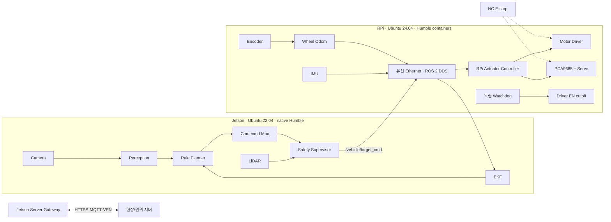
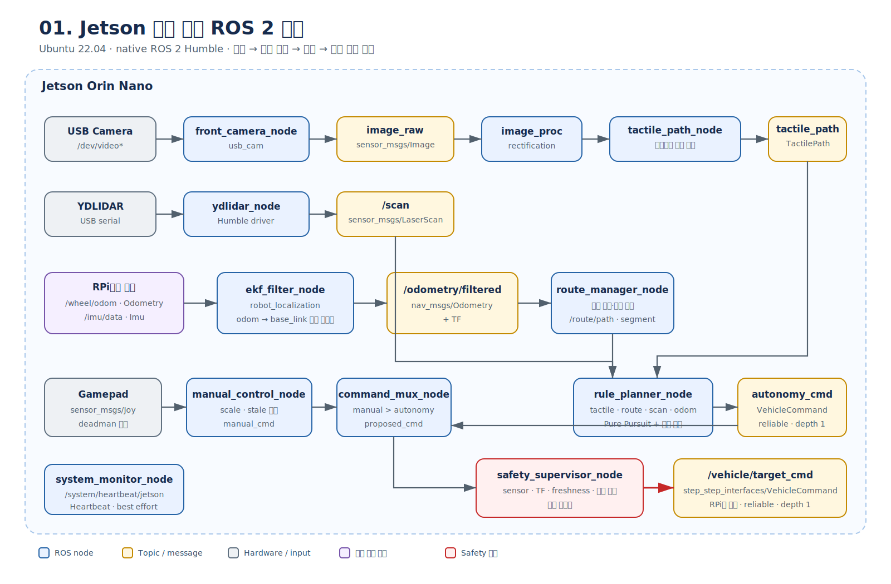
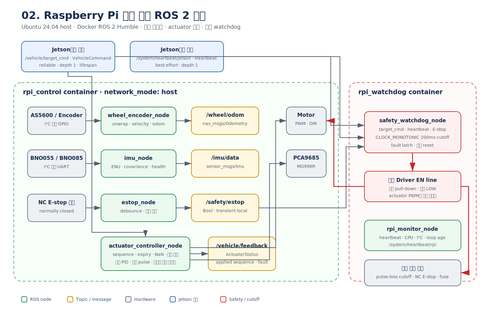
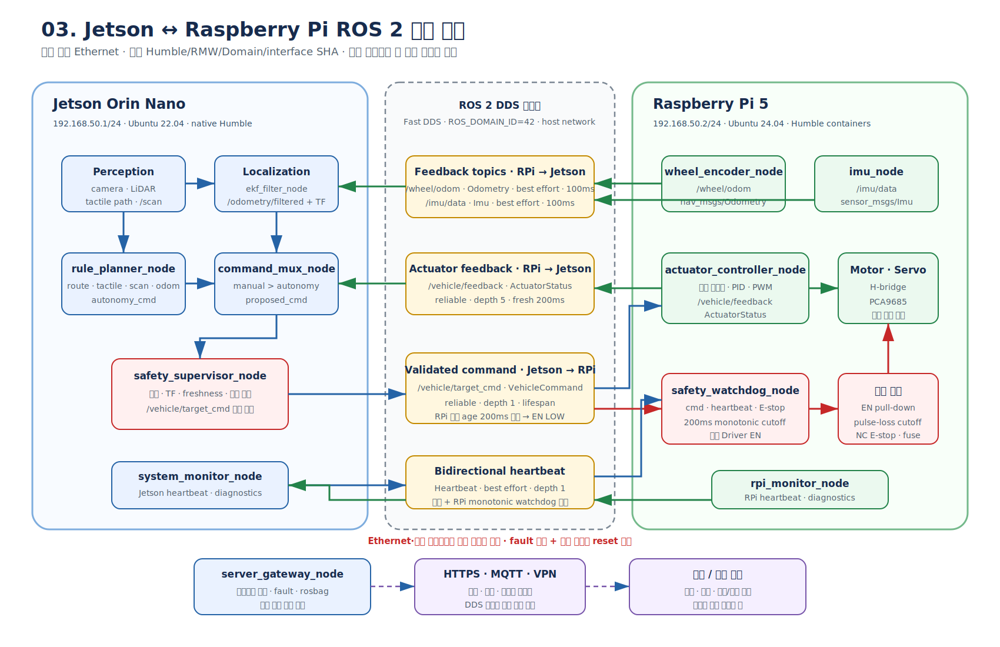
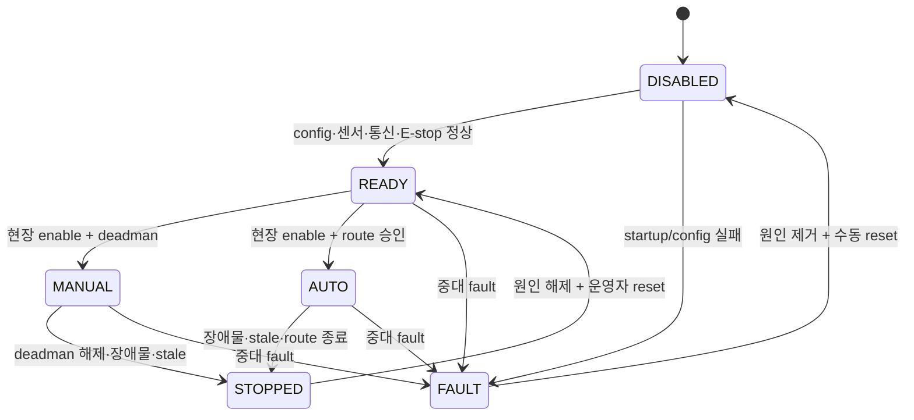

# 09. 최종 HW·ROS·제어 통합설계

> 대상: Jetson Orin Nano + Raspberry Pi 5 기반 Ackermann 조향 차량
> 기준일: 2026-07-20
> 문서 상태: 구현·배선·배포·시험의 최종 기준안
> 상세 알고리즘·메시지·예제 코드: [08. 룰베이스 ROS 2 제어 통합 구현설계](./08_룰베이스_ROS2_제어_통합구현설계.md)

---

## 0. 이 문서의 사용법

이 문서는 “무엇을 검토할까?”가 아니라 “무엇을 그대로 구현할까?”를 정한다. HW 담당자는 전원·배선·핀 소유권을, ROS 담당자는 노드·Topic·TF·QoS를, 제어 담당자는 상태 전이·제한·시험 Gate를 이 문서에서 확인한다.

문서 간 충돌 시 우선순위는 다음과 같다.

1. 실제 부품 datasheet와 측정 결과
2. 이 문서의 안전·인터페이스 계약
3. [08. 룰베이스 ROS 2 제어 통합 구현설계](./08_룰베이스_ROS2_제어_통합구현설계.md)의 구현 상세
4. 그 밖의 기획·참고 문서

`TBD`는 임의값을 넣으라는 뜻이 아니다. 해당 값을 실측·확정해 배포 config에 기록하기 전까지 관련 출력은 `DISABLED`여야 한다.

---

## 1. 최종 결정 요약

### 1.1 한 줄 설계

> **Jetson은 보고 판단하고, Raspberry Pi는 실행하고 즉시 멈추며, 서버는 기록하고 지원할 뿐 주행 폐루프에는 들어오지 않는다.**

| 영역 | 최종 결정 |
|---|---|
| Jetson OS | Ubuntu 22.04, 현재 JetPack 호환 버전 고정 |
| Jetson ROS | native ROS 2 Humble 유지 |
| RPi OS | 현재 Ubuntu 24.04 Desktop 유지; 새 설치 시 GUI가 불필요하면 Server 24.04 가능 |
| RPi ROS | Jammy ARM64 기반 ROS 2 Humble container |
| ROS 배포판 | 모든 주행 노드 Humble 통일; Humble–Jazzy 혼용 금지 |
| Container 범위 | RPi control과 watchdog 분리; Jetson은 현재 native |
| Board network | 전용 유선 Ethernet `192.168.50.0/24` |
| ROS middleware | Fast DDS로 시작, 전 장치 동일 RMW |
| 서버 연결 | 현장 관측은 제한된 DDS 가능, 원격은 HTTPS·MQTT·VPN gateway |
| 상위 제어 | Jetson의 인지·EKF·경로·Planner·Safety |
| 하위 제어 | RPi의 encoder·IMU·PID·PWM·watchdog |
| 최종 명령 | `/vehicle/target_cmd` 하나 |
| 안전 기본값 | 무명령·오류·부팅·재시작 시 구동 불가 |
| E-stop | ROS·OS·Docker와 무관한 물리 구동 전원 차단 |

### 1.2 하지 않는 것

- RPi Ubuntu 24.04 host에 native Humble을 억지로 설치하지 않는다.
- RPi만 Jazzy로 설치해 Jetson Humble과 혼용하지 않는다.
- Docker 기본 bridge network를 실차 DDS 기준안으로 사용하지 않는다.
- `/cmd_vel`, 테스트 PWM 스크립트, Nav2가 모터를 직접 제어하지 않는다.
- 서버 응답, Wi-Fi, 클라우드 추론에 주행 안전을 의존하지 않는다.
- container restart를 watchdog이나 안전장치로 계산하지 않는다.
- Motor Driver IC·핀·정격을 확인하기 전에 모터 enable을 허용하지 않는다.

---

## 2. 시스템 경계와 책임



### 2.1 Jetson 책임

- 카메라·LiDAR·GNSS driver와 calibration
- 점자블록 인지, route 관리, `robot_localization` EKF
- 수동·자동 명령 선택, 장애물·센서 신선도·TF 상위 안전 검사
- 승인된 `/vehicle/target_cmd`와 Jetson heartbeat 발행
- rosbag, diagnostics, 서버 gateway

Jetson은 Motor Driver GPIO와 PCA9685를 직접 만지지 않는다.

### 2.2 Raspberry Pi 책임

- encoder·IMU·선택 거리센서 수집
- 속도 PID와 조향 pulse 출력
- sequence·유효시간·범위·NaN 검사
- Jetson heartbeat와 target command의 monotonic timeout 감시
- E-stop 입력, Driver `EN`, 하위 fault latch

RPi는 경로를 계획하거나 서버 응답을 기다리지 않는다.

### 2.3 서버 책임

- 상태·fault·저율 telemetry 수집
- rosbag·학습 데이터·이벤트 업로드
- 서명된 모델·설정 배포와 버전 관리

서버는 실시간 속도·조향 폐루프에 참여하지 않으며 `/vehicle/target_cmd` 발행 권한을 갖지 않는다.

### 2.4 ROS 2 관계도

노드·Topic·message의 상세 흐름은 다음 세 관점으로 나눠 확인한다. 그림의 이름은 실제 구현 계약과 동일하게 유지한다.

#### Jetson 보드 내부



#### Raspberry Pi 보드 내부



#### Jetson–Raspberry Pi 연동



---

## 3. 하드웨어 최종 구조

### 3.1 연결표

| 장치 | 연결 위치 | 인터페이스 | 전원 | 소프트웨어 소유자 |
|---|---|---|---|---|
| USB 전방 카메라 | Jetson | USB/V4L2 | Jetson USB 예산 확인 | `front_camera_node` |
| YDLIDAR | Jetson | USB serial | 정격에 맞는 USB | `ydlidar_node` |
| GNSS(선택) | Jetson | USB/UART | 정격 전원 | `gnss_node` |
| BNO055 또는 BNO085 | RPi | I²C/UART | 3.3V 논리 확인 | `imu_node` |
| AS5600/encoder | RPi | I²C/GPIO | 3.3V 논리 확인 | `wheel_encoder_node` |
| Motor Driver/H-bridge | RPi | PWM·DIR·EN | 별도 모터 전원 | `actuator_controller_node` + watchdog EN |
| PCA9685 | RPi | I²C | logic와 servo V+ 분리 | `actuator_controller_node` |
| MG996R | PCA9685 | PWM | 별도 servo V+ | `actuator_controller_node` |
| NC E-stop | 구동 전원 경로 | hard-wired | normally closed | 소프트웨어 비의존 |

### 3.2 구현 전 반드시 확정할 값

| ID | 미확정값 | 증거 | 확정 전 상태 |
|---|---|---|---|
| HW-01 | Motor Driver IC, pin map, PWM·DIR·brake 논리 | 실물 마킹 + datasheet + continuity | motor `DISABLED` |
| HW-02 | 정격·기동·stall current, fuse | motor/driver datasheet + bench 측정 | 구동 전원 차단 |
| HW-03 | GA25-370 전압·기어비·encoder PPR | 라벨 + 1회전 측정 | odom 사용 금지 |
| HW-04 | PCA9685 I²C 주소 | `i2cdetect` + board jumper | servo output 금지 |
| HW-05 | MG996R center/min/max pulse와 실제 조향각 | 바퀴를 띄운 jig 측정 | center pulse만 시험 |
| HW-06 | wheelbase·wheel radius·최대 조향각 | 캘리퍼·줄자 실측 | planner enable 금지 |
| HW-07 | IMU 정확한 모델·축 방향·주소 | 실물 + stationary test | EKF 사용 금지 |
| HW-08 | `/dev/gpiochipN`과 line offset | `gpioinfo` + 배선표 | GPIO claim 금지 |

### 3.3 전원·배선 계약

- Jetson·RPi GPIO에서 모터 또는 서보 전원을 공급하지 않는다.
- 컴퓨팅, motor, servo 전원 레일을 분리한다.
- PCA9685 logic 전원과 MG996R `V+`를 분리한다.
- GND는 검증한 한 점에서 공통 연결하고 ground loop와 전압 강하를 측정한다.
- motor 전원에는 계산된 fuse와 역기전력·노이즈 대책을 둔다.
- Driver `EN`에는 외부 pull-down을 둬 RPi 부팅·high-Z·프로세스 죽음 시 OFF가 되게 한다.
- NC E-stop은 motor와 servo 구동 전원을 물리적으로 차단하되 컴퓨터 전원은 유지해 로그를 보존한다.
- 소프트웨어 heartbeat와 별개로 pulse가 끊기면 EN을 차단하는 외부 monostable 또는 안전 MCU를 권장한다.

---

## 4. OS·Container·배포 설계

### 4.1 실행 배치

| Host | 실행 단위 | 시작 주체 | 장치 접근 |
|---|---|---|---|
| Jetson | `jetson_bringup.launch.py` native | Jetson `systemd` | `/dev/video*`, LiDAR/GNSS serial, GPU |
| RPi | `rpi_control` container | RPi `systemd` + Docker Compose | I²C, encoder, actuator GPIO |
| RPi | `rpi_watchdog` container | RPi `systemd` + Docker Compose | 별도 safety GPIO line |
| 개발 PC | `replay.launch.py` | 사용자/CI | actuator·watchdog 없음 |

RPi의 두 container는 Linux `network_mode: host`를 사용한다. `--privileged`는 금지하고 확인된 `/dev/i2c-*`, `/dev/gpiochip*`, `/dev/serial/by-id/*`와 필요한 group만 전달한다. 같은 GPIO line을 두 프로세스가 claim하면 시작에 실패해야 한다.

### 4.2 재현 가능한 배포 단위

한 배포 manifest에 다음을 기록한다.

```yaml
release_id: TBD
git_sha: TBD
interfaces_sha: TBD
jetpack_version: TBD
jetson_ubuntu: 22.04
rpi_ubuntu: 24.04
rpi_kernel: TBD
ros_distro: humble
rmw: rmw_fastrtps_cpp
ros_domain_id: 42
rpi_control_image_digest: TBD
rpi_watchdog_image_digest: TBD
config_sha256: TBD
firmware_versions: {}
```

- ROS binary package version, source package commit SHA, `rosdep` 결과를 고정한다.
- Python 하드웨어 의존성은 exact version과 hash를 lock file에 기록한다.
- 운영 container에는 source bind mount와 개발 도구를 넣지 않는다.
- config는 read-only mount하고 변경은 Git review와 HIL을 거친다.
- `restart: unless-stopped`는 복구 편의일 뿐 drive enable을 복원하지 않는다.

---

## 5. Network·DDS·시간·서버 설계

### 5.1 제어망

| 장치 | 주소 | 비고 |
|---|---|---|
| Jetson | `192.168.50.1/24` | `chrony` server |
| RPi | `192.168.50.2/24` | `chrony` client |
| 현장 서버(선택) | `192.168.50.10/24` | read-only 관측 |

```bash
export ROS_DOMAIN_ID=42
export ROS_LOCALHOST_ONLY=0
export RMW_IMPLEMENTATION=rmw_fastrtps_cpp
```

두 보드는 같은 Humble, RMW, Domain ID, interface commit/type hash를 사용한다. DDS vendor 설정에서 전용 Ethernet NIC만 allowlist한다. Wi-Fi는 원격 관리용 보조망일 수 있지만 safety command 경로로 사용하지 않는다.

검증 순서는 `ping → ros2 multicast → demo talker/listener → 실제 topic → 전체 부하`다. image는 Jetson 내부에 유지해 command·heartbeat가 큰 UDP sample에 밀리지 않게 한다.

### 5.2 시간

- cross-board 메시지 stamp 비교는 `chrony` 정상 상태에서만 사용한다.
- RPi의 command·heartbeat 200ms cutoff는 `CLOCK_MONOTONIC` 수신 age로 판단한다.
- 시간 동기화가 기준 밖이면 drive enable을 거부하고 diagnostics만 허용한다.

### 5.3 서버 연결

현장 서버가 ROS 데이터를 받아야 하면 동일 Humble container와 제한된 네트워크 ACL을 사용한다. 원격 서버에는 DDS를 직접 노출하지 않는다. Jetson `server_gateway_node`가 상태·fault·파일만 HTTPS·MQTT로 전달하며 필요하면 VPN을 사용한다.

원격 설정이나 모델은 다운로드 후 해시·서명을 검증하고 차량이 `DISABLED`일 때만 적용한다. 서버 장애·지연·재시작은 차량 제어 결과를 바꾸지 않아야 한다.

---

## 6. ROS package와 node 설계

```text
step_step_ws/src/
├─ step_step_interfaces/       # 양쪽 같은 commit
├─ step_step_description/      # URDF, dimensions
├─ step_step_perception/       # tactile path
├─ step_step_navigation/       # route, EKF config, planner, mux, safety
├─ step_step_hardware_rpi/     # encoder, IMU, actuator, watchdog
├─ step_step_server_gateway/   # 비실시간 업로드·다운로드
└─ step_step_bringup/
   ├─ launch/{jetson_bringup,rpi_control_bringup,rpi_watchdog_bringup,replay}.launch.py
   └─ config/{common,jetson/*,rpi/*,qos_overrides}.yaml
```

### 6.1 Jetson nodes

| Node | 핵심 입력 | 핵심 출력 | 주기·책임 |
|---|---|---|---|
| `front_camera_node` | V4L2 | image, camera_info | 20~30Hz |
| `ydlidar_node` | USB serial | `/scan` | driver native |
| `tactile_path_node` | rectified image | `/perception/tactile_path` | 15~20Hz |
| `ekf_filter_node` | odom, IMU | `/odometry/filtered`, TF | 30~50Hz |
| `route_manager_node` | route, pose | path, segment | 앞쪽 목표 선택 |
| `rule_planner_node` | tactile, route, scan, odom | autonomy command | 20~50Hz |
| `manual_control_node` | `joy` | manual command | deadman 포함 |
| `command_mux_node` | manual, autonomy | proposed command | manual 우선 |
| `safety_supervisor_node` | proposed cmd + 모든 health | `/vehicle/target_cmd` | 최종 승인자 |
| `system_monitor_node` | diagnostics | Jetson heartbeat | 10~20Hz |
| `server_gateway_node` | 허용 상태·파일 | HTTPS·MQTT | 비실시간 |

### 6.2 RPi nodes

| Node | 입력 | 출력 | 단일 책임 |
|---|---|---|---|
| `wheel_encoder_node` | encoder | ticks, `/wheel/odom` | unwrap·속도·odom |
| `imu_node` | BNO sensor | `/imu/data` | ENU·covariance·health |
| `estop_node` | NC contact | `/safety/estop` | 입력 상태 보고 |
| `actuator_controller_node` | `/vehicle/target_cmd` | PWM·DIR·steering, feedback | 유일한 actuator API 소유자 |
| `safety_watchdog_node` | command, heartbeat, E-stop | 별도 EN, RPi safety state | monotonic cutoff |
| `rpi_monitor_node` | CPU·I²C·loop | RPi heartbeat, diagnostics | 상태 보고 |

---

## 7. ROS 인터페이스 계약

### 7.1 핵심 Topic·QoS

| Topic | Type | Publisher → Subscriber | QoS | Fresh 기준 |
|---|---|---|---|---:|
| `/scan` | `sensor_msgs/LaserScan` | LiDAR → Planner/Safety | best effort, depth 5 | 200ms |
| `/imu/data` | `sensor_msgs/Imu` | RPi → EKF/Safety | best effort, depth 5 | 100ms |
| `/wheel/odom` | `nav_msgs/Odometry` | RPi → EKF/Safety | best effort, depth 5 | 100ms |
| `/odometry/filtered` | `nav_msgs/Odometry` | EKF → Planner | reliable, depth 5 | 100ms |
| `/control/autonomy_cmd` | `VehicleCommand` | Planner → Mux | reliable, depth 1 | 150ms |
| `/control/manual_cmd` | `VehicleCommand` | Manual → Mux | reliable, depth 1 | 150ms |
| `/control/proposed_cmd` | `VehicleCommand` | Mux → Safety | reliable, depth 1 | 150ms |
| `/vehicle/target_cmd` | `VehicleCommand` | Safety → RPi | reliable, depth 1, lifespan | 200ms cutoff |
| `/vehicle/feedback` | `ActuatorStatus` | RPi → Safety | reliable, depth 5 | 200ms |
| `/safety/state` | `SafetyState` | Safety → 전체 | reliable, transient local | event |
| `/safety/estop` | `std_msgs/Bool` | RPi → 전체 | reliable, transient local | event |
| `/system/heartbeat/*` | `Heartbeat` | 각 board → 상대 | best effort, depth 1 | 200ms |

QoS 연결 여부는 추측하지 않고 `ros2 topic info -v`로 확인한다. 센서의 오래된 sample 재전송보다 최신값을 우선하며, 안전 상태는 늦게 시작한 구독자도 마지막 값을 받아야 한다.

### 7.2 `VehicleCommand` 필수 의미

| Field | 의미·규칙 |
|---|---|
| `header.stamp` | 생성 시각; 동기화 진단에 사용 |
| `sequence` | RPi가 역행·중복을 거부 |
| `speed_mps` | 유한값, 설정된 정·역방향 한계 내 |
| `steering_angle_rad` | 유한값, 기계적 한계 내 |
| `enable` | `false`가 기본값 |
| `mode` | MANUAL/AUTO/FAILSAFE 등 정의된 enum만 허용 |
| `valid_for` | `builtin_interfaces/Duration`; 만료 명령 거부 |

`ActuatorStatus`에는 applied sequence, 실제/추정 속도, 조향값, enable, fault code, loop age를 포함한다. `SafetyState`에는 상태 enum, latched 여부, stop reason bitmask, stale input 목록을 포함한다. 정확한 IDL은 08 문서를 기준으로 양쪽에서 같은 commit을 빌드한다.

### 7.3 TF 소유권

```text
map --(map_odom_alignment_node)--> odom
odom --(ekf_filter_node only)----> base_link
base_link --(robot_state_publisher static)--> imu_link
base_link --(robot_state_publisher static)--> front_laser_link
base_link --(robot_state_publisher static)--> front_camera_link
```

`wheel_encoder_node`는 `/wheel/odom`을 발행하지만 `odom → base_link` TF를 발행하지 않는다. 각 TF edge의 broadcaster는 하나뿐이어야 한다.

---

## 8. 제어와 상태 전이

### 8.1 명령 경로

```text
autonomy_cmd ---+
                +--> command_mux --> proposed_cmd --> safety_supervisor
manual_cmd -----+                                      |
                                                       v
                                              /vehicle/target_cmd
                                                       |
                                                       v
                                              RPi actuator controller
```

우선순위는 `E-stop/fault > manual deadman > autonomy > disabled`다. 어떤 입력도 Safety Supervisor를 우회하지 않는다.

### 8.2 상태



전원 인가, node/container 재시작, Ethernet 복구만으로 MANUAL/AUTO에 들어갈 수 없다.

### 8.3 룰베이스 제어 기준

- 점자블록 신뢰도가 높으면 tactile path를 우선한다.
- 신뢰도가 낮으면 등록 route 비중을 높이고 감속한다.
- Pure Pursuit lookahead, 최대 조향각, 가속도 제한은 실측 config만 사용한다.
- LiDAR emergency distance 침범, stale scan, TF 오류에서는 즉시 0 명령과 fault를 만든다.
- GNSS는 이벤트 좌표·전역 정렬 보조이며 단독 횡방향 제어에 사용하지 않는다.
- 서버 데이터와 AI 출력은 검증 전 모터 명령으로 직접 변환하지 않는다.

---

## 9. Safety 설계

### 9.1 방어 계층

| 계층 | 위치 | 역할 | 실패 시 다음 방어 |
|---|---|---|---|
| 1 | Jetson Safety Supervisor | 센서·TF·경로·명령 상위 검증 | RPi timeout |
| 2 | RPi actuator 검증 | sequence·expiry·range·NaN·slew 검사 | watchdog EN |
| 3 | RPi watchdog | command·heartbeat 200ms monotonic cutoff | 외부 회로 |
| 4 | 외부 pull-down/monostable/안전 MCU | 소프트웨어·Docker·host failure 차단 | E-stop |
| 5 | NC E-stop·fuse | 물리 구동 전원 차단 | 사람의 회수 |

### 9.2 Fault 반응표

| Fault | Jetson 반응 | RPi 반응 | 재시작 조건 |
|---|---|---|---|
| target command >200ms | 0 명령 시도 | EN LOW, latch | 운영자 reset |
| Jetson heartbeat >200ms | 해당 없음 | EN LOW, latch | 운영자 reset |
| scan >200ms | 즉시 0, fault | command timeout 방어 | sensor 정상 + reset |
| odom/IMU >100ms | 0, fault | 상태 보고/필요 시 EN LOW | 정상 + reset |
| Ethernet 단절 | 0 발행 불가 | 200ms 내 EN LOW | 연결 + reset |
| control container 죽음 | heartbeat/fb stale | watchdog가 EN LOW | container 정상 + reset |
| watchdog container 죽음 | diagnostics fault | 외부 pulse-loss 회로 차단 | 원인 제거 + reset |
| Docker daemon/host 죽음 | heartbeat stale | 외부 회로 차단 | host 복구 + 점검 |
| E-stop | fault 기록 | 즉시 구동 차단 | 물리 해제 + reset |
| NaN·범위 초과·sequence 역행 | Safety에서 거부 | 재검사 후 거부·EN LOW | 정상 명령 + reset 정책 |

모든 timeout 수치는 초기 기준이다. 센서 주기와 전체 p99 지연을 측정한 뒤 더 느슨하게 바꿀 수 있지만, 변경 근거와 fault-injection 결과를 ADR 또는 시험 기록에 남긴다.

---

## 10. 오픈소스·구현 선택

| 기능 | 채택 | 우리 추가 작업 |
|---|---|---|
| Camera | `usb_cam` | YAML, remap, calibration, diagnostics |
| Rectify | `image_proc` | CPU baseline; 병목일 때만 Isaac ROS 비교 |
| LiDAR | YDLIDAR Humble driver | commit·SDK·udev·모델 config 고정 |
| EKF | `robot_localization` | 축, covariance, TF ownership |
| Manual | `joy` | deadman adapter와 `VehicleCommand` 변환 |
| GPIO | `libgpiod` | Pi 5 gpiochip/line 확인, fault 처리 |
| Servo | Adafruit PCA9685 | ROS wrapper, pulse calibration, clamp |
| IMU | BNO055/BNO08x 중 실물 하나 | ENU, covariance, health wrapper |
| Encoder | AS5600 register access | unwrap, direction, velocity, odom |
| Planner | custom rule planner | RPP 수식 참고, 우리 safety 계약 유지 |
| DDS | Fast DDS | NIC allowlist, QoS, 부하 시험 |

`ros2_control`, Cyclone DDS, Isaac ROS, Nav2 RPP 전체 도입은 측정된 문제가 생겼을 때만 A/B한다. `pigpio`, `rmw_zenoh`, F1TENTH·Linorobot2·Autoware 전체 이식은 현재 설계에서 제외한다.

---

## 11. Bring-up과 운영 절차

### 11.1 시작

1. 차량을 띄우고 E-stop을 누른다.
2. 전원·fuse·배선·EN LOW를 확인한다.
3. RPi host와 control/watchdog container를 시작한다.
4. GPIO line 소유권, sensor topic, watchdog 출력 LOW를 확인한다.
5. Jetson native bring-up을 시작한다.
6. node·Topic·TF·QoS·chrony·heartbeat를 확인한다.
7. 바퀴를 띄운 채 manual 저출력 시험을 한다.
8. Safety `READY` 확인 후 E-stop을 해제한다.
9. 운영자가 `SetDriveEnabled`를 요청한다.
10. 0.1m/s 통제 코스에서 시작한다.

### 11.2 종료

1. mode를 `DISABLED`, target speed를 0으로 만든다.
2. feedback 0과 Driver EN LOW를 확인한다.
3. E-stop을 누른다.
4. bag과 diagnostics를 flush한다.
5. Jetson nodes, RPi containers 순으로 종료한다.
6. 구동 전원 후 컴퓨팅 전원을 차단한다.

### 11.3 운영 확인 명령

```bash
ros2 node list
ros2 topic info -v /vehicle/target_cmd
ros2 topic hz /wheel/odom
ros2 topic hz /imu/data
ros2 topic hz /system/heartbeat/jetson
ros2 run tf2_tools view_frames
ros2 doctor --report
chronyc tracking
```

---

## 12. 검증 Gate와 인수 기준

| Gate | 시험 | 합격 조건 |
|---:|---|---|
| 0 | 부품·전원·핀 확정 | HW-01~08 증거와 배선도 승인 |
| 1 | 읽기 전용 sensor bring-up | 각 topic 30분, I²C/USB 끊김 0 |
| 2 | 바퀴를 띄운 RPi 제어 | 방향·center·limit 정상, E-stop 10/10 |
| 3 | watchdog/fault injection | 모든 software/통신 고장 시 200ms 내 EN LOW |
| 4 | Jetson–RPi DDS 통합 | 50Hz command, heartbeat, QoS·type 일치 |
| 5 | EKF·TF | broadcaster 중복 0, 5m 직선 오차 10% 이내 1차 목표 |
| 6 | 수동·룰 주행 | 0.1m/s 직선·좌우 곡선·정지 성공 |
| 7 | 장애물·단절·재합류 | 충돌 0, 자동 재출발 0 |
| 8 | 장기·회귀 | 30분 열·부하 통과, 동일 bag 결과 재현 |

### 필수 고장 주입

- Ethernet cable 제거·복구
- Jetson planner·Safety process kill
- RPi control container kill
- RPi watchdog container kill
- Docker daemon과 RPi host 종료
- sensor USB/I²C 제거, stale message, TF 제거
- sequence 역행, NaN, Inf, expiry, QoS mismatch
- E-stop 10회와 전원 brownout 모사

### 기록 지표

- control loop p50/p95/p99
- sensing-to-command latency p99
- 실제 watchdog cutoff 시간
- command loss·reject·stop reason
- 직선 거리·횡오차·heading error
- 최소 obstacle clearance
- CPU·RAM·온도·전압·I²C/USB error
- container·Git·config·firmware 버전

---

## 13. 구현 완료 체크리스트

### HW

- [ ] HW-01~08이 실측값과 증거로 채워졌다.
- [ ] motor·servo·computer 전원과 fuse가 확정됐다.
- [ ] Driver EN pull-down과 외부 pulse-loss cutoff를 측정했다.
- [ ] E-stop이 ROS·Docker·OS와 무관하게 구동 전원을 끊는다.

### OS·배포

- [ ] Jetson native Humble와 RPi Humble container를 사용한다.
- [ ] image digest·package version·commit·config hash가 manifest에 있다.
- [ ] `--privileged` 없이 필요한 장치만 전달한다.
- [ ] control/watchdog의 GPIO line 소유권이 분리됐다.

### ROS·Network

- [ ] distribution·RMW·Domain·interface SHA/type hash가 양쪽에서 같다.
- [ ] 고정 IP·NIC allowlist·chrony가 적용됐다.
- [ ] Topic publisher 소유권, QoS, TF broadcaster가 각각 하나다.
- [ ] 원격 서버에 DDS가 직접 노출되지 않는다.

### 제어·안전

- [ ] 모든 motor command가 Mux→Safety→target_cmd→Actuator를 통과한다.
- [ ] sequence·expiry·NaN·범위·slew를 Jetson과 RPi가 이중 검사한다.
- [ ] fault와 재시작 뒤 운영자 승인 없이 움직이지 않는다.
- [ ] 모든 Gate와 고장 주입 결과가 rosbag·diagnostics·시험표로 남았다.

---

## 14. 공식 근거와 관련 문서

- [ROS 2 배포판과 cross-distribution 통신 정책](https://docs.ros.org/en/humble/Releases.html)
- [ROS 2 Humble on Raspberry Pi](https://docs.ros.org/en/humble/How-To-Guides/Installing-on-Raspberry-Pi.html)
- [ROS 2 Humble target platforms](https://www.ros.org/reps/rep-2000.html)
- [Docker host network driver](https://docs.docker.com/engine/network/drivers/host/)
- [ROS 2 Humble QoS](https://docs.ros.org/en/humble/Concepts/Intermediate/About-Quality-of-Service-Settings.html)
- [ROS 2 multicast test](https://docs.ros.org/en/ros2_packages/humble/api/ros2multicast/)
- [ROS 2 DDS tuning](https://docs.ros.org/en/humble/How-To-Guides/DDS-tuning.html)
- [Raspberry Pi GPIO current best practices](https://pip-assets.raspberrypi.com/categories/685/app-notes-guides-whitepapers/documents/RP-006553-WP/A-history-of-GPIO-usage-on-Raspberry-Pi-devices-and-current-best-practices)
- [08. 룰베이스 ROS 2 제어 통합 구현설계](./08_룰베이스_ROS2_제어_통합구현설계.md)
- [10. 규칙 기반 차량 완성 및 데이터 수집](./10_규칙기반_차량완성_및_데이터수집.md)

⬅️ [08. 룰베이스 ROS 2 제어 통합 구현설계](./08_룰베이스_ROS2_제어_통합구현설계.md) · ➡️ [10. 규칙 기반 차량 완성 및 데이터 수집](./10_규칙기반_차량완성_및_데이터수집.md)
