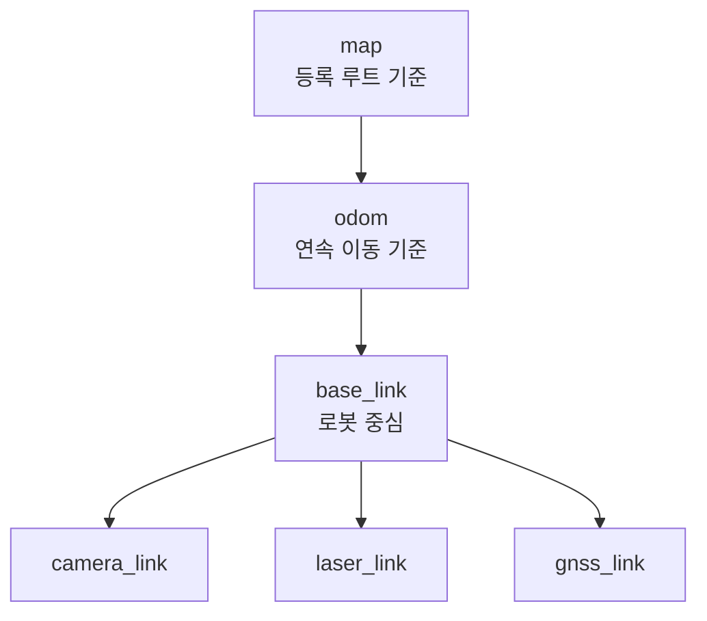

# 10. 규칙 기반 차량 완성 및 데이터 수집

> ⏱️ 예상 읽기 시간: 10분
> 🎯 목표: AI 없이도 안전하게 반복 주행하고, 다시 재생할 수 있는 ROS bag을 만든다.

## 이 단계가 먼저인 이유


차량이 흔들리거나 센서 시간이 맞지 않으면 AI는 잘못된 행동을 정답으로 배운다. 이 단계의 성공 기준은 “AI를 실행했다”가 아니라 **같은 코스를 안전하게 반복하고 기록을 재현했다**는 것이다.

## 완료 모습

| 영역 | 완료 결과 |
|---|---|
| 🛡️ 안전 | E-stop·watchdog·속도 제한·LiDAR 정지가 AI와 독립적으로 동작 |
| 📡 센서 | 카메라·LiDAR·IMU·엔코더·GNSS 값과 timestamp가 정상 |
| 📍 좌표 | `map → odom → base_link → sensor` 관계를 설명 가능 |
| 🚗 주행 | 수동 주행과 규칙 기반 반복 순찰 가능 |
| 💾 기록 | 명령·실제 반응·개입을 포함한 ROS bag 재생 가능 |

## 0. 시작 전 안전장치부터 확인한다

> ⛔ 아래 항목이 준비되지 않으면 구동 시험을 시작하지 않는다.

- [ ] 물리 E-stop이 모터 출력을 실제로 차단한다.
- [ ] Jetson heartbeat가 끊기면 Raspberry Pi가 출력을 0으로 만든다.
- [ ] 최대 속도와 최대 조향각 제한이 적용된다.
- [ ] LiDAR 긴급정지가 주행 Planner와 독립적으로 동작한다.
- [ ] 사람이 즉시 수동 제어를 가져올 수 있다.
- [ ] 시험 구역을 통제하고 안전 요원을 배치한다.

## 1. 센서 Topic을 확인한다

아래 이름은 **설계 예시**다. 실제 장비에서 확인한 이름과 message type을 별도 표로 확정한다.

| 데이터 | Topic 예시 | 확인할 내용 |
|---|---|---|
| 전방 카메라 | `/sensors/front/image_raw` | 영상, 해상도, frame rate |
| LiDAR | `/scan` | 거리 범위, `frame_id` |
| IMU | `/imu/data` | yaw·각속도 방향 |
| 휠 오도메트리 | `/wheel/odom` | 거리·속도 부호 |
| 융합 오도메트리 | `/odometry/filtered` | pose 연속성 |
| 안전 정지 | `/safety/stop_reason` | 정지 원인 기록 |
| 차량 명령 | `/vehicle/target_cmd` | 목표 속도·조향 |
| 차량 피드백 | `/vehicle/feedback` | 실제 속도·조향 |

```bash
ros2 topic list
ros2 topic hz /sensors/front/image_raw
ros2 topic hz /scan
ros2 topic hz /imu/data
ros2 topic hz /wheel/odom
```

숫자가 한 번 출력되는지만 보지 말고 최소 5분 동안 끊김과 주기 변화를 관찰한다.

## 2. 시간과 좌표계를 확인한다



```bash
ros2 topic echo /wheel/odom --once
ros2 topic echo /imu/data --once
ros2 run tf2_tools view_frames
```

확인 질문:

- timestamp가 0이 아니며 앞으로 증가하는가?
- 정지 상태에서 속도가 거의 0인가?
- 전진·좌회전·우회전 때 좌표와 yaw 부호가 일관적인가?
- 센서의 실제 장착 위치와 TF가 맞는가?
- 카메라 위치·각도·intrinsic·extrinsic 버전이 기록되는가?

## 3. 짧은 구동 시험부터 한다


처음부터 긴 코스를 달리지 않는다. 각 동작에서 명령과 실제 반응이 맞는지 확인한 뒤 점자블록 추종과 등록 루트 반복 주행으로 범위를 넓힌다.

## 4. 규칙 기반 주행 Baseline을 만든다

| 상황 | 기본 행동 |
|---|---|
| 점자블록 신뢰도 높음 | 설정된 오프셋을 유지하며 추종 |
| 점자블록 가림·단절 | 등록 루트와 오도메트리 비중 증가 |
| 장애물 가까움 | 감속 또는 정지 |
| 안전한 우회 공간 있음 | 제한된 방향으로 우회 후 앞쪽 루트 재합류 |
| 위치·센서 불확실 | 감속 후 정지·수동 복구 |

이 Baseline은 이후 AI의 성능 비교 기준이자 정상 궤적을 제공하는 teacher가 된다.

## 5. 첫 ROS Bag을 기록한다

> ℹ️ 아래는 Jetson Ubuntu의 Bash 예시다. 존재하는 topic만 사용하고 실제 이름에 맞게 수정한다.

```bash
mkdir -p data/rosbags

ros2 bag record \
  -o data/rosbags/SITE_A_ROUTE_01_20260719_153000_MANUAL \
  /sensors/front/image_raw \
  /sensors/front/camera_info \
  /scan \
  /imu/data \
  /wheel/odom \
  /wheel/ticks \
  /odometry/filtered \
  /perception/tactile_path \
  /route/path \
  /route/segment \
  /control/autonomy_cmd \
  /control/proposed_cmd \
  /vehicle/target_cmd \
  /vehicle/feedback \
  /safety/state \
  /safety/estop \
  /safety/stop_reason \
  /system/heartbeat/jetson \
  /system/heartbeat/rpi \
  /tf \
  /tf_static
```

### 이름 규칙

```text
{장소}_{경로}_{날짜시간}_{제어방식}

SITE_A_ROUTE_01_20260719_153000_MANUAL
SITE_A_ROUTE_01_20260719_160000_RULE
```

`test1`, `final`, `진짜최종`처럼 나중에 의미를 알 수 없는 이름은 사용하지 않는다.

## 6. 기록 직후 반드시 재생한다

```bash
ros2 bag info data/rosbags/SITE_A_ROUTE_01_20260719_153000_MANUAL
ros2 bag play data/rosbags/SITE_A_ROUTE_01_20260719_153000_MANUAL
```

RViz 또는 viewer에서 다음을 확인한다.

- 영상과 LiDAR가 재생된다.
- odometry 경로가 순간이동하지 않는다.
- 정지 이벤트와 실제 정지 시각이 맞는다.
- 카메라만 많고 IMU·엔코더 메시지가 비어 있지 않다.
- 목표 명령과 실제 차량 반응이 함께 기록된다.

## 데이터 품질 Gate

> 아래 수치는 프로젝트 계획을 위한 **공학적 추정치**이며 실제 센서 주기에 맞춰 확정한다.

| 검사 | Go 기준 | No-Go 예시 |
|---|---|---|
| 짧은 episode | 10회 이상 모두 재생 | 일부 bag 손상·재생 실패 |
| 시간 정렬 | RGB 기준 95% 이상이 최근 센서와 ±50ms 이내 | timestamp 역행·clock 불일치 |
| 핵심 topic 누락 | 누락률 1% 이하, 누락 mask 저장 | 누락값을 정상 0처럼 처리 |
| Odometry | 정지·직선·회전 시험 통과 | pose jump·좌표계 불명 |
| Action | 목표 명령과 실제 반응 모두 기록 | PWM 명령만 존재 |
| Metadata | route·site·date·weather·제어 주체 100% 기록 | 파일명만으로 회차 구분 불가 |

## 문제 발생 시 어디부터 볼까?

| 증상 | 먼저 확인할 것 |
|---|---|
| Topic이 없음 | 전원·배선·driver·launch 파일 |
| 센서 주기가 불안정 | USB 대역폭·CPU 부하·QoS |
| 경로가 순간이동 | timestamp·TF·엔코더 부호·IMU 축 |
| 조향이 반대로 움직임 | 좌표계와 steering 부호 |
| Bag 용량이 지나치게 큼 | 영상 해상도·압축·기록 topic |
| 정지 이벤트가 늦음 | sensing-to-command 지연과 clock |

## 완료 체크리스트

- [ ] 물리 E-stop, watchdog, LiDAR 정지를 각각 시험했다.
- [ ] 실제 Topic 이름·message type·주기 표가 있다.
- [ ] TF와 calibration version이 기록된다.
- [ ] 수동·규칙 기반의 짧은 episode 10개 이상이 재생된다.
- [ ] 목표 명령·실제 반응·사람 개입이 함께 저장된다.
- [ ] 품질 Gate 실패 시 학습 단계로 넘어가지 않는다.

⬅️ [09. 최종 HW·ROS·제어 통합설계](./09_최종_HW_ROS_제어_통합설계.md) · ➡️ [11. 사전학습 모델 활용](./11_사전학습_모델_활용.md)
