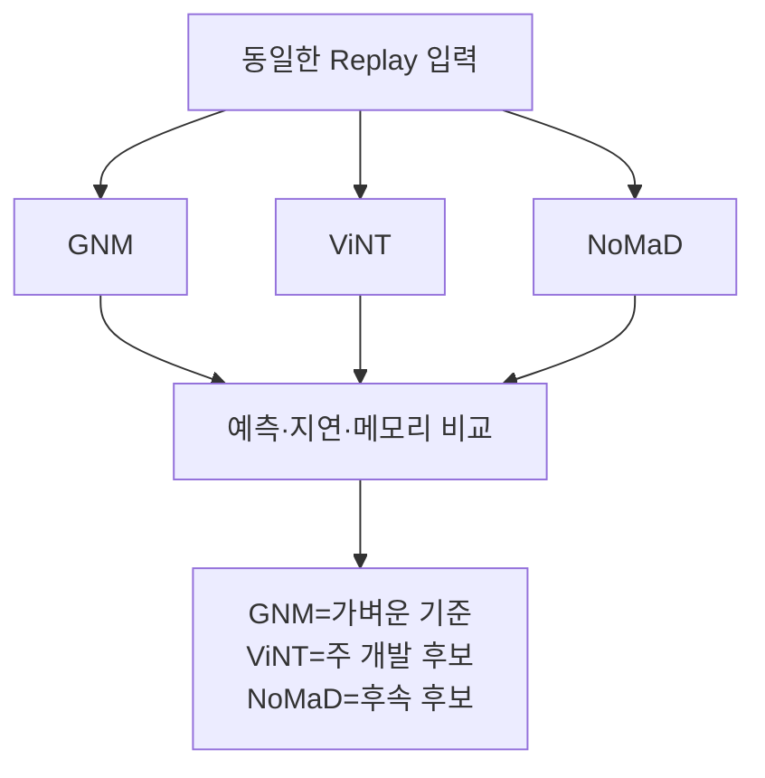
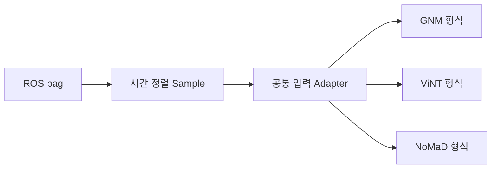
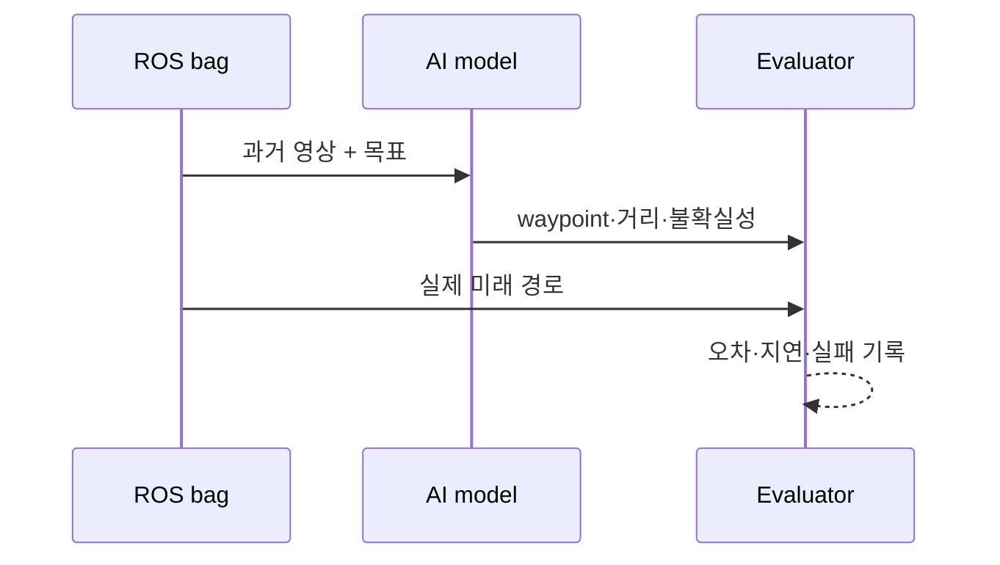
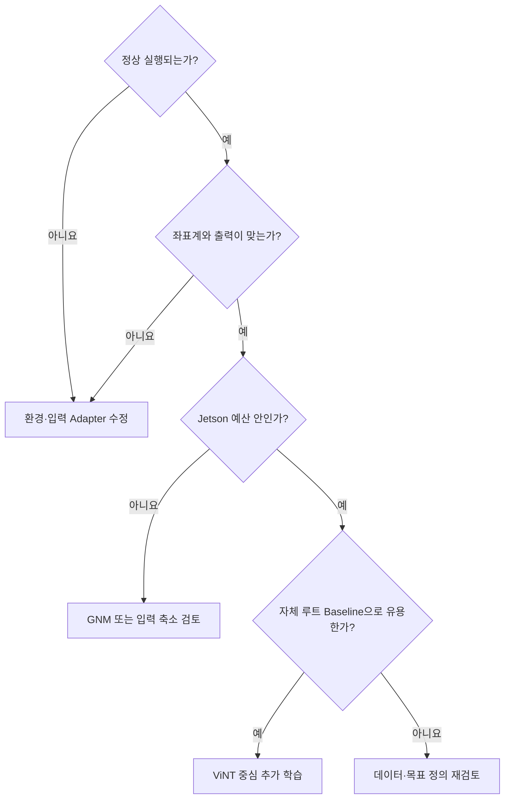

# 11. 사전학습 모델 활용

> ⏱️ 예상 읽기 시간: 9분
> 🎯 목표: GNM·ViNT·NoMaD를 같은 조건에서 비교하고, 프로젝트의 시작 모델을 결정한다.

## 이 단계의 목적

> 사전학습 모델은 완성된 운전자가 아니라, 여러 길을 미리 본 **초보 운전자용 기본 감각**이다.

공개 checkpoint가 우리 카메라·차량·점자블록 임무를 그대로 알지는 못한다. 따라서 이 단계에서는 모터를 제어하지 않고 다음만 확인한다.

- 모델 코드와 checkpoint가 정상 실행되는가?
- 같은 입력에서 waypoint를 일관되게 출력하는가?
- 좌표계와 출력 단위를 정확히 해석했는가?
- Jetson의 지연·메모리 예산에 들어오는가?
- 자체 루트에서 어떤 모델이 가장 나은 출발점인가?

## 후보 모델 비교

| 후보 | 쉬운 설명 | 장점 | 한계 | 권장 역할 |
|---|---|---|---|---|
| **GNM** | 가벼운 범용 시각 주행 모델 | 실행·파이프라인 검증이 쉬움 | 긴 문맥·멀티센서 입력이 제한적 | 경량 Baseline |
| **ViNT** | 현재·과거 영상과 목표를 함께 보는 모델 | 시간적 관측과 다양한 주행 prior | 프로젝트 기능은 추가 학습 필요 | 주 개발 모델 |
| **NoMaD** | 여러 후보 움직임을 생성하는 diffusion 모델 | 불확실한 장면에 여러 선택지 | 연산량·후보 선택 비용 증가 | 후속 고도화 |



## 시작 전 선행 조건

- [ ] 10단계의 ROS bag 품질 Gate를 통과했다.
- [ ] 카메라 영상과 odometry가 같은 시간축으로 재생된다.
- [ ] 모델 출력 좌표를 `base_link` 기준으로 변환하는 규칙이 있다.
- [ ] 규칙 기반 Planner의 동일 구간 결과를 저장했다.
- [ ] AI 출력이 차량 명령 Topic과 물리적으로 분리돼 있다.

## 1. 공식 구현과 환경을 고정한다

현재 저장소에는 GNM·ViNT 실행 코드가 포함돼 있지 않다. 공식 `visualnav-transformer` 구현과 checkpoint를 별도 작업 공간에 준비한다.

> ⚠️ JetPack·CUDA·PyTorch 조합에 따라 설치 방법이 달라진다. 이 문서에 임의 버전을 고정하지 말고 공식 지침과 실제 환경을 함께 기록한다.

환경 기록표:

| 항목 | 기록 예시 |
|---|---|
| Git commit | 공식 저장소 commit SHA |
| Checkpoint | 파일명·다운로드 출처·hash |
| JetPack / CUDA | 실제 설치 버전 |
| PyTorch / TensorRT | 실제 설치 버전 |
| 입력 크기 | 해상도·관측 frame 수 |
| 출력 정의 | waypoint 수·좌표계·정규화 |

## 2. 동일한 입력 Adapter를 만든다



모델마다 데이터 전처리가 다르더라도 원본 episode, 평가 구간, 목표 지점은 같아야 한다. 비교 중에는 모델별로 유리한 장면만 골라 쓰지 않는다.

공통 sample에 최소한 다음 식별자를 남긴다.

```yaml
episode_id: SITE_A_ROUTE_01_20260719_153000
timestamp_ns: 0
observation_frames: []
goal: []
ground_truth_waypoints: []
planner_waypoints: []
```

## 3. Replay에서 Zero-shot 비교한다



이 단계에서는 AI 결과를 `/vehicle/target_cmd`에 연결하지 않는다. 별도 파일이나 `/ai/shadow_*` Topic으로만 저장한다.

## 4. 무엇을 측정할까?

| 범주 | 지표 | 확인할 질문 |
|---|---|---|
| 실행 | 성공률·오류 수 | 모든 episode가 중단 없이 처리되는가? |
| 경로 | ADE·FDE·방향 오류 | 실제 미래 경로와 얼마나 다른가? |
| 안정성 | 연속 frame 간 출력 변화 | waypoint가 갑자기 튀지 않는가? |
| 속도 | p50·p95·p99 지연 | 느린 최악 구간이 제어 예산 안인가? |
| 자원 | GPU·RAM·온도 | YOLO와 동시에 실행 가능한가? |
| 안전 | 충돌 후보·정지 누락 | 규칙 Baseline보다 위험한 제안이 늘지 않는가? |

> 📌 평균 지연만 기록하면 드문 timeout을 놓친다. 반드시 p95와 p99를 함께 본다.

## 5. 실험표를 먼저 만든다

| 실험 ID | 모델 | 입력 frame | 해상도 | 장치 | YOLO 동시 실행 | 결과 |
|---|---|---:|---:|---|---|---|
| ZS-01 | GNM | 확정 후 기록 | 확정 후 기록 | 개발 PC | 아니요 | 대기 |
| ZS-02 | ViNT | 확정 후 기록 | 확정 후 기록 | 개발 PC | 아니요 | 대기 |
| ZS-03 | GNM | 동일 조건 | 동일 조건 | Jetson | 예 | 대기 |
| ZS-04 | ViNT | 동일 조건 | 동일 조건 | Jetson | 예 | 대기 |
| ZS-05 | NoMaD | 동일 조건 | 동일 조건 | Jetson | 예 | 후속 |

수치는 실행 전에 임의로 채우지 않고 실제 측정 결과와 로그 경로를 적는다.

## 모델 선택 기준



권장 출발점은 다음과 같다.

- **GNM:** 로거·평가·배포 파이프라인의 경량 기준
- **ViNT:** visual encoder를 재사용할 주 개발 모델
- **NoMaD:** ViNT 기반 시스템이 동작한 뒤 다중 궤적 연구

## 완료 체크리스트

- [ ] 모델·checkpoint·환경 버전과 hash가 기록됐다.
- [ ] 모든 모델이 동일 episode와 목표를 사용한다.
- [ ] 출력 좌표계·정규화·waypoint 의미를 검증했다.
- [ ] 개발 PC와 Jetson의 p50·p95·p99 지연을 측정했다.
- [ ] YOLO·ROS 2·기록 동시 실행 자원을 측정했다.
- [ ] AI 출력은 Replay 또는 Shadow에만 존재한다.
- [ ] GNM과 ViNT의 역할을 결정하고 NoMaD는 후속 여부를 기록했다.

⬅️ [10. 규칙 기반 차량 완성 및 데이터 수집](./10_규칙기반_차량완성_및_데이터수집.md) · ➡️ [12. 자체 데이터 기반 학습](./12_자체데이터_기반_학습.md)
