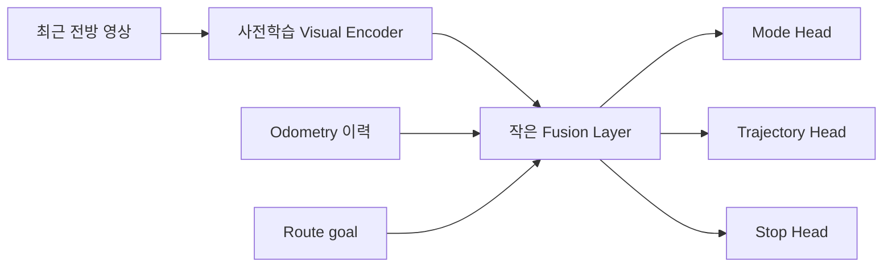
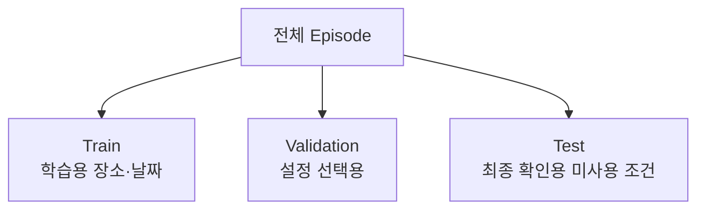
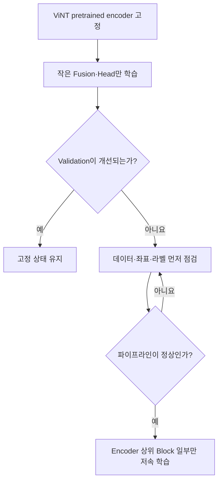

# 12. 자체 데이터 기반 학습

> ⏱️ 예상 읽기 시간: 10분
> 🎯 목표: 복잡한 전체 모델 대신, 자체 RGB+odometry로 작은 주행 Head부터 학습한다.

## 이 단계에서 만들 것



처음부터 완전한 멀티센서 AI를 만들지 않는다. **RGB+odometry+route goal**의 최소 Baseline을 재현한 뒤 센서를 하나씩 추가한다.

## 시작 조건

> 아래 데이터량은 성공 보장이 아닌 **공학적 추정치**다.

- [ ] 5~10시간, 50~100개의 독립 episode가 있다.
- [ ] 3개 이상의 장소 또는 날짜 조건을 포함한다.
- [ ] 센서 시간·좌표·action 품질 Gate를 통과했다.
- [ ] train·validation·test가 episode 단위로 분리됐다.
- [ ] GNM 또는 ViNT Replay Baseline이 재현된다.

데이터가 이보다 적다면 전체 학습보다 로거·라벨·Replay 파이프라인을 먼저 검증한다.

## 1. 학습 Sample을 만든다

| 입력 | 설명 |
|---|---|
| 최근 RGB frame | 현재와 직전 장면의 시간적 변화 |
| Odometry history | 최근 위치·yaw·속도 변화 |
| Route goal | 로봇 기준 다음 목표 위치·방향 |
| 이전 행동 | 직전 속도·조향 명령과 실제 반응 |

| 정답 | 설명 |
|---|---|
| 미래 waypoint | `t+0.5s ... t+2.5s`의 상대 위치 예시 |
| Mode | `FOLLOW_TACTILE`, `OCCLUDED`, `REJOIN`, `STOP` 등 |
| Stop | 지금 정지가 필요한지 여부 |

미래 waypoint는 모든 frame에 사람이 직접 그리지 않는다. timestamp가 맞는 odometry에서 미래 pose를 현재 `base_link` 기준으로 변환해 자동 생성한다.

## 2. 데이터 누수를 막는다



| 올바른 분리 | 잘못된 분리 |
|---|---|
| route·site·date·episode 단위 | frame 무작위 분리 |
| 같은 주행은 한 split에만 배치 | 인접 frame이 train과 test에 동시에 존재 |
| 희귀 mode도 독립 episode 확보 | 같은 장애물 통과 장면을 복제 |

인접 영상은 거의 같은 장면이므로 frame 단위 무작위 분리는 시험 점수를 부풀린다.

## 3. Visual Encoder를 먼저 고정한다



Encoder 전체를 바로 풀면 적은 자체 데이터에 과적합되거나 사전학습 표현을 잃을 수 있다.

## 4. 가장 작은 실험부터 누적한다

| 실험 | 입력 | 목적 |
|---|---|---|
| M0 | RGB | Visual Baseline 확인 |
| M1 | RGB + odometry | 움직임 이력의 효과 확인 |
| M2 | M1 + route goal | 순찰 방향 정보의 효과 확인 |
| M3 | M2 + IMU history | 회전·진동 보완 여부 확인 |
| M4 | M3 + LiDAR feature | 장애물·free-space 효과 확인 |

각 실험은 바로 앞 실험과 **한 가지 차이만** 둔다. 성능이 나빠지면 어느 입력이 원인인지 알 수 있다.

## 5. 출력 Head를 나눠서 관찰한다

| Head | 출력 | 대표 지표 |
|---|---|---|
| Mode | 현재 주행 상태 class | macro-F1, mode별 recall |
| Trajectory | 미래 waypoint 5~8개 등 | ADE·FDE·방향 오류 |
| Stop | 정지 필요 확률 | stop recall·false stop |
| Uncertainty(후속) | 예측 불확실성 | 위험·미지 상황에서 신뢰도 하락 여부 |

정지 누락은 평균 경로 오차보다 안전에 직접 영향을 주므로 별도 지표로 본다.

## 최소 설정 기록 예시

```yaml
experiment_id: M2_VINT_FROZEN
data_version: d2_v1
splits_version: route_date_v1
inputs: [rgb_history, wheel_odom_history, route_goal]
visual_encoder: vint_pretrained
encoder_frozen: true
heads: [mode, trajectory, stop]
seed: 42
checkpoint_selection: validation_only
```

실제 값은 실험 설정에 맞게 바꾸고 Git commit, checkpoint hash, 학습 로그 경로를 함께 남긴다.

## 6. Offline 평가에서 볼 것

| 질문 | 확인 지표 |
|---|---|
| 미래 경로가 실제 경로와 가까운가? | ADE·FDE |
| 가림·재합류 상태를 놓치지 않는가? | mode별 recall·macro-F1 |
| 필요한 정지를 놓치지 않는가? | stop recall |
| 정상 구간에서 너무 자주 멈추는가? | false stop rate |
| 새로운 장소에서 급격히 나빠지는가? | site·date별 지표 |
| 출력이 frame마다 튀는가? | 시간 연속성·jerk 지표 |

좋은 Offline 점수는 Shadow·실차 안전성을 보장하지 않는다. 이 단계의 모델은 아직 모터를 직접 제어하지 않는다.

## 실패했을 때 수정 순서

```text
1. Timestamp와 좌표 변환 확인
2. 미래 waypoint 라벨을 영상 위에 시각화
3. Train/Test 누수 확인
4. 규칙 Baseline과 단순 모델 비교
5. 한 가지 센서만 추가·제거
6. 마지막에만 모델 크기나 Encoder 학습 범위 확대
```

모델을 크게 만드는 것은 첫 해결책이 아니다.

## 완료 체크리스트

- [ ] 데이터 split이 route·site·date·episode 단위다.
- [ ] 미래 waypoint 라벨을 시각적으로 검수했다.
- [ ] frozen encoder + 작은 Head Baseline이 재현된다.
- [ ] 센서는 한 번에 하나씩 추가하며 결과를 기록했다.
- [ ] mode·trajectory·stop을 각각 평가했다.
- [ ] held-out 장소·날짜 결과를 확인했다.
- [ ] 모델 출력은 Replay 또는 Shadow에만 연결돼 있다.

⬅️ [11. 사전학습 모델 활용](./11_사전학습_모델_활용.md) · ➡️ [13. Teacher 및 실패 데이터 강화](./13_Teacher_및_실패데이터_강화.md)
