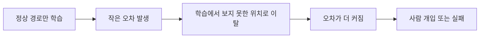
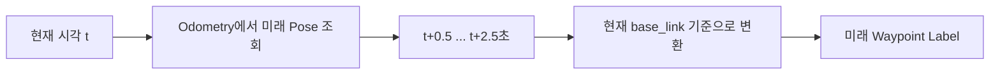
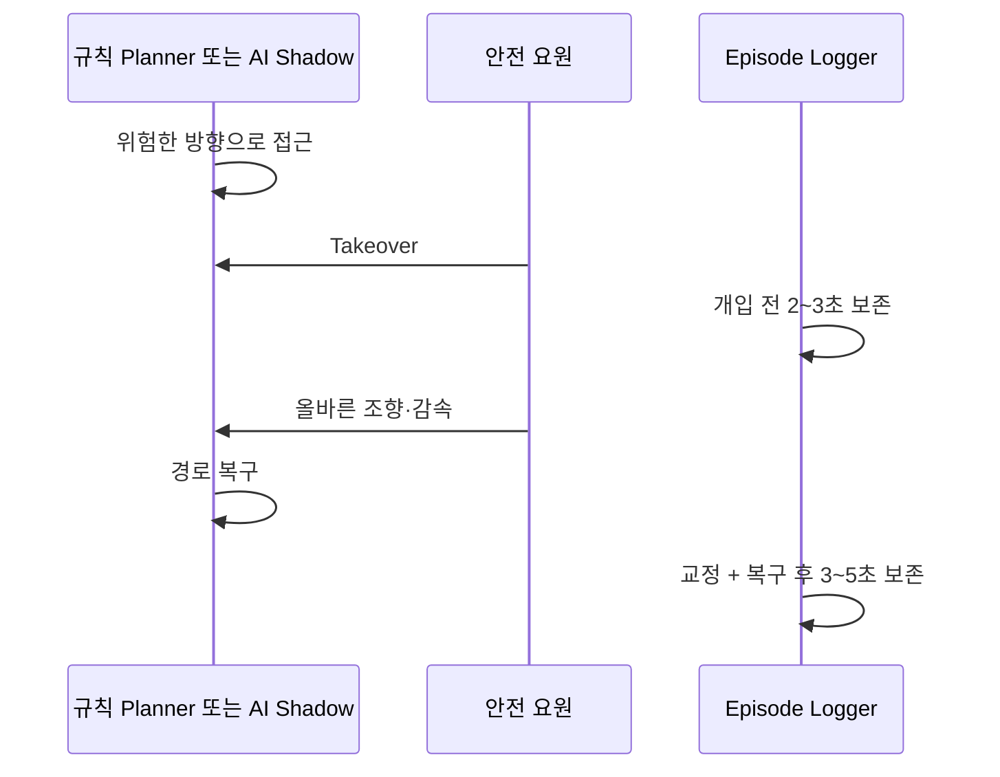
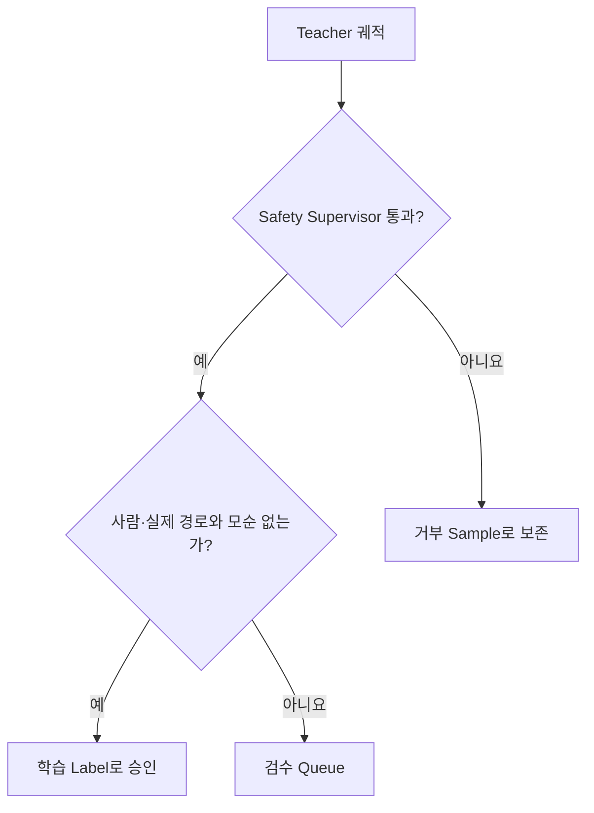
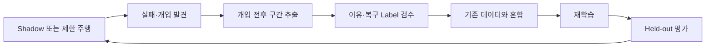

# 13. Teacher 및 실패 데이터 강화

> ⏱️ 예상 읽기 시간: 10분
> 🎯 목표: 정상 주행뿐 아니라 사람 개입·실패·복구 장면을 체계적으로 수집하고 학습에 반영한다.

## 왜 정상 주행만으로 부족한가?



정상 직선 주행만 학습한 모델은 경로에서 조금 벗어났을 때 돌아오는 방법을 모를 수 있다. 따라서 **실패 직전 → 사람의 교정 → 안전한 복구**를 하나의 중요한 학습 사례로 저장한다.

## Teacher란?

> **Teacher는 Student 모델이 배울 행동 예시를 만들어 주는 사람이나 시스템이다.**

| 우선순위 | Teacher | 장점 | 주의점 |
|---:|---|---|---|
| 1 | 숙련된 사람의 수동 주행 | 상황을 유연하게 판단 | 조작자마다 행동 차이 발생 |
| 2 | 검증된 규칙 기반 Planner | 반복 가능하고 설명하기 쉬움 | 규칙의 한계를 그대로 가짐 |
| 3 | 자체 시험에서 검증된 큰 ViNT 모델 | 복잡한 시각 표현 활용 | 자체 데이터와 안전 검증 필요 |
| 4 | NoMaD 등 다중 궤적 모델 | 여러 후보 행동 제공 | 느리고 후보 선택이 복잡함 |

처음에는 사람과 규칙 Planner를 Teacher로 사용한다. 큰 AI Teacher나 증류는 이후 선택 사항이다.

## 정상 궤적은 자동으로 만든다



모든 frame에 사람이 경로를 직접 그리면 시간이 많이 들고 기준이 흔들린다. timestamp가 맞는 odometry를 이용해 미래 waypoint를 자동 생성하고, 사람은 상황·개입·복구 label을 집중 검수한다.

## 사람 개입 데이터 수집 흐름



> ⛔ 실차 개입 수집은 통제 코스·저속·물리 E-stop·즉시 takeover 조건에서만 수행한다. 공공 보도에서 AI가 위험 상황을 탐색하게 하지 않는다.

## 무엇을 Label로 남길까?

| Label | 예시 | 목적 |
|---|---|---|
| `mode` | `OCCLUDED`, `AVOID`, `REJOIN`, `STOP` | 현재 주행 문맥 학습 |
| `intervention_start/end` | timestamp 범위 | 위험 전후 구간 추출 |
| `intervention_reason` | 점자블록 침범·잘못된 분기 | 실패 원인 분류 |
| `recovery_success` | true / false | 복구 행동 평가 |
| `teacher_source` | HUMAN / RULE / MODEL | 정답 출처 추적 |
| `teacher_accepted` | true / false | 안전 검사를 통과한 label 구분 |
| `safety_reject_reason` | clearance·속도·timeout | 위험한 Teacher 출력 제외 |

```yaml
event:
  episode_id: SITE_A_ROUTE_01_20260719_160000
  mode: REJOIN
  intervention_start_ns: 0
  intervention_end_ns: 0
  intervention_reason: wrong_route_branch
  teacher_source: HUMAN
  teacher_accepted: true
  recovery_success: true
```

## Teacher 출력을 무조건 정답으로 쓰지 않는다



Teacher가 틀리면 Student도 같은 실수를 배울 수 있다. 안전 계층에 거부된 출력은 정상 정답으로 사용하지 않고, 어려운 음성 사례 또는 별도 분석 대상으로 남긴다.

## 어떤 상황을 얼마나 모을까?

> 아래 비율은 프로젝트 수집 계획을 위한 **공학적 권장안**이다. 실제 실패 분포에 따라 조정한다.

| 상황 | 권장 비중 | 예시 |
|---|---:|---|
| 정상 점자블록 추종 | 40% | 직선·곡선·정상 조명 |
| 가림·단절·조명 변화 | 20% | 낙엽·그림자·역광 |
| 갈림길·횡단보도·재합류 | 15% | 루트 분기·단절 통과 |
| 장애물 회피·정지 | 15% | 모형 장애물·우회 후 복귀 |
| 센서 품질 저하 | 10% | GNSS 불량·blur·dropout |

전체 시간을 정상 직선으로 채우지 않는다. 희귀 mode별 독립 episode 수와 실패·복구 다양성을 우선한다.

## Intervention Loop



새로 모은 실패 데이터만 학습하면 정상 주행 성능을 잃을 수 있다. 기존 정상 데이터와 일정 비율로 섞고, 동일한 held-out 시험셋으로 전후 성능을 비교한다.

## 증류는 언제 사용할까?

증류는 데이터 부족을 없애는 기술이 아니다. 다음 조건을 모두 만족할 때만 작은 Student를 만드는 수단으로 검토한다.

- Teacher가 자체 held-out episode에서 규칙 Baseline보다 낫다.
- Teacher가 Safety Supervisor에 거부되는 비율이 허용 범위다.
- 같은 입력에서 Teacher의 출력과 사람 정답을 비교할 수 있다.
- Student가 필요한 이유가 지연·메모리 같은 명확한 배포 제약이다.

```text
사람 정답 + 승인된 Teacher Soft Output → 작은 Student
```

Student가 빨라져도 stop recall·충돌·개입률이 악화되면 배포하지 않는다.

## 실패 데이터 품질 점검

| 검사 | Go | No-Go |
|---|---|---|
| 개입 시각 | 영상·명령과 정확히 정렬 | 시작·종료가 수초씩 어긋남 |
| 개입 이유 | 정해진 vocabulary로 기록 | 자유 문장만 있어 집계 불가 |
| 복구 결과 | 성공·실패와 복귀 지점 기록 | 개입 순간만 저장 |
| 독립성 | route·날짜·장소별 별도 episode | 같은 장면을 여러 sample로 복제 |
| Teacher 안전성 | 승인·거부 이유 보존 | 모든 출력을 정답 처리 |

## 완료 체크리스트

- [ ] 사람·규칙 Planner의 Teacher 출처를 구분한다.
- [ ] 미래 waypoint를 odometry로 자동 생성하고 시각 검수했다.
- [ ] 개입 전 2~3초와 복구 후 3~5초를 함께 저장한다.
- [ ] intervention reason과 recovery success를 기록한다.
- [ ] Safety Supervisor 거부 sample을 정답에서 분리한다.
- [ ] 희귀 mode마다 train·validation·test 독립 episode가 있다.
- [ ] 실패 데이터 추가 전후의 정상·안전 성능을 함께 비교했다.

⬅️ [12. 자체 데이터 기반 학습](./12_자체데이터_기반_학습.md) · ➡️ [14. Shadow·Assist 단계 검증](./14_Shadow_Assist_단계검증.md)
