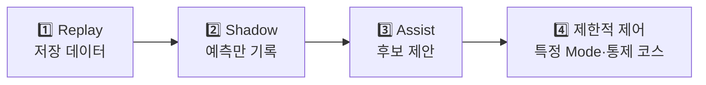
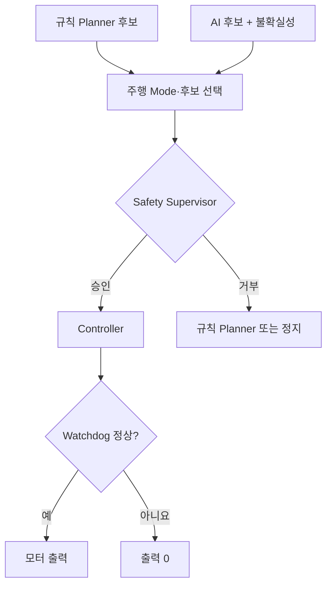
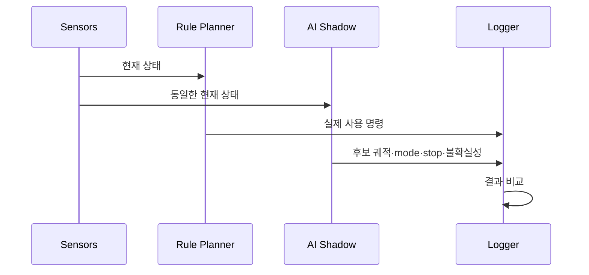
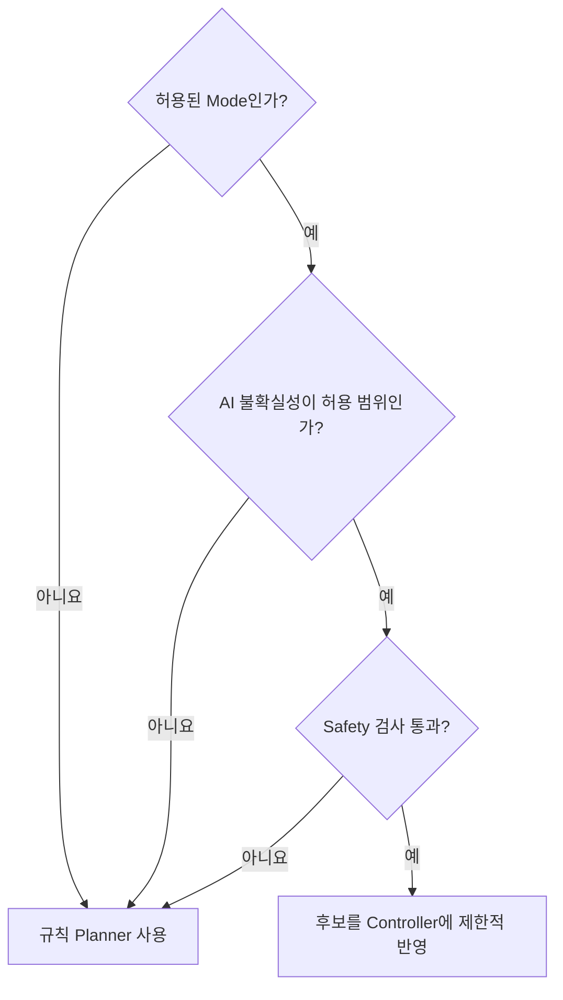

# 14. Shadow·Assist 단계 검증

> ⏱️ 예상 읽기 시간: 10분
> 🎯 목표: AI의 권한을 Replay에서 제한적 실차 제어까지 안전하게 높이고, 각 단계의 Go/No-Go를 증거로 결정한다.

## 권한은 한 계단씩 높인다



| 단계 | AI 출력 | 차량을 실제로 움직이는 주체 |
|---|---|---|
| Replay | 파일에 저장 | 없음 |
| Shadow | 실시간 기록·비교 | 규칙 Planner |
| Assist | 후보 궤적 제안 | Safety 승인 후 기존 제어기 |
| 제한적 제어 | 허용된 mode에서 선택된 명령 | AI 후보 + Safety + 즉시 fallback |

> 🚧 좋은 Offline 점수만으로 다음 단계로 넘어가지 않는다.

## 공통 선행 조건

- [ ] 물리 E-stop·watchdog·LiDAR 정지를 반복 시험했다.
- [ ] AI와 독립된 Safety Supervisor가 동작한다.
- [ ] 규칙 기반 Planner로 즉시 복귀할 수 있다.
- [ ] 안전 요원이 로봇 옆에서 takeover할 수 있다.
- [ ] 저속 통제 코스와 모형 장애물을 사용한다.
- [ ] 시험 전 배터리·센서·저장공간·온도를 확인한다.

## 안전 실행 구조



AI는 Safety Supervisor나 watchdog을 우회해 PWM으로 직접 연결되지 않는다.

## 1단계: Replay 시험

저장된 동일 episode에서 AI와 규칙 Planner의 출력을 비교한다.

| 확인 항목 | 질문 |
|---|---|
| Trajectory | 실제 미래 경로와 가까운가? |
| Stop | 필요한 정지를 놓치지 않는가? |
| Mode | 가림·우회·재합류를 구분하는가? |
| 불확실성 | 처음 보는 장면에서 자신감을 낮추는가? |
| 성능 | 최악 지연 p99가 예산 안인가? |

### Replay Go 조건

- 평가 pipeline이 같은 입력에서 재현된다.
- held-out route·date·site 성능을 따로 확인했다.
- 좌표계 오류·NaN·추론 timeout이 처리된다.
- 위험 제안을 scenario별로 검토했다.

## 2단계: Shadow Mode

실제 운전은 규칙 Planner가 담당하고 AI는 같은 순간의 제안만 기록한다.



### Shadow에서 볼 질문

- Safety Supervisor가 AI 후보를 몇 번, 왜 거부했는가?
- 사람 개입 직전에 AI도 위험 또는 정지를 예측했는가?
- 정상 구간에서 불필요한 정지를 얼마나 제안했는가?
- 새로운 장소·날씨에서 오차가 갑자기 커지는가?
- 출력이 시간에 따라 부드럽고 일관적인가?

## 3단계: 제한적 Assist

처음부터 모든 상황에 개입시키지 않는다. 예를 들어 `OCCLUDED`에서 후보 궤적만 제안하는 것처럼 하나의 mode로 범위를 제한한다.



Assist 시작 조건:

- 충분한 자체 episode와 해당 mode의 독립 시험 사례가 있다.
- AI 후보가 규칙 Baseline보다 나은 구간이 명확하다.
- 후보 거부·fallback·takeover가 모두 로그에 남는다.
- 한 번의 switch로 AI 기능 전체를 비활성화할 수 있다.

## 4단계: 제한적 실차 제어

다음 조건을 모두 만족한 통제 코스에서만 검토한다.

- 특정 mode·구간·속도로 권한을 제한한다.
- 안전 요원이 계속 동행한다.
- 실패 시 같은 제어 주기 안에 규칙 Planner 또는 정지로 전환한다.
- 공공 보행자 환경에서 online exploration을 하지 않는다.
- 시험 횟수와 실패를 숨기지 않고 모두 기록한다.

## 시나리오 시험표

| ID | 시나리오 | 기대 행동 | 핵심 지표 |
|---|---|---|---|
| SC-01 | 정상 직선·곡선 | 오프셋 유지 | 횡방향 오차·완주율 |
| SC-02 | 점자블록 부분 가림 | 감속·방향 유지 | mode recall·개입률 |
| SC-03 | 점자블록 단절 | 등록 루트 통과 | 단절 통과 성공률 |
| SC-04 | 정적 장애물 | 정지 또는 허용 우회 | 최소 clearance·충돌 |
| SC-05 | 우회 후 재합류 | 앞쪽 루트 복귀 | rejoin 성공률·시간 |
| SC-06 | 센서 지연·dropout | 감속·정지 | timeout 대응률 |
| SC-07 | 잘못된 경로 후보 | 후보 거부·fallback | Safety 거부 성공률 |

각 시나리오는 한 번 성공으로 끝내지 않고 조건과 반복 횟수를 시험 계획서에 먼저 고정한다.

## 핵심 평가 지표

| 지표 | 쉬운 의미 | 주의점 |
|---|---|---|
| Route completion | 목표 루트 중 완주한 비율 | 중간 수동 이동을 성공으로 세지 않음 |
| Intervention/km | 1km당 사람이 개입한 횟수 | 개입 이유별로 분리 |
| Collision | 실제 접촉 횟수 | 목표는 0회 |
| Minimum clearance | 장애물과 가장 가까운 거리 | 평균보다 최솟값 중요 |
| Stop recall | 필요한 정지를 놓치지 않은 비율 | 안전 핵심 지표 |
| False stop | 필요 없는데 정지한 비율 | 안전성과 운용성 균형 |
| Offset error | 점자블록 옆 목표 간격 오차 | 평균·최대 함께 기록 |
| Rejoin success | 우회 후 원래 루트 복귀 성공률 | 잘못된 뒤쪽 지점 복귀 제외 |
| Safety rejection | 위험 AI 후보가 거부된 비율 | 거부 사유별 집계 |

## Go/No-Go 판정표

> 충돌 0회 외의 수치 기준은 코스·속도·센서 사양을 확인한 뒤 팀이 시험 전에 확정한다. 결과를 본 뒤 기준을 낮추지 않는다.

| Gate | Go | No-Go |
|---|---|---|
| 안전 | 충돌 0회, E-stop·fallback 정상 | 충돌·정지 실패·fallback 지연 |
| 반복성 | 정해진 반복 횟수 통과 | 일부 성공 장면만 선택 |
| 일반화 | held-out 장소·날짜 통과 | 학습 코스에서만 성공 |
| 운용성 | 개입·false stop이 합의 기준 안 | 안전하지만 거의 진행하지 못함 |
| 로깅 | 모든 후보·거부·개입 재현 가능 | 실패 원인 로그 누락 |

## 실패 시 기록 양식

```yaml
test_id: SC-05_RUN_03
software_version: git_commit
model_checkpoint: sha256
control_mode: AI_ASSIST
failure_time_ns: 0
failure_type: rejoin_failed
safety_action: fallback_to_rule
human_intervention: true
bag_path: data/rosbags/...
notes: 재현 가능한 짧은 설명
```

실패는 삭제하지 않고 13단계의 intervention dataset으로 되돌린다.

## 완료 체크리스트

- [ ] Replay·Shadow·Assist 결과가 서로 분리돼 있다.
- [ ] 모든 실차 시험에 안전 요원·E-stop·fallback이 있다.
- [ ] mode별 시나리오와 반복 횟수를 사전에 정의했다.
- [ ] 충돌·개입·정지·오프셋·재합류를 함께 측정했다.
- [ ] held-out 장소·날짜에서 시험했다.
- [ ] 실패 episode를 보존하고 재학습 Queue에 넣었다.
- [ ] Go/No-Go 기준을 결과 확인 전에 고정했다.

⬅️ [13. Teacher 및 실패 데이터 강화](./13_Teacher_및_실패데이터_강화.md) · ➡️ [15. Jetson 배포 최적화](./15_Jetson_배포_최적화.md)
