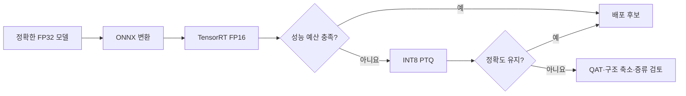
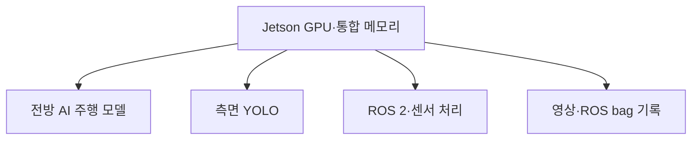
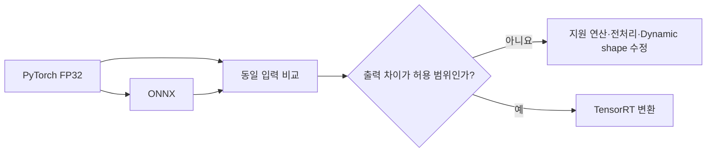
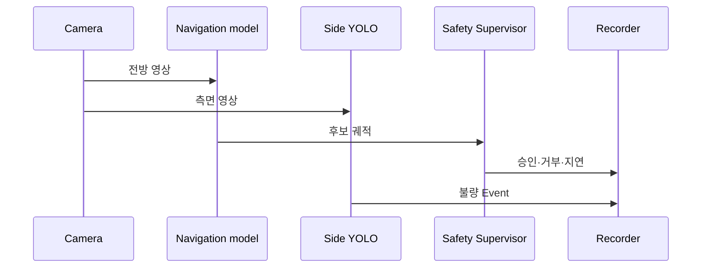
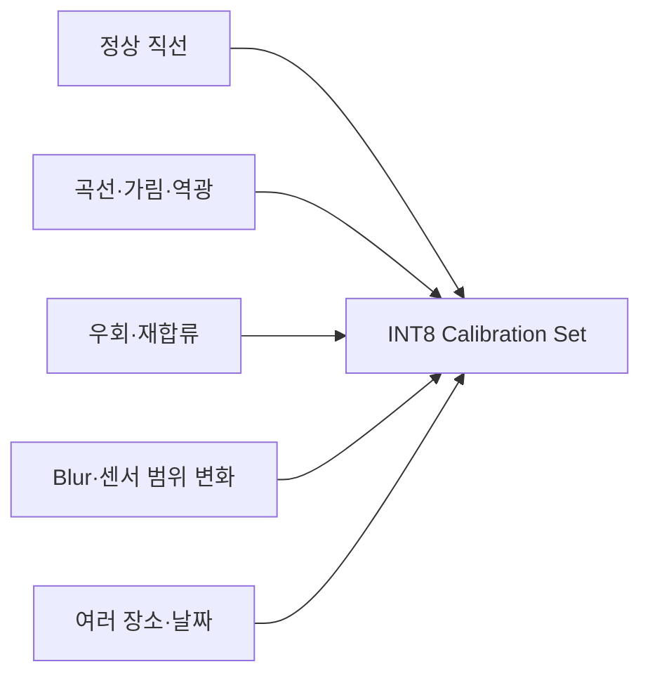
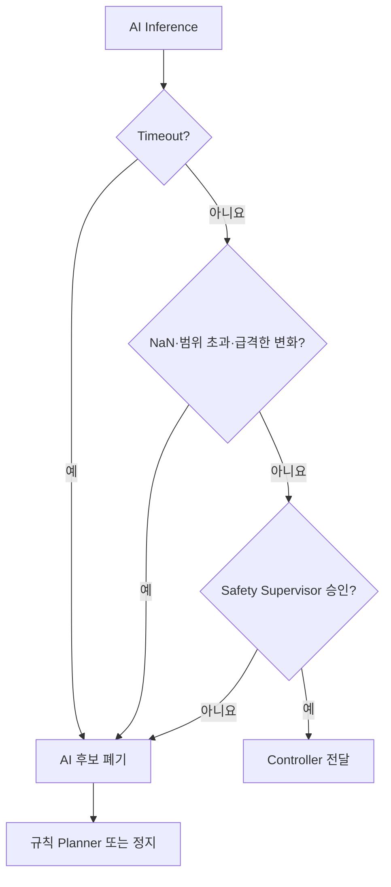

# 15. Jetson 배포 최적화

> ⏱️ 예상 읽기 시간: 10분
> 🎯 목표: 검증된 모델을 Jetson에서 정확도와 안전성을 유지하며 실시간 실행한다.

## 최적화는 마지막에 한다



빠르지만 잘못 판단하는 모델은 배포할 수 없다. 먼저 FP32 기준 성능을 고정하고 한 단계씩 변환하며 같은 데이터로 비교한다.

## 프로젝트의 실행 환경

목표 장치는 Jetson Orin Nano 8GB이며, 주행 모델만 실행하지 않는다.



Orin Nano는 DLA 분리를 전제로 할 수 없으므로 실제 동시 부하에서 측정한다. 단독 추론 FPS만으로 배포 가능성을 판단하지 않는다.

## 시작 조건

- [ ] FP32 모델의 held-out Offline 결과가 고정됐다.
- [ ] Shadow 또는 제한적 Assist의 안전 결과가 있다.
- [ ] 같은 입력·전처리·후처리를 재현할 Replay set이 있다.
- [ ] mode·stop·trajectory·불확실성 기준 지표가 있다.
- [ ] Safety Supervisor 주기가 AI 추론과 독립적이다.

## 1. FP32 기준선을 고정한다

| 기록 항목 | 이유 |
|---|---|
| Git commit·checkpoint hash | 어떤 모델인지 재현 |
| 입력 해상도·frame 수 | 연산량과 정확도 비교 |
| 전처리·후처리 버전 | 엔진 밖의 차이 방지 |
| ADE·FDE·mode F1·stop recall | 변환 전 정확도 기준 |
| p50·p95·p99 지연 | 평균과 최악 지연 확인 |
| GPU·RAM·온도·전력 | 동시 실행 여유 확인 |

## 2. ONNX로 변환하고 출력 일치성을 확인한다



몇 장만 눈으로 보지 말고 held-out Replay set 전체에서 waypoint·mode·stop 출력 차이를 비교한다.

## 3. TensorRT FP16을 먼저 적용한다

> 아래 명령은 개념 예시다. 실제 TensorRT 버전의 `trtexec --help`와 모델 입출력 이름을 확인해 수정한다.

```bash
trtexec \
  --onnx=model.onnx \
  --saveEngine=model_fp16.engine \
  --fp16
```

FP16은 추가 학습 없이 속도와 메모리를 개선할 수 있어 첫 선택이다. FP16 결과가 목표를 만족하면 복잡한 INT8·증류를 추가하지 않는다.

## 4. 실제 동시 실행으로 Benchmark한다



측정 조건을 고정한다.

- 같은 Replay episode와 카메라 입력률
- 측면 YOLO 동시 실행
- ROS 2 센서 처리와 영상·bag 기록 실행
- 목표 전력 모드와 팬 설정
- 30분 이상 연속 실행으로 thermal soak 확인

## 배포 예산

> 아래 수치는 현재 설계의 **공학적 추정치**다. 실제 속도·제동거리·제어 주기로 다시 계산한다.

| 항목 | 목표 예시 |
|---|---:|
| 주행 Policy 단독 p99 추론 | 100ms 이하 |
| YOLO·ROS 2·기록 포함 전체 decision p99 | 150ms 이하 |
| 30분 thermal soak | timeout 0회 |
| GPU·RAM 여유 | 20% 이상 |
| 정밀도 변경 | mode F1·stop recall·ADE/FDE·불확실성 모두 비교 |

속도가 0.3m/s라면 150ms 동안 약 4.5cm 이동한다. 지연은 단순 FPS가 아니라 sensing-to-command와 제동거리의 일부로 계산한다.

## 5. FP16이 부족할 때 INT8을 검토한다

| 방법 | 추가 학습 | 언제 사용? | 위험 |
|---|---:|---|---|
| FP16 TensorRT | 없음 | 가장 먼저 | 일부 연산의 수치 차이 |
| INT8 PTQ | 없음 | 실제 calibration set 확보 후 | 대표성 부족 시 정확도 하락 |
| INT8 QAT | 필요 | PTQ 정확도 손실이 클 때 | 학습·검증 복잡도 증가 |
| 구조 축소 | 재학습 | frame·encoder 비용이 클 때 | 표현력 감소 |
| Teacher-Student 증류 | 재학습 | 좋은 Teacher와 명확한 지연 문제 | Teacher 오류 복제 |

## Calibration Set은 실제 환경을 대표해야 한다



정상 직선 frame만 사용하면 가림·저조도·희귀 mode에서 양자화 오차가 커질 수 있다. 학습셋 전체가 아니라 실제 추론 분포를 대표하는 별도 sample을 사용한다.

## 정밀도별 비교표

| 항목 | FP32 | FP16 | INT8 | 판정 |
|---|---:|---:|---:|---|
| ADE / FDE | 측정 | 측정 | 측정 | 허용 변화 확정 |
| Mode macro-F1 | 측정 | 측정 | 측정 | mode별 확인 |
| Stop recall | 측정 | 측정 | 측정 | 악화 시 No-Go |
| p99 지연 | 측정 | 측정 | 측정 | 예산과 비교 |
| 최대 RAM·GPU | 측정 | 측정 | 측정 | 20% 여유 확인 |
| Timeout | 측정 | 측정 | 측정 | 30분간 0회 목표 |

표의 값을 추정으로 채우지 않고 동일 Replay와 동시 부하에서 실측한다.

## 6. Runtime 안전 감시를 유지한다



모니터링할 항목:

- 모델 입력 누락·오래된 timestamp
- 추론 timeout과 연속 실패 횟수
- NaN·Inf·출력 범위 초과
- waypoint 급변과 불확실성 상승
- GPU·RAM 부족과 thermal throttling
- heartbeat 단절과 Controller 응답 지연

## Rollback 기준

| 상황 | 조치 |
|---|---|
| ONNX 출력 불일치 | PyTorch FP32로 돌아가 변환 수정 |
| FP16 정확도 저하 | 문제 Layer FP32 유지 또는 모델 수정 |
| INT8 stop recall 저하 | FP16으로 복귀, QAT는 별도 검토 |
| 동시 실행 p99 초과 | 입력·frame·실행 주기 축소 후 재측정 |
| Thermal timeout 발생 | 전력·냉각·부하 조정, 배포 중지 |
| Safety 주기가 AI에 종속 | 구조 수정 전 배포 No-Go |

## 완료 체크리스트

- [ ] FP32·ONNX·FP16 출력과 지표를 같은 Replay에서 비교했다.
- [ ] YOLO·ROS 2·기록 동시 부하로 p50·p95·p99를 측정했다.
- [ ] 30분 이상 thermal soak를 수행했다.
- [ ] GPU·RAM 여유와 timeout을 기록했다.
- [ ] INT8은 대표 calibration set이 있을 때만 검토했다.
- [ ] 정확도 손실 시 FP16으로 되돌릴 수 있다.
- [ ] Safety Supervisor와 watchdog은 AI 추론과 독립적이다.
- [ ] 엔진·환경·checkpoint·benchmark 로그를 버전 관리한다.

⬅️ [14. Shadow·Assist 단계 검증](./14_Shadow_Assist_단계검증.md) · ↩️ [전체 문서 안내](./00_README.md)
