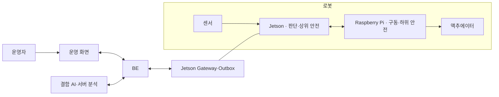

# 전체 서비스 시스템명세

## 1. 시스템 경계

## 2. 확정 책임

| 영역           | 책임                                                   | 금지 경계                 |
| ------------ | ---------------------------------------------------- | --------------------- |
| Jetson       | 센서 수집, 위치추정, 계획, 주행 인지·AI, 상위 Safety, outbox/gateway | 모터 GPIO 직접 소유 금지      |
| Raspberry Pi | encoder·IMU, 속도·조향, watchdog, E-stop 보고, 물리 EN 차단    | 경로·AI 판단 금지           |
| AI 파트        | 불량 탐지·분류·분석 모델과 데이터 품질                               | 자율주행 명령 소유 금지         |
| BE           | 이벤트·미디어·상태 수집, 저장, 조회, 검토 이력                         | 주행 폐루프 참여 금지          |
| 운영 화면        | 루트 선택, 상태·이벤트 조회, 검토                                 | 안전 정지의 유일한 수단이 될 수 없음 |

## 3. 핵심 데이터 흐름

1. 센서→Jetson: 이미지, scan, GNSS와 RPi feedback을 수집한다.
2. Jetson→RPi: Safety가 승인한 `/vehicle/target_cmd`만 전달한다.
3. RPi→Jetson: odometry, IMU, actuator·safety 상태와 heartbeat를 전달한다.
4. 로봇→BE: 허용된 상태·결함·장애물 이벤트와 파일만 gateway로 보낸다.
5. BE→운영자: 원본 근거와 검토 가능한 파생 결과를 제공한다.

## 4. 장애 격리 요구사항

- 서버·인터넷·AI 분석 장애 중에도 로봇은 안전 정지할 수 있어야 한다.
- Jetson 장애 시 RPi가 독립적으로 actuator enable을 차단해야 한다.
- RPi 재시작 후 drive enable은 자동 복구하지 않는다.
- 오래된 명령·역행 sequence·비정상 수치는 actuator에 적용하지 않는다.
- 이벤트 전송 실패는 outbox로 격리하고 주행 제어 주기를 방해하지 않는다.

## 5. 배포 경계

| 배포 단위          | 기준                                                        |
| -------------- | --------------------------------------------------------- |
| Jetson runtime | native ROS 2 Humble 목표, 실제 JetPack·L4T 확인 필요              |
| RPi runtime    | Ubuntu 24.04 host + Jammy ARM64 ROS 2 Humble container 목표 |
| BE             | `[추후 추가 예정]` 배포 환경과 용량 기준                                 |
| AI server      | `[추후 추가 예정]` 모델 serving 위치와 자원 기준                         |

## 6. 후속 상세설계 산출물

- 각 노드 내부 상태·알고리즘 설계
- 실제 ROS IDL, launch, parameter와 QoS override 파일
- Dockerfile·Compose·systemd unit
- BE module·DB·API 내부 설계
- AI 모델·학습·후처리 내부 설계
