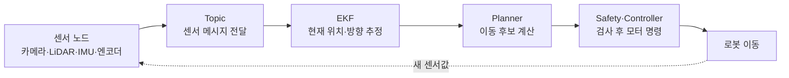
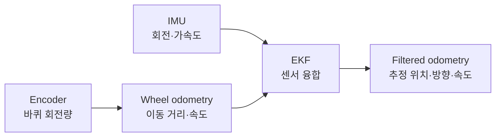

# 공통 용어집 안내

> 🎯 목표: ROS 2와 로봇을 처음 접한 사람도 최종 문서에 반복해서 나오는 용어와 데이터 흐름을 이해한다.

프로젝트의 공식 용어와 파트 책임 경계는 루트 [CONTEXT.md](../../CONTEXT.md)를 단일 원본으로 사용한다. 이 문서는 공식 용어를 바꾸지 않고, 처음 읽는 사람을 위해 ROS 2·센서·제어 기술 용어를 쉽게 풀어 설명한다.

## 1. 먼저 전체 흐름 이해하기



간단히 말하면 **Node가 일을 하고, Topic으로 데이터를 주고받으며, TF로 서로 다른 좌표계를 연결한다.** Odom과 IMU 같은 값은 EKF가 합쳐 더 안정적인 위치를 만들고, Planner와 Safety가 이 값을 사용해 안전한 주행 명령을 결정한다.

## 2. 프로젝트 공식 용어

| 공식 용어 | 쉬운 설명 |
|---|---|
| 평가용 MVP | 운영자 감독과 통제 코스에서 검증하는 현재 출시 범위 |
| HW/CONTROL | 로봇 HW·ROS·제어·안전과 자율주행 AI를 소유하는 파트 |
| AI | 불량 점자블록을 탐지·분류·분석하는 AI 파트 |
| 주행 폐루프 | 센서 관측부터 판단·명령·모터 반응까지 실시간으로 이어지는 로봇 내부 흐름 |
| Replay | 저장된 데이터에서 주행 후보를 예측하며 실제 모터에 영향을 주지 않는 평가 |
| Shadow | 실제 순찰 중 AI 예측만 기록하고 기존 Planner가 차량을 제어하는 평가 |
| Assist | 독립 Safety가 승인한 범위에서 AI 후보를 제한적으로 반영하는 평가 |
| Exit Criteria | 다음 단계로 넘어가기 전에 시험 증거로 충족해야 하는 조건 |

## 3. ROS 2 기본 용어

| 용어                  | 쉬운 설명                                                                          | 이 프로젝트의 예                                               |
| ------------------- | ------------------------------------------------------------------------------ | ------------------------------------------------------- |
| **ROS 2**           | 여러 로봇 프로그램이 정해진 방식으로 통신하도록 돕는 소프트웨어 기반이다. 운영체제 자체가 아니며, 센서 드라이버·제어기 등을 연결한다.   | Jetson과 Raspberry Pi의 주행 프로그램 연결                        |
| **Package(패키지)**    | 관련 코드·설정·실행 파일을 담는 개발 단위다. 하나의 패키지에 여러 Node가 들어갈 수 있다.                         | 센서 패키지, 주행 제어 패키지                                       |
| **Node(노드)**        | 한 가지 책임을 맡아 실행되는 ROS 2 프로그램 단위다. 센서를 읽거나 위치를 계산하거나 명령을 검사한다.                   | `imu_node`, `ekf_filter_node`, `safety_supervisor_node` |
| **Topic(토픽)**       | Node들이 지속적으로 메시지를 주고받는 이름 붙은 데이터 통로다. 발행자는 보내고 구독자는 받아 처리한다.                   | IMU 데이터 통로 `/imu/data`                                  |
| **Publisher(발행자)**  | Topic에 메시지를 보내는 Node다.                                                         | `imu_node`가 `/imu/data` 발행                              |
| **Subscriber(구독자)** | Topic에서 메시지를 받아 사용하는 Node다.                                                    | EKF가 `/imu/data` 구독                                     |
| **Message(메시지)**    | Topic을 통해 전달되는 한 건의 구조화된 데이터다. 값뿐 아니라 timestamp와 frame ID 등을 포함할 수 있다.         | `sensor_msgs/Imu`, `nav_msgs/Odometry`                  |
| **Service(서비스)**    | 요청 한 번에 응답 한 번을 돌려주는 통신 방식이다. 즉시 끝나는 설정·조회에 적합하다.                              | 상태 조회, 설정 변경                                            |
| **Action(액션)**      | 시간이 걸리는 작업의 목표·중간 진행률·최종 결과를 주고받는 방식이며 취소할 수 있다.                               | 목적지 이동 요청                                               |
| **Parameter(파라미터)** | 코드를 바꾸지 않고 Node의 동작을 조정하는 설정값이다.                                               | 최대 속도, 센서 포트, 제어 주기                                     |
| **Launch**          | 여러 Node와 설정을 한 번에 시작하는 실행 구성이다.                                                | 주행에 필요한 센서·EKF·Safety Node 동시 실행                        |
| **DDS**             | ROS 2 Node 사이에서 실제 데이터 전달을 담당하는 통신 기술이다. 같은 네트워크의 Jetson과 RPi가 Topic을 주고받게 한다. | RPi의 odom을 Jetson의 EKF로 전달                              |
| **QoS**             | 메시지를 얼마나 확실히 전달하고 몇 개 보관할지 정하는 통신 규칙이다. 발행자와 구독자의 설정이 맞지 않으면 연결되지 않을 수 있다.     | 센서는 최신값 우선, 안전 상태는 마지막 값 보존                             |

> **Node와 실행 프로세스는 항상 1:1이 아니다.** 한 프로세스에 여러 Node를 넣을 수도 있고, 같은 종류의 Node를 이름만 달리해 여러 개 실행할 수도 있다.

## 4. 위치·좌표·센서 용어

| 용어                        | 쉬운 설명                                                                            | 기억할 점                                                  |
| ------------------------- | -------------------------------------------------------------------------------- | ------------------------------------------------------ |
| **Pose(자세)**              | 좌표계 안에서 로봇의 위치와 방향을 함께 나타낸 값이다.                                                  | “어디에 있는가”와 “어디를 보는가”를 포함                               |
| **Twist**                 | 로봇의 선속도와 각속도를 나타낸 값이다.                                                           | 위치가 아니라 현재 얼마나 빠르게 이동·회전하는지 표현                         |
| **Odometry(오도메트리, Odom)** | 바퀴 회전량·IMU 등을 이용해 출발 후 이동량을 연속 계산한 결과다. 짧은 시간에는 부드럽지만 미끄러짐과 센서 오차가 누적된다.         | `/wheel/odom`은 바퀴 기반 값, `/odometry/filtered`는 EKF 융합 값 |
| **`odom` frame**          | 오도메트리 이동의 기준이 되는 좌표계다. 로봇의 움직임은 연속적이지만 시간이 지나면 실제 지도 위치와 어긋날 수 있다.               | 데이터인 odometry나 Topic 이름의 `odom`과 구분                    |
| **IMU**                   | 가속도와 회전 속도 등을 측정해 로봇의 움직임·방향 변화를 알려주는 센서다.                                       | 단독 사용 시 흔들림·바이어스 때문에 오차가 누적될 수 있음                      |
| **Encoder(엔코더)**          | 바퀴나 모터축이 얼마나 회전했는지 측정하는 센서다.                                                     | 바퀴가 미끄러지면 계산 거리와 실제 거리가 달라짐                            |
| **LiDAR**                 | 레이저로 주변 물체까지의 거리와 방향을 측정하는 센서다.                                                  | 장애물 감지와 긴급정지 판단에 사용                                    |
| **GNSS**                  | 위성 신호로 지구상의 대략적인 절대 위치를 구하는 기술이다. GPS는 GNSS의 한 종류다.                              | 순간 오차가 있을 수 있어 정밀 로컬 이동을 단독 담당하지 않음                    |
| **EKF**                   | Extended Kalman Filter의 약자다. 엔코더와 IMU처럼 장단점이 다른 센서값을 확률적으로 합쳐 현재 위치·방향·속도를 추정한다. | 잘못된 센서 축·시간·오차 설정까지 자동으로 고쳐 주지는 않음                     |
| **Sensor fusion(센서 융합)**  | 여러 센서의 장점을 합쳐 하나의 상태를 추정하는 방법이다. EKF는 대표적인 센서 융합 기법이다.                           | 엔코더의 이동량과 IMU의 회전 변화를 함께 사용                            |
| **Calibration(보정)**       | 센서의 측정값과 실제 장착 위치·방향 사이 차이를 측정해 맞추는 작업이다.                                        | 카메라 왜곡, IMU 축, 센서 장착 위치 보정                             |
| **Timestamp**             | 데이터가 실제로 측정된 시각이다. 서로 다른 센서값을 같은 순간의 값으로 맞출 때 사용한다.                              | 늦게 도착한 시각을 측정 시각으로 오인하지 않음                             |
| **Hz(헤르츠)**               | 1초에 데이터가 몇 번 생성되는지를 나타낸다.                                                        | 50Hz는 약 20ms마다 한 번                                     |

### Odom, IMU, EKF의 관계



EKF는 센서값의 **평균을 단순히 내는 기능이 아니다.** 각 센서의 불확실성과 현재 움직임을 고려해 상태를 추정한다. 입력 timestamp, IMU 축 방향, 엔코더 부호, covariance가 틀리면 결과도 틀릴 수 있다.

## 5. TF와 좌표계

| 용어 | 쉬운 설명 | 이 프로젝트의 예 |
|---|---|---|
| **Frame(좌표계)** | 위치와 방향을 재기 위한 기준이다. 같은 물체도 어느 frame을 기준으로 보느냐에 따라 좌표가 달라진다. | `map`, `odom`, `base_link`, `camera_link` |
| **TF(Transform)** | 두 frame 사이의 위치·회전 관계를 시간에 따라 관리하는 ROS 2 기능이다. 센서 데이터 자체가 아니라 “이 좌표를 저 좌표로 어떻게 바꿀지” 알려준다. | 카메라 앞 1m 지점을 로봇 중심 좌표로 변환 |
| **TF tree** | frame들을 부모–자식 관계로 연결한 좌표계 구조다. 중간 연결이 하나라도 끊기면 좌표 변환을 할 수 없다. | `map → odom → base_link → camera_link` |
| **Static TF** | 센서 장착 위치처럼 운행 중 변하지 않는 좌표 관계다. | `base_link → lidar_link` |
| **Dynamic TF** | 로봇 이동처럼 시간에 따라 계속 변하는 좌표 관계다. | `odom → base_link` |
| **`map`** | 등록 루트와 전역 위치를 표현하는 비교적 고정된 기준 좌표계다. | 순찰 루트의 위치 기준 |
| **`base_link`** | 로봇 차체의 대표 기준점이다. 각 센서의 장착 위치는 이 frame과 연결한다. | 로봇 중심 기준 |
| **`sensor_link`** | 카메라·LiDAR·IMU 등 개별 센서의 기준 좌표계다. | `camera_link`, `lidar_link` |

```text
map ──> odom ──> base_link ──> camera_link
                         └────> lidar_link
```

- `map → odom`: 등록 루트 기준과 로컬 이동 기준을 맞춘다.
- `odom → base_link`: EKF가 추정한 로봇의 연속적인 움직임을 나타낸다.
- `base_link → sensor_link`: 실측한 센서 장착 위치·방향을 나타낸다.
- 같은 TF 연결을 둘 이상의 Node가 동시에 발행하면 좌표가 흔들릴 수 있으므로 **연결마다 발행자는 하나**여야 한다.

> ⚠️ **TF와 TF-Luna는 다르다.** TF는 ROS 2의 좌표 변환 체계이고, TF-Luna는 거리를 재는 ToF 센서 제품명이다.

## 6. 주행·안전·운영 용어

| 용어 | 쉬운 설명 | 이 프로젝트의 예 |
|---|---|---|
| **Planner(계획기)** | 센서·현재 위치·루트를 보고 다음 이동 경로나 주행 후보를 계산한다. | 점자블록을 따라갈 조향·속도 후보 생성 |
| **Controller(제어기)** | 목표 속도·조향을 실제 모터·서보 출력으로 바꾸고 오차를 줄인다. | 목표 조향각에 맞게 PWM 조절 |
| **Safety Supervisor** | Planner나 AI의 후보가 센서 상태와 안전 한계를 만족하는지 검사한 뒤 최종 명령을 승인하거나 정지시킨다. | stale 센서·TF 오류·장애물 감지 시 0 명령 |
| **E-stop(비상정지)** | 소프트웨어 판단과 독립적으로 구동 출력을 즉시 차단하는 물리 안전장치다. | 운영자가 누르는 비상정지 스위치 |
| **Heartbeat** | 장치나 프로그램이 살아 있음을 주기적으로 알리는 신호다. | Jetson이 RPi로 상태를 계속 전송 |
| **Watchdog** | heartbeat나 명령이 정해진 시간 안에 오지 않으면 고장으로 보고 안전 상태로 전환하는 감시 기능이다. | Jetson 통신 단절 시 RPi가 모터 EN 차단 |
| **Stale** | 데이터가 너무 오래되어 현재 상태 판단에 쓰면 위험한 상태다. | odom이 100ms 넘게 갱신되지 않음 |
| **Latency(지연시간)** | 측정·계산·전송·동작 사이에 걸린 시간이다. | 장애물 감지부터 정지 명령까지의 시간 |
| **ROS bag** | 여러 Topic 메시지와 시간을 함께 저장하고 다시 재생할 수 있는 기록이다. | 카메라·IMU·odom·명령을 한 episode로 기록 |
| **Diagnostics** | 센서·Node·보드의 정상 여부와 오류 원인을 나타내는 상태 정보다. | 카메라 끊김, CPU 온도, 통신 오류 보고 |

## 7. 헷갈리기 쉬운 차이

| 비교 | 차이 |
|---|---|
| Node vs Topic | Node는 **일하는 프로그램**, Topic은 그 프로그램들이 사용하는 **데이터 통로**다. |
| Topic vs Message | Topic은 통로의 이름, Message는 그 통로를 지나가는 데이터 한 건이다. |
| Odometry vs `odom` frame | Odometry는 이동 추정 데이터, `odom`은 그 이동을 표현하는 기준 좌표계다. |
| TF vs Topic | Topic은 센서값·명령 등을 전달하고, TF는 좌표계 사이의 변환 관계를 제공한다. TF도 내부적으로 Topic을 사용하지만 목적이 다르다. |
| EKF vs 센서 | 센서는 값을 측정하고, EKF는 여러 측정값을 입력받아 로봇 상태를 추정하는 알고리즘이다. |
| Planner vs Controller | Planner는 **어떻게 이동할지 정하고**, Controller는 그 목표가 실제 움직임이 되게 만든다. |
| Heartbeat vs Watchdog | Heartbeat는 “살아 있음” 신호, Watchdog은 그 신호가 끊겼는지 감시하고 대응하는 기능이다. |

## 8. 실제 ROS 2에서 확인하는 기본 명령

```bash
# 실행 중인 Node와 Topic 확인
ros2 node list
ros2 topic list

# 누가 발행·구독하는지와 QoS 확인
ros2 topic info -v /wheel/odom

# 메시지 한 건과 실제 발행 주기 확인
ros2 topic echo /wheel/odom --once
ros2 topic hz /wheel/odom

# TF 연결 구조 확인
ros2 run tf2_tools view_frames
```

명령 결과를 볼 때는 “이름이 존재하는가”에서 끝내지 않고 **발행자·구독자, message type, QoS, 주기, timestamp, frame ID**가 설계와 맞는지 함께 확인한다. 정확한 Node 책임과 Topic·TF 계약은 [ROS 2 노드 요구사항](../10_HW_CONTROL/16_ROS2_노드_요구사항.md)과 [ROS 2 인터페이스 명세](../10_HW_CONTROL/17_ROS2_인터페이스_명세.md)를 따른다.

공식 용어를 새로 만들거나 의미를 바꾸면 `CONTEXT.md`를 먼저 수정하고 이 문서는 그 변경을 쉽게 설명하도록 보충한다.
