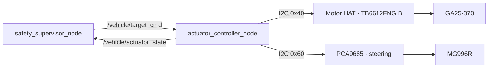

# Jetson-OrinCar I2C 연동명세

## 1. Seam과 소유권

ROS 제어와 물리 actuator 사이의 seam은 `/vehicle/target_cmd`와 `/vehicle/actuator_state`다. `actuator_controller_node`는 이 seam의 유일한 hardware adapter이며, I2C 구현 전체를 내부에 숨긴다.

## 2. I2C 계약

| 항목 | 요구사항 |
|---|---|
| Bus | 실제 Jetson bus를 `i2cdetect`로 확인하고 config에 고정 |
| Address | Motor HAT `0x40`, steering PCA9685 `0x60`; 둘 중 하나라도 다르면 활성화 금지 |
| Owner | `actuator_controller_node` process 하나만 device file open |
| Concurrency | camera·Planner·test script의 직접 I2C 접근 금지 |
| Startup | throttle 0, drive disabled, address 확인 후에만 준비 상태 |
| Shutdown | throttle 0 write 성공을 확인하고 종료; 실패 시 fault 기록 |
| Retry | 무제한 retry 금지; 짧은 제한 횟수 후 motion disabled |

## 3. 명령 수락 조건

다음 조건을 모두 만족한 `VehicleCommand`만 적용한다.

- `enable=true`이고 현재 stage의 motion activation이 명시됨
- sequence가 마지막 적용값보다 큼
- timestamp와 `valid_for` 기준으로 만료되지 않음
- throttle·steering이 `[-1.0, 1.0]` 안에 있고 NaN·Inf가 아님
- 현재 profile이 actuator를 허용하는 stage임
- command source가 stage별 허용 목록과 일치함
- I2C address와 최근 write 상태가 정상

하나라도 실패하면 throttle 0을 요청하고 stop reason을 남긴다. 단, process kill 시 이 동작 자체가 실행되지 않을 수 있으므로 독립 Safety로 주장하지 않는다.

## 4. 상태 의미

`/vehicle/actuator_state`는 다음 사실만 증명한다.

- 어떤 command sequence를 처리했는가
- 어떤 normalized 값과 PWM 값을 계산했는가
- I2C write 호출이 성공했는가
- software enable과 fault 상태가 무엇인가

실제 차속, 실제 이동거리, 실제 steering angle, motor current, battery voltage는 측정하지 않는다.

## 5. 단계별 검증 Gate

1. 전원 OFF continuity·극성 확인
2. logic 전원만 인가하고 `0x40`, `0x60` scan
3. servo horn을 분리하거나 바퀴 간섭을 제거한 center 시험
4. 구동 바퀴를 띄우고 throttle `0.05 → 0.10 → 0.15` 단계 시험
5. command timeout·I2C unplug·정상 종료 시 출력 관찰
6. process `SIGKILL` 후 PWM 유지 여부 기록
7. `drive-test`에서 deadman·timeout·저출력 정지 관찰
8. Rule·Agent 단계에서 source-stage 불일치 command 거부
9. 한 항목이라도 예상과 다르면 다음 motion stage는 No-Go
