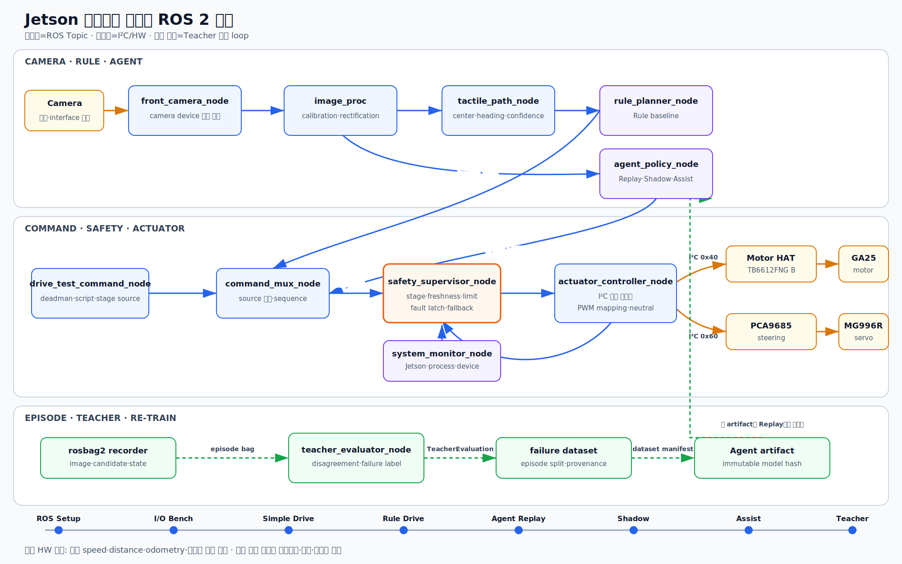
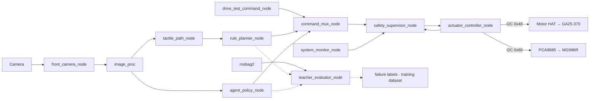

# Jetson 단일보드 ROS 2 Node 요구사항

> 모든 Node는 Jetson에서 실행한다. Node 이름은 외부 책임과 Interface를 정하며 내부 callback·class·모델 구현은 상세설계에서 작성한다.

[편집 가능한 SVG 원본](./diagrams/orincar-ros-node-topic-graph.svg)

## 1. ROS graph

## 2. 필수 Node

| Node | 한 줄 역할 | 구독 입력 | 발행 Topic → 구독 Node | 최초 단계 |
|---|---|---|---|---|
| `front_camera_node` | 전방 camera frame과 보정 정보를 ROS message로 제공한다. | camera device | `/camera/front/image_raw` → `image_proc`, recorder `/camera/front/camera_info` → `image_proc`, recorder | `HC-M1` |
| `image_proc` | camera calibration을 적용해 왜곡이 제거된 image를 만든다. | `/camera/front/image_raw` `/camera/front/camera_info` | `/camera/front/image_rect` → `tactile_path_node`, `agent_policy_node`, recorder | `HC-M1` |
| `tactile_path_node` | 보정 image에서 점자 경로의 중심·방향·confidence를 계산한다. | `/camera/front/image_rect` | `/perception/tactile_path` → `rule_planner_node`, `safety_supervisor_node`, recorder | `HC-M4` |
| `drive_test_command_node` | Bench와 간단 주행시험의 deadman 기반 command를 생성한다. | local CLI·stage config | `/vehicle/bench_cmd` → `command_mux_node`, recorder `/vehicle/drive_test_cmd` → `command_mux_node`, recorder | `HC-M2` |
| `rule_planner_node` | 점자 경로를 규칙 기반 steering·throttle 후보로 변환한다. | `/perception/tactile_path` | `/vehicle/rule_cmd` → `command_mux_node`, recorder | `HC-M4` |
| `agent_policy_node` | image에서 Agent command 후보와 추론 상태를 생성한다. | `/camera/front/image_rect` model artifact | `/vehicle/agent_cmd` → `command_mux_node`, recorder `/autonomy/agent_state` → `safety_supervisor_node`, `teacher_evaluator_node`, recorder | `HC-M5` |
| `teacher_evaluator_node` | 저장된 episode의 Rule·Agent 결과를 비교해 failure label을 만든다. | immutable rosbag·model/rule output | `/teacher/evaluation` → dataset pipeline, recorder dataset manifest → 학습 pipeline file | `HC-M7` |
| `command_mux_node` | 현재 stage에서 허용한 command source 하나를 선택하고 sequence를 부여한다. | `/vehicle/bench_cmd` `/vehicle/drive_test_cmd` `/vehicle/rule_cmd` `/vehicle/agent_cmd` | `/vehicle/proposed_cmd` → `safety_supervisor_node`, recorder | `HC-M2` |
| `safety_supervisor_node` | command freshness·범위·stage·진단을 검사해 안전한 최종 command만 승인한다. | `/vehicle/proposed_cmd` `/perception/tactile_path` `/autonomy/agent_state` `/vehicle/actuator_state` `/diagnostics` | `/vehicle/target_cmd` → `actuator_controller_node`, recorder `/safety/state` → 전체 Node, recorder | `HC-M2` |
| `actuator_controller_node` | 정규화된 최종 command를 Motor HAT·PCA9685 I2C 출력으로 변환한다. | `/vehicle/target_cmd` | `/vehicle/actuator_state` → `safety_supervisor_node`, recorder | `HC-M2` |
| `system_monitor_node` | Jetson process·자원·온도·device 상태와 다른 Node 진단을 감시한다. | OS·process·device 다른 Node의 `/diagnostics` | `/diagnostics` → `safety_supervisor_node`, monitor, recorder | `HC-M0` |

모든 주요 Node는 자신의 오류·지연·device 상태를 `/diagnostics`로 발행한다. rosbag2 recorder는 표준 process로 실행하고 별도 custom Node로 정의하지 않는다.

## 3. Profile별 실행과 권한

| Profile | command source | actuator 적용 | 핵심 제한 |
|---|---|---:|---|
| `ros-setup` | 없음 | 불가 | contract·diagnostics만 |
| `camera-bench` | 없음 | 불가 | I2C device 없음 |
| `actuator-bench` | `BENCH` | 조건부 | 바퀴를 띄움 |
| `drive-test` | `DRIVE_TEST` | 조건부 | 짧은 open-loop·운영자 deadman |
| `rule-replay` | `RULE` | 불가 | file input·I2C 없음 |
| `rule-drive` | `RULE` | Gate 통과 후 | 빈 통제코스·장애물 시나리오 금지 |
| `agent-replay` | `AGENT` | 불가 | rule과 offline 비교 |
| `agent-shadow` | `RULE`만 | Agent 불가 | 같은 frame에서 두 후보 기록 |
| `agent-assist` | `AGENT`, fallback `RULE` | 제한적 | threshold·limit·fallback 강제 |
| `teacher-replay` | 없음 | 불가 | 평가·label·dataset만 |

## 4. Module과 seam

- `actuator_controller_node` Module은 I2C address, channel, PWM mapping, neutral, retry를 `VehicleCommand` Interface 뒤에 숨긴다.
- `command_mux_node` Module은 stage별 source 우선순위와 sequence 부여를 숨긴다.
- `agent_policy_node`와 `rule_planner_node`는 같은 `VehicleCommand` Interface를 사용하므로 mux 이후 경로를 공유한다.
- `teacher_evaluator_node`는 주행 경로 밖에 있으며 target command를 발행하지 않는다.
- test script·Rule·Agent·Teacher·container entrypoint는 `/dev/i2c-*`를 직접 열지 않는다.
- `ActuatorState`는 계산·write 상태이지 실제 차량 motion feedback이 아니다.

## 5. Lifecycle·고장 동작

| Node | 시작 | 오류 | 종료 |
|---|---|---|---|
| camera·perception | device·calibration 확인 후 active | stale/invalid 진단 | publisher 정지 |
| drive-test command | enable false·deadman released | 즉시 neutral candidate | neutral 1회 후 정지 |
| rule | Replay 또는 승인 stage 확인 | lost/ambiguous면 throttle 0 | candidate 정지 |
| Agent | artifact hash·warm-up 확인 | invalid·timeout이면 후보 폐기 | candidate 정지 |
| Teacher | immutable bag·manifest 확인 | episode 격리·평가 실패 기록 | dataset manifest 확정 |
| mux | source 없음 → neutral | 미허용 source 폐기 | neutral proposed command |
| Safety | STOP 시작 | fault latch·neutral target | neutral target 시도 |
| actuator | address 확인·neutral write 후 ready | throttle 0 시도·fault 발행 | throttle 0 write 후 종료 |

process `SIGKILL`, kernel hang, 전원 단절에는 정상 종료가 실행되지 않는다. 이 한계는 후속 단계에서도 사라지지 않으며 운영 조건과 시험 결과에 계속 기록한다.
