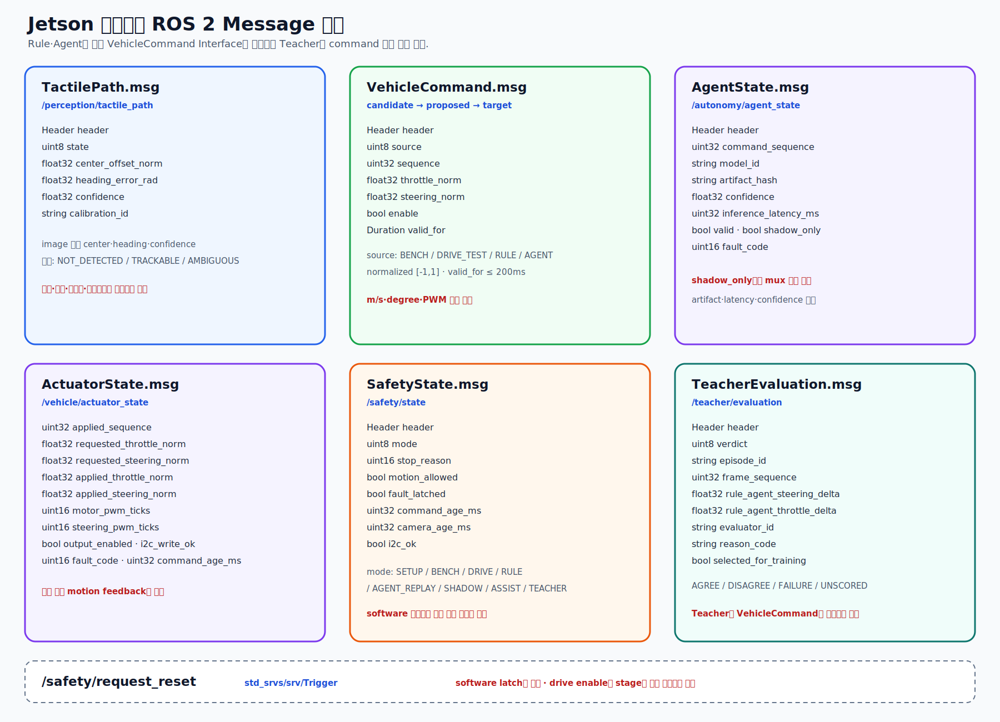

# Jetson 단일보드 ROS 2 Topic·Message Interface 명세

[편집 가능한 Message 계약 SVG 원본](./diagrams/orincar-ros-message-contracts.svg)



## 1. Topic 계약

| Topic | Type | Publisher → Subscriber | QoS 초기값 | 단계·Freshness |
|---|---|---|---|---|
| `/camera/front/image_raw` | `sensor_msgs/msg/Image` | camera → image_proc/recorder | best effort, depth 1 | camera stage, 200ms `[검증 필요]` |
| `/camera/front/camera_info` | `sensor_msgs/msg/CameraInfo` | camera → image_proc/recorder | reliable, depth 1 | calibration ID 일치 |
| `/camera/front/image_rect` | `sensor_msgs/msg/Image` | image_proc → perception/Agent/recorder | best effort, depth 1 | 200ms `[검증 필요]` |
| `/perception/tactile_path` | `step_step_interfaces/msg/TactilePath` | perception → Rule/Safety/recorder | reliable, depth 1 | 200ms |
| `/vehicle/bench_cmd` | `step_step_interfaces/msg/VehicleCommand` | drive-test → mux/recorder | reliable, depth 1, lifespan | actuator-bench만, 200ms |
| `/vehicle/drive_test_cmd` | `step_step_interfaces/msg/VehicleCommand` | drive-test → mux/recorder | reliable, depth 1, lifespan | simple drive만, 200ms |
| `/vehicle/rule_cmd` | `step_step_interfaces/msg/VehicleCommand` | Rule → mux/recorder | reliable, depth 1, lifespan | rule stage, 200ms |
| `/vehicle/agent_cmd` | `step_step_interfaces/msg/VehicleCommand` | Agent → mux/recorder | reliable, depth 1, lifespan | Replay/Shadow/Assist, 200ms |
| `/autonomy/agent_state` | `step_step_interfaces/msg/AgentState` | Agent → Safety/Teacher/recorder | reliable, depth 5 | command sequence와 결합 |
| `/vehicle/proposed_cmd` | `step_step_interfaces/msg/VehicleCommand` | mux → Safety/recorder | reliable, depth 1, lifespan | 200ms |
| `/vehicle/target_cmd` | `step_step_interfaces/msg/VehicleCommand` | Safety → actuator/recorder | reliable, depth 1, lifespan | 200ms cutoff |
| `/vehicle/actuator_state` | `step_step_interfaces/msg/ActuatorState` | actuator → Safety/recorder | reliable, depth 5 | measured motion 아님 |
| `/safety/state` | `step_step_interfaces/msg/SafetyState` | Safety → 전체/recorder | reliable, transient local, depth 1 | 변경+10Hz |
| `/teacher/evaluation` | `step_step_interfaces/msg/TeacherEvaluation` | Teacher → dataset pipeline/recorder | reliable, depth 10 | teacher-replay만 |
| `/diagnostics` | `diagnostic_msgs/msg/DiagnosticArray` | 각 Node → monitor/Safety/recorder | reliable, depth 10 | 1s |

## 2. `TactilePath.msg`

```text
std_msgs/Header header

uint8 STATE_NOT_DETECTED=0
uint8 STATE_TRACKABLE=1
uint8 STATE_AMBIGUOUS=2
uint8 state

float32 center_offset_norm
float32 heading_error_rad
float32 confidence
string calibration_id
```

- `center_offset_norm`은 image center 기준 `[-1.0, 1.0]`이다.
- `confidence`는 `[0.0, 1.0]`이다.
- 거리·속도·세계좌표·장애물 유무를 포함하지 않는다.

## 3. `VehicleCommand.msg`

```text
std_msgs/Header header

uint8 SOURCE_NONE=0
uint8 SOURCE_BENCH=1
uint8 SOURCE_DRIVE_TEST=2
uint8 SOURCE_RULE=3
uint8 SOURCE_AGENT=4
uint8 source

uint32 sequence
float32 throttle_norm
float32 steering_norm
bool enable
builtin_interfaces/Duration valid_for
```

- `throttle_norm`, `steering_norm`은 `[-1.0, 1.0]`이며 m/s·degree가 아니다.
- `command_mux_node`는 proposed command부터 전역 단조 증가 sequence를 부여한다.
- Safety는 승인 시 sequence/source를 보존하고, 거부 시 같은 sequence의 neutral을 발행한다.
- `header.stamp + valid_for`가 지난 command는 적용하지 않는다.
- NaN·Inf·범위 초과·역행 sequence·stage에 허용되지 않은 source는 거부한다.

## 4. `AgentState.msg`

```text
std_msgs/Header header

uint32 command_sequence
string model_id
string artifact_hash
float32 confidence
uint32 inference_latency_ms
bool valid
bool shadow_only
uint16 fault_code
```

- `command_sequence`는 같은 frame에서 생성된 agent command와 연결된다.
- `shadow_only=true`이면 mux가 해당 Agent command를 선택할 수 없다.
- model identity와 latency가 없으면 Agent 후보는 invalid다.
- confidence threshold는 stage config에서 고정하고 bag metadata에 기록한다.

## 5. `TeacherEvaluation.msg`

```text
std_msgs/Header header

uint8 VERDICT_UNSCORED=0
uint8 VERDICT_AGREE=1
uint8 VERDICT_DISAGREE=2
uint8 VERDICT_FAILURE=3
uint8 verdict

string episode_id
uint32 frame_sequence
float32 rule_agent_steering_delta
float32 rule_agent_throttle_delta
string evaluator_id
string reason_code
bool selected_for_training
```

- Teacher 평가는 immutable episode와 frame sequence를 가리킨다.
- `selected_for_training=true`는 dataset 후보라는 뜻이며 model 승격을 뜻하지 않는다.
- Teacher는 `VehicleCommand`와 `/vehicle/target_cmd`를 발행하지 않는다.

## 6. `ActuatorState.msg`

```text
std_msgs/Header header

uint32 applied_sequence
float32 requested_throttle_norm
float32 requested_steering_norm
float32 applied_throttle_norm
float32 applied_steering_norm
uint16 motor_pwm_ticks
uint16 steering_pwm_ticks
bool output_enabled
bool i2c_write_ok
uint16 fault_code
uint32 command_age_ms
```

- `applied_*`는 계산·write 요청값이며 실제 motion 측정값이 아니다.
- `i2c_write_ok=true`는 OS I2C call 성공만 뜻한다.
- sensor가 추가되기 전까지 Message 이름에 `feedback`을 사용하지 않는다.

## 7. `SafetyState.msg`

```text
std_msgs/Header header

uint8 MODE_STOP=0
uint8 MODE_ROS_SETUP=1
uint8 MODE_CAMERA_BENCH=2
uint8 MODE_ACTUATOR_BENCH=3
uint8 MODE_DRIVE_TEST=4
uint8 MODE_RULE_REPLAY=5
uint8 MODE_RULE_DRIVE=6
uint8 MODE_AGENT_REPLAY=7
uint8 MODE_AGENT_SHADOW=8
uint8 MODE_AGENT_ASSIST=9
uint8 MODE_TEACHER_REPLAY=10
uint8 mode

uint16 STOP_NONE=0
uint16 STOP_NOT_ARMED=1
uint16 STOP_COMMAND_STALE=2
uint16 STOP_COMMAND_INVALID=3
uint16 STOP_I2C_FAULT=4
uint16 STOP_CAMERA_STALE=5
uint16 STOP_PROCESS_FAULT=6
uint16 STOP_STAGE_VIOLATION=7
uint16 STOP_AGENT_INVALID=8
uint16 stop_reason

bool motion_allowed
bool fault_latched
uint32 command_age_ms
uint32 camera_age_ms
bool i2c_ok
```

`motion_allowed`는 현재 stage의 software 조건만 만족했다는 뜻이다. 독립적인 물리 안전을 보장하지 않는다.

## 8. Service 계약

| Service | Type | 규칙 |
|---|---|---|
| `/safety/request_reset` | `std_srvs/srv/Trigger` | target neutral, I2C 정상, 운영자 확인일 때 software latch만 해제 |

reset은 drive enable을 자동으로 켜지 않는다. stage 변경은 별도 launch/config와 사전 Gate 증거로만 수행한다.

## 9. 사용하지 않는 Interface

현재 보유 HW에는 원천 데이터가 없으므로 `/scan`, `/imu/data`, `/wheel/odom`, `/odometry/filtered`와 동적 `odom → base_link` TF를 발행하지 않는다.

## 10. 변경 관리

- 실제 `.msg`·`.srv`와 이 문서는 같은 MR에서 변경한다.
- type hash를 release manifest와 rosbag metadata에 기록한다.
- field 제거·단위 변경은 Replay migration 없이 수행하지 않는다.
- I2C address·PWM channel·pulse는 Message가 아니라 actuator config에 둔다.
