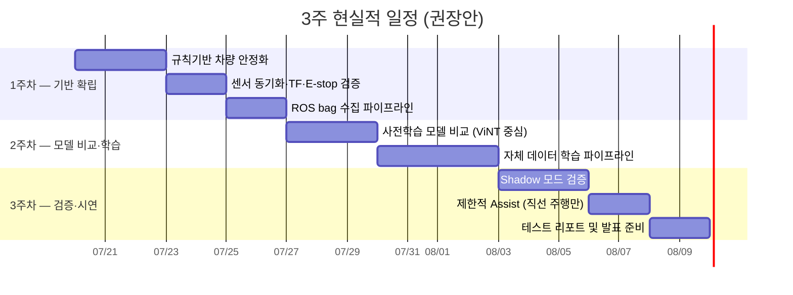

# 🚗 자율주행 기획 문서 종합 평가 리포트

> **평가 대상**: [03_자율주행](file:///C:/Users/SSAFY/Desktop/step-step/03_자율주행) 디렉토리 내 14개 문서  
> **평가 일시**: 2026-07-20  
> **제약 조건**: 약 3주(21일) 내 프로젝트 완수  

---

## 📊 총평

| 항목 | 평가 |
|---|---|
| **문서 품질** | ⭐⭐⭐⭐⭐ 매우 높음 |
| **기술적 정확성** | ⭐⭐⭐⭐☆ 우수 (일부 보완 필요) |
| **초보자 친화성** | ⭐⭐⭐⭐⭐ 탁월 |
| **문서 간 연결성** | ⭐⭐⭐⭐⭐ 논리적 흐름 |
| **3주 내 실현 가능성** | ⭐⭐☆☆☆ **매우 도전적** |

> [!IMPORTANT]
> **핵심 결론**: 기획 자체는 공학적으로 매우 탄탄하고 잘 설계된 '이상적인 과정'입니다. 그러나 현재 로드맵(6단계 전체)을 3주 안에 완수하는 것은 **비현실적**입니다. **3단계(자체 데이터 학습)까지를 핵심 목표로 설정하고, Shadow/Assist는 제한적으로 시도**하는 전략이 필요합니다.

---

## 📚 A구간: 기초 개념 문서 (01~04) — 평가: 탁월

### 강점
- 원격조종 / 자동화 / 자율주행의 차이를 표로 정리하여 초보자 오해를 직관적으로 해소
- 사람의 감각 기관과 로봇 센서를 비교한 표가 매우 이해하기 쉬움
- Jetson(인지/판단)과 RPi(제어/안전) 분리 구조가 실무적으로 합리적
- 헷갈리는 용어 비교 정리(Path vs Trajectory, Train vs Inference)가 팀원 질문을 줄여줌

### 보완 필요 사항

| 문서 | 빠진 내용 | 권고 |
|---|---|---|
| [01_자율주행이란.md](file:///C:/Users/SSAFY/Desktop/step-step/03_자율주행/01_자율주행이란.md) | **보행자 상호작용** 관련 안전 수칙 | 사람 발견 시 정지/우회 규칙 추가 |
| [02_로봇은_어떻게...md](file:///C:/Users/SSAFY/Desktop/step-step/03_자율주행/02_로봇은_어떻게_스스로_움직이는가.md) | **통신 지연(Latency)** 이슈 | Jetson-RPi 간 통신 지연이 제어에 미치는 영향 언급 |
| [03_우리_프로젝트...md](file:///C:/Users/SSAFY/Desktop/step-step/03_자율주행/03_우리_프로젝트의_자율주행_구조.md) | **학습 데이터 저장 트리거** | 어떤 순간에 데이터를 저장할지 구체화 |
| [04_자율주행_AI...md](file:///C:/Users/SSAFY/Desktop/step-step/03_자율주행/04_자율주행_AI_핵심용어.md) | **Data Drift / Distribution Shift** | 환경 변이 용어 추가 (실내→실외 문제 예방) |

---

## 🔄 B구간: 방식 비교 & 로드맵 (05~07) — 평가: 우수

### 강점
- 규칙 기반을 베이스라인(Teacher), AI를 보조(Assist)로 쓰는 **혼합 방식**은 3주 내 가장 현실적인 접근
- Safety Supervisor를 독립 계층으로 분리한 설계가 뛰어남
- Episode 단위 데이터 수집 강조는 자율주행 학습의 본질을 정확히 파악
- 실패 데이터(가림, 단절, 개입) 수집 우선순위가 매우 적절

### 보완 필요 사항

| 항목 | 상세 |
|---|---|
| **디버깅 오버헤드 미반영** | ROS 통신 지연, 타임스탬프 불일치 해결에 상당한 시간 소요 예상 |
| **하드웨어 변수 미고려** | 배터리 전압 변화, 모터 출력 비선형성이 학습 데이터의 노이즈가 될 수 있음 |
| **로드맵 일정이 과도** | 6단계 전체 완수는 6개월~1년 프로젝트 수준을 3주에 압축한 것 |

---

## 🔧 C구간 전반: 구현 가이드 Phase 1-3 (10~12) — 평가: 우수

### 강점
- 데이터 품질 Gate와 Shadow 평가를 거치는 단계적 접근이 모범적
- Zero-shot 비교를 통한 Baseline 설정 방식이 리스크를 최소화
- Frozen Encoder 전략은 소량 자체 데이터셋에 매우 적절
- Episode 단위 Data Leakage 차단이 모범적

### 보완 필요 사항

| 문서 | 빠진 내용 | 권고 |
|---|---|---|
| [10_규칙기반...md](file:///C:/Users/SSAFY/Desktop/step-step/03_자율주행/10_규칙기반_차량완성_및_데이터수집.md) | **통신 대역폭** | Jetson에서 모든 토픽(이미지 포함) 기록 시 USB/디스크 병목 가능. `image_transport` 압축 설정 구체화 필요 |
| [11_사전학습...md](file:///C:/Users/SSAFY/Desktop/step-step/03_자율주행/11_사전학습_모델_활용.md) | **Input Preprocessing 부하** | 모델별 Image Resize/Normalize의 ROS 2 노드 부하 테스트 필요 |
| [12_자체데이터...md](file:///C:/Users/SSAFY/Desktop/step-step/03_자율주행/12_자체데이터_기반_학습.md) | **Teacher 데이터 품질** | 수동 주행 데이터의 일관성 문제. 규칙 기반 주행 데이터를 메인 Teacher로 삼아야 함 |

### 추가 고려 모델
- **Diffusion Policy**: 최근 로봇 제어에서 각광. NoMaD가 무겁다면 가벼운 Diffusion Policy 적용 검토
- **데이터 증강**: 카메라 영상에 노이즈/위치 미세 변형으로 강건성 학습(Robustness Training)

---

## 🚀 C구간 후반: 구현 가이드 Phase 4-6 (13~15) — 평가: 우수하나 일정 비현실적

### 강점
- "실패 직전 → 사람 개입 → 복구"를 하나의 에피소드로 묶는 방식이 실무적으로 매우 중요
- Go/No-Go 판정을 결과 확인 전에 고정하라는 지침이 인상적
- "최적화는 마지막에 한다" 원칙과 TensorRT FP16 시작 접근이 정석적

### 보완 필요 사항

| 문서 | 빠진 내용 | 권고 |
|---|---|---|
| [13_Teacher...md](file:///C:/Users/SSAFY/Desktop/step-step/03_자율주행/13_Teacher_및_실패데이터_강화.md) | **조작자 간 편차** | 수동 주행 가이드라인(조작자 교육) 문서화 필요 |
| [14_Shadow...md](file:///C:/Users/SSAFY/Desktop/step-step/03_자율주행/14_Shadow_Assist_단계검증.md) | **일정 현실성** | 4단계(제한적 실차 제어)까지 3주 내 도달은 극히 어려움 |
| [15_Jetson...md](file:///C:/Users/SSAFY/Desktop/step-step/03_자율주행/15_Jetson_배포_최적화.md) | **로그 데이터 관리** | 3주간의 수집 데이터 저장 공간 확보 및 필터링 전략 필요 |

> [!WARNING]
> **QAT(Quantization Aware Training)** 는 시간과 자원이 매우 많이 소모됩니다. FP16으로 목표 FPS 미달 시 QAT보다 **모델 경량화(구조 축소)를 우선 검토**하세요.

---

## ⏰ 3주 현실적 일정 제안

현재 로드맵 6단계를 전부 완수하기엔 3주가 매우 촉박합니다. 아래와 같이 우선순위를 재조정할 것을 권고합니다.

### 주차별 핵심 목표

| 주차 | 단계 | 핵심 목표 | 성공 기준 |
|---|---|---|---|
| **1주차** | 10단계 | 규칙 기반 주행 완벽 안정화 + ROS bag 10개 수집 | 재생 가능한 episode, E-stop 정상 동작 |
| **2주차** | 11~12단계 | 모델 비교 3일 제한 → ViNT 중심 학습 파이프라인 | Offline 지표 확보, 재현 가능한 학습 루프 |
| **3주차** | 14단계(일부) | Shadow 모드 + 제한적 직선 주행 Assist | 통제 코스 내 안전한 시연 |

> [!CAUTION]
> **1단계(데이터 로깅과 규칙 기반 주행의 완벽한 안정화)가 프로젝트 성공의 80%를 결정합니다.** 1단계에서 절대 서두르지 마세요.

---

## ✅ 즉시 실행 Action Items

1. **[즉시]** 10단계 bag 파일 기록 시 Jetson 디스크 쓰기 속도 및 CPU 부하 테스트(htop) 수행
2. **[즉시]** AI와 별개로 동작하는 **Safety Monitor 노드** 설계를 10단계 체크리스트에 추가
3. **[1주차]** 모델 비교는 **최대 3일로 제한**하고 ViNT로 빠르게 중심 선정
4. **[1주차]** Validation set에 대한 **자동 평가 스크립트**를 가장 먼저 작성
5. **[2주차]** 수동 데이터보다 **규칙 기반 주행 데이터를 학습의 메인 Teacher**로 설정
6. **[3주차]** FP16으로 목표 FPS 미달 시 QAT보다 **모델 구조 축소** 우선 검토
7. **[공통]** 시뮬레이터(Gazebo/ISAAC Sim) 활용으로 실차 시험 실패를 사전 감소

---

## 🔍 빠진 내용 총정리

| 카테고리     | 누락 사항                                   | 중요도   |
| -------- | --------------------------------------- | ----- |
| **안전**   | 보행자 상호작용 규칙 (정지/우회)                     | 🔴 높음 |
| **안전**   | Dead-man Switch (0.5초 이상 메시지 없으면 강제 정지) | 🔴 높음 |
| **인프라**  | Jetson 디스크/USB 대역폭 병목 대응                | 🟠 중간 |
| **인프라**  | 3주간 수집 데이터의 저장 공간 관리 전략                 | 🟠 중간 |
| **학습**   | Data Drift / Distribution Shift 대비      | 🟡 낮음 |
| **학습**   | 조작자 간 편차 보정을 위한 수동 주행 가이드라인             | 🟡 낮음 |
| **통신**   | Jetson-RPi 간 통신 지연이 제어에 미치는 영향          | 🟠 중간 |
| **하드웨어** | 배터리 전압 변화, 모터 비선형성의 노이즈 영향              | 🟡 낮음 |

---

## 💡 대안 및 개선 제안

1. **시뮬레이터 우선 활용**: 실차 시험 전 Gazebo/ISAAC Sim에서 수천 번의 가상 테스트로 실차 검증 실패를 획기적으로 감소
2. **Diffusion Policy 검토**: NoMaD가 무겁다면 최근 로봇 제어에서 각광받는 가벼운 Diffusion Policy 적용 고려
3. **자동 기록 스크립트**: 데이터 수집 시점에 ROS bag 외 '사건 발생 지점' 자동 기록 → 추후 데이터 정제 시간 절감
4. **팀 학습 세션**: 기초 문서(01~04) 함께 읽고 '이해 확인' 질문에 대해 실시간 토론하는 시간을 갖는 것이 효과적

> [!TIP]
> **"완벽한 모델"보다는 "실패를 기록하고 복구하는 프로세스"가 구축되었는지를 중심으로 평가하세요.** 3주 내 완수는 '모든 기능 구현'이 아니라, '핵심 기능을 검증된 안전 가이드 내에서 실차로 시연'하는 것에 집중해야 합니다.
