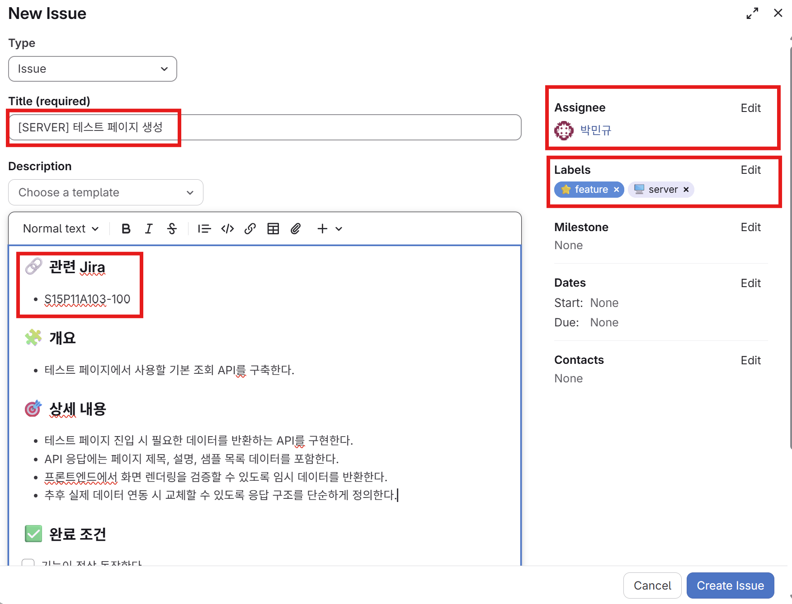
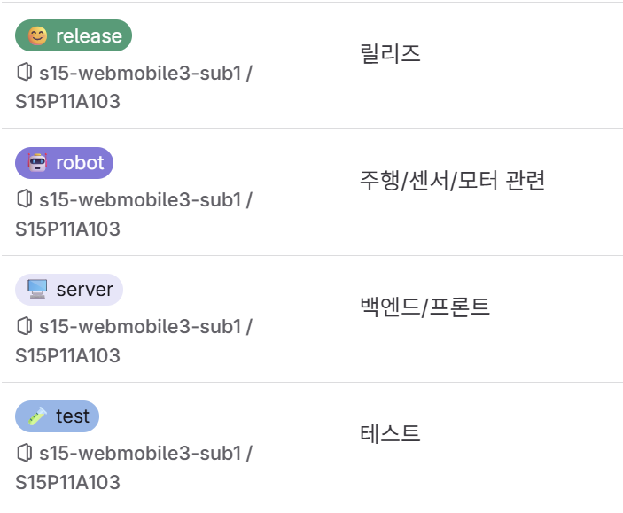
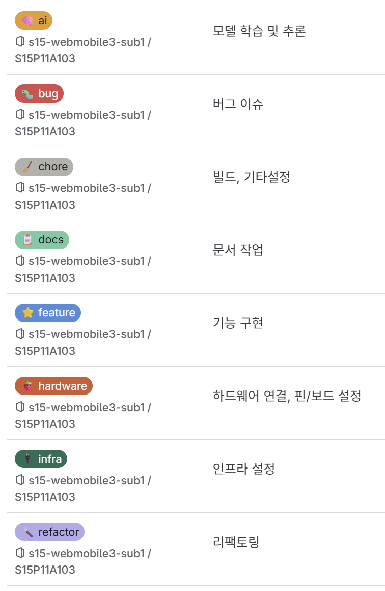
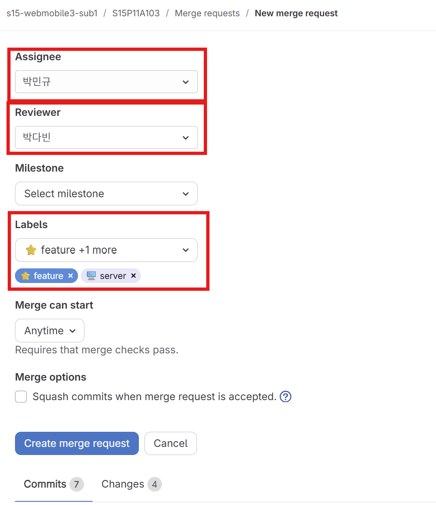

# 팀 GitLab / Jira 협업 컨벤션

## 1. 기본 원칙

우리 팀의 작업 관리는 **Jira를 기준**으로 한다.

모든 개발 작업은 Jira 키를 기준으로 브랜치, 커밋, GitLab Issue, MR을 연결한다.

이미 Jira에 태스크가 만들어져 있다면 새 Jira 이슈를 만들지 않고, 기존 Jira 키를 가져와서 사용한다.  
새로운 작업이 필요하지만 Jira 태스크가 아직 없을 때만 Jira 이슈를 새로 만든다.

예시:

```text
S15P11A103-302
```

---

## 2. 전체 작업 흐름

```text
Jira 이슈 확인 또는 생성
→ GitLab Issue 생성
→ 브랜치 생성
→ 개발
→ 커밋
→ -merge 브랜치 생성
→ 최신 develop 계열 브랜치와 미리 병합
→ 충돌 해결 및 테스트
→ MR 생성
→ 리뷰
→ 머지
→ GitLab Issue 및 Jira 이슈 완료 처리
```

자동화 도구를 쓰는 사람도, 직접 GitLab/Jira에서 작업하는 사람도 이 흐름을 따른다.


## 3. GitLab Issue 생성 규칙

GitLab Issue는 Jira 이슈와 별개로 생성한다.

이미 Jira 태스크가 있는 작업도 GitLab Issue를 만든다.  
GitLab Issue는 GitLab 안에서 코드 변경, 브랜치, MR을 추적하기 위한 용도로 사용한다.

GitLab Issue를 만들 때는 아래 빨간 박스로 표시된 항목을 반드시 확인한다.



필수 확인 항목:

- Type은 `Issue`로 선택한다.
- Title에는 작업 파트와 작업 내용을 짧게 적는다.
- Description에는 관련 Jira 키를 반드시 적는다.
- Assignee는 실제 작업 담당자로 지정한다.
- Labels는 작업 성격과 파트에 맞게 선택한다.

### GitLab Issue 제목

권장 형식:

```text
[DOMAIN] 작업 요약
```

예시:

```text
[AI] 객체 탐지 API 구현
[SERVER] Kafka Consumer 재연결 오류 수정
[ROBOT] 라이다 스캔 처리 추가
```

## 4. 라벨 규칙

라벨은 이슈나 MR의 성격을 빠르게 파악하기 위해 사용한다.

라벨은 새로 만들지 말고, GitLab에 이미 있는 라벨 중에서 선택한다.

아래 화면에 있는 라벨 중에서 작업에 맞는 라벨을 선택한다.





### 라벨 선택 예시

AI 기능 개발:

```text
ai, feature
```

Kafka 설정 작업:

```text
server, infra
```

문서 수정:

```text
docs
```

로봇 센서 코드 수정:

```text
robot, refactor
```

## 5. 브랜치 전략

우리 저장소는 다음 구조를 기준으로 한다.

```text
main
└─ develop
   ├─ ai/develop
   ├─ server/develop
   └─ robot/develop
```

각자 작업 브랜치는 자신의 파트 develop 브랜치에서 만든다.

예시:

```text
ai/develop
→ ai/feature/S15P11A103-302-object-detection-api
```

```text
server/develop
→ server/feature/S15P11A103-411-kafka-consumer
```

```text
robot/develop
→ robot/fix/S15P11A103-520-sensor-timeout
```

공통 작업은 `develop`에서 분기한다.

```text
develop
→ chore/S15P11A103-600-ci-cache
```

---

## 6. 브랜치 이름 규칙

```text
<domain>/<type>/<Jira키>-<짧은-영문-설명>
```

또는 공통 작업이면:

```text
<type>/<Jira키>-<짧은-영문-설명>
```

### domain

| domain | 사용 시점 |
|---|---|
| ai | AI, 모델, 추론, 이미지 분석 |
| server | 백엔드, 프론트엔드, API, DB |
| robot | 로봇, 센서, 모터, 하드웨어 제어 |

### type

| type | 의미 |
|---|---|
| feature | 기능 추가 |
| fix | 버그 수정 |
| refactor | 리팩토링 |
| docs | 문서 작업 |
| chore | 설정, 빌드, 기타 작업 |
| test | 테스트 작업 |

### 예시

```text
ai/feature/S15P11A103-302-object-detection-api
server/fix/S15P11A103-411-mqtt-reconnect
robot/feature/S15P11A103-520-lidar-scan
docs/S15P11A103-610-update-git-rule
chore/S15P11A103-620-ci-cache
```

---

## 7. 커밋 메시지 규칙

커밋 메시지에는 Jira 키를 포함한다.

```text
feat(S15P11A103-302): 객체 탐지 API 추가
fix(S15P11A103-411): Kafka Consumer 재연결 오류 수정
docs(S15P11A103-610): Git 협업 규칙 문서 추가
```

### type 예시

| type | 의미 |
|---|---|
| feat | 기능 추가 |
| fix | 버그 수정 |
| refactor | 리팩토링 |
| docs | 문서 수정 |
| test | 테스트 코드 |
| chore | 설정, 빌드, 기타 작업 |

---

## 8. -merge 브랜치 규칙

작업 브랜치를 바로 `ai/develop`, `server/develop`, `robot/develop`에 MR로 올리지 않는다.

먼저 개인 통합 검증용 브랜치인 `-merge` 브랜치를 만든다.

### 왜 -merge 브랜치를 쓰는가?

- develop 계열 브랜치를 직접 건드리지 않고 충돌을 미리 확인할 수 있다.
- 충돌 해결 중 실수해도 원본 작업 브랜치와 develop 브랜치가 안전하다.
- 각자 자기 작업만 책임지고 통합 테스트할 수 있다.
- 문제가 생기면 `-merge` 브랜치만 삭제하고 다시 만들면 된다.

### 예시

원본 작업 브랜치:

```text
ai/feature/S15P11A103-302-object-detection-api
```

통합 검증용 브랜치:

```text
ai/feature/S15P11A103-302-object-detection-api-merge
```
---

## 9. -merge 브랜치 작업 순서

예시는 AI 파트 기준이다.

### 1. 작업 브랜치에서 개발 완료

```bash
git checkout ai/feature/S15P11A103-302-object-detection-api
```

작업 후 커밋까지 완료한다.

### 2. -merge 브랜치 생성

```bash
git checkout -b ai/feature/S15P11A103-302-object-detection-api-merge
```

### 3. 최신 develop 계열 브랜치 가져오기

```bash
git fetch origin
git merge origin/ai/develop
```

server 파트라면:

```bash
git merge origin/server/develop
```

robot 파트라면:

```bash
git merge origin/robot/develop
```

### 4. 충돌 해결

충돌이 나면 `-merge` 브랜치에서만 해결한다.

충돌 표시:

```text
<<<<<<< HEAD
내 코드
=======
develop 쪽 코드
>>>>>>> origin/ai/develop
```

어떤 코드를 남길지 애매하면 관련 팀원에게 확인한다.

### 5. 테스트

로컬에서 빌드, 실행, 테스트를 확인한다.

### 6. 원격에 push

```bash
git push -u origin ai/feature/S15P11A103-302-object-detection-api-merge
```

---

## 10. MR 생성 규칙

MR은 `-merge` 브랜치에서 각 파트 develop 브랜치로 올린다.

MR을 만들 때는 아래 빨간 박스로 표시된 항목을 반드시 확인한다.



필수 확인 항목:

- Assignee는 실제 작업 담당자로 지정한다.
- Reviewer는 최소 1명 이상 지정한다.
- Labels는 GitLab Issue에 사용한 라벨과 맞춘다.

예시:

```text
source: ai/feature/S15P11A103-302-object-detection-api-merge
target: ai/develop
```

```text
source: server/feature/S15P11A103-411-kafka-consumer-merge
target: server/develop
```

```text
source: robot/fix/S15P11A103-520-sensor-timeout-merge
target: robot/develop
```

공통 작업이면:

```text
source: chore/S15P11A103-600-ci-cache-merge
target: develop
```

---

## 11. MR 제목 규칙

권장 형식:

```text
[DOMAIN] 작업 요약
```

예시:

```text
[AI] 객체 탐지 API 추가
[SERVER] Kafka Consumer 재연결 오류 수정
[ROBOT] 라이다 스캔 처리 추가
```

---

## 12. MR 리뷰 규칙

MR 생성 후 최소 1명 이상의 리뷰를 받는다.

리뷰 기준:

- 코드가 정상 동작하는가
- Jira 이슈의 완료 조건을 만족하는가
- GitLab Issue에 적힌 작업 범위를 만족하는가
- 관련 테스트를 했는가
- 다른 파트에 영향이 없는가
- 충돌 해결이 올바른가
- 불필요한 변경이 섞이지 않았는가

다른 파트에 영향이 있으면 해당 파트 팀원도 리뷰어로 추가한다.

---

## 13. 머지 규칙

MR은 다음 조건을 만족한 뒤 머지한다.

- 리뷰 승인 완료
- 충돌 없음
- 테스트 완료
- MR 대상 브랜치가 올바름
- 관련 Jira 이슈가 연결되어 있음
- 관련 GitLab Issue가 연결되어 있음

머지 후에는 필요 없는 작업 브랜치와 `-merge` 브랜치를 정리한다.
